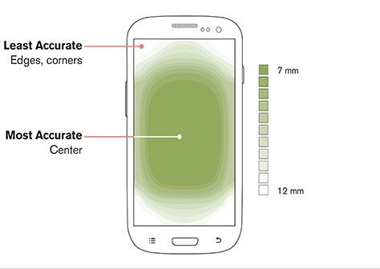

> 대상에 도달하는 시간은 대상까지의 거리와 대상의 크기와 함수 관계에 있다.

---

### 핵심 요약

- 터치 대상의 크기는 사용자가 정확하게 선택할 수 있을 정도로 충분히 커야 한다.
- 터치 대상 사이에 충분한 거리를 확보해야 한다.
- 터치 대상은 인터페이스상에서 쉽게 도달할 수 있는 영역에 배치해야 한다.

 

인터렉션 *-interaction-* 은 최소한의 노력만으로 불편 없이 간단하게 이뤄져야 한다. 디자이너는 인터랙티브 요소의 크기와 위치를 적절하게 지정함으로써 사용자가 해당 요소를 손쉽게 선택하게 하고, 선택 가능 영역에 관한 사용자의 기대에 부응해야 한다.

1. 터치 대상의 크기는 사용자가 쉽게 알아보고 정확하게 선택할 수 있을 정도로 충분히 커야 한다.
2. 터치 대상 사이에 충분한 거리를 확보해야 한다.
3. 터치 대상은 인터페이스 상에서 쉽게 도달할 수 있는 영역에 배치해야 한다.

| 회사 / 조직                           | 권장 규격          |
| --------------------------------- | -------------- |
| 공간 인터페이스 - 휴먼 인터페이스 가이드라인 (Apple) | 60 x 60 pt     |
| 터치 인터페이스 - 휴먼 인터페이스 가이드라인 (Apple) | 44 x 44 pt     |
| Material 디자인 가이드라인 (Google)       | 48 x 48 dp     |
| 웹 콘텐츠 접근성 가이드라인 (WCAG)            | 44 x 44 CSS px |
| 닐슨 노먼 그룹                          | 1 x 1 cm       |

**위의 권장 수치는 최소치라는 점을 명심해야 한다.**

 
요소 사이의 간격도 인터랙티브 요소의 사용성에 영향을 미친다. 요소 사이의 거리가 너무 가까우면 잘못 선택할 가능성이 커진다.

Google Material 디자인 가이드라인에서는 대상이 서로 너무 가까워서 발생하는 입력 오류를 줄이는 방법에 대해 "터치 대상 간의 거리를 최소 8dp 이상 확보해서 정보 밀도와 사용성을 적정 수준으로 유지해라." 고 권고한다.

피츠의 법칙은 마우스나 터치 입력에만 국한되지 않는다. 애플의 비전 OS 는 사용자의 머리를 기준으로 시야의 중앙에 주요 콘텐츠를 배치하고 인터랙티브 콘텐츠를 똑같은 깊이로 유지해 목이나 몸의 움직임을 최소화하며 눈이 새로운 공간적 깊이에 적응하지 않아도 되게 함으로써 대상을 선택하는데 드는 시간을 최적화한다.

게다가 애플은 인터랙티브 요소의 모서리를 둥글게 만들어서 정확도를 높일 것을 권장한다. 우리의 눈은 가장자리에 집중하는 경향이 있어서 대상 영역의 가장자리가 각진 형태일 경우 정확도가 떨어지기 때문이다.

