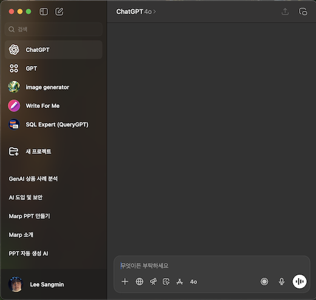
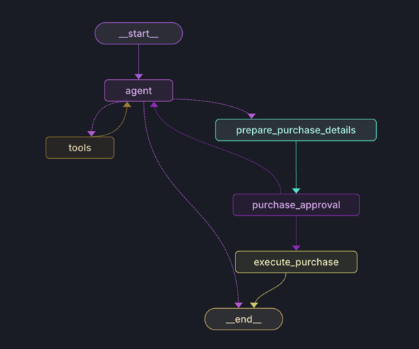

    

# 💡 Backend 개발자가 보는 AI  
#### 우리는 어떻게 적응하고 있는가?

  

👨‍💻 이상민 &nbsp;&nbsp; 📍 2025.07.27  

---
## 소개
<table style="width: 100%;">
  <tr>
    <td style="width: 60%; vertical-align: top; text-align: left; padding-right: 2em;">
      이름 : 이상민 
      직무 : Backend, DevOps 
      경력 : 4년차 
      특기 : AI로 귀찮은 업무 대체 
      특이사항 : 주변에 AI로 뭐 하려는 친구들 많음
    </td>
    <td style="width: 40%; text-align: right;">
      
    </td>
  </tr>
</table>

---

    

# AI : 자기객관화
- 나의 현 주소를 알아보자
---

## 🌟 AI 성숙도란?

  

### 개인, 기업, 단체 등을 마다하지 않고, 
### AI에 대한 이해도와 활용 수준을 통합적으로 측정하는 지표

---
## 🌟 AI 성숙도란? - 예시
<table style="width: 100%;">
  <tr>
    <td style="width: 40%; text-align: right;">
      
    </td>
    <td style="width: 40%; text-align: right;">
      
    </td>
  </tr>
</table>

---

## 🌟 AI 성숙도 - 개인

1. **무관심 (Unaware)**: AI에 대한 관심이 없고, 어떤 기술인지조차 잘 모름
2. **호기심 (Curious)**: ChatGPT 등 일부 AI 기술을 체험해본 수준  
3. **활용 (Utilizing)**: 업무나 일상에 AI 툴을 적극적으로 활용함  
4. **탐색 (Exploring)**: 다양한 도구들을 비교·분석하며, 목적에 맞게 적절히 사용  
5. **통합 (Integrating)**: 업무 프로세스에 AI를 자동화하거나 시스템적으로 연동  
6. **AI 파트너십 (Co-Creating)**: AI를 파트너로 여기며 새로운 것을 함께 창조함

---

## 🌟 AI 성숙도 - 개인 : 평가 
현 시점 기준, 80% 정도는 2단계에서 멈춰있음.
영어 학습기, 검색 대체재, 감정 쓰레기통, 고민상담 봇 처럼 
**'호기심에 사용해보는'** 형태로 많이 사용함.

---

## 🌟 AI 성숙도란? - 기업

1. **무관심 (Exploratory)**: AI에 대한 관심도가 없고, 계획도 없음.
2. **실험 (Experimental)**: 소규모 PoC(개념검증)를 통해 AI 가능성 탐색.
3. **도입 (Emerging)**: 일부 프로젝트에 AI를 정식 도입. 기술 도입 중심.
4. **확산 (Early Scaling)**: AI가 전사적으로 확산되며, 플랫폼화를 시도함. 
5. **전략 통합 (Strategic Integration)**: 전담 조직 운영. 핵심 업무에 도입. 
6. **AI 중심 (Transformational)**: 프로세스, 조직 구조 자체가 AI 중심. 

---

## 🌟 AI 성숙도란? - 기업의 측면에서

대부분의 기업은 아직 3단계(부분 채택) 미만에 머무르고 있으며,  
다음 단계로의 진입 여부는 사업 모델, 데이터 준비도, 조직문화 등에 따라 상이하게 나타난다.

---

## 🎯 왜 AI 성숙도를 알아야 할까?

- **현재 위치 진단**: 나와 우리 조직이 어느 단계에 있는지 파악  
- **목표 설정**: 다음 단계로 가기 위한 전략과 학습 방향 설정  
- **성장 가이드**: 막연한 AI 열풍이 아닌, 체계적이고 지속가능한 성숙을 위한 기준  
- **조직 내 설득**: AI 투자와 도입 필요성을 설명하고 설득할 수 있는 공통 언어 제공  

---

    

# AI가 현재 개발자에게 스며드는 과정
- AI의 등장으로 시작된 업무 프로세스의 변화

---
## 💻 사전지식 : Backend 개발 프로세스

사용자의 요청을 처리하고, 데이터를 저장하며, 시스템 간의 연결을 담당

 

---

## 💻 사전지식 : Backend 개발 프로세스
1. **🧠 요구사항 분석**: API 명세 정의, ERD 및 플로우차트 작성 등
2. **🧩 설계 (Design)**: DB 설계, 레이어드 아키텍처 정의 등
3. **🛠️ 개발 (Implementation)**: API 구현, 비즈니스 로직, 외부 시스템 연동
4. **🧪 테스트 (Testing)**: 단위 테스트, 통합 테스트, 자동화 테스트
5. **🚀 배포 (Deployment)**: CI/CD 구축, 컨테이너화(Docker), 클라우드 적용
6. **🖥️ 운영 및 모니터링**: 로그, 메트릭, 트레이싱, 장애 대응
7. **🗂️ 문서화**: 개발진행사항, 이슈, API 명세 등 인수인계에 필요한 자료

---
    
## 어디에다 AI를 도입할 수 있을까?
  
- 아래부터는 예시용 자료입니다.

---
## 🧠 개발에 AI 도입해보기: 요구사항 분석
1. 🤖 **요구사항 추출 자동화**
    - 자연어 처리 기반의 AI를 활용해 고객의 대화나 문서를 분석하고 요구사항을 자동으로 추출.
    - 📌 예: 대규모 회의록에서 주요 요구사항 키워드 자동 추출.

2. 📝 **API 명세 자동 생성**
    - 고객 요구사항을 기반으로 OpenAPI(JSON/YAML) 형식의 API 스펙 초안을 AI가 생성.
    - 📌 예: 사용자의 입력 텍스트를 분석해 메서드, URL, 파라미터 등을 제안.

---
## 🧠 개발에 AI 도입해보기: 요구사항 분석
3. 🗺️ **ERD 및 플로우차트 생성 보조**
    - 자연어 설명을 토대로 AI가 Entity-Relationship Diagram(ERD)나 플로우차트의 틀을 자동 생성.
    - 📌 예: "사용자는 주문을 생성하고, 주문은 상품과 연결된다"라는 설명을 AI가 분석해 ERD로 변환.

4. 🎯 **요구사항 우선순위 설정**
    - AI를 통해 기능의 비즈니스 가치, 기술 복잡도 등을 분석하고 우선순위를 자동 추천.
    - 📌 예: 각 기능의 예상 개발 시간과 고객 가치 점수를 AI가 평가.
---
## 🧠 개발에 AI 도입해보기: 요구사항 분석

5. ⚠️ **사전 요건 및 리스크 분석**
    - 과거 프로젝트 데이터를 학습한 AI가 요구사항의 잠재적인 리스크(기술적 문제, 비즈니스 적합도 등)를 분석.
    - 📌 예: "이 기능은 과거 3가지 프로젝트에서 실패율이 높았습니다" 같은 통찰 제공.

---

## 🧩 개발에 AI 도입해보기: 설계 (Design)

1. 💾 **DB 설계 자동화**
    - AI를 활용해 자연어로 설명된 데이터 구조를 기반으로 데이터베이스 스키마를 자동 추천 및 생성.
    - 📌 예: "사용자는 이름, 이메일, 비밀번호를 입력하고 저장한다"는 요구사항을 테이블과 필드로 변환.

2. 🏗️ **아키텍처 추천**
    - 프로젝트의 요구사항과 규모를 분석해 권장할 만한 애플리케이션 아키텍처를 AI가 제안.
    - 📌 예: "소규모 프로젝트라면 MVC 아키텍처를 추천, 대규모 프로젝트라면 Hexagonal 아키텍처를 추천."
---
## 🧩 개발에 AI 도입해보기: 설계 (Design)
3. 🔧 **서비스 설계 자동화**
    - 입력된 요구사항을 바탕으로 서비스 간의 인터페이스와 역할을 정의.
    - 📌 예: "사용자 서비스는 로그인, 로그아웃, 회원가입 기능 제공"과 같은 설명을 AI가 서비스 설계 문서로 변환.

4. 🌐 **네트워크 구성 설계**
    - 시스템 규모와 예상 트래픽을 바탕으로 네트워크 토폴로지 및 클라우드 리소스 설계를 AI가 지원.
    - 📌 예: "이 서비스는 로드 밸런서를 통해 처리량을 분산하고, 가용성을 위해 다중 지역에 배포가 필요합니다"라는 제안 생성.
---
## 🧩 개발에 AI 도입해보기: 설계 (Design)
5. 🖌️ **UI/UX 설계 보조**
    - 화면 설계나 자연어 기술(스토리보드)을 바탕으로 와이어프레임 초안을 작성.
    - 📌 예: 사용자의 워크플로우를 분석하고 최적의 인터페이스 설계를 자동 제안.

6. 🧩 **컴포넌트 다이어그램 자동 생성**
    - 시스템 구성 요소와 그들 간의 의존성을 설명하면, 컴포넌트 다이어그램으로 시각화.
    - 📌 예: "사용자는 브라우저를 통해 요청, 프론트엔드는 백엔드에 요청, 백엔드는 데이터베이스에 접근한다"는 구조를 도식화.

---
## 🛠️ 개발에 AI 도입해보기: 개발 (Implementation)

1. 💻 **코드 자동 생성**
    - AI를 활용해 코딩 표준 및 요구사항을 기반으로 코드 생성 자동화.
    - 📌 예: "CRUD API를 생성해줘"라는 입력만으로 기본적인 Create, Read, Update, Delete API 코드 생성.

2. 🧩 **비즈니스 로직 생성 보조**
    - 복잡한 비즈니스 규칙을 자연어로 설명하면 이에 따른 코드를 AI가 추천 및 생성.
    - 📌 예: "1년 내 가입한 사용자에게는 20% 할인율 적용"이라는 규칙을 기반으로 로직 작성.
---
## 🛠️ 개발에 AI 도입해보기: 개발 (Implementation)

3. 🔗 **외부 시스템 연동 자동화**
    - API 문서와 명세를 분석해 외부 서비스와의 통합 코드를 자동 생성.
    - 📌 예: 외부 결제 시스템이나 메일 발송 API와의 연동 코드 작성.

---

## 🧪 개발에 AI 도입해보기: 테스트 (Testing)

1. 🧪 **테스트 코드 자동 생성**
    - 구현된 API와 비즈니스 로직에 따라 단위 테스트 및 통합 테스트 코드 스켈레톤 제공.
    - 📌 예: "회원가입 API"에 대한 입력/출력 케이스를 분석해 테스트 코드 자동 생성.

2. ⚙️ **자동화 테스트 스크립트 생성**
    - CI/CD 환경에서 사용하는 자동화 테스트 스크립트를 생성하고 테스트 케이스를 추천.
    - 📌 예: Selenium을 통해 UI 테스트를 자동 실행하고 관련 스크립트를 생성.
---
## 🧪 개발에 AI 도입해보기: 테스트 (Testing)
3. 🧐 **테스트 결과 분석**
    - 테스트 실행 로그와 오류를 분석해 근본 원인 및 해결 방법을 제공.
    - 📌 예: "API 응답 속도가 초과되었습니다. 데이터베이스 쿼리 최적화 필요."

---

## 🚀 개발에 AI 도입해보기: 배포 (Deployment)

1. ⚙️ **CI/CD 파이프라인 자동화**
    - 프로젝트 형식 및 요구사항에 따라 최적화된 빌드, 테스트, 배포 파이프라인 설정을 추천.
    - 📌 예: GitLab CI/CD 또는 GitHub Actions를 기반으로 파이프라인 스크립트 생성.

2. 🐳 **컨테이너 파일 생성 보조**
    - 도커파일(Dockerfile) 작성 자동화 및 컨테이너 베스트 프랙티스 적용.
    - 📌 예: "Node.js 프로젝트를 위한 Dockerfile 작성"을 요청 시 AI가 최적 구성 제안.
---
## 🚀 개발에 AI 도입해보기: 배포 (Deployment)

3. ☁️ **클라우드 리소스 배포 자동화**
    - 인터페이스를 통해 클라우드 서비스를 구성하고 인프라 설정 자동화(IaC).
    - 📌 예: "AWS에서 Auto Scaling 그룹 설정 및 배포 스크립트 제공."

---

## 🖥️ 개발에 AI 도입해보기: 운영 및 모니터링

1. 📊 **로그 및 메트릭 분석**
    - 로그 데이터를 수집 및 분석해 오류 패턴과 성능 병목현상을 자동으로 제안.
    - 📌 예: "로그 데이터를 기반으로 특정 시간대 과부하 원인을 분석하고 해결책 제안."

2. 🚨 **알림 및 장애 대응 자동화**
    - 장애 발생 시 AI가 근본 원인 분석 및 즉각적인 알림 전달.
    - 📌 예: "데이터베이스 연결 문제 발생 → 새 연결풀 생성 및 관리자 알림."
---
## 🖥️ 개발에 AI 도입해보기: 운영 및 모니터링

3. 📈 **모니터링 대시보드 생성**
    - 시스템 상태와 주요 지표를 시각화하는 커스텀 대시보드를 추천 및 생성.
    - 📌 예: "CPU 사용량, 메모리 사용량, 요청 수 등의 실시간 상태를 대시보드로 제공."

---

## 🗂️ 개발에 AI 도입해보기: 문서화

1. 📄 **문서 자동 생성**
    - 구현된 코드 및 테스트 결과를 바탕으로 API 명세와 개발 문서를 자동 생성.
    - 📌 예: Swagger를 이용한 API 문서화 자동화.

2. 📝 **진행사항 요약**
    - 프로젝트 이슈와 진행 상황을 요약한 레포트를 생성.
    - 📌 예: "현재까지의 완료된 기능, 남은 작업, 주요 이슈 요약 보고서 작성."
---
## 🗂️ 개발에 AI 도입해보기: 문서화

3. 🗃️ **이슈 로그 통합 정리**
    - 협업 도구(JIRA, GitHub 등)에서 생성된 이슈와 히스토리를 자동으로 정리.
    - 📌 예: "5개 주요 버그와 3개 개선 과제가 완료되었습니다"와 같은 요약 제공.

---
## 다음으로: 개인화 하기
  

### 💡 **모든 기능 실현이 AI 도입의 목표는 아니다.**

---
## 다음으로: 개인화 하기
1. 개인이 직접 하기 귀찮거나, 빠트리기 쉬운 항목 찾기
2. 귀찮은 부분이 'AI로 절충할 수 있는지' 고민하기
3. 실제로 만들어 보고, 나에게 얼마의 이득이 있는지 측정하기

---
## QnA

### **왜 바이브 코딩이 중요한가요?**

- 개발 속도를 높이고 협업을 원활하게 하기 위한 방법론. 특히 AI 기술과의 결합으로 더욱 효율적.
- 📌 예: 기존 코드 기반에서 라이브 코딩으로 빠르게 신규 기능을 추가하며 실시간 에러 검증.

---
## QnA

### **기업에서는 왜 AI 도입에 소극적인가요?**

- 주요 이유 중 하나는 보안 및 개인정보 보호 우려, 그리고 초기 도입 비용.
- 📌 예: "내부 데이터 유출 가능성 → 별도 폐쇄형 AI 시스템 구축으로 해결."

---
## QnA

### **우리 회사는 개인정보 보호 때문에 ChatGPT 사용이 어렵습니다. 대안은 있나요?**

- 온프레미스(On-Premise) AI 솔루션 또는 폐쇄형 AI 시스템을 제안.
- 📌 예: 내부 서버에서 작동하는 GPT 자체 배포판 사용.

---
## QnA

### **AI 사용으로 개발 속도가 느려졌다는데, 이유가 뭘까요?**

- 초기 학습 비용과 불완전한 결과물을 검토하는 데 소요되는 추가 작업 시간.
- 📌 예: "생성 결과 검토와 수정 → 팀 내 검수 시간 증가."

---
## QnA

### **AI 코드 퀄리티가 기대만큼 높지 않습니다!**

- AI의 학습 데이터 한계와 특정 도메인에 대한 이해 부족 때문일 가능성.
- 📌 예: 도메인 전용 데이터 제공으로 AI의 정확도를 높임.

---
## QnA

### **AI 도입으로 결국 인력을 줄이는 게 목표인가요?**

- AI는 반복 작업을 줄이고, 창의적이고 고성능의 작업에 인력을 집중하기 위함.
- 📌 예: 코드 리뷰와 테스트에서 AI 지원으로 개발자 업무량 감소, 더 창의적인 작업에 집중.

---
## QnA

### **그래도, AI를 통해 대체할 수 있는 구석이 있나요?**

- 조직 구조와 방향성에 따라 다르지만, 조직이 원하는 방향으로의 대체는 가능.
- 📌 예: BE 개발자밖에 없는 조직에서 FE의 요구사항이 생기는 경우

---

## ✅ 오늘 발표 요약

- 🌱 **AI 성숙도**를 통해 나와 우리 조직의 현재 위치를 진단하고
- 🛠 **Backend 프로세스 전반에 AI 도입 포인트**를 확인하며
- 🧠 **귀찮음을 AI로 절충하는 개인화 전략**까지 살펴봤습니다.

---

## 📌 오늘의 To-Do

1. 지금 하는 일 중 "귀찮거나 반복되는 것" 하나 떠올리기  
2. 그걸 ChatGPT나 Copilot에게 시켜보기  
3. 결과를 비교하며 시간과 에너지 절약을 실감해보기

---