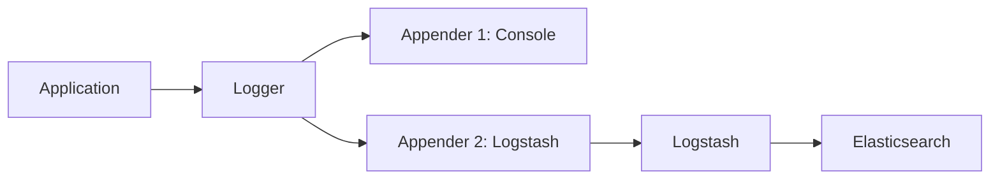

---
tags:
  - ELK/Client
  - Kotlin
  - SpringBoot
  - Logback
  - Logstash
created: 2025-10-06
updated: 2025-10-06
---

# Kotlin + Spring Boot 로깅 설정

> [!info] 개요
> Kotlin + Spring Boot 애플리케이션에서 구조화된 로그를 ELK Stack으로 전송하는 완전한 가이드

## 📦 의존성 설정

### build.gradle.kts

```kotlin
plugins {
    kotlin("jvm") version "1.9.20"
    kotlin("plugin.spring") version "1.9.20"
    id("org.springframework.boot") version "3.2.0"
    id("io.spring.dependency-management") version "1.1.4"
}

dependencies {
    // Spring Boot Starter
    implementation("org.springframework.boot:spring-boot-starter-web")
    implementation("org.springframework.boot:spring-boot-starter-actuator")
    implementation("com.fasterxml.jackson.module:jackson-module-kotlin")

    // Kotlin 로깅
    implementation("io.github.microutils:kotlin-logging-jvm:3.0.5")

    // Logstash Encoder
    implementation("net.logstash.logback:logstash-logback-encoder:7.4")

    // Micrometer (메트릭)
    implementation("io.micrometer:micrometer-registry-elastic:1.12.0")

    // Spring Boot Test
    testImplementation("org.springframework.boot:spring-boot-starter-test")
}
```

**출처**:
- [kotlin-logging GitHub](https://github.com/oshai/kotlin-logging)
- [logstash-logback-encoder](https://github.com/logfellow/logstash-logback-encoder)

---

## 🔧 Logback 설정

### 기본 구조



### logback-spring.xml

> [!tip] 파일 위치
> `src/main/resources/logback-spring.xml`

```xml
<?xml version="1.0" encoding="UTF-8"?>
<configuration>
    <!-- Spring Boot 기본 설정 포함 -->
    <include resource="org/springframework/boot/logging/logback/defaults.xml"/>

    <!-- Property 정의 -->
    <springProperty scope="context" name="APP_NAME" source="spring.application.name"/>
    <springProperty scope="context" name="PROFILE" source="spring.profiles.active" defaultValue="local"/>
    <springProperty scope="context" name="LOGSTASH_HOST" source="logstash.host" defaultValue="localhost"/>
    <springProperty scope="context" name="LOGSTASH_PORT" source="logstash.port" defaultValue="5000"/>

    <!-- 콘솔 Appender -->
    <appender name="CONSOLE" class="ch.qos.logback.core.ConsoleAppender">
        <encoder>
            <pattern>
                %d{yyyy-MM-dd HH:mm:ss.SSS} %5p [%15.15t] %-40.40logger{39} : %m%n%wEx
            </pattern>
            <charset>UTF-8</charset>
        </encoder>
    </appender>

    <!-- Logstash TCP Appender -->
    <appender name="LOGSTASH" class="net.logstash.logback.appender.LogstashTcpSocketAppender">
        <destination>${LOGSTASH_HOST}:${LOGSTASH_PORT}</destination>

        <!-- 재연결 설정 -->
        <reconnectionDelay>10 seconds</reconnectionDelay>

        <!-- 연결 실패시 로그 손실 방지 -->
        <writeBufferSize>16384</writeBufferSize>

        <!-- JSON 인코더 -->
        <encoder class="net.logstash.logback.encoder.LogstashEncoder">
            <!-- 커스텀 필드 추가 -->
            <customFields>
                {
                    "app_name":"${APP_NAME}",
                    "profile":"${PROFILE}",
                    "instance":"${HOSTNAME}"
                }
            </customFields>

            <!-- 스택 트레이스 해시 -->
            <enableContextMap>true</enableContextMap>

            <!-- 타임스탬프 형식 -->
            <timestampPattern>yyyy-MM-dd'T'HH:mm:ss.SSSZ</timestampPattern>
        </encoder>
    </appender>

    <!-- 비동기 Logstash Appender -->
    <appender name="ASYNC_LOGSTASH" class="ch.qos.logback.classic.AsyncAppender">
        <appender-ref ref="LOGSTASH"/>

        <!-- 큐 크기 -->
        <queueSize>512</queueSize>

        <!-- 큐가 가득 차도 로그를 버리지 않음 -->
        <discardingThreshold>0</discardingThreshold>

        <!-- 최대 플러시 시간 (ms) -->
        <maxFlushTime>5000</maxFlushTime>

        <!-- 앱 종료시 남은 로그 전송 -->
        <includeCallerData>false</includeCallerData>
    </appender>

    <!-- 파일 Appender (Logstash 장애 대비) -->
    <appender name="FILE" class="ch.qos.logback.core.rolling.RollingFileAppender">
        <file>logs/application.log</file>

        <encoder class="net.logstash.logback.encoder.LogstashEncoder">
            <customFields>{"app_name":"${APP_NAME}"}</customFields>
        </encoder>

        <rollingPolicy class="ch.qos.logback.core.rolling.TimeBasedRollingPolicy">
            <fileNamePattern>logs/application-%d{yyyy-MM-dd}.%i.log.gz</fileNamePattern>
            <maxHistory>7</maxHistory>

            <timeBasedFileNamingAndTriggeringPolicy
                class="ch.qos.logback.core.rolling.SizeAndTimeBasedFNATP">
                <maxFileSize>100MB</maxFileSize>
            </timeBasedFileNamingAndTriggeringPolicy>
        </rollingPolicy>
    </appender>

    <!-- Root Logger -->
    <root level="INFO">
        <appender-ref ref="CONSOLE"/>
        <appender-ref ref="ASYNC_LOGSTASH"/>
        <appender-ref ref="FILE"/>
    </root>

    <!-- 패키지별 로그 레벨 -->
    <logger name="com.example.myapp" level="DEBUG"/>
    <logger name="org.springframework.web" level="INFO"/>
    <logger name="org.hibernate" level="INFO"/>

    <!-- Profile별 설정 -->
    <springProfile name="local">
        <root level="DEBUG">
            <appender-ref ref="CONSOLE"/>
        </root>
    </springProfile>

    <springProfile name="dev,staging">
        <root level="DEBUG">
            <appender-ref ref="CONSOLE"/>
            <appender-ref ref="ASYNC_LOGSTASH"/>
        </root>
    </springProfile>

    <springProfile name="prod">
        <root level="INFO">
            <appender-ref ref="CONSOLE"/>
            <appender-ref ref="ASYNC_LOGSTASH"/>
            <appender-ref ref="FILE"/>
        </root>
    </springProfile>
</configuration>
```

---

## 🖊️ Kotlin 코드에서 로깅

### kotlin-logging 사용

```kotlin
import mu.KotlinLogging

private val log = KotlinLogging.logger {}

@RestController
@RequestMapping("/api")
class UserController(
    private val userService: UserService
) {

    @GetMapping("/users/{id}")
    fun getUser(@PathVariable id: Long): ResponseEntity<User> {
        log.info { "Fetching user with id: $id" }

        return try {
            val user = userService.findById(id)
            log.debug { "Found user: $user" }
            ResponseEntity.ok(user)
        } catch (e: UserNotFoundException) {
            log.warn(e) { "User not found: $id" }
            ResponseEntity.notFound().build()
        } catch (e: Exception) {
            log.error(e) { "Error fetching user: $id" }
            ResponseEntity.internalServerError().build()
        }
    }

    @PostMapping("/users")
    fun createUser(@RequestBody request: CreateUserRequest): ResponseEntity<User> {
        log.info { "Creating new user: ${request.email}" }

        val user = userService.create(request)
        log.info { "User created successfully: ${user.id}" }

        return ResponseEntity.status(HttpStatus.CREATED).body(user)
    }
}
```

### 장점

> [!success] kotlin-logging 장점
> - **Lazy 평가**: 로그 레벨이 꺼져있으면 메시지를 생성하지 않음
> - **간결한 문법**: `log.info { "message" }`
> - **Null-safe**: Kotlin의 null safety 활용

---

## 🏷️ MDC (Mapped Diagnostic Context)

### MDC란?

> [!abstract] MDC
> 로그에 자동으로 추가되는 컨텍스트 정보 (요청 ID, 사용자 ID 등)

### MDC 설정

```kotlin
import org.slf4j.MDC
import org.springframework.stereotype.Component
import org.springframework.web.filter.OncePerRequestFilter
import java.util.UUID
import javax.servlet.FilterChain
import javax.servlet.http.HttpServletRequest
import javax.servlet.http.HttpServletResponse

@Component
class MdcFilter : OncePerRequestFilter() {

    companion object {
        const val REQUEST_ID = "requestId"
        const val USER_ID = "userId"
        const val SESSION_ID = "sessionId"
    }

    override fun doFilterInternal(
        request: HttpServletRequest,
        response: HttpServletResponse,
        filterChain: FilterChain
    ) {
        try {
            // Request ID 생성
            val requestId = request.getHeader("X-Request-ID")
                ?: UUID.randomUUID().toString()

            MDC.put(REQUEST_ID, requestId)

            // 인증된 사용자 정보 (예시)
            request.userPrincipal?.name?.let { username ->
                MDC.put(USER_ID, username)
            }

            // 세션 ID
            request.session?.id?.let { sessionId ->
                MDC.put(SESSION_ID, sessionId)
            }

            // Response 헤더에 Request ID 추가
            response.setHeader("X-Request-ID", requestId)

            filterChain.doFilter(request, response)
        } finally {
            // 요청 종료 후 MDC 정리
            MDC.clear()
        }
    }
}
```

### MDC 사용 예시

```kotlin
@Service
class UserService {
    private val log = KotlinLogging.logger {}

    fun findById(id: Long): User {
        // MDC의 requestId, userId가 자동으로 로그에 포함됨
        log.info { "Querying database for user: $id" }

        // DB 조회...
        val user = userRepository.findById(id)
            .orElseThrow { UserNotFoundException(id) }

        return user
    }
}
```

### JSON 로그 출력 예시

```json
{
  "@timestamp": "2025-10-06T10:30:45.123+09:00",
  "level": "INFO",
  "logger_name": "com.example.myapp.UserService",
  "message": "Querying database for user: 123",
  "thread_name": "http-nio-8080-exec-1",
  "app_name": "user-service",
  "profile": "production",
  "instance": "server-01",
  "requestId": "a1b2c3d4-e5f6-7890-abcd-ef1234567890",
  "userId": "john.doe",
  "sessionId": "JSESSIONID=ABC123"
}
```

---

## 📊 구조화된 로깅 (Structured Logging)

### StructuredArguments 사용

```kotlin
import net.logstash.logback.argument.StructuredArguments.*

@Service
class OrderService {
    private val log = KotlinLogging.logger {}

    fun createOrder(order: Order): Order {
        log.info(
            "Order created",
            kv("orderId", order.id),
            kv("userId", order.userId),
            kv("amount", order.totalAmount),
            kv("items", order.items.size)
        )

        return orderRepository.save(order)
    }

    fun processPayment(orderId: Long, amount: BigDecimal) {
        val startTime = System.currentTimeMillis()

        try {
            paymentGateway.process(orderId, amount)

            val duration = System.currentTimeMillis() - startTime

            log.info(
                "Payment processed successfully",
                kv("orderId", orderId),
                kv("amount", amount),
                kv("duration_ms", duration),
                kv("status", "success")
            )
        } catch (e: PaymentException) {
            val duration = System.currentTimeMillis() - startTime

            log.error(
                e,
                "Payment failed",
                kv("orderId", orderId),
                kv("amount", amount),
                kv("duration_ms", duration),
                kv("status", "failed"),
                kv("error_code", e.errorCode)
            )
            throw e
        }
    }
}
```

### JSON 출력 결과

```json
{
  "@timestamp": "2025-10-06T10:30:45.123+09:00",
  "level": "INFO",
  "message": "Order created",
  "orderId": 12345,
  "userId": "user-789",
  "amount": 99.99,
  "items": 3
}
```

---

## ⚡ 성능 최적화

### 1. 비동기 Appender 사용

> [!tip] AsyncAppender
> 로깅이 애플리케이션 성능에 영향을 주지 않도록 비동기 처리

```xml
<appender name="ASYNC_LOGSTASH" class="ch.qos.logback.classic.AsyncAppender">
    <appender-ref ref="LOGSTASH"/>
    <queueSize>512</queueSize>
    <discardingThreshold>0</discardingThreshold>
    <includeCallerData>false</includeCallerData>
</appender>
```

### 2. Lazy 평가

```kotlin
// ❌ 나쁜 예: 로그 레벨이 꺼져있어도 문자열 연산 실행
log.debug("User data: " + user.toString())

// ✅ 좋은 예: 로그 레벨이 켜져있을 때만 평가
log.debug { "User data: $user" }
```

### 3. 조건부 로깅

```kotlin
// ❌ 불필요한 로그 생성
list.forEach { item ->
    log.debug { "Processing item: $item" }
}

// ✅ 중요한 정보만 로깅
log.debug { "Processing ${list.size} items" }
```

---

## 🔒 보안 고려사항

### 민감한 정보 필터링

```kotlin
data class User(
    val id: Long,
    val email: String,
    @JsonIgnore // JSON 직렬화시 제외
    val password: String,
    val name: String
) {
    // toString()에서도 비밀번호 제외
    override fun toString(): String {
        return "User(id=$id, email=$email, name=$name)"
    }
}

// 로그 필터 (Logback)
class SensitiveDataFilter : Filter<ILoggingEvent>() {
    private val patterns = listOf(
        "password=\\S+".toRegex(),
        "token=\\S+".toRegex(),
        "apiKey=\\S+".toRegex(),
        "\\d{4}-\\d{4}-\\d{4}-\\d{4}".toRegex() // 카드 번호
    )

    override fun decide(event: ILoggingEvent): FilterReply {
        var message = event.formattedMessage

        patterns.forEach { pattern ->
            message = message.replace(pattern, "[REDACTED]")
        }

        // 메시지 교체 (주의: 복잡함)
        return FilterReply.NEUTRAL
    }
}
```

---

## 🧪 테스트

### 로깅 테스트

```kotlin
import ch.qos.logback.classic.Logger
import ch.qos.logback.classic.spi.ILoggingEvent
import ch.qos.logback.core.read.ListAppender
import org.junit.jupiter.api.BeforeEach
import org.junit.jupiter.api.Test
import org.slf4j.LoggerFactory
import kotlin.test.assertTrue

class UserServiceTest {

    private lateinit var listAppender: ListAppender<ILoggingEvent>
    private lateinit var userService: UserService

    @BeforeEach
    fun setup() {
        val logger = LoggerFactory.getLogger(UserService::class.java) as Logger

        listAppender = ListAppender()
        listAppender.start()
        logger.addAppender(listAppender)

        userService = UserService()
    }

    @Test
    fun `should log user creation`() {
        // given
        val request = CreateUserRequest("test@example.com", "John Doe")

        // when
        userService.create(request)

        // then
        val logs = listAppender.list
        assertTrue(logs.any { it.message.contains("Creating new user") })
        assertTrue(logs.any { it.message.contains("User created successfully") })
    }
}
```

---

## 📖 application.yml 설정

```yaml
spring:
  application:
    name: user-service
  profiles:
    active: ${PROFILE:local}

# Logstash 설정
logstash:
  host: ${LOGSTASH_HOST:localhost}
  port: ${LOGSTASH_PORT:5000}

# Actuator 설정
management:
  endpoints:
    web:
      exposure:
        include: health,info,metrics,loggers
  endpoint:
    health:
      show-details: always
    loggers:
      enabled: true  # 런타임 로그 레벨 변경 가능

# 로깅 설정 (logback-spring.xml이 우선)
logging:
  level:
    root: INFO
    com.example.myapp: DEBUG
```

---

## 🔗 관련 문서

- [[README|← Client 관점 개요]]
- [[02-Spring-Actuator-Metrics|Spring Actuator & Metrics →]]
- [[03-Kotlin-로깅-Best-Practices|Kotlin 로깅 Best Practices →]]
- [[../02-Server/02-Logstash-파이프라인|Logstash 설정 →]]

---

## 📚 참고 자료

- [kotlin-logging GitHub](https://github.com/oshai/kotlin-logging)
- [logstash-logback-encoder](https://github.com/logfellow/logstash-logback-encoder)
- [Logback Documentation](https://logback.qos.ch/documentation.html)
- [Spring Boot Logging](https://docs.spring.io/spring-boot/docs/current/reference/html/features.html#features.logging)

---

#ELK/Client #Kotlin #SpringBoot #Logback #구조화된로깅 #MDC
