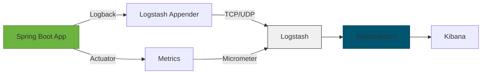
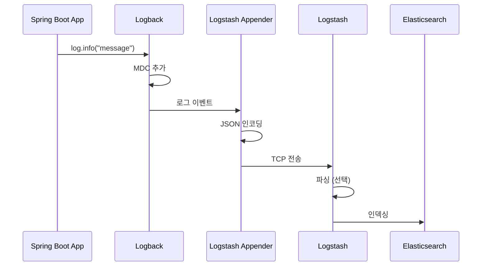

---
tags:
  - ELK/Client
  - Kotlin
  - SpringBoot
  - Logback
  - 로깅
created: 2025-10-06
updated: 2025-10-06
---

# Client 관점 (Kotlin + Spring Boot)

> [!abstract] 개요
> Kotlin + Spring Boot 애플리케이션에서 ELK Stack으로 로그를 전송하는 방법

## 📚 학습 자료

### [[01-Kotlin-SpringBoot-로깅-설정|🔧 Kotlin + Spring Boot 로깅 설정]]

Logback 및 Logstash 연동

- Logback 설정
- Logstash Appender
- 구조화된 로깅 (Structured Logging)
- MDC (Mapped Diagnostic Context)

### [[02-Spring-Actuator-Metrics|📊 Spring Actuator & Metrics]]

메트릭 및 헬스체크

- Spring Boot Actuator
- Micrometer + Elasticsearch
- 커스텀 메트릭

### [[03-Kotlin-로깅-Best-Practices|⭐ Kotlin 로깅 Best Practices]]

코틀린 로깅 모범 사례

- kotlin-logging 라이브러리
- 로깅 레벨 관리
- 성능 최적화
- 보안 고려사항

---

## 🏗️ 아키텍처

### 전체 구조



### Logback → Logstash → Elasticsearch

> [!success] 권장 방식
> Spring Boot 애플리케이션에서 Logback의 Logstash Appender를 사용하여 직접 전송

**장점:**
- 실시간 로그 전송
- 애플리케이션 재시작 없이 로그 레벨 변경 가능
- 구조화된 JSON 로그
- 자동 메타데이터 추가

---

## 🚀 빠른 시작

### 의존성 추가

```kotlin
// build.gradle.kts
dependencies {
    // Kotlin 로깅
    implementation("io.github.microutils:kotlin-logging-jvm:3.0.5")

    // Logstash Encoder
    implementation("net.logstash.logback:logstash-logback-encoder:7.4")

    // Spring Boot Actuator
    implementation("org.springframework.boot:spring-boot-starter-actuator")

    // Micrometer Elasticsearch (선택)
    implementation("io.micrometer:micrometer-registry-elastic:1.12.0")
}
```

### 기본 Logback 설정

```xml
<!-- src/main/resources/logback-spring.xml -->
<?xml version="1.0" encoding="UTF-8"?>
<configuration>
    <include resource="org/springframework/boot/logging/logback/defaults.xml"/>

    <!-- 콘솔 출력 -->
    <appender name="CONSOLE" class="ch.qos.logback.core.ConsoleAppender">
        <encoder>
            <pattern>${CONSOLE_LOG_PATTERN}</pattern>
        </encoder>
    </appender>

    <!-- Logstash TCP 전송 -->
    <appender name="LOGSTASH" class="net.logstash.logback.appender.LogstashTcpSocketAppender">
        <destination>localhost:5000</destination>

        <!-- JSON 인코더 -->
        <encoder class="net.logstash.logback.encoder.LogstashEncoder">
            <customFields>{"app":"my-spring-boot-app","env":"production"}</customFields>
        </encoder>
    </appender>

    <!-- 비동기 Logstash -->
    <appender name="ASYNC_LOGSTASH" class="ch.qos.logback.classic.AsyncAppender">
        <appender-ref ref="LOGSTASH"/>
        <queueSize>512</queueSize>
        <discardingThreshold>0</discardingThreshold>
    </appender>

    <!-- Root Logger -->
    <root level="INFO">
        <appender-ref ref="CONSOLE"/>
        <appender-ref ref="ASYNC_LOGSTASH"/>
    </root>
</configuration>
```

---

## 🔑 핵심 차이점

### 기존 (브라우저/모바일) vs 현재 (Kotlin + Spring Boot)

| 구분 | 브라우저/모바일 | Kotlin + Spring Boot |
|:-----|:---------------|:---------------------|
| **로그 생성** | JavaScript | Kotlin + Logback |
| **전송 방식** | HTTP API → 백엔드 | Logstash Appender (TCP) |
| **구조화** | 수동 JSON | Logback Encoder |
| **메타데이터** | 수동 추가 | 자동 (MDC) |
| **오프라인** | 로컬 버퍼 필요 | 네트워크 안정적 |
| **보안** | 공개 네트워크 | 내부 네트워크 |

---

## 📖 데이터 흐름



---

## ✅ 체크리스트

### 기본 설정

- [ ] kotlin-logging 의존성 추가
- [ ] logstash-logback-encoder 의존성 추가
- [ ] logback-spring.xml 설정
- [ ] Logstash appender 구성

### 구조화된 로깅

- [ ] JSON 로그 형식 적용
- [ ] MDC 사용
- [ ] 커스텀 필드 추가
- [ ] Exception 스택 트레이스 포함

### 성능 최적화

- [ ] AsyncAppender 사용
- [ ] 로그 레벨 적절히 설정
- [ ] 불필요한 로그 제거
- [ ] 배치 전송 설정

### 모니터링

- [ ] Spring Actuator 활성화
- [ ] 헬스체크 엔드포인트
- [ ] 메트릭 수집
- [ ] Micrometer 연동 (선택)

---

## 🔗 관련 문서

- [[../README|← 메인으로 돌아가기]]
- [[01-Kotlin-SpringBoot-로깅-설정|Kotlin + Spring Boot 로깅 설정 →]]
- [[../02-Server/README|Server 관점으로 →]]

---

#ELK/Client #Kotlin #SpringBoot #Logback #로깅
