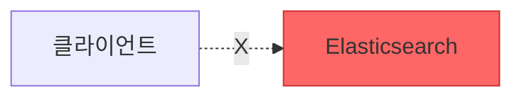

---
tags:
  - ELK/Client
  - 로깅
  - Frontend
  - Mobile
created: 2025-10-06
updated: 2025-10-06
---

# Client 관점

> [!abstract] 개요
> 클라이언트 애플리케이션에서 ELK Stack으로 로그를 전송하는 방법과 아키텍처

## 📚 학습 자료

### [[01-웹-브라우저-로깅|🌐 웹 브라우저 로깅]]

JavaScript 프레임워크에서 로그 수집

- React, Vue, Angular 구현
- 백엔드 API 방식
- 서드파티 로깅 서비스

### [[02-모바일-애플리케이션-로깅|📱 모바일 앱 로깅]]

iOS, Android 앱에서 로그 수집

- 네트워크 제약 대응
- 오프라인 저장
- 전송 최적화

### [[03-Client-Best-Practices|⭐ Best Practices]]

보안, 성능, 데이터 품질

- 보안 가이드라인
- 성능 최적화
- 오프라인 대응

---

## 🔑 핵심 원칙

### ❌ 절대 금지



> [!danger] 직접 연결 금지
> 클라이언트에서 Elasticsearch에 직접 연결하지 마세요!
>
> **위험 요소:**
> - 자격 증명 노출
> - 악의적 데이터 주입
> - DDoS 공격 대상
> - 인증/권한 관리 불가

### ✅ 권장 방식


> [!success] 백엔드 API 경유
> **장점:**
> - 보안 강화
> - 데이터 검증
> - 인증/권한 관리
> - 로그 변환 및 보강

---

## 📊 Client vs Server 비교

| 구분 | Client | Server |
|:-----|:-------|:-------|
| 네트워크 | 불안정적 | 안정적 |
| 대역폭 | 제한적 | 풍부 |
| 보안 | 공개 네트워크 | 내부 네트워크 |
| 직접 연결 | **불가능/비권장** | 가능 |
| 오프라인 대응 | 필수 | 불필요 |

---

## 🚀 빠른 시작

### 웹 개발자라면

```
[[01-웹-브라우저-로깅]] → [[03-Client-Best-Practices#보안]]
```

### 모바일 개발자라면

```
[[02-모바일-애플리케이션-로깅]] → [[03-Client-Best-Practices#성능-최적화]]
```

---

## 🔗 관련 문서

- [[../README|← 메인으로 돌아가기]]
- [[../02-Server/README|Server 관점으로 →]]

---

#ELK/Client #Frontend #Mobile #로깅
