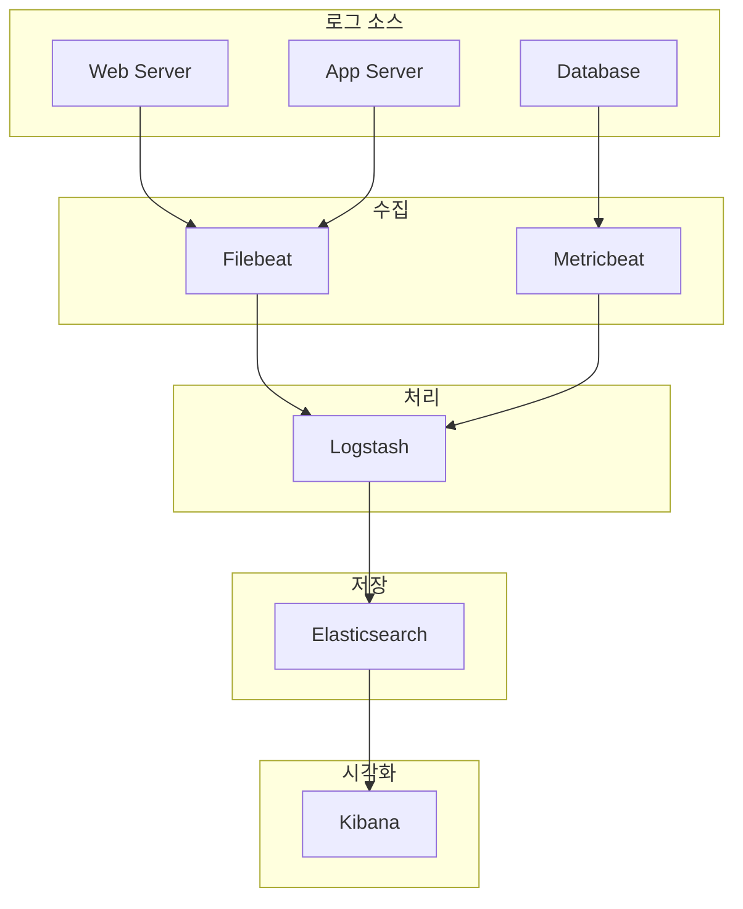
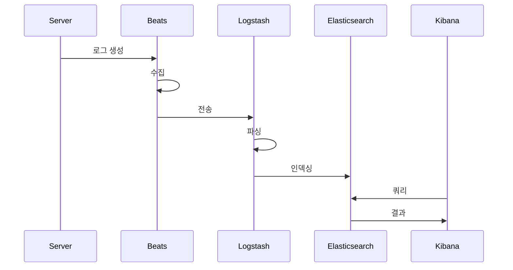

---
tags:
  - ELK/Server
  - Elasticsearch
  - Logstash
  - Kibana
  - Beats
  - DevOps
created: 2025-10-06
updated: 2025-10-06
---

# Server 관점

> [!abstract] 개요
> 서버 측에서 로그를 수집, 처리, 저장, 시각화하는 전체 ELK Stack

## 📚 학습 자료

### [[01-Beats-설치-및-구성|📡 Beats 설치]]

경량 데이터 수집기

- Filebeat: 로그 파일 수집
- Metricbeat: 시스템 메트릭

### [[02-Logstash-파이프라인|⚙️ Logstash 파이프라인]]

데이터 처리 파이프라인

- Input, Filter, Output
- 파싱 및 변환

### [[03-Elasticsearch-설치-및-구성|🔍 Elasticsearch 설치]]

분산 검색 엔진

- 클러스터 구성
- 인덱스 관리

### [[04-Kibana-시각화|📊 Kibana 시각화]]

데이터 시각화 도구

- 대시보드 생성
- 알림 설정

---

## 🏗️ 전체 아키텍처

---

## 🎯 설치 순서

> [!tip] 권장 순서
> 1. [[03-Elasticsearch-설치-및-구성|Elasticsearch]] (먼저)
> 2. [[04-Kibana-시각화|Kibana]]
> 3. [[02-Logstash-파이프라인|Logstash]] (선택)
> 4. [[01-Beats-설치-및-구성|Beats]] (마지막)

### 체크리스트

- [ ] Elasticsearch 설치 및 실행
- [ ] Kibana 설치 및 연결
- [ ] Beats 설치 및 설정
- [ ] Logstash 설정 (필요시)
- [ ] 대시보드 생성

---

## 📖 데이터 흐름

---

## 🔗 관련 문서

- [[../README|← 메인으로 돌아가기]]
- [[../01-Client/README|Client 관점 ←]]
- [[../03-Components/README|Components 상세 →]]

---

#ELK/Server #DevOps #Infrastructure
