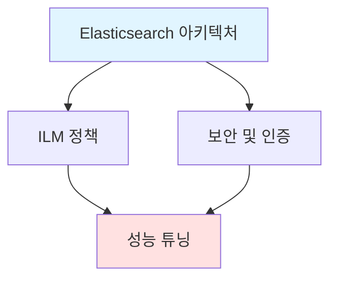

---
tags:
  - ELK/Components
  - Architecture
  - Advanced
  - Performance
  - Security
created: 2025-10-06
updated: 2025-10-06
---

# Components 상세

> [!abstract] 개요
> ELK Stack 각 구성 요소의 내부 동작 원리와 고급 기능

## 📚 학습 자료

### [[01-Elasticsearch-아키텍처|🔍 Elasticsearch 아키텍처]]

내부 구조 및 동작 원리

- 클러스터, 노드, 샤드
- 인덱싱 및 검색 프로세스
- Mapping 전략

### [[02-Logstash-상세|⚙️ Logstash 상세]]

파이프라인 심화

- Filter 플러그인 상세
- 성능 튜닝
- 멀티 파이프라인

### [[03-Kibana-고급-기능|📊 Kibana 고급 기능]]

고급 시각화 및 분석

- KQL (Kibana Query Language)
- 고급 시각화
- Alerting

### [[04-ILM-정책|🔄 ILM 정책]]

데이터 수명 주기 관리

- Hot-Warm-Cold-Delete
- ILM 정책 구성
- 자동 롤오버

### [[05-보안-및-인증|🔒 보안 및 인증]]

프로덕션 보안 설정

- TLS/SSL 설정
- RBAC
- API Keys

### [[06-성능-튜닝|⚡ 성능 튜닝]]

성능 최적화 가이드

- Elasticsearch 튜닝
- JVM 설정
- 검색 성능 향상

---

## 🎓 학습 순서

> [!tip] 권장 학습 순서
> 1. [[01-Elasticsearch-아키텍처|Elasticsearch 아키텍처]] (필수)
> 2. [[04-ILM-정책|ILM 정책]] (데이터 관리)
> 3. [[05-보안-및-인증|보안 및 인증]] (프로덕션 필수)
> 4. [[06-성능-튜닝|성능 튜닝]] (운영 최적화)

---

## ✅ 체크리스트

### 기본 이해

- [ ] Elasticsearch 클러스터 구조 이해
- [ ] 노드 역할 구분 (Master, Data, Coordinating)
- [ ] 샤드와 레플리카 개념

### 데이터 관리

- [ ] ILM 정책 이해
- [ ] Hot-Warm-Cold 아키텍처
- [ ] 인덱스 롤오버 설정

### 보안

- [ ] TLS/SSL 설정 완료
- [ ] RBAC 구성
- [ ] API Keys 생성 및 관리

### 성능

- [ ] JVM 힙 크기 최적화
- [ ] 샤드 크기 조정
- [ ] Bulk API 사용

---

## 🔗 관련 문서

- [[../README|← 메인으로 돌아가기]]
- [[../02-Server/README|← Server 관점]]

---

#ELK/Components #Architecture #Advanced
