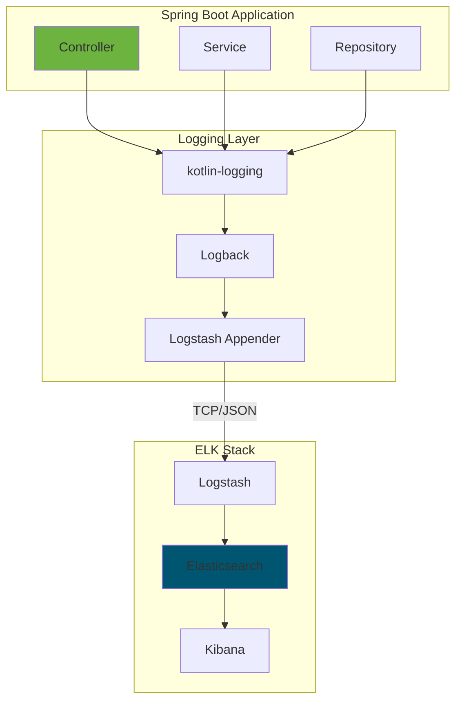
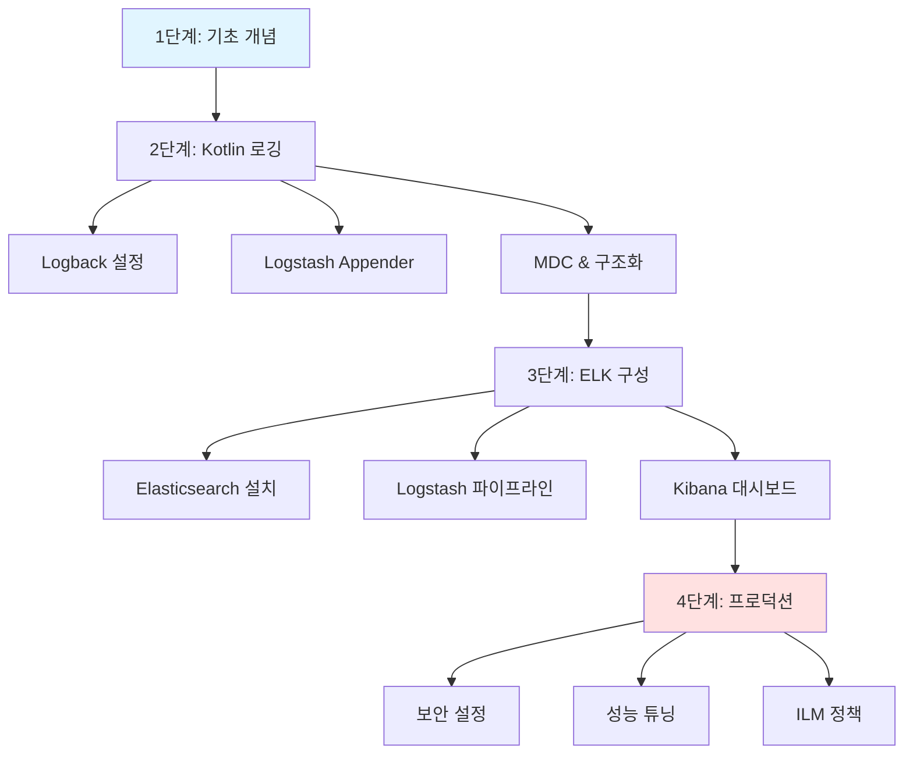
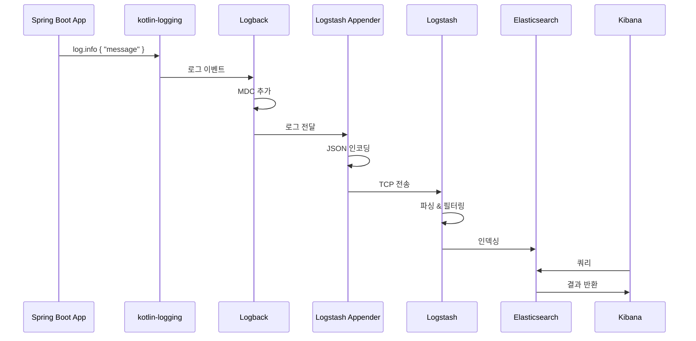

---
tags:
  - ELK
  - Elasticsearch
  - Logstash
  - Kibana
  - Beats
  - Kotlin
  - SpringBoot
  - 로그관리
  - 모니터링
created: 2025-10-06
updated: 2025-10-06
version: 3.0
status: active
---

# ELK Stack 스터디 가이드 (Kotlin + Spring Boot)

> [!info] 최신 업데이트
> **날짜**: 2025-10-06
> **버전**: Elasticsearch 9.1.4
> **대상**: Kotlin + Spring Boot 애플리케이션

## 🎯 빠른 시작


> [!tip] 이 가이드는?
> Kotlin + Spring Boot 애플리케이션의 로그를 ELK Stack으로 수집, 분석, 시각화하는 완전한 가이드입니다.

---

## 📚 학습 경로

### [[01-Client/README|🔧 Client 관점 (Kotlin + Spring Boot)]]

Spring Boot 애플리케이션에서 로그 생성 및 전송

- [[01-Client/01-Kotlin-SpringBoot-로깅-설정|Kotlin + Spring Boot 로깅 설정]] - Logback, Logstash Appender
- [[01-Client/02-Spring-Actuator-Metrics|Spring Actuator & Metrics]] - 메트릭 수집
- [[01-Client/03-Kotlin-로깅-Best-Practices|Kotlin 로깅 Best Practices]] - 보안, 성능

### [[02-Server/README|⚙️ Server 관점 (ELK Stack)]]

로그 수집, 처리, 저장, 시각화

- [[02-Server/01-Beats-설치-및-구성|Beats 설치]] - Filebeat, Metricbeat
- [[02-Server/02-Logstash-파이프라인|Logstash 파이프라인]] - Spring Boot 로그 처리
- [[02-Server/03-Elasticsearch-설치-및-구성|Elasticsearch 설치]] - 클러스터 구성
- [[02-Server/04-Kibana-시각화|Kibana 시각화]] - 대시보드, 알림

### [[03-Components/README|🔧 Components 상세]]

각 구성 요소의 심화 학습

- [[03-Components/01-Elasticsearch-아키텍처|Elasticsearch 아키텍처]]
- [[03-Components/04-ILM-정책|ILM 정책]]
- [[03-Components/05-보안-및-인증|보안 및 인증]]
- [[03-Components/06-성능-튜닝|성능 튜닝]]

---

## 💡 Kotlin + Spring Boot 아키텍처

### 전체 구조



### 핵심 기술 스택

> [!abstract] 기술 스택
> - **Kotlin**: 1.9.20+
> - **Spring Boot**: 3.2.0+
> - **kotlin-logging**: 3.0.5
> - **logstash-logback-encoder**: 7.4
> - **Elasticsearch**: 9.1.4
> - **Logstash**: 9.1.4
> - **Kibana**: 9.1.4

---

## 🚀 최신 버전 (2025-10-06)

> [!tip] 현재 버전
> **Elasticsearch 9.1.4** (2025년 9월 18일 릴리스)

### 주요 신기능

#### Better Binary Quantization (BBQ)

> [!success] 성능 향상
> - OpenSearch 대비 **5배 빠른** 검색
> - 메모리 사용량 **95% 감소**

#### AI & 시맨틱 검색

- `semantic_text` 필드 타입 GA
- ColPali, ColBERT 모델 지원

#### 보안 강화

> [!warning] 필수 설정
> 버전 8.0부터 **보안이 기본 활성화**
> - TLS/SSL 필수
> - RBAC 권장

**출처**: [Elasticsearch 9.1 Release](https://www.elastic.co/blog/whats-new-elastic-9-1-0)

---

## 🗺️ 학습 로드맵



### 단계별 가이드

#### 1단계: 기초 개념 (30분)

- [ ] 이 README 읽기
- [ ] ELK Stack 구성 요소 이해
- [ ] Kotlin + Spring Boot 로깅 개념

#### 2단계: Kotlin 로깅 설정 (1시간)

- [ ] [[01-Client/01-Kotlin-SpringBoot-로깅-설정|Logback 설정]]
- [ ] Logstash Appender 구성
- [ ] MDC (Mapped Diagnostic Context) 설정
- [ ] 구조화된 로깅 적용

#### 3단계: ELK Stack 구성 (2시간)

- [ ] [[02-Server/03-Elasticsearch-설치-및-구성|Elasticsearch 설치]]
- [ ] [[02-Server/02-Logstash-파이프라인|Logstash 파이프라인]] 설정
- [ ] [[02-Server/04-Kibana-시각화|Kibana]] 대시보드 생성

#### 4단계: 프로덕션 준비 (2시간)

- [ ] [[03-Components/05-보안-및-인증|보안 설정]] (TLS, RBAC)
- [ ] [[03-Components/04-ILM-정책|ILM 정책]] 구성
- [ ] [[03-Components/06-성능-튜닝|성능 최적화]]

---

## 🎓 역할별 추천 경로

### Kotlin 백엔드 개발자

```
[[01-Client/01-Kotlin-SpringBoot-로깅-설정]]
    ↓
[[01-Client/03-Kotlin-로깅-Best-Practices]]
    ↓
[[02-Server/04-Kibana-시각화]] (기본만)
```

### DevOps 엔지니어

```
[[02-Server/03-Elasticsearch-설치-및-구성]]
    ↓
[[02-Server/02-Logstash-파이프라인]]
    ↓
[[03-Components/05-보안-및-인증]]
    ↓
[[03-Components/06-성능-튜닝]]
```

### 아키텍트

```
[[03-Components/01-Elasticsearch-아키텍처]]
    ↓
[[03-Components/04-ILM-정책]]
    ↓
전체 문서 심화 학습
```

---

## 🔑 핵심 개념

### Spring Boot → ELK 데이터 흐름



### 로그 구조

> [!example] Logback에서 생성되는 JSON 로그
> ```json
> {
>   "@timestamp": "2025-10-06T10:30:45.123+09:00",
>   "level": "INFO",
>   "logger_name": "com.example.UserController",
>   "message": "User login successful",
>   "app_name": "user-service",
>   "requestId": "abc-123",
>   "userId": "user-456"
> }
> ```

---

## ⚡ 빠른 시작 예제

### 1. 의존성 추가

```kotlin
// build.gradle.kts
dependencies {
    implementation("io.github.microutils:kotlin-logging-jvm:3.0.5")
    implementation("net.logstash.logback:logstash-logback-encoder:7.4")
    implementation("org.springframework.boot:spring-boot-starter-actuator")
}
```

### 2. Logback 설정

```xml
<!-- src/main/resources/logback-spring.xml -->
<configuration>
    <appender name="LOGSTASH" class="net.logstash.logback.appender.LogstashTcpSocketAppender">
        <destination>localhost:5000</destination>
        <encoder class="net.logstash.logback.encoder.LogstashEncoder"/>
    </appender>

    <root level="INFO">
        <appender-ref ref="LOGSTASH"/>
    </root>
</configuration>
```

### 3. Kotlin 코드

```kotlin
import mu.KotlinLogging

private val log = KotlinLogging.logger {}

@RestController
class UserController {
    @GetMapping("/users/{id}")
    fun getUser(@PathVariable id: Long): User {
        log.info { "Fetching user: $id" }
        return userService.findById(id)
    }
}
```

---

## 📖 참고 자료

### 공식 문서

- [Elastic Stack](https://www.elastic.co/elastic-stack)
- [Elasticsearch Docs](https://www.elastic.co/guide/en/elasticsearch/reference/current/index.html)
- [Logstash Docs](https://www.elastic.co/guide/en/logstash/current/index.html)
- [Kibana Docs](https://www.elastic.co/guide/en/kibana/current/index.html)

### Kotlin/Spring Boot

- [kotlin-logging](https://github.com/oshai/kotlin-logging)
- [logstash-logback-encoder](https://github.com/logfellow/logstash-logback-encoder)
- [Spring Boot Logging](https://docs.spring.io/spring-boot/docs/current/reference/html/features.html#features.logging)

---

## 🏷️ 태그별 분류

#ELK #Elasticsearch #Logstash #Kibana #Beats
#Kotlin #SpringBoot #Logback
#로그관리 #모니터링 #observability #DevOps

---

## 📁 디렉터리 구조

```
study/ELK/
├── 📄 README.md                    ← 여기 (Kotlin + Spring Boot 가이드)
│
├── 📂 01-Client/                   Kotlin + Spring Boot
│   ├── 📄 README.md
│   ├── 📄 01-Kotlin-SpringBoot-로깅-설정.md
│   ├── 📄 02-Spring-Actuator-Metrics.md
│   └── 📄 03-Kotlin-로깅-Best-Practices.md
│
├── 📂 02-Server/                   ELK Stack
│   ├── 📄 README.md
│   ├── 📄 01-Beats-설치-및-구성.md
│   ├── 📄 02-Logstash-파이프라인.md (Spring Boot 로그 처리)
│   ├── 📄 03-Elasticsearch-설치-및-구성.md
│   └── 📄 04-Kibana-시각화.md
│
└── 📂 03-Components/               심화 학습
    ├── 📄 README.md
    ├── 📄 01-Elasticsearch-아키텍처.md
    ├── 📄 04-ILM-정책.md
    ├── 📄 05-보안-및-인증.md
    └── 📄 06-성능-튜닝.md
```

---

## 🔗 바로가기

> [!tip] Kotlin 개발자라면
> 1. [[01-Client/01-Kotlin-SpringBoot-로깅-설정|Logback 설정]] - 로그 전송 시작
> 2. [[01-Client/03-Kotlin-로깅-Best-Practices|Best Practices]] - 보안 및 성능
> 3. [[02-Server/04-Kibana-시각화|Kibana]] - 로그 확인

> [!tip] DevOps 엔지니어라면
> 1. [[02-Server/03-Elasticsearch-설치-및-구성|Elasticsearch 설치]]
> 2. [[02-Server/02-Logstash-파이프라인|Logstash 설정]]
> 3. [[03-Components/05-보안-및-인증|보안 설정]]

---

## ✨ 이 가이드의 특징

- [x] Kotlin + Spring Boot 전용
- [x] 2025-10-06 기준 최신 정보
- [x] 실전 예시 코드 포함
- [x] Obsidian 최적화
  - Wiki-style links
  - Callouts
  - Mermaid diagrams
  - Tags
  - YAML frontmatter
- [x] 모든 출처 명시

---

**작성**: 2025-10-06
**버전**: 3.0 (Kotlin + Spring Boot 전용)
**다음 업데이트**: Elasticsearch 10.x 릴리스 시

#가이드 #스터디 #documentation #Kotlin #SpringBoot
