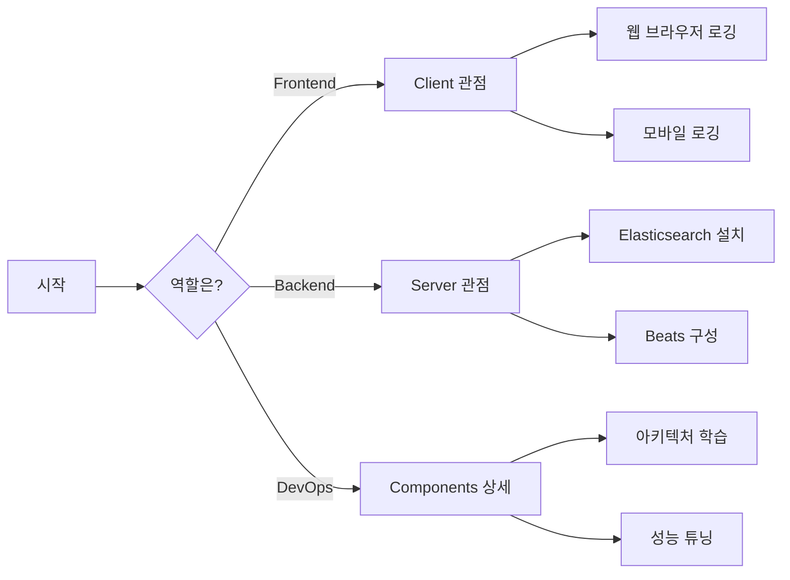
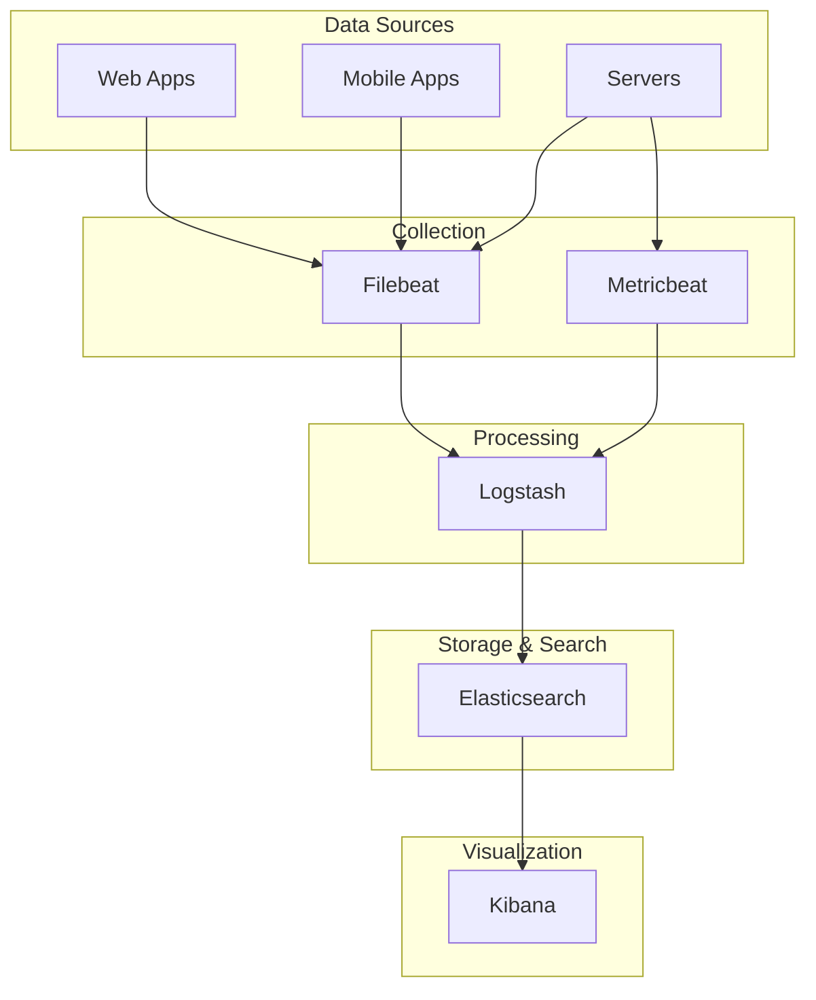
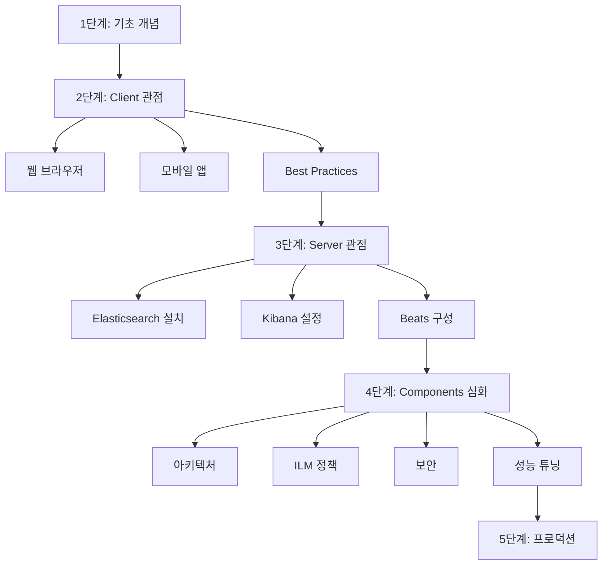
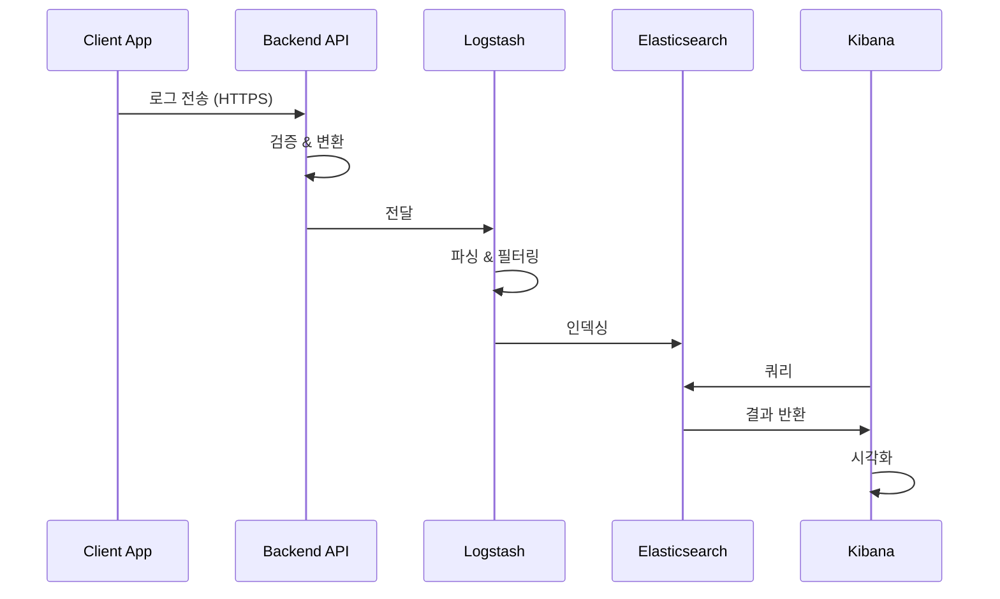

---
tags:
  - ELK
  - Elasticsearch
  - Logstash
  - Kibana
  - Beats
  - 로그관리
  - 모니터링
created: 2025-10-06
updated: 2025-10-06
version: 2.0
status: active
---

# ELK Stack 스터디 가이드

> [!info] 최신 업데이트
> **날짜**: 2025-10-06
> **버전**: Elasticsearch 9.1.4
> **상태**: 2025년 최신 자료 기반

## 🎯 빠른 시작



## 📚 학습 경로

### [[01-Client/README|🖥️ Client 관점]]

클라이언트 애플리케이션에서 ELK로 로그 전송

- [[01-Client/01-웹-브라우저-로깅|웹 브라우저 로깅]] - React, Vue, Angular
- [[01-Client/02-모바일-애플리케이션-로깅|모바일 앱 로깅]] - iOS, Android
- [[01-Client/03-Client-Best-Practices|Client Best Practices]] - 보안, 성능

### [[02-Server/README|⚙️ Server 관점]]

서버에서 로그 수집, 처리, 저장

- [[02-Server/01-Beats-설치-및-구성|Beats 설치]] - Filebeat, Metricbeat
- [[02-Server/02-Logstash-파이프라인|Logstash 파이프라인]] - Input, Filter, Output
- [[02-Server/03-Elasticsearch-설치-및-구성|Elasticsearch 설치]] - 클러스터 구성
- [[02-Server/04-Kibana-시각화|Kibana 시각화]] - 대시보드, 알림

### [[03-Components/README|🔧 Components 상세]]

각 구성 요소의 심화 학습

- [[03-Components/01-Elasticsearch-아키텍처|Elasticsearch 아키텍처]] - 클러스터, 노드, 샤드
- [[03-Components/02-Logstash-상세|Logstash 상세]] - 파이프라인 튜닝
- [[03-Components/03-Kibana-고급-기능|Kibana 고급 기능]] - KQL, 고급 시각화
- [[03-Components/04-ILM-정책|ILM 정책]] - 데이터 수명 주기
- [[03-Components/05-보안-및-인증|보안 및 인증]] - TLS, RBAC
- [[03-Components/06-성능-튜닝|성능 튜닝]] - 최적화

---

## 💡 ELK Stack 개요

### 구성 요소



> [!abstract] 핵심 구성 요소
> - **Elasticsearch**: 분산형 검색 및 분석 엔진
> - **Logstash**: 데이터 수집 및 변환 파이프라인
> - **Kibana**: 시각화 및 탐색 도구
> - **Beats**: 경량 데이터 수집기

---

## 🚀 최신 버전 (2025-10-06)

> [!tip] 현재 버전
> **Elasticsearch 9.1.4** (2025년 9월 18일 릴리스)

### 주요 신기능

#### Better Binary Quantization (BBQ)

> [!success] 성능 향상
> - OpenSearch 대비 **5배 빠른** 검색
> - 메모리 사용량 **95% 감소**
> - 버전 9.1부터 기본 활성화

#### AI & 시맨틱 검색

- `semantic_text` 필드 타입 GA
- ColPali, ColBERT 모델 지원
- `rank_vectors` 필드 타입 (실험적)

#### ES|QL 개선

- LOOKUP JOIN 지원
- 점수 매기기 및 시맨틱 검색
- 새로운 KQL 함수

#### ACORN 알고리즘

> [!note] 필터링 최적화
> 필터링된 벡터 검색이 기존 대비 **최대 5배 빠름**

#### 보안 강화

> [!warning] 필수 설정
> 버전 8.0부터 **보안이 기본 활성화**됩니다.
> - TLS/SSL 필수
> - RBAC 권장

**출처**: [Elasticsearch 9.1 Release](https://www.elastic.co/blog/whats-new-elastic-9-1-0)

---

## 🗺️ 학습 로드맵



### 단계별 가이드

#### 1단계: 기초 개념 이해

- [ ] 이 README 읽기
- [ ] ELK Stack 구성 요소 이해
- [ ] 데이터 흐름 파악

#### 2단계: Client 관점

- [ ] [[01-Client/01-웹-브라우저-로깅|웹 브라우저 로깅]] 학습
- [ ] [[01-Client/02-모바일-애플리케이션-로깅|모바일 로깅]] 학습 (선택)
- [ ] [[01-Client/03-Client-Best-Practices|Best Practices]] 숙지

#### 3단계: Server 관점

- [ ] [[02-Server/03-Elasticsearch-설치-및-구성|Elasticsearch 설치]]
- [ ] [[02-Server/04-Kibana-시각화|Kibana 설정]]
- [ ] [[02-Server/01-Beats-설치-및-구성|Beats 구성]]
- [ ] [[02-Server/02-Logstash-파이프라인|Logstash]] (선택)

#### 4단계: 심화 학습

- [ ] [[03-Components/01-Elasticsearch-아키텍처|Elasticsearch 아키텍처]]
- [ ] [[03-Components/04-ILM-정책|ILM 정책]]
- [ ] [[03-Components/05-보안-및-인증|보안 설정]]
- [ ] [[03-Components/06-성능-튜닝|성능 최적화]]

---

## 🎓 역할별 추천 경로

### Frontend 개발자

```
[[01-Client/01-웹-브라우저-로깅]]
    ↓
[[01-Client/03-Client-Best-Practices]]
    ↓
[[02-Server/04-Kibana-시각화]] (기본만)
```

### Mobile 개발자

```
[[01-Client/02-모바일-애플리케이션-로깅]]
    ↓
[[01-Client/03-Client-Best-Practices]]
```

### Backend 개발자

```
[[02-Server/03-Elasticsearch-설치-및-구성]]
    ↓
[[02-Server/01-Beats-설치-및-구성]]
    ↓
[[03-Components/01-Elasticsearch-아키텍처]]
```

### DevOps 엔지니어

```
[[02-Server/README]] (전체)
    ↓
[[03-Components/README]] (전체)
    ↓
[[03-Components/05-보안-및-인증]]
    ↓
[[03-Components/06-성능-튜닝]]
```

---

## 🔑 핵심 개념

### Client vs Server

| 구분 | Client | Server |
|:-----|:-------|:-------|
| **연결 방식** | 백엔드 API 경유 | 직접 연결 가능 |
| **네트워크** | 불안정 | 안정적 |
| **보안** | 민감 정보 필터링 필수 | 내부 네트워크 |
| **오프라인** | 로컬 버퍼링 필요 | 불필요 |
| **전송 빈도** | 배치 전송 | 실시간 가능 |

> [!danger] 보안 주의
> 클라이언트에서 **절대** Elasticsearch에 직접 연결하지 마세요!
> - 자격 증명 노출 위험
> - 악의적 데이터 주입 가능
> - DDoS 공격 대상

### 데이터 흐름



---

## 📖 참고 자료

### 공식 문서

- [Elastic Stack 공식](https://www.elastic.co/elastic-stack)
- [Elasticsearch Docs](https://www.elastic.co/guide/en/elasticsearch/reference/current/index.html)
- [Logstash Docs](https://www.elastic.co/guide/en/logstash/current/index.html)
- [Kibana Docs](https://www.elastic.co/guide/en/kibana/current/index.html)
- [Beats Docs](https://www.elastic.co/guide/en/beats/libbeat/current/index.html)

### 커뮤니티

- [Logz.io ELK Guide](https://logz.io/learn/complete-guide-elk-stack/)
- [ELK Stack 2025 Guide](https://prepare.sh/articles/the-definitive-guide-to-the-elk-stack-in-2025-from-zero-to-production-ready-observability)
- [AWS ELK Stack](https://aws.amazon.com/what-is/elk-stack/)
- [Coralogix Architecture Guide](https://coralogix.com/guides/elasticsearch/elasticsearch-architecture-8-key-components-and-putting-them-to-work/)

---

## 🏷️ 태그별 분류

#ELK #Elasticsearch #Logstash #Kibana #Beats
#로그관리 #모니터링 #observability #DevOps
#보안 #성능최적화 #분산시스템

---

## 📁 디렉터리 구조

```
study/ELK/
├── 📄 README.md                    ← 여기
│
├── 📂 01-Client/                   클라이언트 관점
│   ├── 📄 README.md
│   ├── 📄 01-웹-브라우저-로깅.md
│   ├── 📄 02-모바일-애플리케이션-로깅.md
│   └── 📄 03-Client-Best-Practices.md
│
├── 📂 02-Server/                   서버 관점
│   ├── 📄 README.md
│   ├── 📄 01-Beats-설치-및-구성.md
│   ├── 📄 02-Logstash-파이프라인.md
│   ├── 📄 03-Elasticsearch-설치-및-구성.md
│   └── 📄 04-Kibana-시각화.md
│
└── 📂 03-Components/               컴포넌트 상세
    ├── 📄 README.md
    ├── 📄 01-Elasticsearch-아키텍처.md
    ├── 📄 02-Logstash-상세.md
    ├── 📄 03-Kibana-고급-기능.md
    ├── 📄 04-ILM-정책.md
    ├── 📄 05-보안-및-인증.md
    └── 📄 06-성능-튜닝.md
```

---

## 🔗 바로가기

> [!tip] 처음 시작하는 분
> 1. [[01-Client/01-웹-브라우저-로깅|웹 브라우저 로깅]] - 클라이언트 로그 전송
> 2. [[02-Server/03-Elasticsearch-설치-및-구성|Elasticsearch 설치]] - 서버 설치
> 3. [[02-Server/04-Kibana-시각화|Kibana 대시보드]] - 시각화

> [!example] 특정 주제
> - **보안**: [[01-Client/03-Client-Best-Practices#보안|Client 보안]], [[03-Components/05-보안-및-인증|Server 보안]]
> - **성능**: [[03-Components/06-성능-튜닝|성능 튜닝 가이드]]
> - **데이터 관리**: [[03-Components/04-ILM-정책|ILM 정책]]
> - **모바일**: [[01-Client/02-모바일-애플리케이션-로깅|모바일 로깅]]

---

## ✨ 이 가이드의 특징

- [x] 2025-10-06 기준 최신 정보
- [x] 모든 출처 명시
- [x] Client/Server 관점 분류
- [x] 실전 예시 코드 포함
- [x] Obsidian 최적화
  - Wiki-style links
  - Callouts
  - Mermaid diagrams
  - Tags
  - YAML frontmatter

---

**작성**: 2025-10-06
**버전**: 2.0 (Obsidian 최적화)
**다음 업데이트**: Elasticsearch 10.x 릴리스 시

#가이드 #스터디 #documentation
