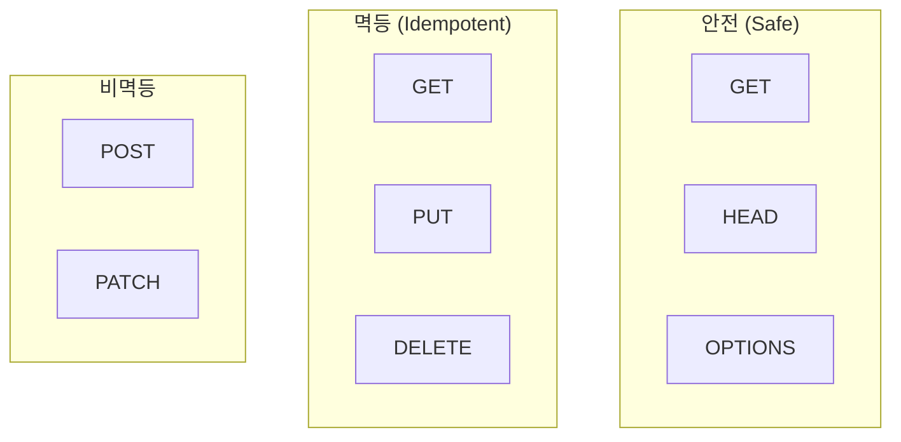
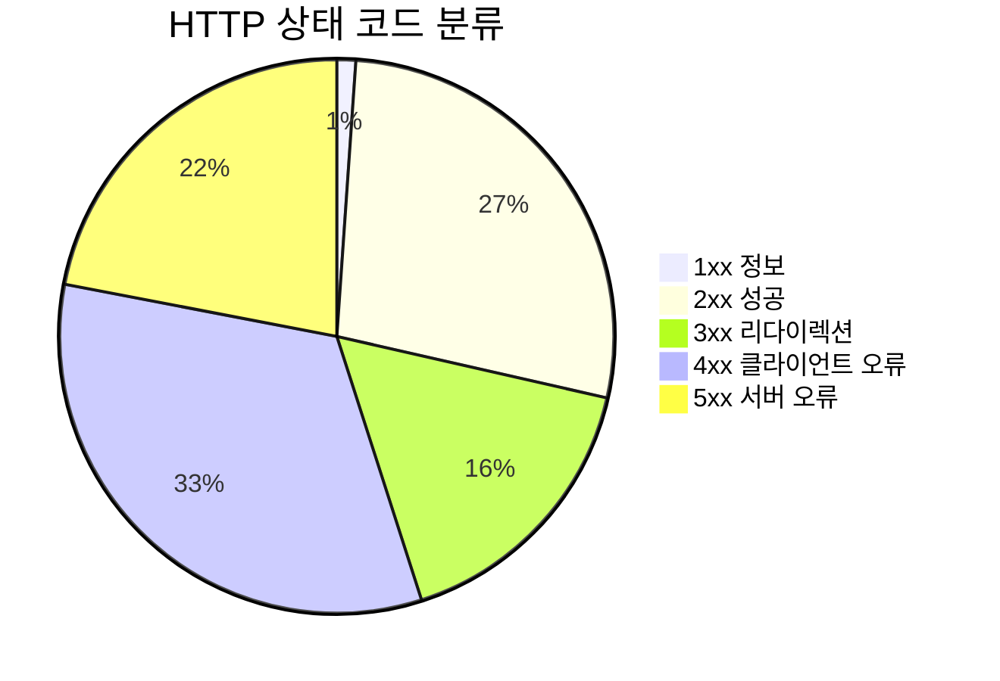
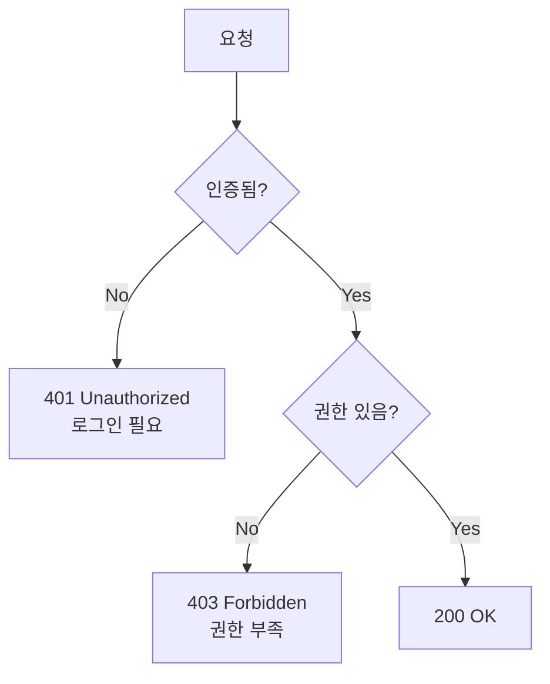
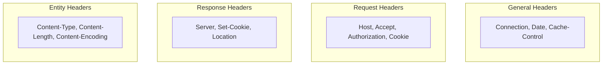
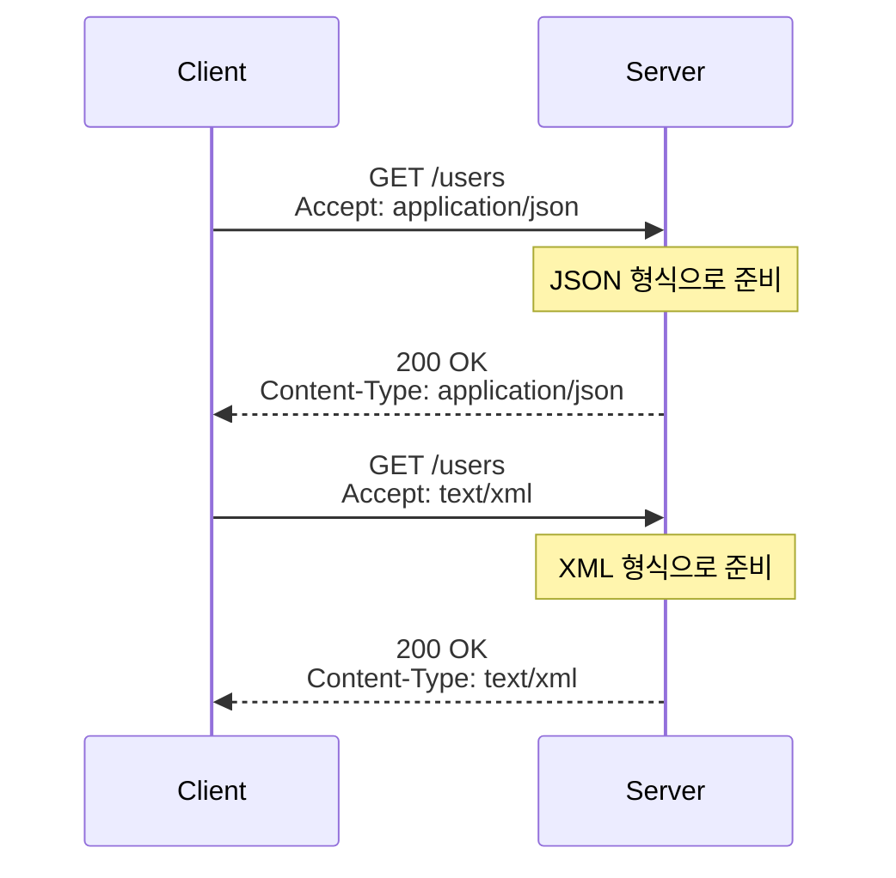
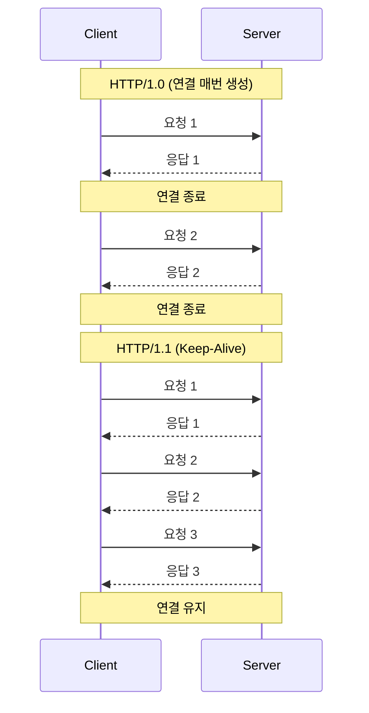
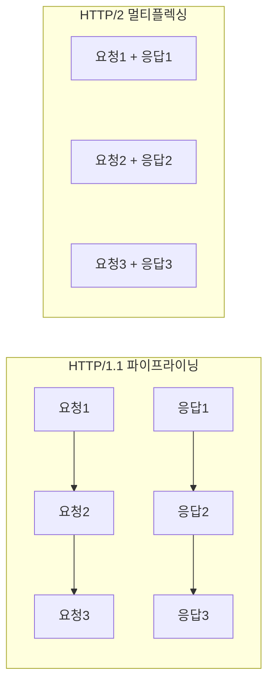

# HTTP - 핵심

> ⬅️ [[01-basics|이전: 기초]] | ➡️ [[03-practice|다음: 실무]]

---

## 1. HTTP 메서드

### 주요 메서드

| 메서드 | 목적 | 안전 | 멱등 | 요청 본문 | 응답 본문 |
|--------|------|------|------|----------|----------|
| **GET** | 조회 | ✅ | ✅ | ❌ | ✅ |
| **POST** | 생성 | ❌ | ❌ | ✅ | ✅ |
| **PUT** | 전체 수정 | ❌ | ✅ | ✅ | ✅ |
| **PATCH** | 부분 수정 | ❌ | ❌ | ✅ | ✅ |
| **DELETE** | 삭제 | ❌ | ✅ | ❌ | ❌ |
| **HEAD** | 헤더만 조회 | ✅ | ✅ | ❌ | ❌ |
| **OPTIONS** | 지원 메서드 조회 | ✅ | ✅ | ❌ | ✅ |

### 안전(Safe) vs 멱등(Idempotent)



- **안전**: 서버 상태를 변경하지 않음
- **멱등**: 여러 번 호출해도 결과가 동일

### 메서드 사용 예시

```http
# GET - 리소스 조회
GET /api/users/1 HTTP/1.1
Host: api.example.com

# POST - 리소스 생성
POST /api/users HTTP/1.1
Content-Type: application/json

{"name": "Alice", "email": "alice@example.com"}

# PUT - 전체 수정 (리소스 전체 교체)
PUT /api/users/1 HTTP/1.1
Content-Type: application/json

{"name": "Alice Updated", "email": "new@example.com", "age": 30}

# PATCH - 부분 수정
PATCH /api/users/1 HTTP/1.1
Content-Type: application/json

{"name": "Alice Updated"}

# DELETE - 삭제
DELETE /api/users/1 HTTP/1.1
```

---

## 2. 상태 코드

### 상태 코드 분류



### 주요 상태 코드

#### 2xx 성공

| 코드 | 이름 | 설명 | 사용 케이스 |
|------|------|------|------------|
| **200** | OK | 성공 | GET 조회 성공 |
| **201** | Created | 생성됨 | POST 생성 성공 |
| **204** | No Content | 본문 없음 | DELETE 성공 |

#### 3xx 리다이렉션

| 코드 | 이름 | 설명 | 메서드 유지 |
|------|------|------|------------|
| **301** | Moved Permanently | 영구 이동 | ❌ (GET으로 변경) |
| **302** | Found | 임시 이동 | ❌ (GET으로 변경) |
| **304** | Not Modified | 캐시 사용 | - |
| **307** | Temporary Redirect | 임시 이동 | ✅ |
| **308** | Permanent Redirect | 영구 이동 | ✅ |

#### 4xx 클라이언트 오류

| 코드 | 이름 | 설명 |
|------|------|------|
| **400** | Bad Request | 잘못된 요청 문법 |
| **401** | Unauthorized | 인증 필요 |
| **403** | Forbidden | 권한 없음 (인증됨) |
| **404** | Not Found | 리소스 없음 |
| **405** | Method Not Allowed | 지원하지 않는 메서드 |
| **409** | Conflict | 충돌 (중복 등) |
| **422** | Unprocessable Entity | 유효성 검증 실패 |
| **429** | Too Many Requests | 요청 한도 초과 |

#### 5xx 서버 오류

| 코드 | 이름 | 설명 |
|------|------|------|
| **500** | Internal Server Error | 서버 내부 오류 |
| **502** | Bad Gateway | 게이트웨이 오류 |
| **503** | Service Unavailable | 서비스 이용 불가 |
| **504** | Gateway Timeout | 게이트웨이 타임아웃 |

### 401 vs 403



---

## 3. HTTP 헤더

### 헤더 분류



### 주요 요청 헤더

| 헤더 | 설명 | 예시 |
|------|------|------|
| **Host** | 대상 서버 | `Host: api.example.com` |
| **Accept** | 원하는 응답 형식 | `Accept: application/json` |
| **Accept-Language** | 선호 언어 | `Accept-Language: ko-KR,en` |
| **Accept-Encoding** | 지원 압축 | `Accept-Encoding: gzip, br` |
| **Authorization** | 인증 정보 | `Authorization: Bearer token` |
| **Cookie** | 쿠키 전송 | `Cookie: session=abc123` |
| **User-Agent** | 클라이언트 정보 | `User-Agent: Mozilla/5.0...` |
| **Referer** | 이전 페이지 URL | `Referer: https://google.com` |

### 주요 응답 헤더

| 헤더 | 설명 | 예시 |
|------|------|------|
| **Content-Type** | 본문 타입 | `Content-Type: application/json` |
| **Content-Length** | 본문 크기 | `Content-Length: 1234` |
| **Content-Encoding** | 압축 방식 | `Content-Encoding: gzip` |
| **Location** | 리다이렉트 위치 | `Location: /new-path` |
| **Set-Cookie** | 쿠키 설정 | `Set-Cookie: session=xyz` |
| **Cache-Control** | 캐시 정책 | `Cache-Control: max-age=3600` |

### Content-Type 종류

| Content-Type | 용도 |
|--------------|------|
| `application/json` | JSON 데이터 |
| `application/x-www-form-urlencoded` | HTML 폼 데이터 |
| `multipart/form-data` | 파일 업로드 |
| `text/html` | HTML 문서 |
| `text/plain` | 일반 텍스트 |
| `application/octet-stream` | 바이너리 파일 |

---

## 4. 콘텐츠 협상 (Content Negotiation)

### 협상 흐름



### Quality Value (q)

```http
Accept: text/html, application/json;q=0.9, */*;q=0.8
```

| 값 | 우선순위 |
|----|---------|
| `text/html` | 1.0 (기본) |
| `application/json;q=0.9` | 0.9 |
| `*/*;q=0.8` | 0.8 |

---

## 5. 연결 관리

### Keep-Alive



### 파이프라이닝 vs 멀티플렉싱



---

## 6. 체크리스트

### 이해도 확인

- [ ] HTTP 메서드 5개 이상 설명 가능
- [ ] 안전/멱등 개념 이해
- [ ] 상태 코드 분류 (2xx, 3xx, 4xx, 5xx) 이해
- [ ] 401 vs 403 차이 설명 가능
- [ ] 주요 헤더 역할 이해
- [ ] Content-Type 종류 알고 있음

---

## 다음 단계

> [!tip] 다음으로
> 핵심 개념을 이해했다면 [[03-practice|실무 적용]]에서 캐시, 쿠키, 보안을 학습하세요.

---

## References

- [MDN HTTP 메서드](https://developer.mozilla.org/ko/docs/Web/HTTP/Methods)
- [HTTP Status Codes](https://httpstatuses.com/)
- [RFC 7231 - HTTP/1.1 Semantics](https://tools.ietf.org/html/rfc7231)
