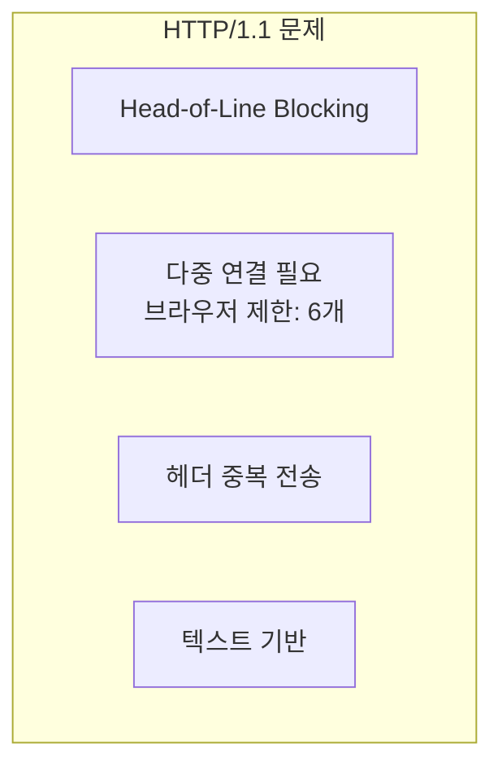
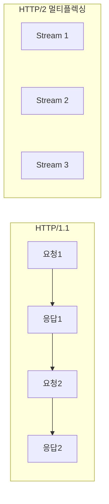
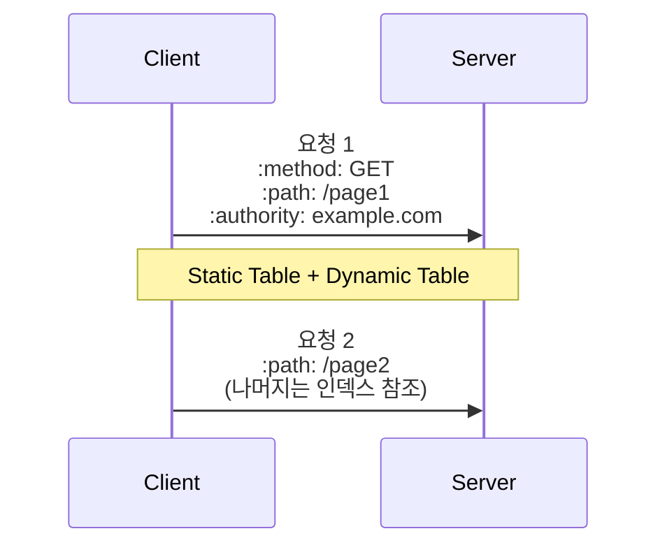
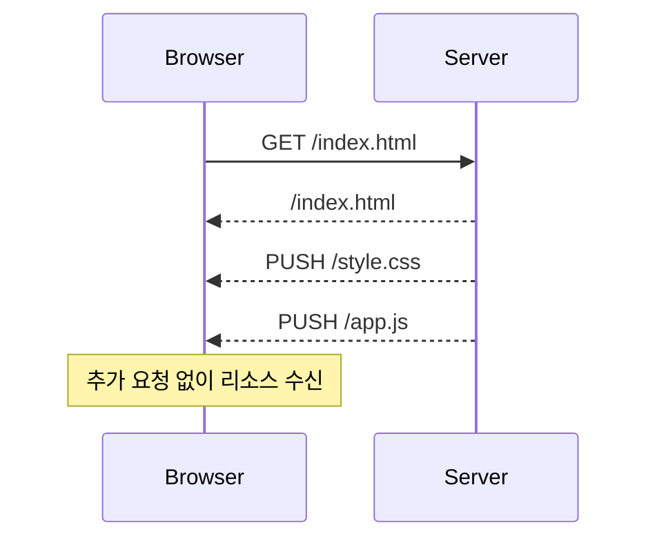
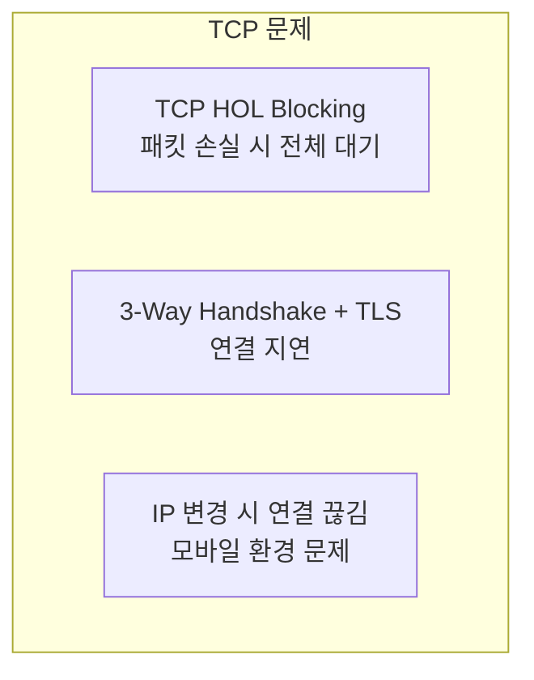
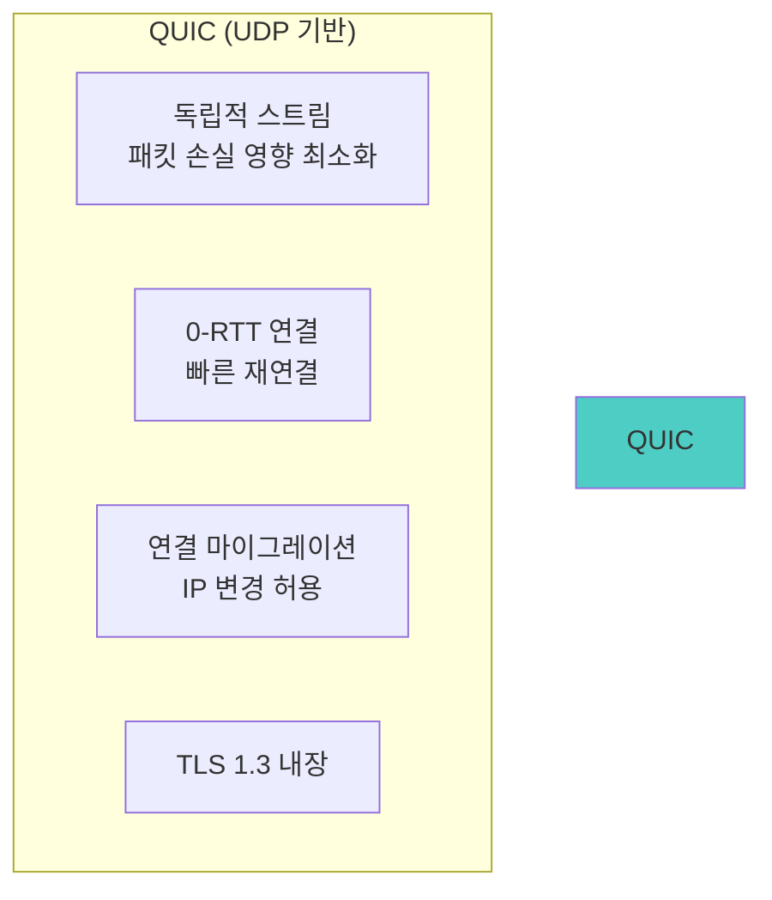
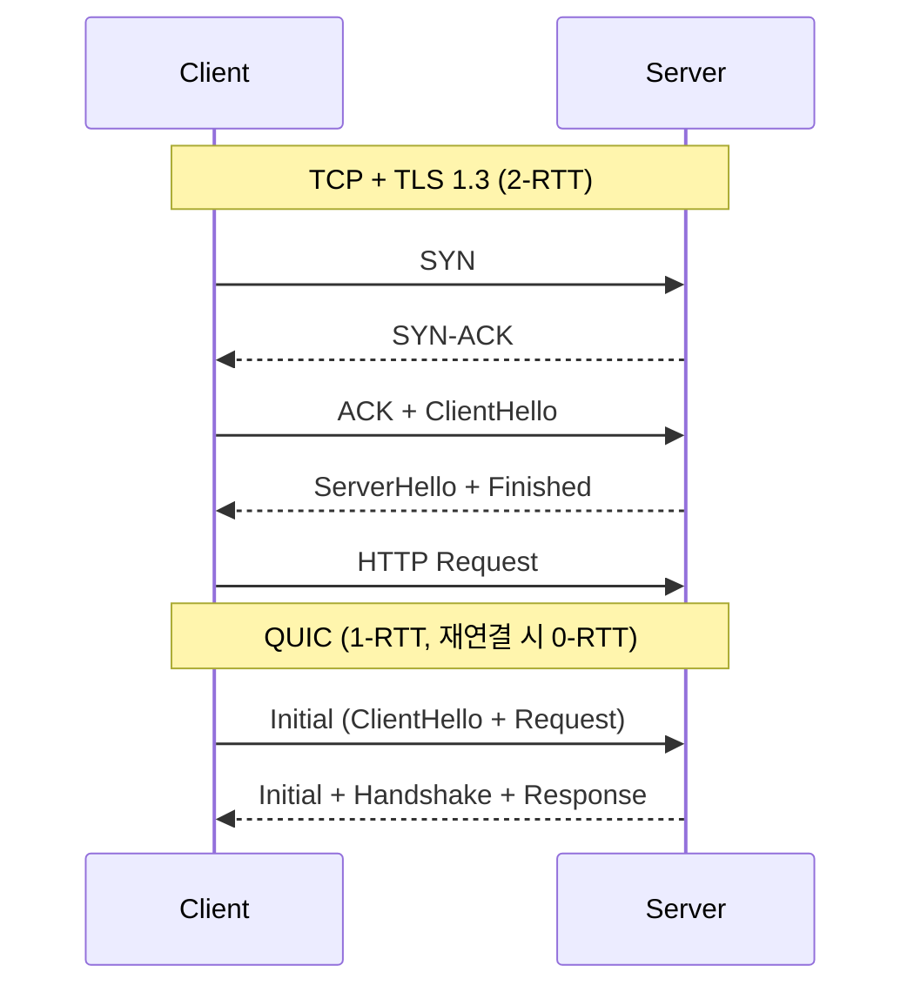
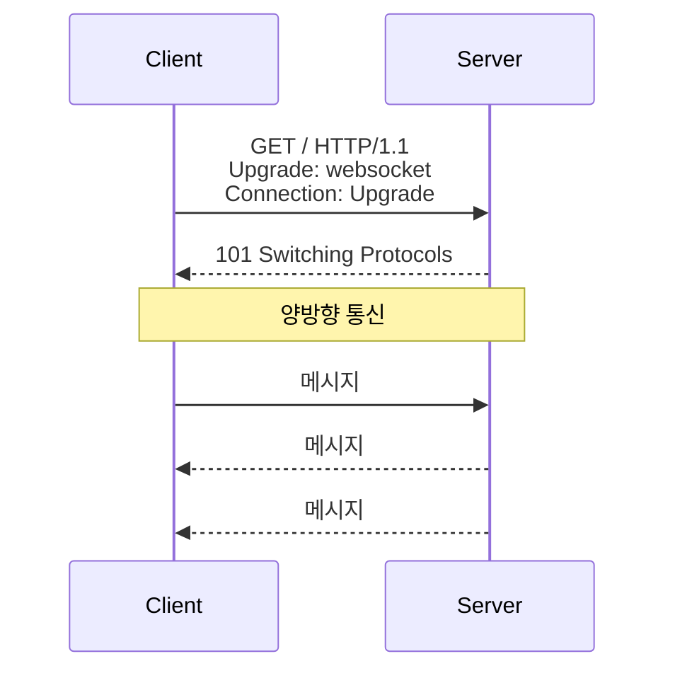
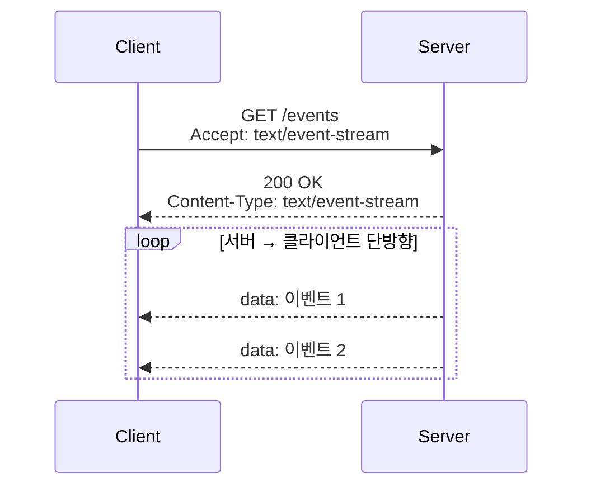

# HTTP - 고급

> ⬅️ [[03-practice|이전: 실무]] | 🏠 [[README|목차로 돌아가기]]

---

## 1. HTTP/2

### HTTP/1.1 문제점



### HTTP/2 특징

#### 멀티플렉싱



```
하나의 TCP 연결에서 여러 스트림 병렬 처리
→ 연결 수 감소, HOL Blocking 해결
```

#### HPACK 헤더 압축



| 구성 | 설명 |
|------|------|
| **Static Table** | 61개 사전 정의 헤더 |
| **Dynamic Table** | 연결 중 학습한 헤더 |
| **Huffman Encoding** | 값 압축 |

#### 서버 푸시



### HTTP/2 설정

```nginx
# Nginx HTTP/2 설정
server {
    listen 443 ssl http2;
    ssl_certificate /path/to/cert.pem;
    ssl_certificate_key /path/to/key.pem;

    # 서버 푸시
    location / {
        http2_push /css/style.css;
        http2_push /js/app.js;
    }
}
```

---

## 2. HTTP/3 & QUIC

### TCP의 한계



### QUIC 특징



### 연결 설정 비교



### HTTP/3 vs HTTP/2

| 항목 | HTTP/2 | HTTP/3 |
|------|--------|--------|
| 전송 계층 | TCP | QUIC (UDP) |
| 암호화 | TLS 1.2+ | TLS 1.3 내장 |
| HOL Blocking | TCP 레벨 존재 | 스트림별 독립 |
| 연결 설정 | 2-3 RTT | 1 RTT (0-RTT 가능) |
| 연결 마이그레이션 | 불가 | 가능 |
| 헤더 압축 | HPACK | QPACK |

### HTTP/3 활성화

```nginx
# Nginx HTTP/3 (1.25.0+)
server {
    listen 443 quic reuseport;
    listen 443 ssl;
    http2 on;

    ssl_protocols TLSv1.3;

    add_header Alt-Svc 'h3=":443"; ma=86400';
}
```

---

## 3. 성능 최적화

### 리소스 힌트

```html
<!-- DNS Prefetch: DNS 조회 미리 수행 -->
<link rel="dns-prefetch" href="//api.example.com">

<!-- Preconnect: DNS + TCP + TLS 미리 연결 -->
<link rel="preconnect" href="https://cdn.example.com">

<!-- Prefetch: 다음 페이지 리소스 미리 로드 -->
<link rel="prefetch" href="/next-page.js">

<!-- Preload: 현재 페이지 중요 리소스 미리 로드 -->
<link rel="preload" href="/critical.css" as="style">
```

### Priority Hints (HTTP/2+)

```html
<!-- 높은 우선순위 -->


<!-- 낮은 우선순위 -->


<!-- 스크립트 우선순위 -->
<script src="critical.js" fetchpriority="high"></script>
```

### 103 Early Hints

```mermaid
sequenceDiagram
    participant Browser
    participant Server

    Browser->>Server: GET /page
    Server-->>Browser: 103 Early Hints<br>Link: </style.css>; rel=preload

    Note over Browser: CSS 다운로드 시작

    Server-->>Browser: 200 OK<br>HTML 본문
```

```nginx
# Nginx Early Hints
location / {
    add_header Link "</style.css>; rel=preload; as=style" early;
}
```

---

## 4. 실시간 통신

### WebSocket



```javascript
const ws = new WebSocket('wss://example.com/socket');

ws.onopen = () => ws.send('Hello');
ws.onmessage = (event) => console.log(event.data);
```

### Server-Sent Events (SSE)



```javascript
const source = new EventSource('/events');
source.onmessage = (event) => console.log(event.data);
```

### 비교

| 항목 | WebSocket | SSE | HTTP Polling |
|------|-----------|-----|--------------|
| 방향 | 양방향 | 서버→클라이언트 | 요청-응답 |
| 프로토콜 | WS/WSS | HTTP | HTTP |
| 연결 | 상시 유지 | 상시 유지 | 주기적 재연결 |
| 적합 | 채팅, 게임 | 알림, 피드 | 간단한 갱신 |

---

## 5. 모니터링 & 디버깅

### Chrome DevTools

```
Network 탭:
- Protocol: h2, h3 확인
- Timing: TTFB, Content Download 분석
- Priority: 리소스 우선순위 확인

Performance 탭:
- Waterfall: 리소스 로드 순서
- Long Tasks: 블로킹 작업 식별
```

### curl로 HTTP 버전 확인

```bash
# HTTP/2
curl -I --http2 https://example.com

# HTTP/3
curl -I --http3 https://example.com

# 상세 연결 정보
curl -v --http2 https://example.com 2>&1 | grep '< HTTP'
```

### 성능 지표

| 지표 | 설명 | 목표 |
|------|------|------|
| **TTFB** | 첫 바이트 도착 시간 | < 200ms |
| **FCP** | 첫 콘텐츠 렌더링 | < 1.8s |
| **LCP** | 최대 콘텐츠 렌더링 | < 2.5s |
| **CLS** | 레이아웃 이동 | < 0.1 |

---

## 6. 체크리스트

### HTTP/2 도입

- [ ] HTTPS 활성화 (필수)
- [ ] HTTP/2 서버 설정
- [ ] 도메인 샤딩 제거
- [ ] 스프라이트/번들 최소화 검토
- [ ] 서버 푸시 테스트

### HTTP/3 도입

- [ ] TLS 1.3 설정
- [ ] QUIC 지원 서버 업그레이드
- [ ] Alt-Svc 헤더 설정
- [ ] UDP 443 방화벽 허용

### 성능 최적화

- [ ] 리소스 힌트 적용 (preconnect, preload)
- [ ] Priority Hints 설정
- [ ] Core Web Vitals 측정

---

## References

- [HTTP/2 RFC 7540](https://tools.ietf.org/html/rfc7540)
- [HTTP/3 RFC 9114](https://datatracker.ietf.org/doc/rfc9114/)
- [QUIC RFC 9000](https://datatracker.ietf.org/doc/rfc9000/)
- [web.dev HTTP/2](https://web.dev/performance-http2/)
