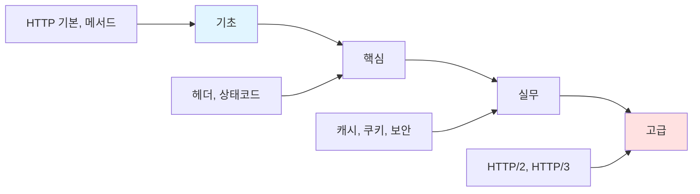
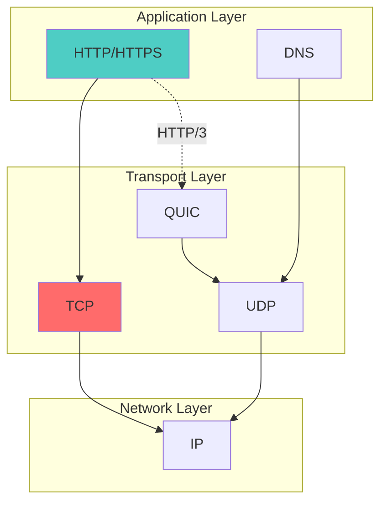

# HTTP

> **한 줄 정의**: HyperText Transfer Protocol, 웹에서 클라이언트와 서버 간 데이터를 주고받는 애플리케이션 계층 프로토콜

## 개요



### 네트워크 계층 구조



---

## 학습 경로

### 1단계: 기초 (1시간)
- [ ] [[01-basics|기초 개념]] 읽기
- [ ] HTTP 기본 원리 이해
- [ ] 요청/응답 구조

### 2단계: 핵심 (2시간)
- [ ] [[02-core|핵심 개념]] 학습
- [ ] HTTP 메서드와 상태 코드
- [ ] 헤더의 역할

### 3단계: 실무 (2시간)
- [ ] [[03-practice|실무 적용]] 실습
- [ ] 캐시, 쿠키, 인증
- [ ] CORS, 보안 헤더

### 4단계: 고급 (선택)
- [ ] [[04-advanced|심화 학습]]
- [ ] HTTP/2, HTTP/3
- [ ] 성능 최적화

---

## 파일 구조

```
HTTP/
├── README.md          ← 여기 (개요 + 로드맵)
├── 01-basics.md       ← 기초 (프로토콜 기본)
├── 02-core.md         ← 핵심 (메서드, 상태코드, 헤더)
├── 03-practice.md     ← 실무 (캐시, 쿠키, 보안)
├── 04-advanced.md     ← 고급 (HTTP/2, HTTP/3)
└── pre/               ← 기존 노트 백업
```

## 바로가기

| 단계 | 파일 | 핵심 내용 |
|------|------|----------|
| 기초 | [[01-basics]] | URL, 요청/응답 구조, TCP/IP |
| 핵심 | [[02-core]] | 메서드, 상태코드, 헤더 |
| 실무 | [[03-practice]] | 캐시, 쿠키, CORS, HTTPS |
| 고급 | [[04-advanced]] | HTTP/2, HTTP/3, QUIC |

---

## 빠른 참조

### HTTP 요청 구조

```http
GET /api/users HTTP/1.1
Host: example.com
Accept: application/json
Authorization: Bearer eyJhbGc...
```

### HTTP 응답 구조

```http
HTTP/1.1 200 OK
Content-Type: application/json
Cache-Control: max-age=3600

{"id": 1, "name": "Alice"}
```

---

## 관련 노트

- [[TCP]]
- [[REST-API]]
- [[Web-Security]]

---

**생성일**: 2025-01-18
**상태**: 학습 중
**예상 학습 시간**: 5-6시간
