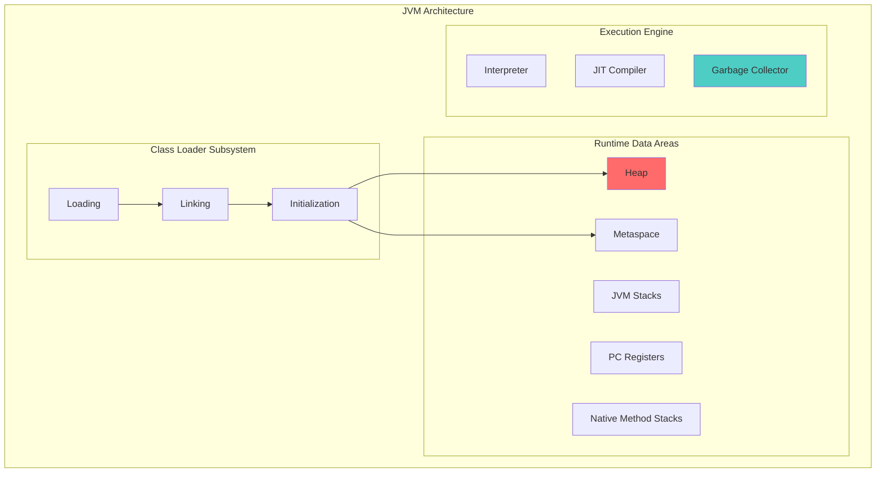
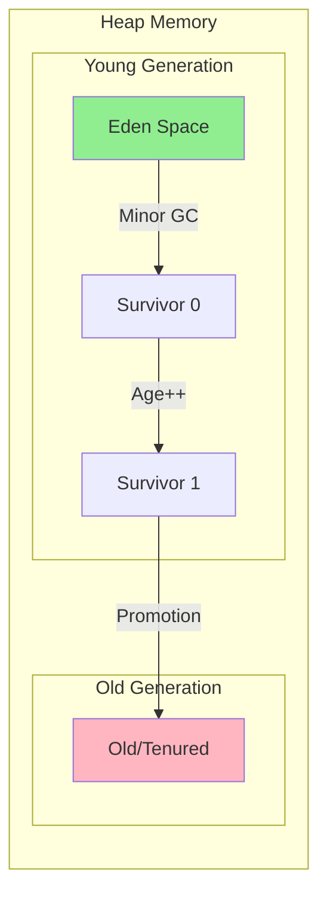
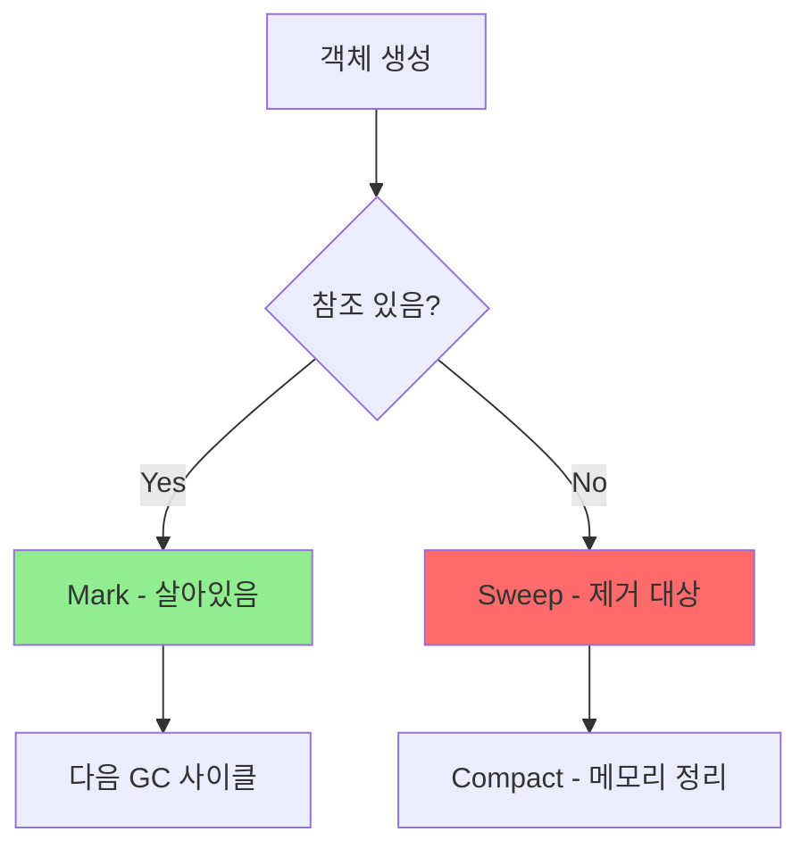
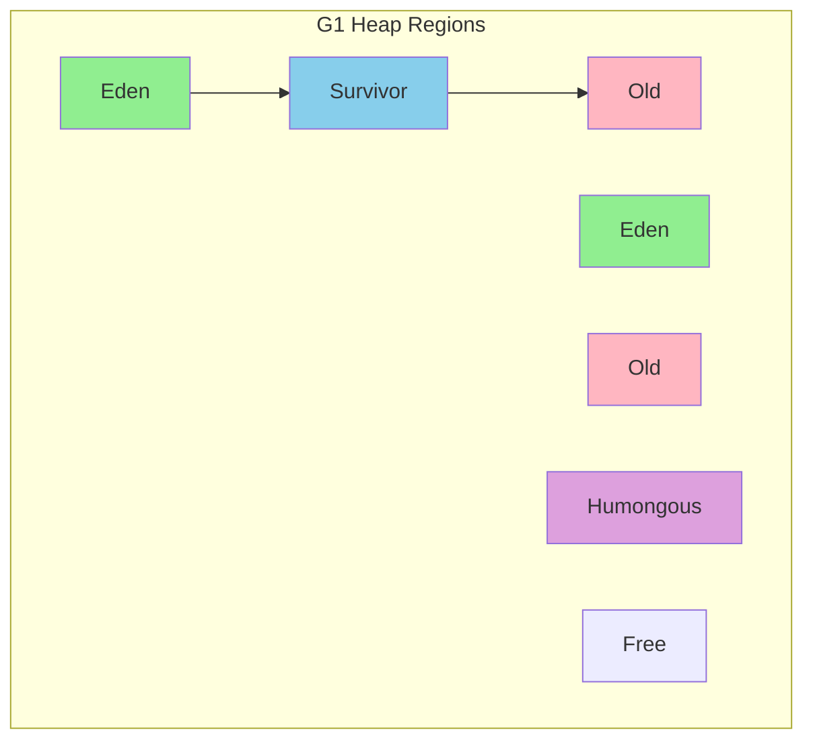
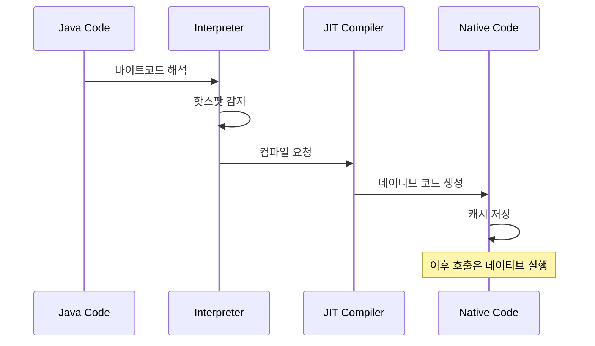

# Java - JVM 심화

> ⬅️ [[01-basics|이전: 기초]] | ➡️ [[03-practice|다음: 실무]]

---

## 1. JVM 아키텍처

### 전체 구조



### Class Loader 단계

| 단계 | 역할 |
|------|------|
| **Loading** | .class 파일을 메모리에 로드 |
| **Linking** | Verify → Prepare → Resolve |
| **Initialization** | static 블록 실행, 변수 초기화 |

```java
// Class Loading 순서
// 1. Bootstrap ClassLoader: rt.jar (core classes)
// 2. Extension ClassLoader: ext/*.jar
// 3. Application ClassLoader: classpath

Class<?> clazz = Class.forName("com.example.MyClass");
System.out.println(clazz.getClassLoader());
```

---

## 2. 메모리 구조

### Heap 영역



### 메모리 영역별 특징

| 영역 | 저장 내용 | 특징 |
|------|----------|------|
| **Heap** | 객체 인스턴스 | GC 대상, 모든 스레드 공유 |
| **Stack** | 지역변수, 메서드 호출 | 스레드별 독립, LIFO |
| **Metaspace** | 클래스 메타데이터 | Native 메모리 사용 |
| **PC Register** | 현재 실행 명령 주소 | 스레드별 독립 |

### Stack vs Heap

```java
public void example() {
    int x = 10;              // Stack (primitive)
    String s = "Hello";      // Stack(참조) + Heap(객체)
    User user = new User();  // Stack(참조) + Heap(객체)
}
// 메서드 종료 시 Stack 자동 해제
// Heap의 객체는 GC가 처리
```

---

## 3. Garbage Collection

### GC 기본 원리



### GC 알고리즘 비교

| GC 종류 | 특징 | STW | 적합한 환경 |
|---------|------|-----|------------|
| **Serial GC** | 단일 스레드 | 길다 | 작은 애플리케이션 |
| **Parallel GC** | 멀티 스레드 | 중간 | 처리량 중시 |
| **G1 GC** | Region 기반 | 짧다 | 균형잡힌 성능 |
| **ZGC** | 초저지연 | <1ms | 대용량, 저지연 필수 |
| **Shenandoah** | 동시 압축 | 매우 짧음 | 저지연 필요 |

### G1 GC 동작 원리



```bash
# G1 GC 활성화 (Java 9+ 기본)
java -XX:+UseG1GC -Xms4g -Xmx4g MyApp

# ZGC 활성화 (Java 15+)
java -XX:+UseZGC -Xms8g -Xmx8g MyApp
```

### GC 튜닝 핵심 옵션

```bash
# Heap 크기
-Xms2g              # 초기 힙 크기
-Xmx4g              # 최대 힙 크기

# G1 GC 튜닝
-XX:MaxGCPauseMillis=200    # 목표 STW 시간
-XX:G1HeapRegionSize=16m    # Region 크기

# GC 로깅 (Java 9+)
-Xlog:gc*:file=gc.log:time,uptime,level,tags
```

---

## 4. JIT Compiler

### 동작 원리



### C1 vs C2 Compiler

| 컴파일러 | 최적화 수준 | 컴파일 속도 | 사용 시점 |
|---------|-----------|------------|----------|
| **C1 (Client)** | 낮음 | 빠름 | 시작 직후 |
| **C2 (Server)** | 높음 | 느림 | 핫스팟 감지 후 |

```bash
# Tiered Compilation (기본 활성화)
-XX:+TieredCompilation

# 컴파일 임계값
-XX:CompileThreshold=10000
```

---

## 5. 메모리 누수 패턴

### 흔한 메모리 누수

```java
// 1. Static 컬렉션
public class Cache {
    private static final Map<String, Object> cache = new HashMap<>();
    // 계속 쌓이면 OOM
}

// 2. 리스너 미해제
button.addActionListener(listener);
// removeActionListener() 호출 안함

// 3. 내부 클래스 참조
public class Outer {
    private byte[] data = new byte[1024 * 1024];

    class Inner {
        // Outer 참조를 유지 → data도 GC 안됨
    }
}

// 4. ThreadLocal 미정리
ThreadLocal<User> userContext = new ThreadLocal<>();
userContext.set(user);
// 스레드 풀 사용 시 userContext.remove() 필수
```

### 해결 방법

```java
// WeakReference 사용
Map<String, WeakReference<Object>> cache = new WeakHashMap<>();

// try-with-resources
try (Connection conn = dataSource.getConnection()) {
    // 자동 close
}

// ThreadLocal 정리
try {
    userContext.set(user);
    // 작업 수행
} finally {
    userContext.remove();
}
```

---

## 6. 체크리스트

### 이해도 확인

- [ ] JVM 메모리 구조 (Heap, Stack, Metaspace) 설명 가능
- [ ] Young/Old Generation 차이 이해
- [ ] GC 알고리즘 (G1, ZGC) 차이 설명 가능
- [ ] JIT Compiler 동작 원리 이해
- [ ] 메모리 누수 패턴 3가지 이상 알고 있음

---

## 다음 단계

> [!tip] 다음으로
> JVM 원리를 이해했다면 [[03-practice|실무 적용]]에서 성능 최적화와 디버깅을 학습하세요.

---

## References

- [Oracle JVM Tuning Guide](https://docs.oracle.com/en/java/javase/17/gctuning/)
- [G1 GC Fundamentals](https://www.oracle.com/technical-resources/articles/java/g1gc.html)
- [ZGC - Oracle](https://docs.oracle.com/en/java/javase/17/gctuning/z-garbage-collector.html)
