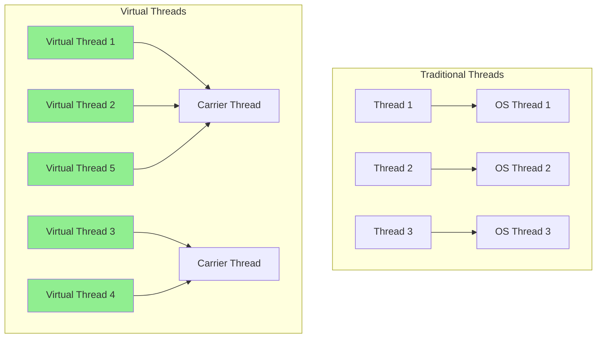
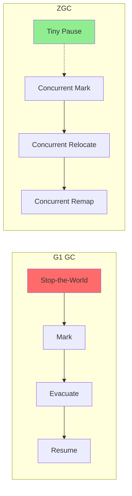

# Java - 고급

> ⬅️ [[03-practice|이전: 실무]] | 🏠 [[README|목차로 돌아가기]]

---

## 1. Java 21 LTS 신기능

### Virtual Threads (가상 스레드)

> **핵심**: OS 스레드가 아닌 JVM 관리 경량 스레드, 수백만 개 생성 가능



```java
// Virtual Thread 생성
Thread vThread = Thread.ofVirtual().start(() -> {
    System.out.println("Running in virtual thread");
});

// ExecutorService with Virtual Threads
try (var executor = Executors.newVirtualThreadPerTaskExecutor()) {
    IntStream.range(0, 100_000).forEach(i -> {
        executor.submit(() -> {
            Thread.sleep(Duration.ofSeconds(1));
            return i;
        });
    });
}  // 10만 개 동시 실행 가능!

// Spring Boot 3.2+ 설정
spring.threads.virtual.enabled=true
```

**적합한 케이스**:
- I/O 바운드 작업 (HTTP 호출, DB 쿼리)
- 대량 동시 요청 처리

**부적합한 케이스**:
- CPU 바운드 작업 (계산 집약적)
- synchronized 블록이 많은 코드

### Structured Concurrency

```java
// 구조화된 동시성 (Preview in Java 21)
try (var scope = new StructuredTaskScope.ShutdownOnFailure()) {
    Future<User> user = scope.fork(() -> findUser(userId));
    Future<Order> order = scope.fork(() -> findOrder(orderId));

    scope.join();           // 모든 작업 완료 대기
    scope.throwIfFailed();  // 예외 전파

    return new UserOrder(user.resultNow(), order.resultNow());
}
```

### Record Patterns

```java
// Record
record Point(int x, int y) {}
record Rectangle(Point topLeft, Point bottomRight) {}

// Record Pattern (Deconstruction)
if (obj instanceof Rectangle(Point(int x1, int y1), Point(int x2, int y2))) {
    int width = x2 - x1;
    int height = y2 - y1;
}

// Switch with Record Patterns
String describe(Object obj) {
    return switch (obj) {
        case Point(int x, int y) -> "Point at (" + x + ", " + y + ")";
        case Rectangle(Point tl, Point br) -> "Rectangle from " + tl + " to " + br;
        default -> "Unknown shape";
    };
}
```

### Pattern Matching for Switch

```java
// Exhaustive switch (sealed class)
sealed interface Shape permits Circle, Rectangle, Square {}
record Circle(double radius) implements Shape {}
record Rectangle(double width, double height) implements Shape {}
record Square(double side) implements Shape {}

double area(Shape shape) {
    return switch (shape) {
        case Circle(double r) -> Math.PI * r * r;
        case Rectangle(double w, double h) -> w * h;
        case Square(double s) -> s * s;
        // 컴파일러가 완전성 보장
    };
}

// Guarded Patterns
String classify(Integer i) {
    return switch (i) {
        case null -> "null";
        case Integer n when n < 0 -> "negative";
        case Integer n when n == 0 -> "zero";
        case Integer n -> "positive";
    };
}
```

### Sequenced Collections

```java
// Java 21 새로운 컬렉션 인터페이스
SequencedCollection<String> list = new ArrayList<>();
list.addFirst("first");    // 맨 앞에 추가
list.addLast("last");      // 맨 뒤에 추가
list.getFirst();           // 첫 요소
list.getLast();            // 마지막 요소
list.reversed();           // 역순 뷰

SequencedMap<String, Integer> map = new LinkedHashMap<>();
map.putFirst("a", 1);
map.putLast("z", 26);
map.firstEntry();
map.lastEntry();
```

---

## 2. GC 심화: ZGC

### ZGC 특징

| 특성 | 값 |
|-----|-----|
| **Pause Time** | < 1ms (수 TB 힙에서도) |
| **힙 크기** | 8MB ~ 16TB |
| **동시성** | 거의 모든 작업이 동시 수행 |
| **세대 구분** | Generational ZGC (Java 21) |

```bash
# ZGC 활성화
java -XX:+UseZGC -Xms16g -Xmx16g MyApp

# Generational ZGC (Java 21+, 기본)
java -XX:+UseZGC -XX:+ZGenerational -Xms16g -Xmx16g MyApp
```

### ZGC vs G1 GC



| 항목 | G1 GC | ZGC |
|-----|-------|-----|
| 일반 Pause | 50-200ms | < 1ms |
| 처리량 | 높음 | 약간 낮음 |
| 메모리 오버헤드 | 낮음 | 높음 (3-5%) |
| 적합한 힙 | 4GB-32GB | 8GB-16TB |

---

## 3. 고급 동시성 패턴

### CompletableFuture 고급

```java
// 여러 비동기 작업 조합
CompletableFuture<String> future = CompletableFuture
    .supplyAsync(() -> fetchUser(userId))
    .thenCombine(
        CompletableFuture.supplyAsync(() -> fetchOrders(userId)),
        (user, orders) -> formatResult(user, orders)
    )
    .exceptionally(ex -> {
        log.error("Failed", ex);
        return "Error: " + ex.getMessage();
    });

// 여러 작업 중 하나라도 완료되면
CompletableFuture<Object> anyOf = CompletableFuture.anyOf(
    fetchFromCache(),
    fetchFromDB(),
    fetchFromRemote()
);

// 모든 작업 완료 대기
CompletableFuture<Void> allOf = CompletableFuture.allOf(
    saveToCache(data),
    saveToAuditLog(data),
    notifySubscribers(data)
);
```

### Reactive Streams (Project Reactor)

```java
Flux.fromIterable(userIds)
    .flatMap(id -> userRepository.findById(id))
    .filter(user -> user.isActive())
    .map(user -> user.getEmail())
    .buffer(10)
    .subscribe(
        emails -> emailService.sendBatch(emails),
        error -> log.error("Error", error),
        () -> log.info("Completed")
    );
```

---

## 4. 디자인 패턴 (Java 17+)

### Builder with Record

```java
public record User(String name, int age, String email) {
    public static Builder builder() {
        return new Builder();
    }

    public static class Builder {
        private String name;
        private int age;
        private String email;

        public Builder name(String name) { this.name = name; return this; }
        public Builder age(int age) { this.age = age; return this; }
        public Builder email(String email) { this.email = email; return this; }

        public User build() {
            return new User(name, age, email);
        }
    }
}

User user = User.builder()
    .name("Alice")
    .age(30)
    .email("alice@example.com")
    .build();
```

### Sealed Classes로 상태 머신

```java
public sealed interface OrderState
    permits Pending, Confirmed, Shipped, Delivered, Cancelled {
}

record Pending(LocalDateTime createdAt) implements OrderState {}
record Confirmed(LocalDateTime confirmedAt) implements OrderState {}
record Shipped(String trackingNumber) implements OrderState {}
record Delivered(LocalDateTime deliveredAt) implements OrderState {}
record Cancelled(String reason) implements OrderState {}

// 상태 전이 로직
OrderState transition(OrderState state, OrderEvent event) {
    return switch (state) {
        case Pending p -> switch (event) {
            case ConfirmEvent e -> new Confirmed(LocalDateTime.now());
            case CancelEvent e -> new Cancelled(e.reason());
            default -> state;
        };
        case Confirmed c -> switch (event) {
            case ShipEvent e -> new Shipped(e.trackingNumber());
            case CancelEvent e -> new Cancelled(e.reason());
            default -> state;
        };
        case Shipped s -> switch (event) {
            case DeliverEvent e -> new Delivered(LocalDateTime.now());
            default -> state;
        };
        case Delivered d, Cancelled c -> state;  // 최종 상태
    };
}
```

---

## 5. Native Image (GraalVM)

### 네이티브 컴파일

```bash
# GraalVM Native Image 생성
native-image -jar application.jar

# Spring Boot Native
./mvnw -Pnative native:compile
```

### 비교

| 항목 | JVM | Native Image |
|-----|-----|--------------|
| 시작 시간 | 수 초 | 수십 ms |
| 메모리 | 높음 | 낮음 |
| 최고 성능 | 높음 (JIT) | 중간 (AOT) |
| 빌드 시간 | 빠름 | 느림 |
| 리플렉션 | 완벽 지원 | 제한적 |

**적합한 케이스**:
- 서버리스/람다
- CLI 도구
- 마이크로서비스

---

## 6. 체크리스트

### Java 21 도입 체크

- [ ] Virtual Threads 테스트 완료
- [ ] synchronized → ReentrantLock 전환 검토
- [ ] Pinned Thread 모니터링 설정
- [ ] Record Pattern 리팩토링
- [ ] Sequenced Collections 적용

### 성능 최적화 체크

- [ ] 적절한 GC 선택 (G1 vs ZGC)
- [ ] CompletableFuture 병렬화 적용
- [ ] ThreadLocal 정리 확인
- [ ] Connection Pool 최적화

---

## References

- [Java 21 Release Notes](https://openjdk.org/projects/jdk/21/)
- [Virtual Threads JEP 444](https://openjdk.org/jeps/444)
- [ZGC Documentation](https://wiki.openjdk.org/display/zgc)
- [GraalVM Native Image](https://www.graalvm.org/native-image/)
