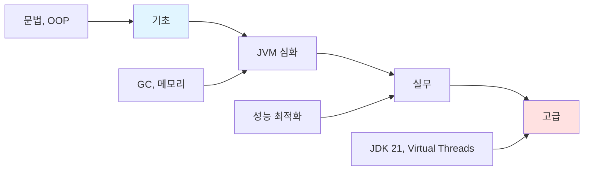
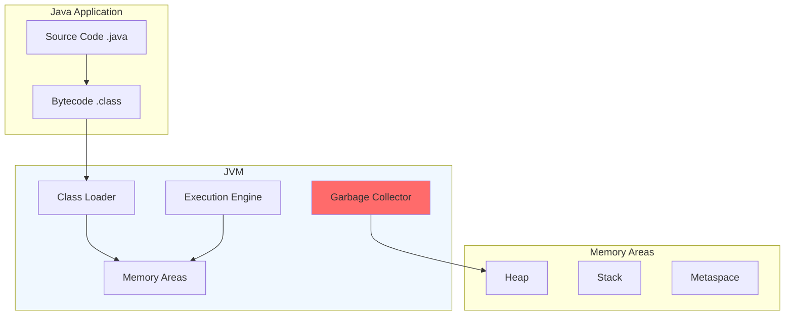

# Java

> **한 줄 정의**: 객체지향 프로그래밍 언어로, JVM 위에서 동작하며 "Write Once, Run Anywhere" 철학을 가진 엔터프라이즈급 언어

## 개요



### 핵심 구성요소



---

## 학습 경로

### 1단계: 기초 (2시간)
- [ ] [[01-basics|기초 개념]] 읽기
- [ ] Java 철학과 특징 이해
- [ ] 데이터 타입, 문법 기초

### 2단계: JVM 심화 (2시간)
- [ ] [[02-core|JVM 아키텍처]] 학습
- [ ] 메모리 구조 이해
- [ ] Garbage Collection 원리

### 3단계: 실무 (2시간)
- [ ] [[03-practice|실무 적용]] 실습
- [ ] 성능 최적화 기법
- [ ] 디버깅과 프로파일링

### 4단계: 고급 (선택)
- [ ] [[04-advanced|심화 학습]]
- [ ] Java 21 신기능
- [ ] Virtual Threads

---

## 파일 구조

```
Java/
├── README.md          ← 여기 (개요 + 로드맵)
├── 01-basics.md       ← 기초 (언어 특징, 문법)
├── 02-core.md         ← JVM (메모리, GC)
├── 03-practice.md     ← 실무 (최적화, 디버깅)
├── 04-advanced.md     ← 고급 (Java 21, 패턴)
└── pre/               ← 기존 노트 백업
```

## 바로가기

| 단계 | 파일 | 핵심 내용 |
|------|------|----------|
| 기초 | [[01-basics]] | Java 철학, OOP, 문법 |
| JVM | [[02-core]] | 메모리 구조, GC 알고리즘 |
| 실무 | [[03-practice]] | 성능 최적화, 프로파일링 |
| 고급 | [[04-advanced]] | Java 21, Virtual Threads |

---

## 빠른 시작

```java
// Hello World
public class Main {
    public static void main(String[] args) {
        System.out.println("Hello, Java!");
    }
}

// 컴파일 및 실행
// javac Main.java && java Main
```

```bash
# Java 버전 확인
java -version

# JVM 옵션으로 실행
java -Xms512m -Xmx1024m -XX:+UseG1GC MyApp
```

---

## 관련 노트

- [[JVM-GC]]
- [[Spring]]
- [[Design-Patterns]]

---

**생성일**: 2025-01-18
**상태**: 학습 중
**예상 학습 시간**: 6-8시간
