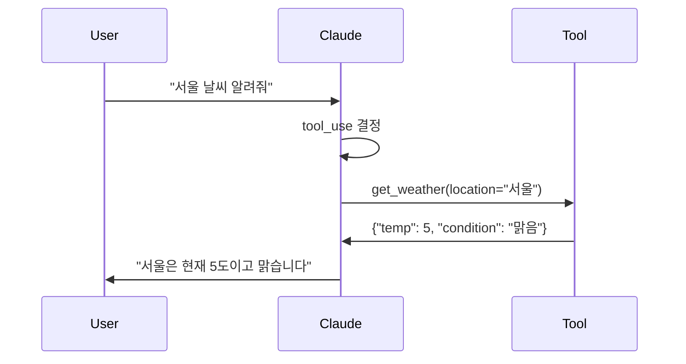

# Claude - API

> ⬅️ [[01-basics|이전: 기초]] | [[README|목차]] | ➡️ [[03-claude-code|다음: Claude Code]]

---

## 1. API 개요

### 인증

```bash
# API Key 설정
export ANTHROPIC_API_KEY="sk-ant-..."
```

### Base URL

```
https://api.anthropic.com/v1
```

### 주요 엔드포인트

| 엔드포인트 | 설명 |
|-----------|------|
| `/messages` | 대화 메시지 생성 |
| `/messages` (stream) | 스트리밍 응답 |

---

## 2. Messages API

### 기본 요청 구조

```bash
curl https://api.anthropic.com/v1/messages \
  -H "Content-Type: application/json" \
  -H "x-api-key: $ANTHROPIC_API_KEY" \
  -H "anthropic-version: 2023-06-01" \
  -d '{
    "model": "claude-sonnet-4-20250514",
    "max_tokens": 1024,
    "messages": [
      {"role": "user", "content": "Hello, Claude"}
    ]
  }'
```

### 요청 파라미터

| 파라미터 | 필수 | 설명 |
|---------|------|------|
| `model` | O | 모델 ID |
| `max_tokens` | O | 최대 출력 토큰 |
| `messages` | O | 대화 메시지 배열 |
| `system` | X | 시스템 프롬프트 |
| `temperature` | X | 무작위성 (0~1) |
| `stream` | X | 스트리밍 여부 |

### 응답 구조

```json
{
  "id": "msg_xxx",
  "type": "message",
  "role": "assistant",
  "content": [
    {
      "type": "text",
      "text": "Hello! How can I help you?"
    }
  ],
  "model": "claude-sonnet-4-20250514",
  "stop_reason": "end_turn",
  "usage": {
    "input_tokens": 10,
    "output_tokens": 15
  }
}
```

---

## 3. System Prompt

### 사용법

```json
{
  "model": "claude-sonnet-4-20250514",
  "max_tokens": 1024,
  "system": "당신은 친절한 한국어 어시스턴트입니다.",
  "messages": [
    {"role": "user", "content": "안녕하세요"}
  ]
}
```

### System Prompt 팁

- 역할 정의: "당신은 ... 입니다"
- 응답 형식 지정: "JSON으로 응답하세요"
- 제약 조건: "100자 이내로 답변하세요"

---

## 4. Tool Use (Function Calling)

### 도구 정의

```json
{
  "model": "claude-sonnet-4-20250514",
  "max_tokens": 1024,
  "tools": [
    {
      "name": "get_weather",
      "description": "지정된 위치의 현재 날씨를 가져옵니다",
      "input_schema": {
        "type": "object",
        "properties": {
          "location": {
            "type": "string",
            "description": "도시 이름 (예: 서울)"
          }
        },
        "required": ["location"]
      }
    }
  ],
  "messages": [
    {"role": "user", "content": "서울 날씨 어때?"}
  ]
}
```

### Tool Use 흐름



### Tool 응답 처리

```json
{
  "role": "user",
  "content": [
    {
      "type": "tool_result",
      "tool_use_id": "toolu_xxx",
      "content": "{\"temp\": 5, \"condition\": \"맑음\"}"
    }
  ]
}
```

---

## 5. Python SDK

### 설치

```bash
pip install anthropic
```

### 기본 사용

```python
import anthropic

client = anthropic.Anthropic()

message = client.messages.create(
    model="claude-sonnet-4-20250514",
    max_tokens=1024,
    messages=[
        {"role": "user", "content": "Hello, Claude"}
    ]
)

print(message.content[0].text)
```

### 스트리밍

```python
with client.messages.stream(
    model="claude-sonnet-4-20250514",
    max_tokens=1024,
    messages=[{"role": "user", "content": "긴 이야기 해줘"}]
) as stream:
    for text in stream.text_stream:
        print(text, end="", flush=True)
```

---

## 6. 최신 API 변경사항 (2026-03-27)

### Web Search & Tool Calling GA

- **Web search tool** 및 programmatic tool calling이 **정식 출시(GA)** → beta 헤더 불필요
- **API code execution** 이 web search 또는 web fetch와 함께 사용 시 **무료**
  - Sandboxed code execution으로 모델 성능 및 토큰 효율 향상

### Data Residency (데이터 레지던시)

```json
{
  "model": "claude-sonnet-4-6",
  "inference_geo": "us",
  "messages": [...]
}
```

- `inference_geo` 파라미터로 모델 추론 실행 지역 지정 가능
- US-only 추론: 2026-02-01 이후 출시 모델 기준 **1.1× 요금** 적용

### Structured Outputs GA

- Claude Sonnet 4.5, Opus 4.5, Haiku 4.5에서 **Structured Outputs 정식 출시**
- 개선 사항: 확장된 schema 지원, grammar compilation 레이턴시 감소, 단순화된 통합 경로

---

## 7. 요금

### 가격 (2026년 1월 기준)

| 모델 | Input (1M tokens) | Output (1M tokens) |
|------|-------------------|-------------------|
| Claude Opus 4.6 | $15 | $75 |
| Claude Sonnet 4.6 | $3 | $15 |
| Claude Haiku 4.5 | $0.80 | $4 |

### 비용 계산 예시

```
1,000 요청 × (500 입력 + 200 출력 토큰)
= 500K input + 200K output tokens
= (0.5 × $3) + (0.2 × $15) = $4.50 (Sonnet 4.6 기준)
```

---

## 8. 업데이트 이력

| 날짜 | 내용 |
|------|------|
| 2026-03-27 | Web search tool & tool calling GA (beta 헤더 불필요) |
| 2026-03-27 | Web search/fetch와 함께 쓰면 code execution 무료 |
| 2026-03-27 | Data residency 제어 (`inference_geo` 파라미터) 도입 |
| 2026-03-27 | Structured Outputs GA (Sonnet/Opus/Haiku 4.5) |

---

## 다음 단계

> [!tip] 다음으로
> API를 이해했다면 [[03-claude-code|Claude Code]]에서 CLI 도구를 배워보세요.

---

## References

- [Anthropic API Docs](https://docs.anthropic.com/claude/reference)
- [Python SDK](https://github.com/anthropics/anthropic-sdk-python)
- [Tool Use Guide](https://docs.anthropic.com/claude/docs/tool-use)
