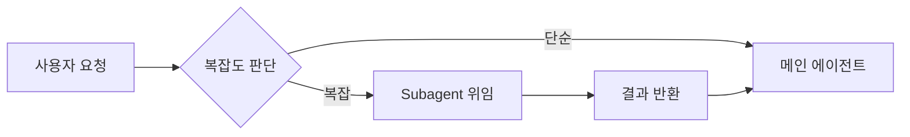

# Claude Code - Subagents

> ⬅️ [[07-mcp|이전: MCP]] | [[README|목차]]

---

## 1. Subagents란?

> 특정 작업을 처리하는 독립적인 AI 에이전트로, 별도의 컨텍스트와 도구 접근 권한을 가짐

### 핵심 특징

- 독립된 컨텍스트 윈도우
- 커스텀 시스템 프롬프트
- 제한된 도구 접근
- 병렬/백그라운드 실행

---

## 2. 내장 Subagent

### 기본 제공 에이전트

| 에이전트 | 모델 | 용도 |
|----------|------|------|
| **Explore** | Haiku | 빠른 코드베이스 탐색 |
| **Plan** | Sonnet | 계획 수립 (읽기 전용) |
| **General-purpose** | Sonnet | 복잡한 멀티스텝 작업 |

### Explore 에이전트

```
> 이 프로젝트에서 인증 관련 코드 찾아줘
# Explore 에이전트가 빠르게 탐색
```

### Plan 에이전트

```
> /plan 새로운 API 엔드포인트 추가 계획 세워줘
# Plan 에이전트가 읽기 전용으로 분석
```

---

## 3. Subagent 자동 위임

### 동작 방식



### 위임 기준

- 작업 설명과 매칭
- 컨텍스트 크기 고려
- 도구 제한 필요성

---

## 4. Subagent 설정

### Skills에서 Subagent 정의

```markdown
---
name: test-runner
description: 테스트 실행 전문 에이전트
context: fork
allowed-tools:
  - Bash
  - Read
  - Grep
---

# 테스트 러너

테스트 실행 및 결과 분석 전문 에이전트입니다.

## 역할
1. 테스트 실행
2. 실패 원인 분석
3. 수정 제안
```

### 설정 필드

| 필드 | 설명 |
|------|------|
| `context: fork` | 별도 컨텍스트에서 실행 |
| `allowed-tools` | 허용 도구 제한 |
| `permissionMode` | 권한 모드 설정 |
| `skills` | 프리로드할 스킬 |

---

## 5. Foreground vs Background

### Foreground (기본)

메인 대화 블로킹, 결과 대기

```
> 테스트 실행해줘
# 완료까지 대기
```

### Background

비동기 실행, 병렬 작업

```
> 백그라운드로 테스트 실행해줘
# 다른 작업 가능
> 테스트 결과 확인해줘
```

---

## 6. 컨텍스트 관리

### 독립 컨텍스트

```
메인 에이전트: 200K tokens
    ↓
Subagent A: 별도 200K tokens
Subagent B: 별도 200K tokens
```

### 자동 압축

95% 용량 도달 시 자동 compaction

### 트랜스크립트 저장

```
~/.claude/projects/{project}/{sessionId}/subagents/
```

---

## 7. 실전 패턴

### 테스트 격리

```markdown
---
name: test-agent
context: fork
allowed-tools:
  - Bash
  - Read
---

테스트 실행 전용 에이전트.
대량의 테스트 출력을 메인 컨텍스트에서 격리.
```

**사용:**

```
> /test-agent npm test 실행하고 실패하면 분석해줘
```

### 로그 분석

```markdown
---
name: log-analyzer
context: fork
allowed-tools:
  - Read
  - Grep
  - Bash
---

로그 파일 분석 전용.
대용량 로그를 메인 컨텍스트 오염 없이 처리.
```

### 병렬 리서치

```markdown
---
name: researcher
context: fork
allowed-tools:
  - Read
  - Grep
  - Glob
  - WebFetch
---

백그라운드 리서치 에이전트.
```

**병렬 실행:**

```
> 백그라운드로:
> 1. API 문서 분석
> 2. 기존 구현 패턴 조사
> 3. 테스트 커버리지 확인
```

---

## 8. Subagent Hooks

### Stop Hook

Subagent 종료 시 실행

```json
{
  "hooks": {
    "SubagentStop": [
      {
        "matcher": ".*",
        "command": "echo '서브에이전트 완료' >> ~/.claude/subagent.log"
      }
    ]
  }
}
```

### 커스텀 Hooks

Subagent 내부에서 별도 hooks 정의 가능

---

## 9. 세션 재개

### Subagent 재개

```
> 이전 테스트 에이전트 결과 이어서 봐줘
# 이전 세션의 subagent 컨텍스트 복원
```

### 트랜스크립트 확인

```bash
ls ~/.claude/projects/*/subagents/
```

---

## 10. 도구 제한 패턴

### 읽기 전용

```yaml
allowed-tools:
  - Read
  - Grep
  - Glob
```

### 실행 허용

```yaml
allowed-tools:
  - Read
  - Grep
  - Glob
  - Bash
```

### 쓰기 허용

```yaml
allowed-tools:
  - Read
  - Write
  - Edit
  - Bash
```

---

## 11. 권한 모드

### permissionMode 옵션

| 모드 | 설명 |
|------|------|
| `inherit` | 메인 에이전트 권한 상속 |
| `restricted` | 제한된 권한 |
| `elevated` | 확장된 권한 |

```yaml
permissionMode: restricted
```

---

## 12. Best Practices

### DO ✅

- 대용량 출력 작업 격리 (테스트, 로그)
- 병렬 가능한 작업 분리
- 명확한 도구 제한
- 적절한 에이전트 이름

### DON'T ❌

- 모든 작업에 subagent 사용
- 과도한 병렬 실행
- 무제한 도구 접근
- 컨텍스트 공유 기대

---

## 13. 트러블슈팅

| 문제 | 원인 | 해결 |
|------|------|------|
| 느린 응답 | 과도한 컨텍스트 | 컨텍스트 정리 |
| 도구 실패 | 권한 부족 | allowed-tools 확인 |
| 결과 누락 | 백그라운드 미완료 | 완료 대기 |

---

## 시리즈 완료 (확장)

> [!success] 축하합니다!
> Claude 확장 시리즈를 완료했습니다.
>
> **전체 학습 경로**:
> - [[01-basics|기초]] - Claude 모델
> - [[02-api|API]] - Messages API
> - [[03-claude-code|Claude Code]] - CLI
> - [[04-advanced|심화]] - 프롬프트 엔지니어링
> - [[05-skills|Skills]] - 커스텀 플러그인
> - [[06-hooks|Hooks]] - 자동화
> - [[07-mcp|MCP]] - 외부 연동
> - [[08-subagents|Subagents]] - 멀티 에이전트

---

## References

- [Claude Code Subagents 문서](https://docs.anthropic.com/claude/docs/sub-agents)
- [Multi-Agent Patterns](https://www.anthropic.com/research/building-effective-agents)
