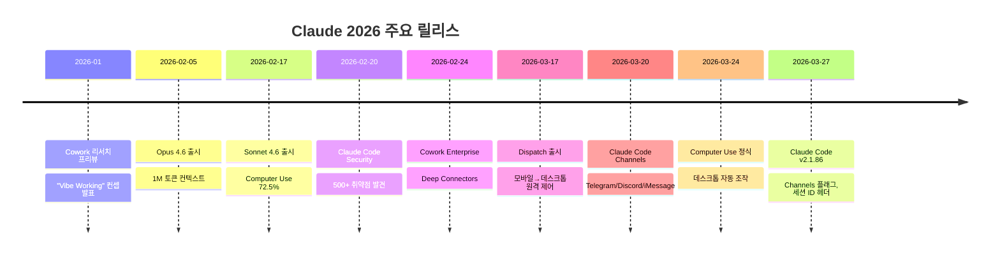

# Claude 2026 주요 업데이트 총정리

## 타임라인

---

## 1. 모델 업데이트

### Claude Opus 4.6 (2026-02-05)

| 항목 | 내용 |
|------|------|
| 컨텍스트 윈도우 | **1M 토큰** (100만) |
| 주요 개선 | 코딩, 계획, 디버깅 능력 강화 |
| 특징 | Finance Agent 벤치마크 1위, 14.5시간 연속 작업 가능 |
| 멀티에이전트 | "팀" 협업 기능 |
| 가용성 | claude.ai, API, AWS, GCP |

### Claude Sonnet 4.6 (2026-02-17)

| 항목 | 내용 |
|------|------|
| 가격 | Sonnet 4.5와 동일 |
| Computer Use | OSWorld 벤치마크 ~15% → **72.5%** |
| 주요 개선 | 코딩, 에이전트 검색, 장문 추론 |
| 컨텍스트 | 1M 토큰 (베타) |

### Claude Mythos (예정)

- Opus보다 상위 티어의 새 모델
- 고급 추론 기능 탑재 예정
- 별도 가격 책정

---

## 2. 제품 기능

### Cowork (2026-01)

- 코딩을 넘어 **모든 지식 근로자**를 위한 AI 작업 도구
- "Vibe Working": 목표를 말하면 거의 완성된 결과물 제공
- → 자세한 내용: [[11-cowork-dispatch]]

### Dispatch (2026-03-17)

- 모바일에서 작업 지시 → 데스크톱에서 실행
- **Persistent Thread**: 세션 리셋 없이 연속 작업
- Computer Use와 결합하여 데스크톱 자동 조작
- Pro/Max 플랜에서 사용 가능
- → 자세한 내용: [[11-cowork-dispatch]]

### Claude Code Channels (2026-03-20)

- Telegram, Discord, iMessage로 Claude Code 원격 제어
- MCP 서버 기반 양방향 통신
- 리서치 프리뷰 (v2.1.80+)
- → 자세한 내용: [[10-channels]]

### Computer Use (2026-03-24 정식)

- Claude가 데스크톱 화면을 보고 직접 조작
- 앱 열기, 웹 브라우저 탐색, 스프레드시트 편집
- Dispatch와 결합하여 부재중에도 작업 수행

### Claude Code v2.1.86 (2026-03-27)

**세션 & 프록시**
- API 요청에 `X-Claude-Code-Session-Id` 헤더 추가 (프록시 집계 지원)
- MCP 서버 중복 제거: 로컬 설정과 claude.ai 커넥터 동시 설정 시 로컬 우선

**VCS 지원 확대**
- `.jj` (Jujutsu), `.sl` (Sapling) 디렉토리 제외 목록 추가

**버그 수정**
- `--resume` 시 "tool_use ids without tool_result blocks" 오류 수정
- 프로젝트 루트 밖 파일에서 Write/Edit/Read 도구 실패 수정
- `deniedMcpServers` 설정이 claude.ai MCP 서버를 차단하지 못하던 문제 수정
- `--bare` 모드에서 MCP 도구가 누락되던 문제 수정
- `/feedback` 사용 시 긴 세션에서 OOM 크래시 수정
- 마스킹된 입력(OAuth 코드)에서 토큰 시작 부분이 노출되던 문제 수정
- macOS/Linux에서 v2.1.83 이후 공식 마켓플레이스 플러그인 스크립트 실패 수정
- 리모트 세션 스트리밍 중단 시 메모리 누수 수정
- 엣지 연결 변경 시 ECONNRESET 오류 반복 수정

**성능 & UX 개선**
- macOS 키체인 캐시 스타트업 지연 단축 (5초 → 30초 간격)
- `@` 파일 멘션의 토큰 오버헤드 감소
- Bedrock/Vertex/Foundry 프롬프트 캐시 히트율 향상
- 1M 이상 토큰 수 표시 방식 개선 (`1512.6k` → `1.5m`)
- ToolSearch 활성화 시 글로벌 시스템 프롬프트 캐싱 정상 동작
- 메모리 파일명 클릭 시 하이라이트 및 열기 지원
- Skill 설명 250자 상한 적용, `/skills` 메뉴 알파벳 정렬

**신규 기능**
- statusline 스크립트에 `rate_limits` 필드 추가 (claude.ai 사용량 표시)
- `source: 'settings'` 플러그인 마켓플레이스 소스 지원
- skill/슬래시 커맨드에 `effort` frontmatter 지원
- `--channels` 플래그 리서치 프리뷰: MCP 서버가 세션으로 메시지 push 가능

**VS Code**
- 긴 작업 중 확장 프로그램 무응답 수정
- OAuth 갱신 후 Max 플랜 사용자가 Sonnet으로 기본 설정되던 문제 수정

> 출처: https://code.claude.com/docs/en/changelog

---

### Claude Apps (모바일)

- iOS/Android에서 인터랙티브 앱 실행
- 차트, 다이어그램 등 시각화를 대화 내에서 직접 렌더링
- 라이브 시각화 공유 가능

---

## 3. API & 플랫폼

### 코드 실행 무료화

- Web Search 또는 Web Fetch와 함께 사용 시 **API 코드 실행 무료**
- 샌드박스 코드 실행으로 모델 능력 + 토큰 효율 향상

### Web Search & Web Fetch GA

- 프로그래매틱 도구 호출 정식 출시
- 동적 필터링 지원으로 성능 개선 & 토큰 비용 절감

### Claude Code 개선

- **Auto Mode**: 자동 실행 모드
- **Bare Mode**: 스크립트용 `-p` 호출 최적화
- OAuth, 음성 모드, 세션, 플러그인, Windows 이슈 수정

---

## 4. 보안 & 엔터프라이즈

### Claude Code Security (2026-02-20)

- 추론 기반 코드 취약점 탐지
- 오픈소스 프로덕션 코드에서 **500개 이상 미탐지 취약점** 발견
- 사이버보안 대회 및 주요 인프라 방어에 활용

### Enterprise Cowork (2026-02-24)

- **Deep Connectors**: Google Drive, Gmail, DocuSign, FactSet 연동
- **Private Plugin Marketplace**: 조직 내 승인된 에이전트 배포
- 관리자 도구 접근 권한 통제

### 주요 도입 사례

| 기업 | 활용 | 효과 |
|------|------|------|
| Spotify | 코드 마이그레이션 | 엔지니어링 시간 **90% 절감** |
| Novo Nordisk | NovoScribe (규제 문서) | 규제 준수 자동화 |
| Accenture | AI 사이버보안 운영 | 보안 운영 확장 |

---

## 5. 안전성 & 확장

### Responsible Scaling Policy v3.0

- 업데이트된 안전 프레임워크
- 공개 로드맵 + 제3자 리뷰 체계

### 글로벌 확장

- 벵갈루루 오피스 설립
- Infosys 파트너십 (규제 산업)
- GOV.UK AI 어시스턴트 개발
- 10개 인도 언어 지원 개선

---

## 6. 기능 비교표: Channels vs Dispatch

| 비교 항목 | Claude Code Channels | Cowork Dispatch |
|-----------|---------------------|-----------------|
| 대상 사용자 | **개발자** | **모든 지식 근로자** |
| 작업 영역 | 코드, 터미널, Git | 데스크톱 앱 전체 |
| 통신 방식 | Telegram/Discord/iMessage | Claude 모바일 앱 |
| 실행 환경 | Claude Code 세션 (터미널) | Claude Desktop (GUI) |
| Computer Use | ❌ | ✅ |
| Persistent Thread | ❌ (세션 기반) | ✅ |
| 설정 난이도 | 봇 생성 + MCP 설정 | 앱 설치만 |
| 적합한 상황 | 코딩 워크플로우 자동화 | 범용 데스크톱 작업 자동화 |

---

## 7. 학습 체크리스트

- [ ] 2026년 Claude 주요 업데이트 흐름을 설명할 수 있다
- [ ] Channels와 Dispatch의 차이점을 이해한다
- [ ] Computer Use의 발전과 현재 성능을 안다
- [ ] Cowork Enterprise 기능을 파악하고 있다
- [ ] 각 기능의 요구사항(플랜, 버전)을 안다

---

## 8. References

- [Anthropic 2026 업데이트 총정리](https://fazal-sec.medium.com/anthropics-explosive-start-to-2026-everything-claude-has-launched-and-why-it-s-shaking-up-the-668788c2c9de)
- [CNBC - Claude Computer Use](https://www.cnbc.com/2026/03/24/anthropic-claude-ai-agent-use-computer-finish-tasks.html)
- [Anthropic Release Notes](https://releasebot.io/updates/anthropic)
- [Claude Platform Release Notes](https://platform.claude.com/docs/en/release-notes/overview)
- 관련 노트: [[10-channels]], [[11-cowork-dispatch]], [[03-claude-code]]
