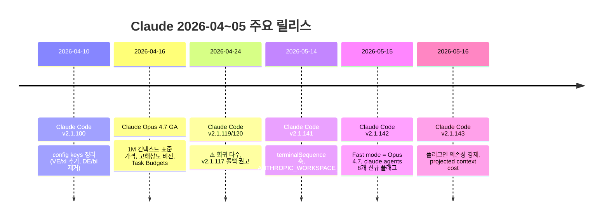

# Claude 2026-04~05 최신 변경사항 & 사용 꿀팁

> 이 노트는 [[12-2026-updates]] 이후 (2026-04-09 ~ 2026-05-20) 변경 사항을 추적한다.
> 직전 노트 마지막 항목: Claude Code v2.1.97 (2026-04-08)

---

## 타임라인



---

## 1. 모델 업데이트

### Claude Opus 4.7 (2026-04-16 GA) ⭐

| 항목 | 내용 |
|------|------|
| 출시일 | 2026-04-16 (정식 GA) |
| 모델 ID | `claude-opus-4-7` |
| 컨텍스트 윈도우 | **1M 토큰** (표준 API 가격, **롱컨텍스트 프리미엄 없음**) |
| 최대 출력 | 128k 토큰 |
| 비전 | **첫 고해상도 지원** — 최대 2576px / 3.75MP |
| 추론 모드 | Adaptive thinking 단독 (Extended thinking budgets **제거**) |
| 신규 기능 | **Task Budgets** — 에이전트 루프 전체 토큰 예산, 모델이 카운트다운 보며 우선순위 결정 |
| GitHub Copilot 가격 | 7.5× (~2026-04-30 프로모션) → 5월부터 15× |

**주요 개선점**
- 멀티스텝 작업 안정성 강화
- 에이전트 실행 신뢰도 향상
- 장기 추론 + 도구 의존 워크플로우 개선

**Opus 4.6 → 4.7 마이그레이션 주의**
- Extended thinking budgets 제거 — 명시적 thinking budget 코드 동작 변경
- adaptive thinking으로 통일되어 내부 평가에서 안정적으로 우수
- 1M 컨텍스트가 이제 비프리미엄이라 적극 활용 가능

> 출처:
> - [What's new in Claude Opus 4.7](https://platform.claude.com/docs/en/about-claude/models/whats-new-claude-4-7)
> - [GitHub Changelog - Claude Opus 4.7 GA](https://github.blog/changelog/2026-04-16-claude-opus-4-7-is-generally-available/)
> - [Opus 4.6 → 4.7 Migration Playbook](https://www.digitalapplied.com/blog/claude-opus-4-6-to-4-7-migration-playbook-breaking-changes-2026)

### 현재 모델 라인업 (2026-05-20)

| 모델 | ID | 비고 |
|------|----|----|
| Opus 4.7 | `claude-opus-4-7` | 최신, 1M context 표준가, 고해상도 비전 |
| Sonnet 4.6 | `claude-sonnet-4-6` | 유지 |
| Haiku 4.5 | `claude-haiku-4-5-20251001` | 유지 |
| Opus 4.6 | (Claude Code Fast mode에서 사용되다가 v2.1.142부터 4.7로 교체) | Deprecated 진행 중 |

---

## 2. Claude Code 변경사항

### Claude Code v2.1.100 (2026-04-10)

- config keys: `VE`, `xI` 추가 / `DE`, `bI` 제거
- 안정성 개선 위주의 소규모 업데이트

> 출처: [Claude Code v2.1.100 Release](https://claude-world.com/articles/claude-code-21100-release/)

### Claude Code v2.1.119/v2.1.120 (2026-04-24) ⚠️ 회귀 폭주

> ⚠️ **운영 환경 즉시 적용 금지** — 8개 회귀가 24시간 윈도우에서 발견됨

**보고된 회귀 8건**
- 자동 업데이트 파손 (retract-grade)
- 사일런트 모델 스왑
- resume-time 크래시 2건
- UI 중복 버그 재발
- WSL2 한정 `/mcp` 프리즈
- `CLAUDE.md` 무시 회귀
- `sandbox.excludedCommands` 약속 파손
- macOS worktree hang

**권고**: `v2.1.117`로 롤백, 최신 릴리스 직후엔 프로덕션 적용 회피

> 출처: [v2.1.119/v2.1.120 Survival Checklist](https://gist.github.com/yurukusa/a866b4cd2976486156a00c190c39cef6)

### Claude Code v2.1.141 (2026-05-14)

**신규 기능**
- **`terminalSequence` 훅 JSON 필드**: 훅이 데스크톱 알림 / 윈도우 타이틀 / 벨을 컨트롤링 터미널 없이도 송출
- **`CLAUDE_CODE_PLUGIN_PREFER_HTTPS`**: GitHub 플러그인 소스를 SSH 대신 HTTPS로 클론
- **`ANTHROPIC_WORKSPACE_ID`**: 워크로드 identity federation용 환경변수

### Claude Code v2.1.142 (2026-05-15) ⭐

**신규 기능**
- **Fast mode가 Opus 4.7로 변경** (이전: Opus 4.6) — `/fast` 토글 시 4.7로 진입
- **`claude agents` 8개 신규 플래그**로 디스패치된 백그라운드 세션 설정 가능
  - `--add-dir`, `--settings`, `--mcp-config`, `--plugin-dir`
  - `--permission-mode`, `--model`, `--effort`, `--dangerously-skip-permissions`
- 루트 레벨 `SKILL.md` 있고 `skills/` 서브디렉토리 없는 플러그인이 직접 스킬로 노출
- `/plugin details` 및 `claude plugin details`가 플러그인 제공 LSP 서버 목록 표시

**주요 버그 수정**
- `MCP_TOOL_TIMEOUT`이 원격 HTTP/SSE MCP 서버의 per-request fetch timeout을 올리지 못해 툴콜이 60초에서 컷되던 문제
- 백그라운드 세션이 기존 git worktree를 인식 못해 Edit 차단되던 문제 (EnterWorktree 중복 거부)
- Bedrock/Vertex 사용자가 `/model` 피커에서 "Opus (1M context)" 선택 불가 (v2.1.129 회귀)
- MCP 이미지의 미지원 MIME (예: SVG)가 대화를 망가뜨리던 문제 → 디스크 저장 후 툴 결과에서 참조

> 출처: [Claudeupdates v2.1.143](https://www.claudeupdates.dev/version/2.1.143), [Releasebot - Claude Code May 2026](https://releasebot.io/updates/anthropic/claude-code)

### Claude Code v2.1.143 (2026-05-16)

**신규 기능**
- **플러그인 의존성 강제**:
  - `claude plugin disable`: 다른 활성 플러그인이 대상에 의존하면 거부
  - `claude plugin enable`: 전이적 의존성을 강제 활성화
- **`/plugin` 마켓플레이스 browse pane에 projected context cost 표시** — per-turn 및 per-invocation 토큰 추정

### 4월 중순 ~ 5월 누적 변경 (버전 횡단)

**훅/플러그인 시스템**
- 훅이 `effort.level` JSON 입력 필드 + `$CLAUDE_EFFORT` 환경변수로 활성 effort 수신
- `--plugin-dir`이 `.zip` 아카이브 수용
- `--plugin-url` 플래그: URL에서 플러그인 아카이브 fetch
- 루트 `SKILL.md`만 있는 플러그인이 스킬로 자동 surface

---

## 3. 사용 꿀팁 (2026-05 시점)

### Opus 4.7 활용

#### 1M 컨텍스트를 부담 없이
```bash
# 표준 API 가격, 롱컨텍스트 프리미엄 없음
# 대형 코드베이스 전체 컨텍스트 로딩 부담↓
```
- 이전엔 1M = 비용 폭탄이었으나 4.7부터 표준가
- 작은 컨텍스트로 잘게 자를 필요 줄어듦

#### Task Budgets 활용
- 에이전트가 토큰 예산 카운트다운을 보며 작업 우선순위 조정
- 긴 에이전트 루프(자율 작업)에서 효율적인 종료/요약 기대 가능

#### Extended thinking 코드 마이그레이션
- 명시적 thinking budget 사용 코드는 4.7에서 동작 변경
- adaptive thinking이 자동 — thinking 모드만 켜고 budget은 빼기

### Claude Code 효율

#### Fast mode 활용 (v2.1.142+)
```bash
/fast    # Opus 4.7로 전환 (이전엔 4.6) — 이제 의미 달라짐
```
- v2.1.141 이전: Fast = Opus 4.6 (저렴/빠름)
- v2.1.142 이후: Fast = Opus 4.7 (빠른 출력 모드)
- 사실상 더 이상 "약한 모델로 다운그레이드"가 아니라 "출력 속도 우선 모드"

#### `claude agents` 백그라운드 세션 풀 제어
```bash
claude agents \
  --model claude-opus-4-7 \
  --effort high \
  --add-dir /path/to/sandbox \
  --permission-mode plan \
  --plugin-dir ./team-plugins
```
- 디스패치된 백그라운드 작업의 모든 설정을 명령행에서 통제

#### 훅으로 데스크톱 알림 (v2.1.141+)
- 훅 JSON 출력에 `terminalSequence` 필드 추가
- 긴 작업 종료 시 macOS 알림/벨/윈도우 타이틀 변경
- → [[06-hooks]] 보강 필요

#### 플러그인 의존성 안전 (v2.1.143+)
- `claude plugin disable foo`가 의존 플러그인 있으면 차단
- `claude plugin enable foo`로 전이 의존성 자동 활성화
- 팀 환경에서 플러그인 일관성 강제 가능

#### 새 환경변수
| 변수 | 용도 |
|------|------|
| `CLAUDE_CODE_PLUGIN_PREFER_HTTPS=1` | SSH 키 없는 환경에서 GitHub 플러그인 클론 |
| `ANTHROPIC_WORKSPACE_ID` | 워크로드 identity federation |
| `CLAUDE_CODE_NO_FLICKER=1` | (v2.1.88~) 깜박임 없는 alt-screen |
| `MCP_CONNECTION_NONBLOCKING=true` | (v2.1.89~) `-p` 모드 MCP 대기 생략 |

### 운영 베스트 프랙티스

#### 최신 릴리스 즉시 적용 금지
- v2.1.119/120 회귀 사건 학습: **최신 직후엔 프로덕션 회피**
- 1~2 패치 지난 안정 버전 사용 (현재 추천: v2.1.143)
- 회귀 발생 시 한 단계 이전 마이너 패치로 rollback

#### Bedrock/Vertex 사용자 (v2.1.129~141 회귀 주의)
- `/model` 피커에서 "Opus (1M context)" 안 보였던 회귀가 v2.1.142에서 수정
- v2.1.129~v2.1.141을 쓰던 팀은 v2.1.142+로 업데이트 필수

#### MCP 시간 초과 이슈
- 60초 캡 회귀가 v2.1.142에서 수정
- 긴 MCP 도구 호출(DB 쿼리, LLM 보조 호출 등)은 v2.1.142+ 사용

---

## 4. 학습 체크리스트

- [ ] Opus 4.7과 4.6의 차이를 5가지 이상 설명할 수 있다
- [ ] Task Budgets 개념을 이해한다
- [ ] Adaptive thinking과 Extended thinking의 차이를 안다
- [ ] Fast mode가 v2.1.142에서 어떻게 바뀌었는지 안다
- [ ] `claude agents` 8개 플래그를 활용해 백그라운드 세션 구성 가능
- [ ] v2.1.119/120 회귀 사건과 운영 교훈을 안다
- [ ] terminalSequence 훅으로 데스크톱 알림 송출할 수 있다

---

## 5. References

**모델**
- [What's new in Claude Opus 4.7 (공식)](https://platform.claude.com/docs/en/about-claude/models/whats-new-claude-4-7)
- [GitHub Changelog - Opus 4.7 GA (2026-04-16)](https://github.blog/changelog/2026-04-16-claude-opus-4-7-is-generally-available/)
- [Opus 4.7 Release Tracker - First Week Verdict](https://findskill.ai/blog/claude-opus-4-7-release-tracker/)
- [Opus 4.6 → 4.7 Migration Playbook](https://www.digitalapplied.com/blog/claude-opus-4-6-to-4-7-migration-playbook-breaking-changes-2026)

**Claude Code**
- [Claude Code 공식 changelog](https://code.claude.com/docs/en/changelog)
- [Releasebot - Claude Code May 2026](https://releasebot.io/updates/anthropic/claude-code)
- [Claudeupdates - v2.1.143](https://www.claudeupdates.dev/version/2.1.143)
- [Claude Code v2.1.100 Release](https://claude-world.com/articles/claude-code-21100-release/)
- [v2.1.119/120 Survival Checklist](https://gist.github.com/yurukusa/a866b4cd2976486156a00c190c39cef6)

**관련 노트**
- [[12-2026-updates]] — 이전 누적 노트 (~2026-04-08)
- [[03-claude-code]], [[06-hooks]], [[07-mcp]], [[08-subagents]]
- [[../codex/README|Codex tool-study]] — Codex CLI 비교

---

**생성일**: 2026-05-20
**상태**: 학습 중
