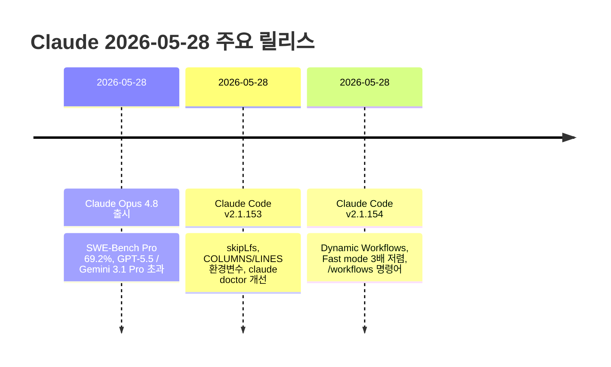

# Claude 2026-05-28/29 최신 변경사항

> 이 노트는 [[13-2026-05-latest]] 이후 (2026-05-28 ~ 2026-05-29) 변경 사항을 추적한다.
> 직전 노트 마지막 항목: Claude Code v2.1.143 (2026-05-16)

---

## 타임라인



---

## 1. 모델 업데이트

### Claude Opus 4.8 (2026-05-28) ⭐

| 항목 | 내용 |
|------|------|
| 출시일 | 2026-05-28 |
| 모델 ID | `claude-opus-4-8` |
| 가격 | Opus 4.7과 동일 |
| Fast mode | **2.5× 속도**, 이전 대비 **3배 저렴** |

**벤치마크 성과**

| 벤치마크 | 점수 | 비교 |
|---------|------|------|
| SWE-Bench Pro | **69.2%** | GPT-5.5, Gemini 3.1 Pro 초과 |

**주요 개선 영역**
- 에이전틱 코딩 (Agentic Coding)
- 다학제 추론 (Multidisciplinary Reasoning)
- 에이전틱 컴퓨터 사용 (Agentic Computer Use)
- 지식 업무 (Knowledge Work)
- 에이전틱 금융 분석 (Agentic Financial Analysis)

**에이전트 작업 안정성**
- 불확실한 부분을 더 잘 플래그함
- 근거 없는 주장을 덜 함
- 에이전트 작업에서 "더 신뢰할 수 있고 더 날카로운 판단"

**API 변경**
- Messages API가 `messages` 배열 내에 `system` 항목 수용 → 작업 도중 Claude 지시 업데이트 가능

> 출처:
> - [Anthropic - Introducing Claude Opus 4.8](https://www.anthropic.com/news/claude-opus-4-8)
> - [SD Times - Anthropic releases Claude Opus 4.8](https://sdtimes.com/devconvsm/anthropic-releases-claude-opus-4-8/)
> - [9to5Mac - Anthropic upgrades Claude with new Opus 4.8](https://9to5mac.com/2026/05/28/anthropic-upgrades-claude-with-new-opus-4-8-model-heres-whats-new/)

### Claude Mythos 공개 임박

- 소수 조직과 테스트 중인 Mythos 모델의 안전장치 개발 완료
- Anthropic: "앞으로 몇 주 내" 모든 고객에게 제공 예정
- 사이버보안 방어 등 고위험 영역 특화

> 출처: [AndroidHeadlines - Anthropic Claude Mythos AI Model Nearing Public Release](https://www.androidheadlines.com/2026/05/anthropic-claude-mythos-ai-model-public-release-cybersecurity.html)

### 현재 모델 라인업 (2026-05-29)

| 모델 | ID | 비고 |
|------|----|----|
| Opus 4.8 | `claude-opus-4-8` | 최신, SWE-Bench Pro 69.2% |
| Opus 4.7 | `claude-opus-4-7` | 1M context 표준가, 고해상도 비전 |
| Sonnet 4.6 | `claude-sonnet-4-6` | 유지 |
| Haiku 4.5 | `claude-haiku-4-5-20251001` | 유지 |

---

## 2. Claude Code 변경사항

### Claude Code v2.1.154 (2026-05-28) ⭐

#### 주요 신기능

**Dynamic Workflows**
- Claude가 수십~수백 개의 에이전트를 오케스트레이션하는 워크플로우를 생성
- `/workflows` 명령어로 실행 현황 조회
- 대규모 병렬 작업에 최적

**Opus 4.8 기본 설정**
- Opus 4.8은 기본적으로 `xhigh` effort로 실행
- Fast mode (Opus 4.8): 2× 표준 요금에 2.5× 속도

**Lean system prompt**
- Haiku, Sonnet, Opus 4.7 이전 모델을 제외한 모든 모델에서 기본 적용
- 다중 선택 프롬프트는 진짜 결정 불가 상황에만 예약

**`/effort` 레이블 변경**
- "Speed" / "Intelligence" → **"Faster" / "Smarter"**

#### Claude Code UI/UX 개선

```bash
# 셸 명령 백그라운드 세션으로 실행
! <command>
# 또는
claude --bg --exec '<command>'

# 멀티 브라우저 선택
/chrome  →  "Select browser…"  (여러 브라우저 연결 시)

# /simplify: 리팩토링 전용 리뷰 + 자동 수정 적용
/simplify
```

- `/logout`: 배경 세션 접근 → 로그아웃으로 변경
- `/simplify`: cleanup-only 리뷰 (재사용, 단순화, 효율성, altitude) 후 자동 적용

#### 플러그인/MCP 강화

| 기능 | 설명 |
|------|------|
| `defaultEnabled: false` | `plugin.json`에서 선언 가능. `/plugin` 또는 `claude plugin enable`로 활성화 |
| `/plugin` Discover 탭 | 현재 디렉토리에 맞는 플러그인 핀 추천 |
| 스트리밍 툴 실행 | 항상 활성화 (Bedrock/Vertex/Foundry 포함) |
| `CLAUDE_CODE_SESSION_ID` | Stdio MCP 서버에 세션 ID 전달 |
| `CLAUDECODE=1` | Stdio MCP 서버에 환경변수 전달 |
| 미승인 MCP 서버 표시 | `claude mcp list/get`: `⏸ Pending approval` |

#### 보안 강화

- 자동 모드 분류기의 데이터 유출 탐지 개선
- `rm -rf $HOME/` (슬래시 포함) 차단 수정

#### 버그 수정 (주요)

- `claude agents` 강조 행 텍스트 가독성 수정
- 백그라운드 에이전트 완료 알림이 "out of context" 동작 유발하던 문제
- 백그라운드 세션 분류기가 예약 명령에서 목표를 잃는 문제
- 서브에이전트가 worktree 격리 가드 우회하던 문제
- macOS에서 `claude --bg-pty-host` 프로세스가 100% CPU 점유하던 문제
- Windows: 업데이트 실패 시 generic 오류 메시지 수정
- 잘못된 `allowedMcpServers`/`deniedMcpServers` 항목이 전체 정책을 버리던 문제

---

### Claude Code v2.1.153 (2026-05-28)

#### 신규 기능

| 기능 | 설명 |
|------|------|
| `skipLfs` | `github`/`git` 플러그인 마켓플레이스 소스에서 Git LFS 다운로드 스킵 |
| `COLUMNS` / `LINES` 환경변수 | 상태 라인 명령에 전달 → 터미널 크기 인식 출력 가능 |
| `claude agents` 자동완성 | 네이티브 슬래시 명령어 및 번들 스킬 제안 |
| PR 컬럼 | `claude agents`: `PR #N` 또는 `N PRs` 표시 |
| `claude doctor` 개선 | 마지막 업데이트 시도 결과 표시 |
| macOS 권한 개선 | 배경 에이전트가 Privacy & Security에 "Claude Code"로 표시, 영구 권한 유지 |

#### 버그 수정 (주요)

- 선택적 GET SSE 스트림 없는 Stateful MCP 서버 재연결 루프 수정
- 커스텀 API 게이트웨이가 게이트웨이 토큰 대신 OAuth 자격증명 받던 문제
- 서브에이전트 MCP 서버가 strict config 및 managed 정책 무시하던 문제
- Windows PowerShell 인스톨러 false success 메시지 수정
- `claude update` 설정된 채널 대신 최신 버전 설치하던 문제
- 세션 재개 시 여러 GB 메모리 과다 사용 문제
- `/model` 이제 선택을 기본값으로 저장 (`s` 키로 현재 세션만 적용)

> 출처:
> - [Claude Code Changelog](https://code.claude.com/docs/en/changelog)
> - [Releasebot - Anthropic May 2026](https://releasebot.io/updates/anthropic)

---

## 3. API 변경사항

### Messages API: 메시지 배열 내 System 항목

```python
# 이제 messages 배열 안에서 system 항목 사용 가능
# → 작업 도중 Claude 지시사항 동적 업데이트 가능
messages = [
    {"role": "user", "content": "시작해줘"},
    {"role": "assistant", "content": "알겠습니다."},
    {"role": "system", "content": "이제부터 더 간결하게 답변해"},  # ← NEW
    {"role": "user", "content": "계속해줘"},
]
```

멀티스텝 에이전트 파이프라인에서 중간에 지시사항을 변경해야 할 때 유용.

---

## 4. 사용 꿀팁 (2026-05-29 시점)

### Opus 4.8 활용

#### Fast mode 비용 절감
```bash
/fast    # Opus 4.8 Fast mode — 이전 대비 3배 저렴, 2.5× 속도
```
- Fast mode가 이제 Opus 4.8에서 비용 효율이 크게 향상

#### Dynamic Workflows로 대규모 병렬 작업
```bash
# Claude에게 워크플로우 생성 요청
"100개 파일을 동시에 분석하는 워크플로우를 만들어줘"

# 실행 현황 확인
/workflows
```

### Claude Code

#### 백그라운드 셸 명령
```bash
# ! 접두사로 셸 명령을 백그라운드 세션으로 실행
! npm test
! python script.py

# 또는 CLI에서
claude --bg --exec 'npm run build'
```

#### 플러그인 기본 비활성화
```json
// plugin.json
{
  "defaultEnabled": false
}
```
- 팀 환경에서 플러그인 선택적 활성화 강제

#### Git LFS 없는 경량 플러그인 설치
```bash
# plugin.json에서
{
  "source": {
    "type": "github",
    "repo": "owner/repo",
    "skipLfs": true    // Git LFS 다운로드 건너뜀
  }
}
```

---

## 5. References

**모델**
- [Anthropic - Introducing Claude Opus 4.8](https://www.anthropic.com/news/claude-opus-4-8)
- [MacRumors - Anthropic Launches Claude Opus 4.8](https://www.macrumors.com/2026/05/28/anthropic-claude-opus-4-8/)
- [9to5Mac - Anthropic upgrades Claude with new Opus 4.8 model](https://9to5mac.com/2026/05/28/anthropic-upgrades-claude-with-new-opus-4-8-model-heres-whats-new/)
- [SD Times - Anthropic releases Claude Opus 4.8](https://sdtimes.com/devconvsm/anthropic-releases-claude-opus-4-8/)
- [Decrypt - Claude Mythos Nearing Release](https://decrypt.co/369383/anthropic-claude-mythos-ai-model-nearing-release-cybersecurity-alarms)

**Claude Code**
- [Claude Code Changelog](https://code.claude.com/docs/en/changelog)
- [Releasebot - Anthropic Updates May 2026](https://releasebot.io/updates/anthropic)
- [Releasebot - Claude Updates May 2026](https://releasebot.io/updates/anthropic/claude)

**관련 노트**
- [[13-2026-05-latest]] — 이전 누적 노트 (~2026-05-20)
- [[01-basics]] — 모델 기초
- [[03-claude-code]], [[08-subagents]]

---

**생성일**: 2026-05-29
**상태**: 학습 중
