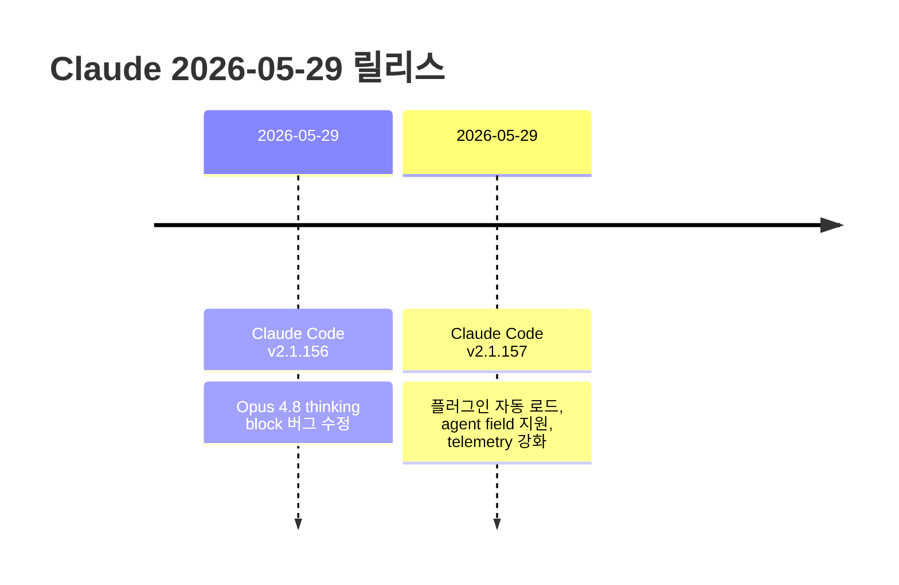

# Claude 2026-05-30 최신 변경사항

> 이 노트는 [[14-2026-05-29]] 이후 (2026-05-29) 변경 사항을 추적한다.
> 직전 노트 마지막 항목: Claude Code v2.1.154 (2026-05-28)

---

## 타임라인



---

## 1. Claude Code 변경사항

### Claude Code v2.1.157 (2026-05-29) ⭐

#### 플러그인 시스템 강화

| 기능 | 설명 |
|------|------|
| `.claude/skills` 자동 로드 | 마켓플레이스 등록 없이도 플러그인 자동 로드 |
| `claude plugin init <name>` | `.claude/skills`에 새 플러그인 scaffold 생성 |
| `/plugin` 자동완성 | 서브명령어, 설치된 플러그인, 마켓플레이스 플러그인 자동완성 |

```bash
# 새 플러그인 생성
claude plugin init my-plugin
# → .claude/skills/my-plugin/ 디렉토리 생성

# 마켓플레이스 없이 로컬 스킬 자동 인식
# .claude/skills/ 에 플러그인 배치하면 자동 로드
```

#### 에이전트 & 세션 관리

| 기능 | 설명 |
|------|------|
| `agent` field in `settings.json` | dispatched 세션에서 에이전트 지정 가능 (`--agent <name>`으로 오버라이드) |
| `EnterWorktree` mid-session | Claude-managed worktree 간 세션 중 전환 가능 |
| 백그라운드 에이전트 worktree | 완료 후 잠금 해제 → `git worktree remove`/`prune` 으로 쉽게 정리 |

```json
// settings.json
{
  "agent": "my-custom-agent"
}
```

```bash
# agent 오버라이드
claude --agent other-agent
```

#### Telemetry 강화

```bash
# tool_decision 이벤트에 tool_parameters 포함 (bash 명령, MCP/skill 이름)
OTEL_LOG_TOOL_DETAILS=1 claude
```

#### 버그 수정

- 0바이트/손상된 이미지가 요청 crash 유발하던 문제 → 텍스트 placeholder로 처리
- 데스크탑 앱, IDE 확장, SDK의 auto/bypass-permissions 모드에서 샌드박스 네트워크 권한 프롬프트 표시되던 문제
- 30일 job retention sweep 이후 백그라운드 에이전트 worktree orphan 되던 문제
- sleep/wake 후 백그라운드 세션 날짜 오보 문제
- tmux `set-clipboard on` 환경에서 `claude agents`의 copy-on-select가 시스템 클립보드에 도달하지 않던 문제
- 각종 터미널 렌더링, 다이얼로그, UI 버그
- `/model` 피커가 잘못된 "Newer version available" 힌트 표시하던 문제
- WSL: 이미지 붙여넣기, Windows 11 스크린샷 붙여넣기, Windows Explorer 이미지 드래그앤드롭 지원

#### UI/UX 개선

- 시작 배너의 "bash commands will be sandboxed" 메시지 제거
- `/config`에 "Workflow keyword trigger" 설정 추가 (동적 워크플로우 키워드 비활성화)
- Feature of the Week 크레딧 상태가 프롬프트 위 대신 상태 영역 알림으로 표시

---

### Claude Code v2.1.156 (2026-05-29)

**버그 수정**
- Opus 4.8에서 수정된 thinking block이 API 오류 유발하던 문제 수정

---

## 2. References

- [Claude Code Changelog](https://code.claude.com/docs/en/changelog)
- [Claude Code GitHub Releases](https://github.com/anthropics/claude-code/releases)

**관련 노트**
- [[14-2026-05-29]] — 직전 노트 (Opus 4.8, v2.1.153-154)
- [[03-claude-code]] — Claude Code 기초
- [[08-subagents]] — 서브에이전트

---

**생성일**: 2026-05-30
**상태**: 학습 중
