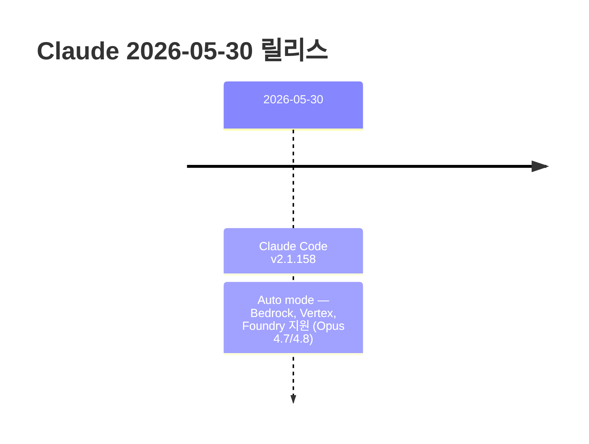

# Claude 2026-05-31 최신 변경사항

> 이 노트는 [[15-2026-05-30]] 이후 (2026-05-30) 변경 사항을 추적한다.
> 직전 노트 마지막 항목: Claude Code v2.1.157 (2026-05-29)

---

## 타임라인



---

## 1. Claude Code 변경사항

### Claude Code v2.1.158 (2026-05-30) ⭐

#### Auto Mode — Bedrock / Vertex / Foundry 지원

| 항목 | 내용 |
|------|------|
| 대상 모델 | Opus 4.7, Opus 4.8 |
| 대상 플랫폼 | Amazon Bedrock, Google Vertex AI, Azure Foundry |
| 활성화 방법 | `CLAUDE_CODE_ENABLE_AUTO_MODE=1` 환경변수 설정 (opt-in) |

```bash
# Bedrock / Vertex / Foundry에서 Auto mode 활성화
export CLAUDE_CODE_ENABLE_AUTO_MODE=1
claude
```

> **Auto mode**: Claude가 effort level을 자동으로 조절하는 모드. 기존에는 claude.ai 및 기본 API 환경에서만 동작했으나, 이제 엔터프라이즈 배포 환경(Bedrock, Vertex, Foundry)에서도 Opus 4.7/4.8에 대해 지원됨.

---

## 2. References

- [Claude Code Changelog](https://code.claude.com/docs/en/changelog)

**관련 노트**
- [[15-2026-05-30]] — 직전 노트 (v2.1.156, v2.1.157)
- [[14-2026-05-29]] — Opus 4.8, v2.1.153~154
- [[03-claude-code]] — Claude Code 기초

---

**생성일**: 2026-05-31
**상태**: 학습 중
