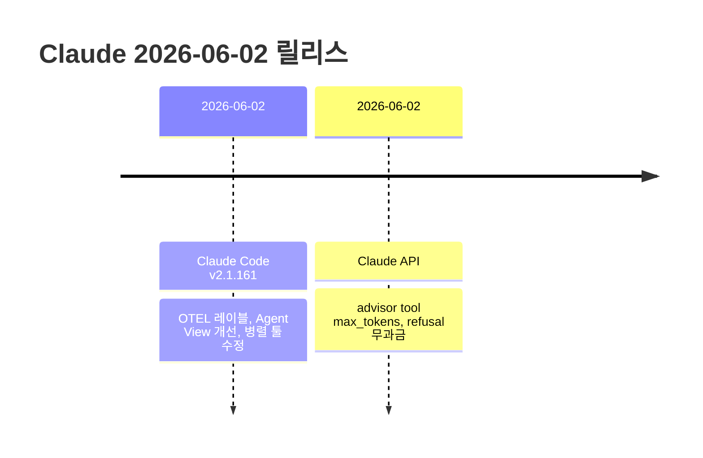

# Claude 2026-06-03 최신 변경사항

> 이 노트는 [[16-2026-05-31]] 이후 (2026-05-31) 변경 사항을 추적한다.
> 직전 노트 마지막 항목: Claude Code v2.1.158 (2026-05-30)

---

## 타임라인



---

## 1. Claude Code 변경사항

### Claude Code v2.1.161 (2026-06-02) ⭐

#### OTEL Resource Attributes — 메트릭 레이블 지원

`OTEL_RESOURCE_ATTRIBUTES` 값이 메트릭 데이터포인트의 레이블로 포함되어, 팀·레포 등 커스텀 차원으로 사용량 메트릭을 슬라이싱할 수 있음.

```bash
# 예시: 팀과 레포를 레이블로 설정
export OTEL_RESOURCE_ATTRIBUTES="team=platform,repo=my-service"
claude
# → 이제 메트릭에 team=platform, repo=my-service 레이블 포함
```

#### Agent View 개선

| 항목 | 이전 | 이후 |
|------|------|------|
| `claude agents` 행 표시 | 상세 정보만 | `done/total` + 상세 정보 |
| Peek 정보 | - | 가장 오래 실행 중인 항목 표시 |

#### MCP Connectors — 미사용 커넥터 접기

`/mcp` 명령에서 사용하지 않는 claude.ai 커넥터가 "Show unused connectors" 행 뒤로 접혀 목록이 간결해짐.

#### 병렬 툴 호출 — 독립 결과 반환

- **이전**: 배치 내 Bash 명령 하나가 실패하면 나머지 호출이 취소됨
- **이후**: 실패한 호출은 자체 오류 결과를 반환하고, 나머지는 계속 실행됨

#### Fullscreen 모드 클립보드 (Linux)

- `wl-copy` / `xclip` / `xsel` 가 설치된 경우 해당 툴 사용
- 클립보드와 PRIMARY selection 모두 복사 → 중간 버튼(middle-click) 붙여넣기 지원
- "hold `{key}` for native selection" 힌트가 터미널별 정확한 키를 표시

#### 접근성 (Accessibility)

다음 UI 요소에서 "Reduce motion" 설정을 이제 올바르게 준수:
- `/effort` 다이얼로그
- 워크플로 애니메이션
- 프롬프트 키워드 shimmer 효과

#### 버그 수정

| 수정 항목 | 내용 |
|-----------|------|
| managed-settings 정책 | `forceLoginOrgUUID`/`forceLoginMethod`가 Bedrock·Vertex·Foundry·Mantle 세션 차단하던 문제 수정 |
| `-p` stdout 오염 | 백그라운드 subagent 출력이 `--output-format text/json` 모드에서 stdout 오염하던 문제 수정 |
| `/usage-credits` | Team/Enterprise 어드민이 재로그인 루프에 빠지던 문제 수정 (조직 사용량 설정 페이지로 이동) |
| `/autofix-pr` | git worktree나 다른 레포에서 "default branch에서 실행 불가" 오류 수정 |
| Windows hooks | bash를 명시적으로 호출하는 훅이 "command not found"로 실패하던 문제 수정 |
| OTEL 로그 이벤트 | 텔레메트리 초기화 전 로그 이벤트가 무시되던 문제 수정 |
| `claude mcp` 시크릿 출력 | `${VAR}` 참조가 더 이상 확장되지 않고, 자격증명이 마스킹됨 |
| Workflow agent worktree | `isolation: "worktree"` 에이전트가 자신의 worktree 파일을 편집하지 못하던 문제 수정 |

#### 성능 개선

- 대용량 파일 쓰기 시 터미널 렌더링 성능 향상

---

## 2. Claude API 변경사항

### Advisor Tool — `max_tokens` 파라미터 추가 (2026-06-02)

advisor tool 정의에 `tools[].max_tokens`를 설정하면 advisor 모델의 출력 길이를 제한할 수 있음.

```json
{
  "type": "advisor",
  "name": "my_advisor",
  "max_tokens": 256
}
```

- **효과**: 전체 길이 응답이 필요 없는 워크로드에서 레이턴시 및 출력 토큰 비용 절감
- **참고**: [Capping advisor output](https://platform.claude.com/docs/en/agents-and-tools/tool-use/advisor-tool#capping-advisor-output)

### Refusal 무과금 (2026-06-02)

`stop_reason: "refusal"`로 응답이 반환되고 Claude가 **아무 출력도 생성하지 않은 경우**, 해당 요청에 대해 과금되지 않음.

- **적용 조건**: 출력 생성 없이 refusal된 경우만 해당
- **감지 방법**: [Streaming refusals](https://platform.claude.com/docs/en/test-and-evaluate/strengthen-guardrails/handle-streaming-refusals) 문서 참고

---

## 3. References

- [Claude Code Changelog](https://code.claude.com/docs/en/changelog)
- [Claude API Release Notes](https://platform.claude.com/docs/en/release-notes/overview)

**관련 노트**
- [[16-2026-05-31]] — 직전 노트 (v2.1.158)
- [[15-2026-05-30]] — v2.1.156, v2.1.157
- [[03-claude-code]] — Claude Code 기초
- [[02-api]] — API 기초

---

**생성일**: 2026-06-03
**상태**: 학습 중
