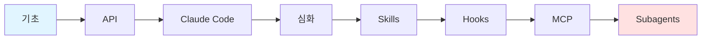

# Claude

> **한 줄 정의**: Anthropic이 개발한 AI 어시스턴트로, 안전하고 유용한 대화형 AI를 목표로 설계됨

## 개요



## 학습 경로

### 1단계: 기초 (30분)
- [ ] [[01-basics|기초 개념]] 읽기
- [ ] Claude 모델 종류 이해 (Opus, Sonnet, Haiku)
- [ ] Constitutional AI 개념 이해

### 2단계: API (1시간)
- [ ] [[02-api|Claude API]] 학습
- [ ] Messages API 구조 이해
- [ ] Tool Use (Function Calling) 학습

### 3단계: Claude Code (1시간)
- [ ] [[03-claude-code|Claude Code]] 실습
- [ ] CLI 설치 및 설정
- [ ] 프로젝트 연동

### 4단계: 심화 (선택)
- [ ] [[04-advanced|심화 학습]]
- [ ] 프롬프트 엔지니어링
- [ ] Agent SDK

### 5단계: 확장 기능 (실무)
- [ ] [[05-skills|Skills]] - 커스텀 플러그인
- [ ] [[06-hooks|Hooks]] - 자동화
- [ ] [[07-mcp|MCP]] - 외부 도구 연동
- [ ] [[08-subagents|Subagents]] - 멀티 에이전트

---

## 파일 구조

```
claude/
├── README.md          ← 여기 (개요 + 로드맵)
├── 01-basics.md       ← 기초 (모델, 특징)
├── 02-api.md          ← API (Messages, Tool Use)
├── 03-claude-code.md  ← Claude Code CLI
├── 04-advanced.md     ← 심화 (프롬프트, Agent)
├── 05-skills.md       ← Skills (커스텀 플러그인)
├── 06-hooks.md        ← Hooks (자동화)
├── 07-mcp.md          ← MCP (외부 연동)
└── 08-subagents.md    ← Subagents (멀티 에이전트)
```

## 바로가기

| 단계 | 파일 | 설명 |
|------|------|------|
| 기초 | [[01-basics]] | Claude 모델, Constitutional AI |
| API | [[02-api]] | Messages API, Tool Use |
| Claude Code | [[03-claude-code]] | CLI 도구 사용법 |
| 심화 | [[04-advanced]] | 프롬프트 엔지니어링, Agent |
| Skills | [[05-skills]] | 커스텀 플러그인 시스템 |
| Hooks | [[06-hooks]] | 라이프사이클 자동화 |
| MCP | [[07-mcp]] | 외부 도구/API 연동 |
| Subagents | [[08-subagents]] | 멀티 에이전트 패턴 |

---

## 관련 노트

- [[study/tech/http/pre/api-design|API 설계]]

---

**생성일**: 2026-01-24
**상태**: 학습 중
