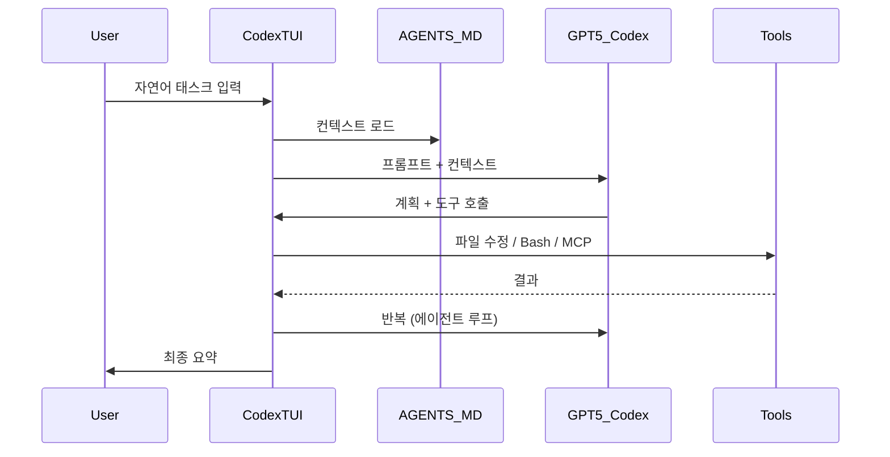

# Codex - 개요

> [[README|목차로 돌아가기]] | [[02-ecosystem|다음: 생태계]]

---

## 1. What — Codex이란?

> **한 줄 정의**: OpenAI의 터미널 기반 AI 코딩 에이전트 CLI.

### 핵심 개념

GPT-5.3-Codex 모델(2026-03 출시)을 기반으로 코드 작성/리뷰/리팩토링/디버깅을 자율 수행하는 에이전트. CLI / IDE 확장 / 데스크톱 앱 / GitHub Cloud / Chrome 확장 등 다양한 서피스에서 동일 모델 + 동일 컨텍스트로 동작.

배포 형태:
- **CLI**: `codex` (TUI 대화형 + `codex exec` 비대화형)
- **IDE 확장**: VS Code 등
- **Codex App**: 데스크톱 앱 (Cowork 등가)
- **GitHub Cloud**: PR 자동 리뷰
- **Chrome Extension**: 2026-05 출시

### 주요 용어

| 용어 | 설명 |
|------|------|
| AGENTS.md | 프로젝트의 에이전트 지시 파일 (Claude의 CLAUDE.md 등가) |
| Skill | 반복 워크플로우를 패키징한 SKILL.md + 로직 묶음 |
| MCP | Model Context Protocol — 외부 도구 연결 표준 |
| Approval mode | 명령 실행 전 사용자 확인 정책 |
| Sandbox mode | Codex의 파일 읽기/쓰기 권한 범위 |
| Hooks | Pre/Post 툴, prompt-submit 등 라이프사이클 훅 |
| remote-control | TUI 없는 헤드리스 app-server (v0.130+) |

### 동작 방식



---

## 2. Why — 왜 Codex인가?

### 해결하려는 문제

- 반복적인 코딩 작업 (보일러플레이트, 리팩토링, 테스트 추가)
- PR 리뷰 표준화 — OpenAI 사내에서 **모든 PR의 100%를 Codex가 리뷰**
- CI/CD에서의 자율 수정 (lint, format, 간단한 버그)
- 신입 온보딩 자동화 (AGENTS.md로 셋업 가이드 자동화)

### 기존 방식의 한계

| 문제 | 기존 방식 | Codex |
|------|----------|-------|
| 컨텍스트 반복 입력 | 매 세션 같은 컨텍스트 | AGENTS.md 스택형 자동 로드 |
| 반복 프롬프트 | 카피/페이스트 | Skills로 패키징 |
| 외부 시스템 연동 | 수동 카피/페이스트 | MCP 표준 |
| CI 통합 | 수동 코드 | `codex exec` 비대화형 |
| 멀티 에이전트 | 수동 분담 | `codex remote-control` (v0.130+) |

---

## 3. 핵심 특징

### 장점

- ChatGPT 구독 통합 — 별도 API 키 없이도 사용 가능
- 헤드리스 / 원격 제어가 강력 (v0.130 remote-control)
- AGENTS.md의 스택형 컨텍스트
- OpenAI의 빠른 모델 개선 속도
- Vim 모달 편집 네이티브 지원 (v0.129+)
- Bedrock + AWS-login 자동 인식 (v0.130+)
- `codex exec`로 CI/CD 자연 통합

### 단점

- Anthropic 대비 후발 — 일부 기능(Skill, MCP, Hooks)이 Claude Code 영향
- **1M 컨텍스트 미지원** (Claude Opus 4.7은 표준가 1M, Codex는 ~200k)
- 가격 모델 ChatGPT 의존적 — 엔터프라이즈 별도 협상 필요
- 회귀 빈도가 잦다는 커뮤니티 보고
- Task Budgets / Adaptive Thinking 같은 모델 레벨 기능 없음

---

## 4. 사용 사례

### 적합한 경우

| 사용 사례 | 설명 |
|----------|------|
| ChatGPT 구독자 | 별도 결제 없이 통합 사용 |
| OpenAI 모델 선호 팀 | GPT-5.3-Codex 일관성 |
| Vim 사용자 | 네이티브 Vim 모드 (v0.129+) |
| CI/CD 자동화 | `codex exec` 비대화형 강력 |
| GitHub PR 리뷰 표준화 | GitHub Cloud 네이티브 통합 |
| AWS/Bedrock 환경 | AWS-login 자동 인식 |

### 부적합한 경우

| 케이스 | 이유 | 대안 |
|--------|------|------|
| 대형 코드베이스 (1M+ 컨텍스트 필요) | 컨텍스트 한계 | Claude Opus 4.7 (1M 표준가) |
| 풍부한 플러그인 마켓플레이스 필요 | 마켓플레이스 미숙 | Claude Code |
| 모바일 작업 | Codex Mobile 미숙 | Claude Cowork Dispatch |

### 실제 활용 예시

```bash
# 1) CI에서 lint 자동 수정
codex exec "Fix all lint errors in src/. Don't break tests."

# 2) 테스트 실패 자율 디버그
codex exec --effort high \
  "Run tests. Diagnose any failure. Fix and re-run until all pass."

# 3) PR 리뷰
codex /review --base main
```

---

## 5. 가격 정책

| 플랜 | 가격 | 특징 |
|------|------|------|
| ChatGPT Plus | $20/월 | 기본 제공 |
| ChatGPT Pro | $200/월 | 더 많은 사용량 |
| Team | $25/사용자/월 | 협업 + 공유 |
| Enterprise | 협상 | SLA, 보안 |
| API (BYO) | 토큰 종량 | `OPENAI_API_KEY` 사용 |

GitHub Copilot으로 사용 시: Claude Opus 4.7과 동일하게 7.5×~15× premium request 멀티플라이어 정책과 호환 (모델별 차등).

---

## 다음 단계

> [!tip] 다음으로
> Codex의 개요를 이해했다면 [[02-ecosystem|생태계와 Claude Code 비교]]를 살펴보세요.

---

## References

- [OpenAI Codex 소개](https://openai.com/index/introducing-upgrades-to-codex/)
- [공식 CLI 가이드](https://developers.openai.com/codex/cli)
- [공식 Best Practices](https://developers.openai.com/codex/learn/best-practices)
- [GitHub: openai/codex](https://github.com/openai/codex)
