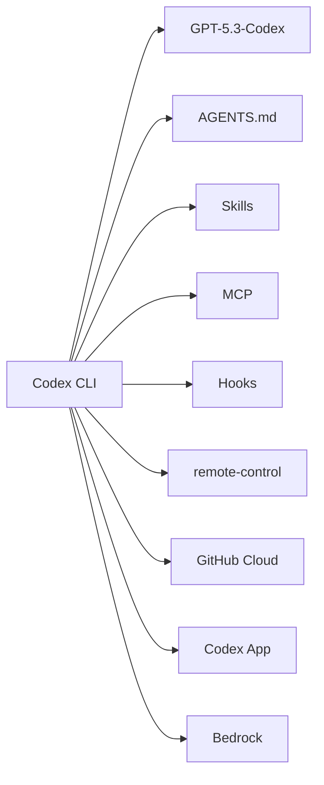

# Codex - 생태계

> [[01-overview|이전: 개요]] | [[README|목차로 돌아가기]] | [[03-references|다음: 참고자료]]

---

## 1. 관련 기술 맵



---

## 2. 대안 도구 비교

### vs Claude Code (2026-05 기준)

| 비교 항목 | Codex CLI (v0.130) | Claude Code (v2.1.143) |
|-----------|---------------------|------------------------|
| 모델 | GPT-5.3-Codex | Claude Opus 4.7 / Sonnet 4.6 |
| 최대 컨텍스트 | ~200k (모델 의존) | **1M (Opus 4.7 표준가)** |
| 비전 | 표준 해상도 | **고해상도 2576px / 3.75MP (Opus 4.7)** |
| 에이전트 지시 파일 | `AGENTS.md` | `CLAUDE.md` |
| Skills | `~/.agents/skills`, `.agents/skills` | `~/.claude/skills`, `.claude/skills`, 플러그인 |
| MCP 지원 | ✅ `codex mcp add` | ✅ 풍부한 마켓플레이스 |
| Hooks | ✅ `/hooks` 브라우저 (v0.129+) | ✅ PreToolUse/PostToolUse/Stop 등 |
| 헤드리스 모드 | `codex exec` + `codex remote-control` | `claude -p`, `--bare`, `claude agents` |
| Vim 모달 편집 | ✅ 네이티브 `/vim` | 외부 에디터 위임 |
| 추론 레벨 조정 | `Alt+,` / `Alt+.` 단축키 | `/effort` 커맨드 |
| 모바일 → 데스크톱 | Codex 앱 | Cowork Dispatch |
| Slack/Discord | 외부 도구 | Channels (v2.1.80+) |
| GitHub PR 자동 리뷰 | ✅ GitHub Cloud 네이티브 | `@claude` 멘션, Actions |
| Bedrock 지원 | ✅ AWS-login 인증 (v0.130+) | ✅ Mantle (v2.1.94+) |
| 플러그인 의존성 강제 | ❌ | ✅ (v2.1.143+) |
| Task Budgets | ❌ | ✅ Opus 4.7 |
| Adaptive Thinking | ❌ | ✅ Opus 4.7 단독 |

### vs 기타 도구

| 도구 | 포지셔닝 | Codex와의 차이 |
|------|---------|-----------------|
| **Aider** | 오픈소스 TUI, BYO 모델 | 모델 비종속, OSS 커뮤니티 / Codex는 OpenAI 종속 + 완성형 |
| **Cursor** | IDE 통합 (VS Code fork) | IDE 우선 / Codex는 CLI 우선 |
| **Continue.dev** | IDE 확장, 멀티프로바이더 | 라이트 통합 / Codex는 풀스택 에이전트 |
| **Cline** | VS Code 확장 | 확장 한정 / Codex는 다중 서피스 |
| **GitHub Copilot Agent** | GitHub 통합 PR 에이전트 | PR 자동화 한정 / Codex는 범용 |
| **Devin** | 풀 자율 SaaS | 클라우드 SaaS / Codex는 로컬 우선 |

---

## 3. 함께 사용하면 좋은 도구

| 도구 | 역할 | 연동 방식 |
|------|------|----------|
| **GitHub MCP** | PR, 이슈 조작 | `codex mcp add github ...` |
| **Linear MCP** | 이슈 트래킹 | MCP 등록 |
| **Sentry MCP** | 에러 추적 | MCP 등록 |
| **Filesystem MCP** | 다른 디렉토리 접근 | MCP 등록 |
| **cmux** | 멀티 워크스페이스 / 멀티 에이전트 | `cmux new-workspace` + `codex` |
| **자체 MCP** | 사내 시스템 노출 | `codex mcp add internal ...` |

OpenAI 코딩 도구 라인업:

```
┌─────────────────────────────────────────────────┐
│  GPT-5.3-Codex 모델 (2026-03~)                  │
└─────────────────────────────────────────────────┘
            │
    ┌───────┼────────┬─────────────┬──────────┐
    ▼       ▼        ▼             ▼          ▼
  Codex   IDE 확장  Codex App   GitHub Cloud  Chrome
   CLI    (VSCode) (데스크톱)   (PR 리뷰)    Extension
                                              (2026-05)
```

---

## 4. 트렌드 (2026-04~05)

### 헤드리스 / 원격 오케스트레이션
- v0.130: `codex remote-control` — 외부 도구가 Codex를 프로그램적으로 조작
- Claude Code의 `claude agents` + Dispatch와 직접 경쟁
- 멀티 에이전트 시스템의 빌딩 블록화

### 다중 환경 (Multi-environment)
- App-server 세션이 여러 환경/디렉토리를 턴별로 선택
- 워크스페이스 격리 + 원격 환경 타기팅

### AGENTS.md 표준화
- AGENTS.md 포맷이 비공식 표준화 진행 — Aider, Cline 등 일부 도구가 호환 시도

### Skills 보편화
- Anthropic이 시작한 Skills 패턴이 Codex에도 전면 채택
- `$skill-creator`로 자가 확장형 도구화

### Bedrock / 멀티 클라우드
- v0.130: Bedrock + AWS-login 인증 (캐시된 콘솔 로그인 자동 사용)
- Claude Code의 Bedrock Mantle (v2.1.94)과 같은 흐름

---

## 다음 단계

> [!tip] 다음으로
> [[03-references|참고자료]]에서 학습 자료를 확인하세요.
