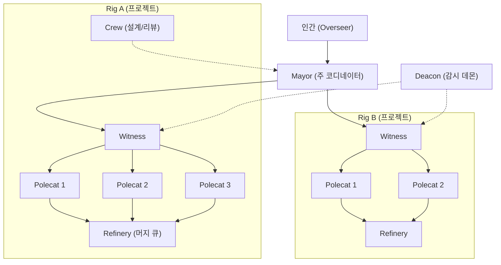

# Gas Town - 개요

> [[README|목차로 돌아가기]] | [[02-ecosystem|다음: 생태계]]

---

## 1. What - Gas Town이란?

> **한 줄 정의**: AI 코딩 에이전트(Claude Code, Codex, Gemini 등) 20~30개를 동시에 관리하는 Git 기반 멀티 에이전트 오케스트레이션 시스템

### 핵심 개념

Gas Town은 Steve Yegge가 2026년 1월에 출시한 오픈소스 프로젝트로, AI 에이전트의 작업을 **구조화된 데이터**로 다루는 오케스트레이션 레이어다. 단일 에이전트를 넘어 수십 개의 에이전트가 동시에 같은 코드베이스에서 작업할 때 발생하는 문제들 -- 컨텍스트 유실, 수동 조율, 병합 충돌, 상태 추적 -- 을 해결한다.

Gas Town Hall(gastownhall.ai)은 Chris Sells가 관리하는 공식 문서 및 커뮤니티 허브이며, 핵심 코드는 Steve Yegge의 GitHub 리포지토리에서 관리된다.

### 주요 용어

| 용어 | 설명 |
|------|------|
| **Town** | 워크스페이스 루트 디렉토리 (`~/gt/`), 모든 프로젝트와 에이전트 관리 |
| **Rig** | Git 리포지토리를 감싸는 프로젝트 컨테이너 |
| **Mayor** | 인간과 소통하는 주요 AI 코디네이터 (Claude Code 인스턴스) |
| **Polecat** | 임시 워커 에이전트 -- 작업 후 소멸하지만 아이덴티티는 유지 |
| **Crew** | 장기 지속 에이전트 -- 설계/리뷰 등 지속 작업 담당 |
| **Witness** | Rig별 Polecat 라이프사이클 관리자 |
| **Deacon** | 시스템 전체 건강 상태 감시 데몬 |
| **Refinery** | Rig별 머지 큐 프로세서 -- 충돌 해결 전문 |
| **Hook** | Git worktree 기반 영속적 작업 저장소 |
| **Bead** | JSONL 기반 원자적 작업 단위 (이슈 트래킹) |
| **Convoy** | 여러 Bead를 묶어 추적하는 작업 배치 단위 |
| **Molecule** | TOML로 정의된 워크플로우 템플릿 |
| **Seance** | 이전 세션의 에이전트에게 컨텍스트를 질의하는 메커니즘 |
| **Wasteland** | 여러 Gas Town을 연결하는 분산 신뢰 네트워크 |

### 동작 방식

**핵심 흐름**:
1. 인간이 Mayor에게 작업 지시
2. Mayor가 Rig별 Witness에게 작업 분배
3. Witness가 Polecat(임시 워커)를 생성하여 개별 작업 할당
4. Polecat이 작업 완료 후 MR(Merge Request) 생성
5. Refinery가 머지 큐에서 순차적으로 충돌 해결 및 병합
6. Deacon이 전체 시스템 건강 상태를 주기적으로 감시

---

## 2. Why - 왜 Gas Town인가?

### 해결하려는 문제

- **컨텍스트 유실**: 에이전트 세션이 종료되면 작업 상태가 사라지는 문제 -- Git 기반 Hook으로 영속화
- **수동 조율의 한계**: 에이전트 4~10개만 되어도 인간이 직접 관리하기 어려움 -- 계층적 역할 체계로 자동화
- **병합 충돌 폭발**: 병렬 작업 시 merge conflict가 기하급수적으로 증가 -- Refinery가 전담 처리
- **책임 추적 불가**: 누가 무엇을 했는지 추적할 수 없음 -- `<rig>/<role>/<name>` 형식 어트리뷰션

### 기존 방식의 한계

| 문제 | 기존 방식 (단일 에이전트) | Gas Town |
|------|--------------------------|----------|
| 확장성 | 1~2개 에이전트 수동 관리 | 20~30개 에이전트 자동 조율 |
| 상태 관리 | 에이전트 메모리에 의존 | Git-backed Beads 영속 저장 |
| 크래시 복구 | 작업 유실 | `gt prime`으로 체크포인트 복구 |
| 병합 관리 | 수동 충돌 해결 | Refinery 자동 병합 큐 |
| 작업 추적 | 없음 | Convoy + Bead 시스템 |

---

## 3. 핵심 특징

### 장점

- **대규모 병렬 처리**: 15개 이상의 Polecat이 동시에 작업 가능
- **크래시 복구**: 세션은 "가축(cattle)" -- 죽어도 아이덴티티와 작업 상태는 Git에 영속
- **완전한 추적성**: 모든 결정이 Git 커밋으로 기록됨
- **모델 평가 가능**: 어트리뷰션과 완료 메트릭으로 A/B 테스트 지원
- **유연한 워크플로우**: Molecule/Formula로 복잡한 작업 흐름을 TOML로 정의
- **분산 협업**: Wasteland 네트워크를 통한 Gas Town 간 연합 작업

### 단점

- **극단적 비용**: 60분 세션 기준 약 $100 (일반 Claude Code 대비 10배)
- **가파른 러닝 커브**: 7개 역할, 수십 개 개념 -- "세례를 통한 입문(Baptism by fire)"
- **높은 진입 장벽**: Stage 6~8 수준의 개발자만 생산적으로 사용 가능
- **미성숙**: Go 포팅 후 약 3주 -- 많은 기능이 아직 개발 중
- **에이전트 의존성**: Claude Code의 협조에 의존하며 안정성이 가변적

---

## 4. 사용 사례

### 적합한 경우

| 사용 사례 | 설명 |
|----------|------|
| 대규모 리팩토링 | 수십 개 파일을 동시에 병렬 수정 |
| 장기 프로젝트 | 크래시 복구와 상태 영속이 중요한 프로젝트 |
| 멀티 리포 작업 | 여러 Git 리포지토리에 걸친 조율 작업 |
| 프로토타입 빠른 생성 | 수주 걸릴 작업을 수시간으로 압축 |

### 적합하지 않은 경우

| 경우 | 이유 |
|------|------|
| 소규모 프로젝트 | 오버헤드가 이점을 초과 |
| 비용에 민감한 환경 | 월 $2,000~$5,000 API 비용 |
| AI 코딩 초보 | Stage 6 이하 개발자에게 비생산적 |
| 프론트엔드/UX 작업 | 시각적 검증이 어려운 에이전트 한계 |

### 개발자 성숙도 모델

| 단계 | 설명 | 에이전트 수 |
|------|------|------------|
| 1~5 | 초기 AI 도입 단계 | 0~2개 |
| 6 | CLI 멀티 에이전트 (YOLO) | 3~5개 |
| 7 | 에이전트 직접 관리 | 10개 이상 |
| 8 | 자체 오케스트레이터 구축 | 20~30개 이상 |

> Gas Town은 Stage 6~8 개발자를 위한 도구다. Yegge의 경고: "돈이 어디서 나오는지 생각해야 한다면 Gas Town은 맞지 않다."

---

## 5. 비용 구조

| 항목 | 비용 | 비고 |
|------|------|------|
| 에이전트 API 비용 | 월 $2,000~$5,000 | 20~30 에이전트 기준 |
| 60분 세션 | ~$100 | 일반 Claude Code 대비 10배 |
| 인프라 | 무료 (오픈소스) | Go, Git, Dolt 필요 |
| 비효율 오버헤드 | 30~50% | 유실 작업, 반복 수정, 재설계 포함 |

> 시니어 개발자 연봉의 10~30%에 해당하는 비용으로, 2~3배 생산성 향상을 달성한다면 정당화 가능하다는 논리.

---

## 다음 단계

> [!tip] 다음으로
> Gas Town의 개요를 이해했다면 [[02-ecosystem|생태계와 대안 도구 비교]]를 살펴보세요.

---

## References

- [Gas Town Hall 공식 사이트](https://gastownhall.ai/)
- [Gas Town 공식 문서](https://docs.gastownhall.ai/)
- [GitHub 리포지토리](https://github.com/steveyegge/gastown)
- [Maggie Appleton 분석](https://maggieappleton.com/gastown)
