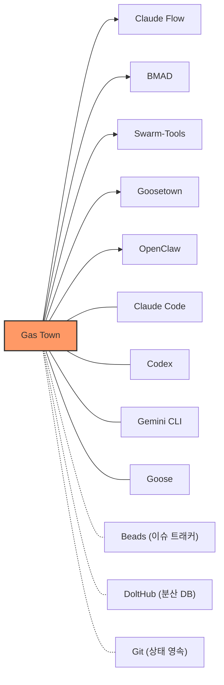
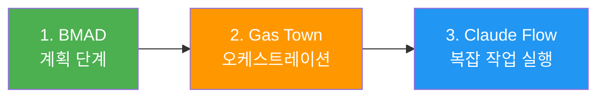

# Gas Town - 생태계

> [[01-overview|이전: 개요]] | [[README|목차로 돌아가기]] | [[03-references|다음: 참고자료]]

---

## 1. 관련 기술 맵

---

## 2. 멀티 에이전트 오케스트레이션 프레임워크 비교

### 핵심 비교표

| 비교 항목 | Gas Town | BMAD | Claude Flow | Swarm-Tools |
|-----------|----------|------|-------------|-------------|
| **철학** | "Physics over Politeness" -- 혼돈을 Git으로 수용 | "Fight chaos with docs" -- 문서가 진실의 원천 | AI 네이티브 메모리 시스템 구축 | 이벤트 소싱 + 내구성 프리미티브 |
| **에이전트 수** | 7개 역할, 15~30 병렬 Polecat | 26개 페르소나 에이전트 | 54개 이상 전문 에이전트 | 분산 시스템 접근 |
| **상태 관리** | Git-backed JSONL (Beads) | Git 버전 관리 문서 | 벡터 DB (AgentDB) | 이벤트 소싱 |
| **실행 방식** | 병렬 (Polecat 스웜) | 순차 (단계별 진행) | 병렬 (Queen-Worker) | 병렬 (코디네이터-워커) |
| **크래시 복구** | `gt prime` 체크포인트 | 문서 기반 재개 | 메모리 기반 재개 | 내구성 프리미티브 |
| **비용** | ~$100/시간 (10x 일반) | 계획 단계 토큰 소비 높음 | MCP 서버 설정 필요 | 중간 수준 |
| **러닝커브** | 매우 높음 (Stage 6+ 필요) | 중간 (구조화된 단계) | 중간 (MCP 이해 필요) | 중간~높음 |
| **적합한 상황** | 장기 프로젝트, 크래시 복구 중요 | 그린필드, 거버넌스 중시 | 복잡한 병렬 작업, 학습 필요 | 분산 시스템 경험자 |

### 각 프레임워크 특징

#### BMAD (Breakthrough Method for Agile AI-Driven Development)

- **핵심**: 코딩 전 철저한 문서화 → PRD → UX → 아키텍처 → 에픽/스토리
- **장점**: 감사 추적, 팀원 간 핸드오프, 거버넌스에 최적
- **단점**: 초기 3시간 이상 계획 투자, 순차 실행으로 속도 제한
- **적합**: 규제 환경, 복잡한 요구사항의 신규 프로젝트

#### Claude Flow

- **핵심**: Queen Agent가 요청 분석 → Worker 할당 → 결과 합성
- **장점**: AgentDB 벡터 검색 (기존 대비 96배 빠름), ReasoningBank로 세션 간 학습
- **단점**: 메모리 오버헤드, DB 유지 관리, 투명성 부족
- **적합**: 빠른 프로토타이핑, 에이전트 학습이 유의미한 프로젝트

#### Swarm-Tools

- **핵심**: 코디네이터가 작업만 분배하고 직접 실행하지 않음 (순수 오케스트레이션)
- **장점**: 이벤트 소싱으로 완전한 재현 가능, 깔끔한 분리
- **단점**: 분산 시스템 개념 이해 필요
- **적합**: 분산 시스템 경험이 있는 팀

#### Goosetown

- **핵심**: Goose 기반 미니멀 멀티 에이전트 오케스트레이션
- **장점**: 의도적으로 단순하게 설계, 연구 중심 병렬 작업에 최적
- **단점**: Gas Town 대비 기능 제한
- **적합**: 연구 목적, 미니멀한 접근 선호 시

---

## 3. 추천 조합 패턴

### 통합 체인 (권장)

| 단계 | 프레임워크 | 역할 |
|------|-----------|------|
| 계획 | BMAD | PRD, 아키텍처 문서화 |
| 오케스트레이션 | Gas Town | 에픽 조율, MR 관리 |
| 실행 | Claude Flow | 스토리별 복잡한 병렬 작업 |

### 경량 대안

**SpecKit + Gas Town** -- BMAD가 너무 무거운 팀을 위한 조합

---

## 4. 함께 사용하는 도구

| 도구 | 역할 | 연동 방식 |
|------|------|----------|
| **Claude Code** | 주력 AI 코딩 에이전트 | Mayor, Polecat 등 역할 수행 |
| **Codex / Gemini** | 대안 AI 에이전트 | 동일 역할 수행 가능 |
| **Beads (bd)** | Git-backed 이슈 트래킹 | Bead ID로 작업 단위 추적 |
| **DoltHub** | 분산 버전 관리 DB | Wasteland 신뢰 네트워크 지원 |
| **tmux** | 터미널 멀티플렉서 | 다수 에이전트 세션 관리 |
| **Git worktree** | 격리된 작업 공간 | Polecat별 독립 워크트리 |

---

## 5. 시나리오별 선택 가이드

| 시나리오 | 추천 프레임워크 | 이유 |
|----------|----------------|------|
| 신규 프로젝트 시작 | BMAD | 구조화된 계획 수립 |
| 병렬 작업 필요 | Claude Flow | 스웜 기반 빠른 실행 |
| 장기 운영, 내구성 중요 | Gas Town | Git-backed 크래시 복구 |
| 거버넌스 우선 | BMAD | 버전 관리된 문서 감사 |
| 빠른 반복 개발 | Claude Flow | 메모리 기반 학습 유지 |
| 비용 최적화 | 단일 에이전트 | 오케스트레이션 오버헤드 없음 |

---

## 6. 트렌드

- **에이전트 오케스트레이션의 표준화**: 개별 에이전트 → 에이전트 군단 관리가 새로운 표준으로 부상
- **Git-backed 상태 관리**: 에이전트 메모리 대신 Git을 단일 진실 원천(SSOT)으로 사용하는 패턴 확산
- **비용 장벽**: 대규모 에이전트 운영의 비용 문제가 아직 해결되지 않음
- **전문화된 서브에이전트**: 보안, 접근성, 문서화 전담 에이전트의 등장 예상
- **Stacked Diff 도구**: 전통적 PR 대신 에이전트 친화적 stacked diff 도구 수요 증가

---

## 다음 단계

> [!tip] 다음으로
> [[03-references|참고자료]]에서 핵심 학습 자료를 확인하세요.
