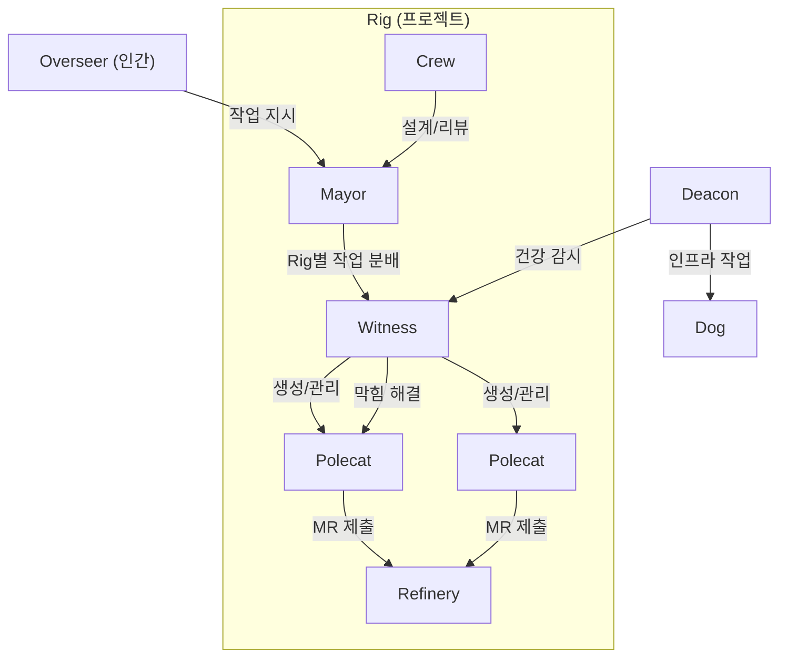

# Gas Town - 아키텍처

> [[README|목차로 돌아가기]] | [[02-workflow-patterns|다음: 워크플로우 패턴]]

---

## 📌 핵심 개념

Gas Town의 아키텍처는 크게 **역할 계층 구조**와 **MEOW 스택**(작업 추상화 계층)으로 나뉜다. Mad Max 세계관에서 영감을 받은 용어 체계를 사용하며, 모든 상태는 Git에 영속화된다.

---

## 1. 역할 계층 구조 (Role Taxonomy)

Gas Town의 에이전트는 **인프라 역할**과 **워커 역할**로 분류된다.

### 인프라 역할 (시스템 관리)

| 역할 | 범위 | 수명 | 기능 |
|------|------|------|------|
| **Overseer** | Town 전체 | 영구 | 인간 운영자 -- 작업 할당 및 모니터링 |
| **Mayor** | Town 전체 | 장기 지속 | 수석 디스패처 -- 인간과 직접 소통하는 AI 코디네이터 |
| **Deacon** | Town 전체 | 장기 지속 | 시스템 건강 감시 데몬 -- 순찰 루프 실행 |
| **Dog** | Town 전체 | 단기 | Deacon 보조 -- 인프라 작업 전담 (워커가 아님) |

### 워커 역할 (프로젝트 작업)

| 역할 | 범위 | 수명 | 기능 |
|------|------|------|------|
| **Polecat** | Rig별 | 임시 | 일회성 워커 -- 작업 후 MR 생성, 세션 종료 |
| **Crew** | Rig별 | 장기 지속 | 지속 워커 -- 설계, 리뷰 등 장기 작업 |
| **Witness** | Rig별 | 장기 지속 | Polecat 라이프사이클 관리, 막힌 작업 해결 |
| **Refinery** | Rig별 | 장기 지속 | 머지 큐 프로세서 -- Bors 스타일 이등분 검증 |

### 역할 상호작용 흐름



---

## 2. MEOW 스택 (Molecular Expression of Work)

MEOW 스택은 Gas Town의 작업 추상화 계층으로, 크래시 복구가 가능한 Git 기반 워크플로우를 구성한다.

### 계층 구조 (아래에서 위로)

```
┌─────────────────────────────────────┐
│  Formula (TOML 정의)                 │ ← 최상위: 워크플로우 선언
├─────────────────────────────────────┤
│  Protomolecule (재사용 가능 템플릿)    │ ← 인스턴스화 전 상태
├─────────────────────────────────────┤
│  Molecule (실행 중 워크플로우)          │ ← 의존성 그래프 + 게이트
├─────────────────────────────────────┤
│  Epic (Bead 트리)                    │ ← 계층적 작업 그룹
├─────────────────────────────────────┤
│  Bead (원자적 작업 단위)              │ ← 최하위: JSONL 이슈
└─────────────────────────────────────┘
```

### 각 계층 설명

| 계층 | 형식 | 설명 |
|------|------|------|
| **Bead** | JSONL | 원자적 작업 단위 -- ID, 설명, 상태를 가진 이슈. prefix + 5자리 형식 (예: `gt-abc12`) |
| **Epic** | 트리 구조 | Bead를 계층적으로 조직하는 컬렉션 |
| **Molecule** | 그래프 | 인스턴스화된 워크플로우 -- 순서 의존성과 게이트를 포함 |
| **Protomolecule** | 템플릿 | 재사용 가능한 워크플로우 정의 -- 인스턴스화 대기 상태 |
| **Formula** | TOML | 최상위 선언 -- 워크플로우, 루프, 조합을 정의 |

---

## 3. 디렉토리 구조

Gas Town은 `~/gt/` 아래에 역할별로 분리된 구조를 사용한다.

```
~/gt/                          # Town 루트
├── .gt/                       # Gas Town 설정
├── mayor/                     # Mayor 워크스페이스
├── deacon/                    # Deacon 데몬
├── rig-a/                     # Rig (프로젝트 A)
│   ├── .beads/                # Bead 저장소 (JSONL)
│   ├── crew/                  # Crew 워크스페이스
│   ├── polecats/              # Polecat 워크트리들
│   │   ├── polecat-001/       # 개별 Polecat 워크트리
│   │   └── polecat-002/
│   ├── witness/               # Witness 설정
│   └── refinery/              # 머지 큐 설정
└── rig-b/                     # Rig (프로젝트 B)
    └── ...
```

---

## 4. 핵심 원칙

### GUPP (Gas Town Universal Propulsion Principle)

> "If there is work on your hook, YOU MUST RUN IT."
> (후크에 작업이 있으면, 반드시 실행해야 한다.)

- 에이전트가 재시작되어도 후크에 남아있는 작업을 즉시 실행
- 확인이나 승인을 기다리지 않음 -- "후크가 곧 할당"
- 이를 통해 크래시 후에도 작업이 자동 재개됨

### Identity & Attribution

- 모든 행위에 `<rig>/<role>/<name>` 형식의 어트리뷰션 부여
- Git 커밋, 이슈, 이벤트 모두에 출처 기록
- 교차 Rig 작업에서도 원래 에이전트의 아이덴티티 보존

### 세션은 가축, 에이전트는 영속

- 세션(session)은 언제든 종료될 수 있는 일회용 -- "가축(cattle)"
- 에이전트의 아이덴티티와 작업 상태는 Git에 영속 -- 새 세션에서 복구 가능
- Seance 메커니즘으로 이전 세션의 에이전트에게 미완성 작업 컨텍스트 질의

---

## 5. 세 가지 개발 루프

Gas Town은 시간 스케일이 다른 세 가지 중첩된 개발 루프를 사용한다.

| 루프 | 시간 스케일 | 활동 |
|------|-----------|------|
| **외부 루프** | 며칠~몇 주 | 전략적 계획, 시스템 업그레이드, Town 수준 정리 |
| **중간 루프** | 몇 시간~며칠 | 에이전트 생성 결정, Mayor 조율, 용량 조절 |
| **내부 루프** | 몇 분 | 빈번한 핸드오프, 작업 명세, 출력 리뷰 |

---

## 💻 실전 예시

### Mayor 시작하기

```bash
# Town 초기화
gt install ~/gt --git
cd ~/gt

# Mayor 연결
gt mayor attach

# 작업 할당
gt convoy create "Feature X 구현" gt-abc12 gt-def34 --notify
gt sling gt-abc12 myproject
```

### Polecat 작업 흐름

```bash
# Polecat에게 작업 할당 (Mayor가 수행)
gt sling gt-abc12 myproject

# 작업 상태 확인
gt convoy list

# 이전 세션 컨텍스트 질의 (Seance)
gt seance polecat-001 "이전 작업 상태는?"
```

---

## ✅ 체크포인트

- [ ] 7개 역할(Overseer, Mayor, Deacon, Dog, Polecat, Crew, Witness, Refinery)의 차이를 설명할 수 있는가?
- [ ] MEOW 스택의 5개 계층(Bead, Epic, Molecule, Protomolecule, Formula)을 구분할 수 있는가?
- [ ] GUPP 원칙이 크래시 복구에 어떻게 기여하는지 이해했는가?
- [ ] 세션과 에이전트 아이덴티티의 차이를 설명할 수 있는가?
- [ ] 세 가지 개발 루프의 시간 스케일을 구분할 수 있는가?

---

## ⚠️ 주의사항

- Gas Town의 용어 체계는 Mad Max에서 차용되어 직관적이지 않음 -- 용어 매핑표를 참고하며 학습할 것
- MEOW 스택의 모든 계층을 한 번에 이해하려 하지 말 것 -- Bead와 Convoy부터 시작
- Refinery의 머지 큐는 단순 merge가 아닌 "창의적 재구현"도 포함 -- 예상치 못한 코드 변경 가능
- 인프라 역할(Mayor, Deacon)과 워커 역할(Polecat, Crew)을 혼동하지 말 것

---

## 🔗 더 알아보기

- [Gas Town 공식 문서 - Understanding Gas Town](https://docs.gastownhall.ai/)
- [GitHub README](https://github.com/steveyegge/gastown)
- [Maggie Appleton - Gas Town Agent Patterns](https://maggieappleton.com/gastown)
- [[02-workflow-patterns|다음: 워크플로우 패턴]]
