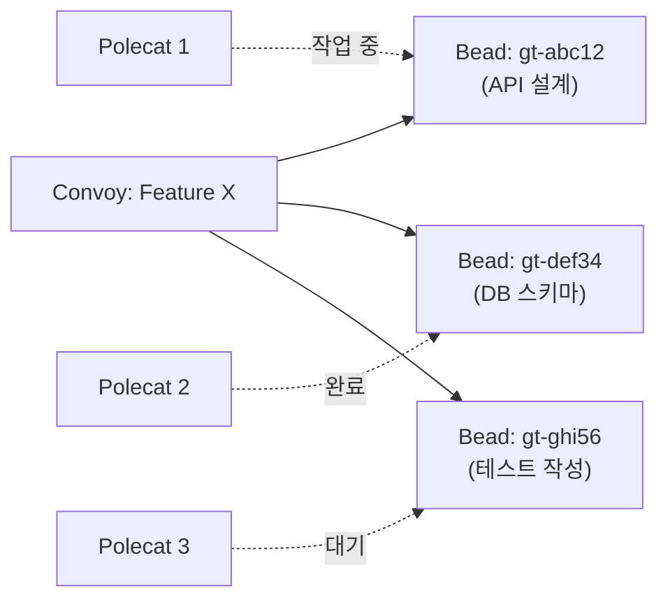
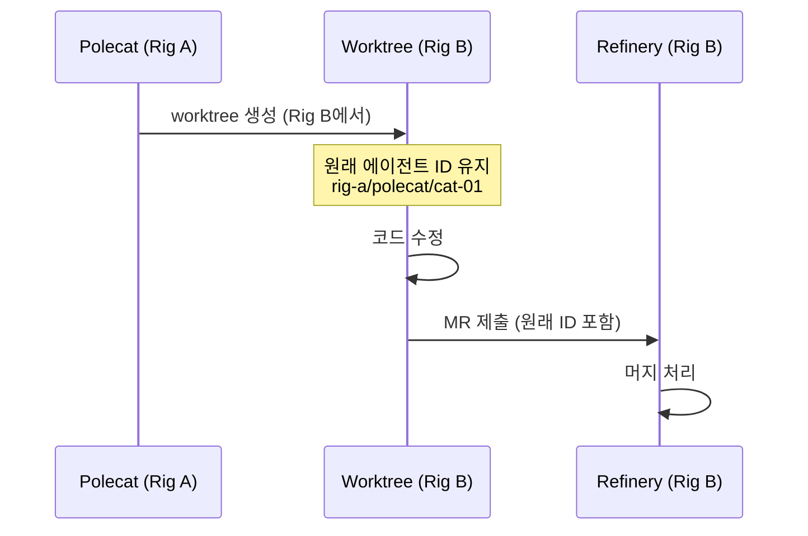
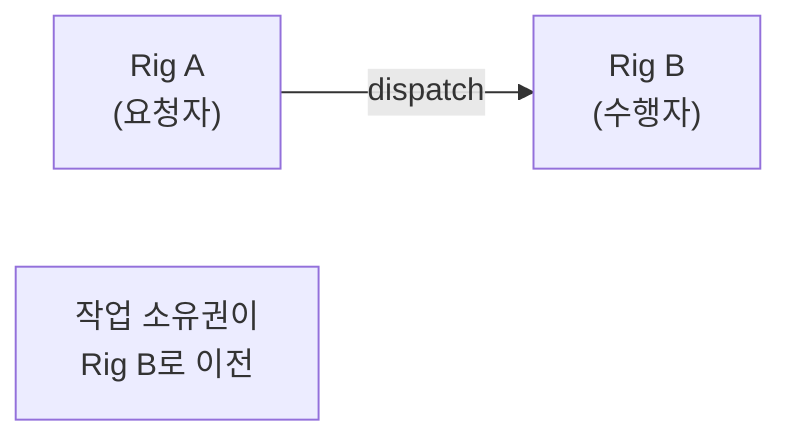
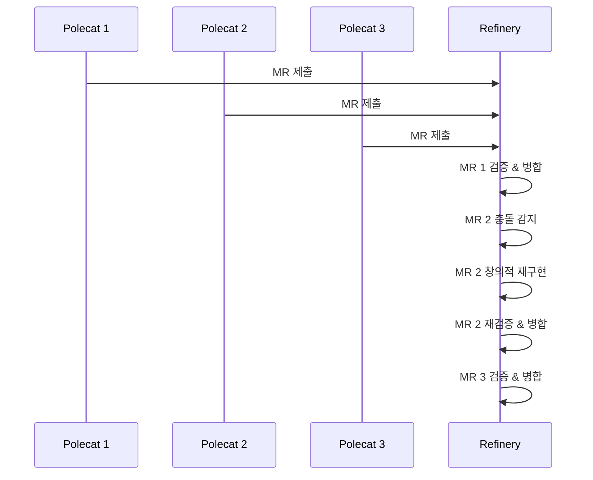

# Gas Town - 워크플로우 패턴

> [[01-architecture|이전: 아키텍처]] | [[README|목차로 돌아가기]] | [[03-vibecoding-at-scale|다음: 바이브코딩과 스케일링]]

---

## 📌 핵심 개념

Gas Town은 작업 조율을 위해 Convoy, Molecule, Worktree, Dispatch 등 다양한 패턴을 제공한다. 핵심은 **모든 작업이 Git에 구조화된 데이터로 기록**되며, 크래시 후에도 복구 가능하다는 점이다.

---

## 1. Convoy 패턴 (배치 작업 추적)

### 개념

Convoy는 여러 Bead(작업 단위)를 하나의 배치로 묶어 진행 상황을 추적하는 메커니즘이다.



### 사용법

```bash
# Convoy 생성 -- 여러 Bead를 묶어 추적
gt convoy create "Feature X 구현" gt-abc12 gt-def34 gt-ghi56 --notify

# Convoy 목록 확인
gt convoy list

# Convoy 상세 조회
gt convoy show "Feature X 구현"
```

### Mountain Convoy

- `--mountain` 플래그를 추가하면 **자율 정체 감지** 활성화
- 에이전트가 정체되면 자동으로 Witness에게 에스컬레이션
- 장기 운영 작업에 적합

---

## 2. Worktree 패턴 (교차 Rig 작업)

### 개념

Git worktree를 활용하여 에이전트가 다른 Rig의 코드를 수정할 때, **원래 에이전트의 아이덴티티를 보존**하면서 작업한다.



### 사용법

```bash
# 다른 Rig에 worktree 생성
gt worktree create rig-b --from rig-a/polecat/cat-01

# 작업 후 MR 제출
gt mr create rig-b "교차 Rig 수정사항"
```

---

## 3. Dispatch 패턴 (작업 위임)

### 개념

Worktree와 달리, Dispatch는 작업을 **대상 Rig의 팀이 소유**하도록 생성한다. 작업 소유권이 이전되는 패턴이다.



| 패턴 | 소유권 | 아이덴티티 | 적합한 경우 |
|------|--------|-----------|------------|
| Worktree | 원래 Rig 유지 | 원래 에이전트 보존 | 다른 Rig 코드 수정이 필요할 때 |
| Dispatch | 대상 Rig로 이전 | 대상 Rig 팀 귀속 | 작업 자체가 대상 Rig의 책임일 때 |

---

## 4. Hook 메커니즘 (영속적 작업 큐)

### 개념

Hook은 에이전트의 "작업 대기열" 역할을 하는 Git 기반 영속 저장소다. GUPP 원칙에 따라, Hook에 작업이 있으면 에이전트는 반드시 실행해야 한다.

```
Hook 라이프사이클:
┌──────────┐    ┌──────────┐    ┌──────────┐    ┌──────────┐
│ 작업 할당  │ -> │ Hook에    │ -> │ 에이전트   │ -> │ Hook에서  │
│ (sling)   │    │ 저장     │    │ 실행     │    │ 제거     │
└──────────┘    └──────────┘    └──────────┘    └──────────┘
                     ↑                               │
                     └── 크래시 시 Hook에 작업 유지 ──────┘
```

### 사용법

```bash
# 작업을 에이전트의 Hook에 할당
gt sling gt-abc12 myproject

# Hook 상태 확인
gt hook list

# 크래시 후 복구
gt prime
```

---

## 5. Molecule 워크플로우 (복합 작업 정의)

### 개념

Molecule은 TOML로 정의된 복합 워크플로우로, 여러 단계의 의존성과 체크포인트를 포함한다.

### Formula 예시 (TOML)

```toml
[formula]
name = "release-workflow"
description = "릴리스 프로세스 자동화"

[[steps]]
name = "run-tests"
role = "polecat"
bead_prefix = "test"

[[steps]]
name = "build-artifact"
role = "polecat"
depends_on = ["run-tests"]
bead_prefix = "build"

[[steps]]
name = "deploy"
role = "crew"
depends_on = ["build-artifact"]
bead_prefix = "deploy"
gate = "manual"  # 수동 승인 필요
```

### Molecule 실행

```bash
# Formula 목록 확인
bd formula list

# Formula 실행
bd cook release-workflow --var version=1.2.0

# 실행 중 Molecule 상태 확인
gt molecule status release-workflow
```

### Wisp (워크플로우 실행 단위)

- **Root-only Wisp**: 단일 지점에서만 실행 -- 간단한 워크플로우에 적합
- **Poured Wisp**: 체크포인트 복구를 지원하는 분산 실행 -- 크래시 내구성 확보

---

## 6. Refinery 머지 큐

### 개념

Refinery는 여러 Polecat의 MR을 순차적으로 처리하며, Bors 스타일의 이등분 검증을 수행한다.



### 핵심 특징

- **순차 처리**: 충돌을 최소화하기 위해 하나씩 처리
- **창의적 재구현**: 단순 충돌 해결이 아닌, 변경 의도를 이해하고 재구현
- **Bors 스타일 이등분**: 빌드 실패 시 이등분 검색으로 원인 식별
- **검증 게이트**: 병합 전 자동 테스트 실행

---

## 7. 에스컬레이션 체계

### 심각도 기반 라우팅

| 심각도 | 설명 | 처리 주체 |
|--------|------|----------|
| **CRITICAL** | 시스템 다운, 데이터 손실 위험 | Mayor → Overseer (인간) |
| **HIGH** | 주요 기능 장애, 에이전트 정체 | Witness → Mayor |
| **MEDIUM** | 비핵심 이슈, 성능 저하 | Witness 자체 처리 |

```bash
# 에스컬레이션 상태 확인
gt escalation list

# 수동 에스컬레이션
gt escalation create --severity HIGH --message "Polecat 3 정체 30분째"
```

---

## 💻 실전 예시: 종합 워크플로우

```bash
# 1. Mayor 연결
gt mayor attach

# 2. Feature 작업을 Convoy로 생성
gt convoy create "사용자 인증 시스템" \
  gt-auth01 gt-auth02 gt-auth03 --notify --mountain

# 3. 각 Bead를 프로젝트에 할당 (Mayor가 자동 분배)
gt sling gt-auth01 backend-api    # API 엔드포인트
gt sling gt-auth02 backend-api    # DB 스키마
gt sling gt-auth03 frontend-app   # 로그인 UI

# 4. 진행 상황 모니터링
gt convoy list
gt convoy show "사용자 인증 시스템"

# 5. 크래시 후 복구
gt prime

# 6. 완료된 작업 확인
gt bead list --status done
```

---

## ✅ 체크포인트

- [ ] Convoy와 Bead의 관계를 설명할 수 있는가?
- [ ] Worktree 패턴과 Dispatch 패턴의 차이를 이해했는가?
- [ ] GUPP 원칙이 Hook과 어떻게 연결되는지 설명할 수 있는가?
- [ ] Formula → Protomolecule → Molecule 인스턴스화 흐름을 이해했는가?
- [ ] Refinery의 "창의적 재구현"이 무엇인지 설명할 수 있는가?
- [ ] 에스컬레이션 심각도 라우팅을 구분할 수 있는가?

---

## ⚠️ 주의사항

- Refinery의 "창의적 재구현"은 예상치 못한 코드 변경을 초래할 수 있음 -- 중요한 로직은 테스트 게이트 필수
- Mountain Convoy의 자율 정체 감지는 API 비용을 추가 소모함 -- 소규모 작업에는 일반 Convoy 사용
- Molecule이 복잡해질수록 디버깅이 어려움 -- 가능한 단순한 Formula부터 시작
- 에스컬레이션이 자동화되어 있어 인간(Overseer)에게 예기치 않은 알림이 올 수 있음

---

## 🔗 더 알아보기

- [Gas Town 공식 문서 - Convoys](https://docs.gastownhall.ai/)
- [Gas Town 공식 문서 - Molecules](https://docs.gastownhall.ai/)
- [GitHub README - Quick Start Workflows](https://github.com/steveyegge/gastown)
- [[03-vibecoding-at-scale|다음: 바이브코딩과 스케일링]]
