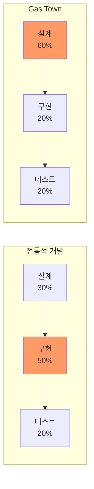

# Gas Town - 바이브코딩과 스케일링

> [[02-workflow-patterns|이전: 워크플로우 패턴]] | [[README|목차로 돌아가기]] | [[04-criticism-and-lessons|다음: 비판과 교훈]]

---

## 📌 핵심 개념

Gas Town은 Steve Yegge의 "100% 바이브코딩" 철학을 극단적으로 실현한 프로젝트다. 생성된 코드를 직접 보지 않고, 에이전트에게 모든 구현을 위임하는 접근법의 현실적 성과와 한계를 분석한다.

---

## 1. 바이브코딩(Vibecoding)이란?

### 정의

> "It is 100% vibecoded. I've never seen the code, and I never care to."
> -- Steve Yegge

바이브코딩은 개발자가 **코드를 직접 작성하거나 검토하지 않고**, AI 에이전트에게 의도만 전달하여 구현을 위임하는 개발 방식이다.

### 전통적 개발과의 비교

| 측면 | 전통적 개발 | 바이브코딩 |
|------|------------|-----------|
| 코드 작성 | 인간이 직접 작성 | 에이전트가 생성 |
| 코드 리뷰 | 필수 -- PR 리뷰 프로세스 | 선택적 또는 생략 |
| 디버깅 | 코드를 읽고 분석 | 에이전트에게 증상 전달 |
| 설계 | 코드와 함께 진화 | 설계가 핵심 병목 |
| 병목 | 구현 속도 | 설계와 명세 품질 |

---

## 2. 스케일링의 현실

### 병목 이동: 구현 → 설계

Gas Town의 가장 중요한 발견은 **병목이 구현에서 설계로 이동**한다는 점이다.



> "Gas Town churns through implementation plans so quickly that you have to do a LOT of design and planning to keep the engine fed."
> (Gas Town이 구현 계획을 너무 빠르게 소화해서, 엔진에 먹일 설계와 계획을 훨씬 많이 해야 한다.)

### 비용 현실

| 항목 | 수치 | 비고 |
|------|------|------|
| 월간 API 비용 | $2,000~$5,000 | 20~30 에이전트 기준 |
| 시간당 비용 | ~$100/세션 | 일반 Claude Code 10배 |
| 비효율 오버헤드 | 30~50% | 유실 작업, 반복 수정 |
| 시니어 개발자 비율 | 10~30% 연봉 | 2~3x 생산성 시 정당화 가능 |

### 비효율의 원천

```
비효율 요인:
├── 유실된 작업 (세션 종료, 크래시)
├── 반복 수정 (요구사항 불명확)
├── 재설계 (아키텍처 변경)
├── 에이전트 간 충돌 (병합 실패)
└── 입력 처리 > 출력 생성 (토큰 경제성)
```

---

## 3. 코드와의 거리 (Code Distance)

Maggie Appleton의 분석에 따르면, 코드와의 거리는 이분법이 아니라 **맥락에 따라 조절**해야 한다.

### 코드 거리 매트릭스

| 요소 | 가까이 (코드 직접 확인) | 멀리 (에이전트에 위임) |
|------|----------------------|---------------------|
| **도메인** | 프론트엔드/UX (시각적 검증 필요) | 백엔드 API (테스트 가능) |
| **피드백 루프** | 미학적, 정성적 작업 | 정량적, 테스트 가능한 작업 |
| **리스크** | 의료/금융 (감독 필수) | 개인 프로젝트 (자유) |
| **프로젝트 유형** | 브라운필드 (기존 코드 제약) | 그린필드 (실수 허용) |
| **팀 규모** | 팀 (표준화 필요) | 솔로 (자율적) |
| **경험 수준** | 주니어 (학습 필요) | 시니어 (실패 패턴 인지) |

### 실전 가이드

```
코드 거리 결정 흐름:
                  ┌─ 프론트엔드? ──→ 가까이 (직접 확인)
                  │
시작 ─── 도메인? ──┤
                  │
                  └─ 백엔드? ──→ 테스트 가능? ──┬─ Yes → 멀리 (위임)
                                              └─ No  → 가까이
```

---

## 4. 에이전트 관리 패턴

### Persistent Roles, Ephemeral Sessions

에이전트 아이덴티티와 역할은 영속적이지만, 세션은 일회용이다.

```
에이전트 라이프사이클:
Session 1 (종료) ──→ Session 2 (크래시) ──→ Session 3 (활성)
      │                    │                     │
      └── Identity: polecat-001 ──────────────────┘
      └── Work State: Git에 영속 ─────────────────┘
      └── Context: Seance로 복구 ─────────────────┘
```

### Continuous Work Streams (지속 작업 흐름)

- 워커는 작업 큐(Hook)를 유지
- 감독자 에이전트가 주기적으로 유휴 워커를 "찔러줌(nudge)"
- 심장 박동처럼 시스템 전체에 작업 흐름을 유지

### Seance (이전 세션 질의)

```bash
# 이전 세션의 에이전트에게 컨텍스트 질의
gt seance polecat-001 "어디까지 작업했어?"

# 미완성 작업 인수인계
gt seance polecat-001 "남은 작업 목록은?"
```

---

## 5. 대규모 운영 시 핵심 교훈

### Gas Town이 밝혀낸 것들

| 교훈 | 설명 |
|------|------|
| **설계가 병목이다** | 구현 속도가 아무리 빨라도 설계가 부족하면 무의미 |
| **계층적 감독이 필수** | 에이전트 수가 늘면 인간이 직접 관리 불가 -- 감독 에이전트 필요 |
| **에이전트 메모리 외부 저장 필수** | 세션 메모리는 휘발성 -- Git 등 외부 저장소 필수 |
| **머지 충돌 전담 필요** | 병렬 작업의 필연적 결과 -- 전문 오케스트레이션 필요 |
| **컨텍스트 비용 복합화** | 에이전트가 늘수록 컨텍스트 비용이 기하급수적 증가 |

### Maggie Appleton의 핵심 인사이트

> "Gas Town sounds fun if you are accountable to nobody: not for code quality, design coherence or inferencing costs."
> (Gas Town은 코드 품질, 설계 일관성, 추론 비용에 대해 아무에게도 책임지지 않아도 될 때 재미있다.)

실제 조직에서는:
- 리뷰 파이프라인 필요
- 컴플라이언스 검증 필수
- 규제 승인 불가피
- 인간을 완전히 제거하는 것은 아직 비현실적

---

## 💻 실전 예시: 생산적 바이브코딩 워크플로우

### 효과적인 패턴

```bash
# 1. 철저한 설계 먼저 (60% 시간 투자)
# Mayor에게 아키텍처 문서 작성 의뢰
gt mayor attach
> "사용자 인증 시스템을 설계해줘.
>  JWT + 리프레시 토큰, OAuth2.0 소셜 로그인 지원.
>  아키텍처 결정 기록(ADR)도 작성해줘."

# 2. 명확한 작업 분할
gt convoy create "인증 시스템" \
  gt-auth01 gt-auth02 gt-auth03 gt-auth04 --notify

# 3. 테스트 가능한 검증 게이트 설정
# Formula에 테스트 단계 포함

# 4. 결과 모니터링 (설계 의도 대비)
gt convoy show "인증 시스템"
```

### 피해야 할 패턴

```bash
# BAD: 설계 없이 바로 구현
gt sling gt-vague01 myproject
> "인증 시스템 만들어줘"  # 너무 모호

# BAD: 모니터링 없이 방치
# → 기술 부채 축적 후 인간이 발견하기까지 오래 걸림

# BAD: 프론트엔드를 에이전트에게 완전 위임
# → 시각적 검증 없이는 품질 보장 불가
```

---

## ✅ 체크포인트

- [ ] 바이브코딩의 핵심 전제(코드를 보지 않는 개발)를 이해했는가?
- [ ] 병목이 구현에서 설계로 이동하는 현상을 설명할 수 있는가?
- [ ] 코드 거리(Code Distance) 개념과 맥락별 조절 기준을 이해했는가?
- [ ] Gas Town의 비용 구조와 비효율 원천을 파악했는가?
- [ ] Seance 메커니즘의 용도를 설명할 수 있는가?

---

## ⚠️ 주의사항

- "바이브코딩 = 코드를 안 봐도 된다"는 모든 상황에 적용되지 않음 -- 도메인, 리스크, 팀 규모에 따라 판단
- 비용이 시니어 개발자 연봉의 상당 부분을 차지할 수 있음 -- ROI 계산 필수
- 에이전트가 축적하는 기술 부채는 인간이 발견하기 전까지 누적됨 -- 주기적 감사 필요
- 프론트엔드/UX 작업에서는 바이브코딩의 효과가 제한적 -- 시각적 피드백 루프 부재
- Gas Town 자체가 "바이브 설계(vibe designed)"되어 있어, 체계적 아키텍처와는 거리가 있음

---

## 🔗 더 알아보기

- [Maggie Appleton - Gas Town's Agent Patterns, Design Bottlenecks, and Vibecoding at Scale](https://maggieappleton.com/gastown)
- [Steve Yegge - Welcome to Gas Town](https://steve-yegge.medium.com/welcome-to-gas-town-4f25ee16dd04)
- [10 hours with Gas Town](https://medium.com/@enterprisevibecode/10-hours-with-gas-town-out-of-a-possible-48-17a6b2801a73)
- [[04-criticism-and-lessons|다음: 비판과 교훈]]
