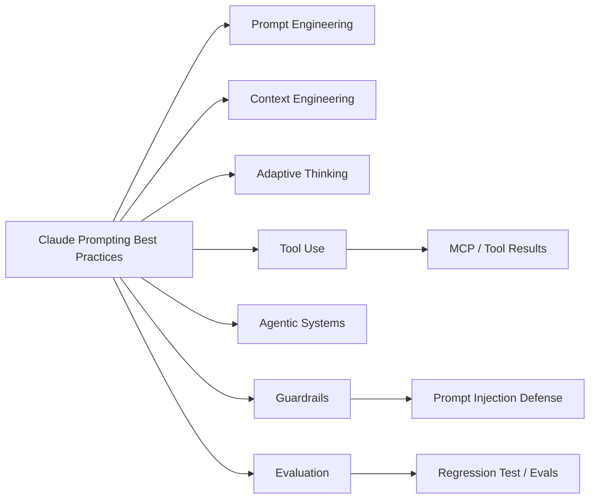

# Claude Prompting Best Practices - 생태계

> [[01-overview|이전: 개요]] | [[README|목차로 돌아가기]] | [[03-references|다음: 참고자료]]

---

## 1. 관련 기술 맵

Claude prompting은 단독 기술이라기보다 Claude API, Claude Code, MCP, RAG, agent framework, evaluation pipeline을 연결하는 interface design discipline에 가깝다.

---

## 2. 경쟁/대안 비교

| 항목 | Claude / Anthropic | OpenAI GPT 계열 | Google Gemini | 공통 리스크/보완 |
|---|---|---|---|---|
| Prompt style | XML tags, explicit role, examples, long-context ordering, adaptive thinking, agentic workflow 지침이 강함 | role/instructions/examples/context 구조, few-shot, structured outputs, tool/function calling 중심 | clear and specific instructions, examples, constraints, multimodal prompting 중심 | 모두 명확한 instruction, examples, context 제공이 기본 |
| Reasoning 제어 | `adaptive thinking`, `effort`, interleaved thinking, long-horizon agent workflow 강조 | GPT 계열은 precise instructions, workflow, tool-use examples, testing 강조 | Gemini는 clear task, input, constraints, multimodal reasoning 강조 | reasoning이 길수록 latency/cost 증가 |
| Output consistency | XML/JSON/custom template, Structured Outputs 권장. prefill은 최신 일부 모델에서 미지원 가능 | Structured Outputs, JSON schema, prompt caching, Responses API | response schema, structured generation, examples | schema validation은 prompt만으로 보장하지 말고 API 기능 사용 |
| Agent/tool use | tool results를 trust boundary로 취급. parallel tool calling, MCP/Claude Code 맥락과 결합 | Agents SDK, function calling, tools, guardrails | Gemini tools/function calling, Google ecosystem 연동 | prompt injection, excessive agency, data leakage가 핵심 보안 이슈 |
| Security | direct/indirect prompt injection mitigation을 구체적으로 제시 | guardrails, safety checks, structured tool workflows | safety filters, grounding, tool controls | OWASP LLM01:2025는 prompt injection을 최상위 LLM risk로 분류 |

---

## 3. Claude prompting이 강한 상황

| 상황 | 적합도 | 이유 |
|------|--------|------|
| 긴 문서 기반 분석 | 높음 | source material과 query ordering, XML structuring이 잘 맞음 |
| 업무 규칙 기반 분류 | 높음 | examples와 output schema로 consistency 확보 가능 |
| Agentic coding workflow | 높음 | role, tool policy, task decomposition, validation loop 설계 가능 |
| 단순 Q&A | 중간 | 구조화가 과하면 prompt overhead가 커질 수 있음 |
| 엄격한 schema API | 중간 | prompt와 별개로 API-level structured output/validator 필요 |
| 보안 민감 tool workflow | 높음 | trust boundary, least privilege, injection defense prompt가 중요 |

---

## 4. 함께 쓰는 도구와 계층

| 도구/계층 | 역할 | Claude prompting과의 연결 |
|-----------|------|---------------------------|
| Claude API | message, system prompt, thinking, tools 실행 | system/user/tool result 구조를 prompt design에 반영 |
| Claude Code | repo 작업 agent | task brief, verification criteria, edit boundary를 명확히 작성 |
| MCP | tool/data/context integration | untrusted tool result와 trusted instruction을 분리 |
| RAG/vector search | private knowledge retrieval | retrieved document를 `<documents>`로 감싸고 citation rule 적용 |
| LiteLLM | provider routing/gateway | provider별 prompt style과 structured output 차이를 관리 |
| Evaluation harness | regression test | prompt change가 output quality를 개선했는지 측정 |
| JSON Schema validator | output validation | prompt가 아니라 validator로 형식 보장 |

---

## 5. Prompt pattern 비교

| Pattern | Claude에서의 사용 | 주의점 |
|---------|------------------|--------|
| XML tags | instruction/data/example 분리에 적극 사용 | tag 이름을 일관되게 유지 |
| Few-shot examples | format과 판단 기준 고정 | 너무 유사한 예시만 넣으면 edge case에 약함 |
| Chain-of-thought 요구 | 최신 문서에서는 API thinking/effort 사용을 우선 고려 | 내부 reasoning을 그대로 요구하지 말고 최종 rationale을 제한 |
| Prefill | 일부 이전 모델에서 format steering에 사용 | 최신 일부 모델에서 미지원 가능하므로 문서 확인 |
| Self-check | hallucination과 schema 오류 감소에 도움 | self-check 결과를 맹신하지 말고 external validation 병행 |
| Tool policy | agent workflow 안정화 | tool result는 instruction이 아니라 data로 취급 |

---

## 6. 보안/운영 트렌드

| 흐름 | 의미 |
|------|------|
| Prompt engineering -> Context engineering | prompt text보다 어떤 context를 어떤 순서로 넣는지가 중요 |
| Single-turn -> Agentic workflow | planning, tool use, verification, rollback 기준이 prompt에 포함 |
| Manual reasoning prompt -> Adaptive thinking | 모델별 reasoning option과 effort control 사용 |
| Best effort answer -> Grounded answer | quote, citation, source restriction으로 factuality 관리 |
| Ad hoc safety -> Injection defense | untrusted content boundary, least privilege, red-team test 필요 |

---

## 관련 노트

- [[study/tech/ai/claude]] - Claude 모델, Claude Code, MCP 연결
- [[study/tech/ai/codex]] - OpenAI/Codex 계열 coding agent 지침과 비교
- [[study/tech/ai/litellm]] - provider별 prompt/eval 차이를 운영하는 gateway
- [[study/tech/ai/model-context-protocol-mcp]] - tool use와 trust boundary의 protocol layer

---

## 다음 단계

> [!tip] 다음으로
> [[03-references|참고자료]]에서 Anthropic 공식 prompt, adaptive thinking, hallucination, jailbreak mitigation 문서를 읽는다.
