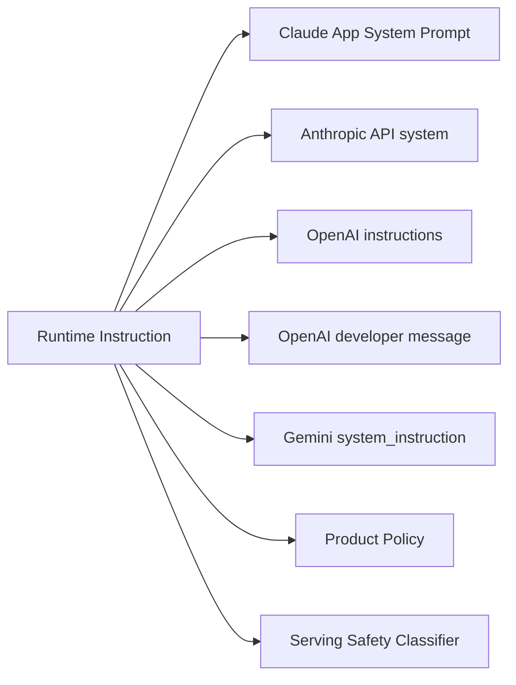

# Claude System Prompts Release Notes - 생태계

> [[01-overview|이전: 개요]] | [[README|목차로 돌아가기]] | [[03-references|다음: 참고자료]]

---

## 1. Instruction primitive 맵



핵심은 각 provider가 "모델에게 무엇을 더 높은 우선순위로 말할 수 있는가"를 서로 다른 primitive로 제공한다는 점이다. Claude release notes는 이 중 **Claude consumer app의 core system prompt**를 공개한다는 점에서 특이하다.

## 2. 경쟁/대안 비교

| 구분 | Claude / Anthropic | OpenAI | Google Gemini |
|---|---|---|---|
| 공개 범위 | `claude.ai`/모바일 core system prompt release notes 공개. API에는 적용 안 됨 | API에서 `instructions`, `developer` role, Model Spec로 authority hierarchy 설명 | `systemInstruction` / `system_instruction`으로 behavior guide |
| API instruction primitive | Messages API의 `system` parameter, Opus 4.8부터 mid-conversation system messages | Responses API `instructions`, `developer` messages가 user보다 우선 | `GenerateContentConfig.system_instruction` |
| Versioning | 4.6+ model ID는 pinned snapshot | prompt는 code-managed 권장, reusable prompt objects deprecation 예정 | model별 `generateContent` config 중심 |
| Strength | system prompt transparency, model snapshot semantics 명확 | authority hierarchy와 production prompt versioning guidance 강함 | SDK/REST에서 단순한 config interface |
| Risk | 앱 prompt와 API behavior 혼동, prompt leak, hidden serving changes | instruction hierarchy 복잡성, prompt lifecycle 관리 필요 | systemInstruction이 단순하지만 governance/변경 로그 투명성은 상대적으로 약함 |
| 관련 공식 근거 | System prompts, model IDs, Opus 4.8 docs | Text generation guide | Gemini text generation docs |

## 3. Claude / Anthropic

Anthropic 쪽에서 구분해야 할 계층은 세 가지다.

| 계층 | 설명 | 운영상 의미 |
|------|------|-------------|
| Claude app prompt | `claude.ai`/mobile core system prompt | 공개 release notes로 변화 추적 가능 |
| API `system` parameter | developer가 직접 지정하는 role/context | application code와 eval로 versioning 필요 |
| Serving safety | classifier, router, sampling 등 | model ID가 고정되어도 관측 behavior 변경 가능 |

API 사용자는 다음처럼 application-specific system instruction을 직접 제공해야 한다.

```json
{
  "model": "claude-sonnet-4-6",
  "max_tokens": 1024,
  "system": "You are a careful coding assistant. Ask clarifying questions only when blocked.",
  "messages": [
    {
      "role": "user",
      "content": "Review this patch for behavioral regressions."
    }
  ]
}
```

## 4. OpenAI

OpenAI는 Responses API에서 `instructions`가 `input` prompt보다 우선하고, `developer` message가 user message보다 우선한다는 authority hierarchy를 문서화한다. 또한 production prompt는 reusable prompt object보다 application code에 두고 tests/evals/deployment process로 관리하라고 권장한다.

```json
{
  "model": "gpt-5",
  "instructions": "You are a concise technical assistant.",
  "input": "Explain system prompt governance."
}
```

OpenAI 방식의 강점은 instruction hierarchy가 API primitive로 비교적 명확하다는 점이다. 반대로 production prompt lifecycle을 application code, eval, deployment와 함께 관리해야 하므로 운영 규율이 필요하다.

## 5. Google Gemini

Gemini는 `GenerateContentConfig.system_instruction` 또는 SDK별 `system_instruction`으로 모델 행동을 guide한다.

```python
from google import genai
from google.genai import types

client = genai.Client()

response = client.models.generate_content(
    model="gemini-2.5-pro",
    config=types.GenerateContentConfig(
        system_instruction="You are a precise Korean technical note writer."
    ),
    contents="Compare Claude and OpenAI system instructions.",
)
```

Gemini의 장점은 config interface가 단순하다는 점이다. 다만 Claude app prompt release notes처럼 consumer product prompt 변경 로그를 투명하게 추적하는 구조는 상대적으로 약하다.

## 6. 선택 기준

| 상황 | 더 중요한 기준 |
|------|----------------|
| 웹 Claude behavior를 연구 | Anthropic System Prompts release notes |
| API app을 production 운영 | provider별 `system`/`instructions`/`system_instruction` code versioning |
| model snapshot 재현성 필요 | Claude model IDs and versioning semantics |
| prompt leak 우려 | proprietary detail 최소화, redaction, audits |
| multi-provider gateway | [[study/tech/ai/litellm]] 같은 routing layer에서 prompt policy 분리 |
| agent tool runtime | [[study/tech/ai/model-context-protocol-mcp]]와 system prompt boundary 함께 설계 |

## 7. 트렌드

- **Prompt as policy**: system prompt가 product policy와 UX convention을 담는다.
- **Prompt as release artifact**: prompt 변경도 release note, diff, eval, rollback 대상이 된다.
- **Snapshot clarity**: model ID가 alias인지 pinned snapshot인지가 재현성 논의의 출발점이다.
- **Serving-aware eval**: model weights뿐 아니라 router/classifier/sampling 변화를 감안해야 한다.
- **Leak-resilient design**: system prompt를 비밀 저장소로 취급하는 설계는 취약하다.

---

## 관련 노트

- [[study/tech/ai/ai-ecosystem/01-overview]] - provider별 AI platform 비교 맥락
- [[study/tech/ai/litellm]] - multi-provider instruction/routing 정책 관리
- [[study/tech/ai/model-context-protocol-mcp]] - tool/resource context와 instruction 계층 비교

## 다음 단계

> [!tip] 다음으로
> [[03-references|참고자료]]에서 Anthropic 공식 문서와 OpenAI/Gemini instruction guide를 확인한다.
