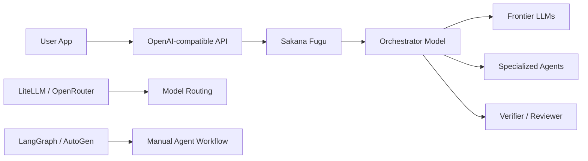

# Sakana Fugu - 생태계

> [[01-overview|이전: 개요]] | [[README|목차로 돌아가기]] | [[03-references|다음: 참고자료]]

---

## 1. 포지셔닝

Fugu는 LLM provider, router, agent framework 사이의 경계에 있다. 가장 가까운 정의는 **managed multi-agent model API**다.



Fugu가 파는 것은 특정 single model endpoint라기보다 **orchestration decision**이다. 사용자는 route, role, topology를 직접 작성하지 않고 결과와 비용을 평가한다.

---

## 2. 경쟁/대안 비교

| 접근 | 대표 | 핵심 차이 | 장점 | 리스크/한계 |
|---|---|---|---|---|
| Managed multi-agent model API | **Sakana Fugu** | orchestration 자체를 모델/API로 상품화 | 기존 API에 꽂기 쉬움, agent routing 자동화 | 내부 모델/route 비공개, vendor 신뢰 필요 |
| Single frontier model | GPT, Claude, Gemini 등 | 한 모델에 reasoning/tool-use 집중 | latency/디버깅 단순, provider docs 성숙 | domain별 약점, vendor lock-in |
| Model marketplace/router | OpenRouter, custom router | 여러 model endpoint를 사용자가 라우팅 | provider 선택권, 비용 최적화 | multi-agent workflow는 직접 설계 필요 |
| LLM router research | RouteLLM | strong/weak model 선택 최적화 | 비용 절감에 명확 | Fugu식 multi-turn 역할 조율은 제한적 |
| Multi-agent composition | Mixture-of-Agents | 여러 LLM 출력을 layer로 결합 | open-source 모델 조합 가능성 | token/call 비용 증가, workflow 고정성 |
| MAS routing | MASRouter | collaboration mode, role, LLM routing 학습 | multi-agent 비용 절감 지향 | 제품 API라기보다 research/framework 성격 |
| Agent frameworks | AutoGen, LangGraph | 개발자가 graph/conversation 직접 설계 | 제어성, tool integration | orchestration 품질, 평가, 보안 책임이 사용자에게 있음 |

---

## 3. Fugu와 router의 차이

model router는 보통 request를 보고 "cheap model vs strong model" 또는 "provider A vs provider B"를 고른다. Fugu는 여기에서 한 단계 더 나아가 task를 여러 agentic step으로 나누고 verifier나 specialist를 붙일 수 있다는 점이 다르다.

| 비교 축 | 일반 router | Fugu |
|---------|-------------|------|
| 기본 단위 | request routing | multi-agent orchestration |
| 결정 | model/provider 선택 | model, role, workflow, coordination |
| 목표 | 비용 절감, fallback, availability | 복잡한 task 품질과 cost-performance |
| 관찰성 | route log를 직접 남기기 쉬움 | 내부 route 비공개 |
| 구현 책임 | 사용자가 routing policy 설계 | service가 orchestration 제공 |

[[study/tech/ai/litellm]]은 provider gateway, key management, budget tracking, fallback에 강하다. 반면 Fugu는 여러 expert agent를 어떻게 조합할지에 대한 decision layer를 managed API로 제공한다.

---

## 4. Fugu와 agent framework의 차이

AutoGen이나 LangGraph는 직접 agent graph를 구성하는 도구다. planner, coder, reviewer, executor, memory, tool permission, retry policy를 개발자가 소유한다.

| 비교 축 | AutoGen/LangGraph | Fugu |
|---------|-------------------|------|
| 제어성 | 높음 | 낮음-중간 |
| 구현 속도 | workflow 설계 필요 | API 교체로 시작 가능 |
| 디버깅 | agent state와 logs를 직접 남김 | route 내부가 제한적으로 보임 |
| 보안 | tool permission과 data boundary를 직접 설계 | provider/model opt-out 등 managed option 활용 |
| 품질 개선 | prompt/graph/retry를 직접 튜닝 | provider orchestration 개선에 의존 |

직접 agent pipeline을 만들면 governance와 reproducibility가 좋아질 수 있지만, orchestration 품질을 계속 개선해야 한다. Fugu는 이 부담을 줄이는 대신 내부 동작을 신뢰해야 한다.

---

## 5. 선택 기준

| 상황 | Fugu 적합도 | 이유 |
|------|-------------|------|
| PR review, bug fix, code migration처럼 검증 step이 많은 task | 높음 | planner/worker/verifier 조합의 이점이 큼 |
| 논문 재현, patent landscape, scientific reasoning | 높음 | 여러 specialist와 cross-check가 필요 |
| 매우 낮은 latency의 단순 chat completion | 낮음 | single model이 더 단순하고 빠를 수 있음 |
| route 감사와 provider별 사용 내역이 필수 | 중간-낮음 | 내부 route 비공개가 리스크 |
| 특정 provider 금지 등 compliance 요구가 있음 | 중간 | 일반 Fugu opt-out으로 실험 가능, Ultra는 agent pool 고정 |
| 자체 agent graph를 이미 운영 중 | 중간 | Fugu를 benchmark baseline 또는 fallback으로 비교 |

---

## 6. 도입 아키텍처 예시

### A. Fugu as primary model

```text
App / Coding Harness
  -> Fugu OpenAI-compatible endpoint
  -> Result evaluator
  -> Human review
```

단순 전환이 가능하지만 route 관찰성이 낮다. 초기 검증에는 같은 prompt set을 single frontier model과 나란히 비교한다.

### B. Fugu as high-difficulty fallback

```text
Request
  -> cheap/single model first pass
  -> confidence or test failure
  -> Fugu Ultra for hard cases
  -> verifier/test suite
```

비용을 아끼면서 어려운 case에만 orchestration을 쓰는 방식이다.

### C. Fugu vs manual agents benchmark

```text
Task Suite
  -> Fugu
  -> Claude/GPT/Gemini single model
  -> LangGraph planner-worker-verifier
  -> Same evaluator
```

enterprise procurement나 model policy 수립에 적합하다.

---

## 관련 노트

- [[study/tech/ai/litellm]] - Fugu 앞뒤에 둘 수 있는 provider gateway/budget layer
- [[study/tech/ai/multi-agent-platforms/autogen]] - manual multi-agent framework 비교 대상
- [[study/tech/ai/model-context-protocol-mcp]] - agent tool/context integration layer

---

## 다음 단계

> [!tip] 다음으로
> [[03-references|참고자료]]에서 Fugu 공식 페이지, technical report, TRINITY, Conductor, RouteLLM, Mixture-of-Agents, MASRouter를 확인한다.
