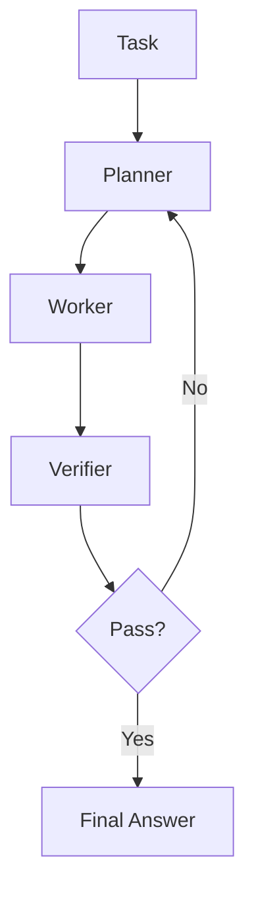

# Fugu 심화

> [[01-getting-started|이전: 시작하기]] | [[../README|목차로 돌아가기]] | [[../05-projects|다음: 프로젝트]]

---

## 1. 핵심 질문

Fugu를 심화 학습할 때의 질문은 다음과 같다.

- orchestration을 API로 살 때 무엇을 얻고 무엇을 잃는가?
- Fugu의 품질 향상이 단순 strong model 호출보다 충분히 큰가?
- 내부 route 비공개 상황에서 enterprise governance를 어떻게 설계할 것인가?
- manual agents를 직접 만드는 비용과 Fugu 사용 비용 중 어느 쪽이 낮은가?

---

## 2. TRINITY 관점

TRINITY는 Fugu를 이해하는 데 필요한 "coordinator + expert models" 사고방식을 제공한다.

| 구성 | 의미 |
|------|------|
| Thinker | 문제 분해, 전략 수립 |
| Worker | 실제 subtask 수행 |
| Verifier | 답 검증, 오류 탐지, 재시도 판단 |
| Compact coordinator | 어떤 role과 model을 언제 쓸지 결정 |
| sep-CMA-ES | coordination policy를 black-box optimization으로 개선 |

Fugu 자체의 내부 구현이 TRINITY와 동일하다고 단정할 수는 없다. 하지만 product claim을 해석할 때 "큰 모델 하나가 답한다"가 아니라 "coordinator가 여러 expert call을 배치한다"는 관점이 유용하다.

```text
Task
  -> Thinker: decompose
  -> Worker A: implement
  -> Worker B: reason or search
  -> Verifier: check
  -> Coordinator: decide stop/retry/switch
```

---

## 3. Conductor 관점

Conductor는 orchestration을 natural-language workflow generation으로 본다. 7B Conductor가 worker model별 subtask, access list, communication topology를 생성하고 RL/GRPO로 개선된다.

| 개념 | 설명 |
|------|------|
| Natural-language workflow | agent에게 실행 가능한 작업 절차를 언어로 생성 |
| Worker access list | 어떤 agent가 어떤 정보/도구에 접근할 수 있는지 제한 |
| Communication topology | agent들이 순차, 병렬, recursive 형태로 대화/검증하는 구조 |
| Randomized agent pool | 다양한 worker 조합에 대해 robust한 orchestration 학습 |
| Test-time scaling | 어려운 문제에서 더 많은 agent/call을 쓰는 품질 우선 전략 |

Fugu Ultra는 더 많은 expert agents를 동원하는 품질 우선 모델로 설명되므로, Conductor의 test-time scaling 관점과 잘 맞는다.

---

## 4. Manual planner-worker-verifier와 비교

Fugu 도입 여부는 직접 만든 agent pipeline과 비교해야 명확해진다.



### LangGraph/AutoGen baseline

```python
# Pseudocode: manual agent pipeline
def solve(task):
    plan = planner.invoke(task)
    draft = worker.invoke({"task": task, "plan": plan})
    review = verifier.invoke({"task": task, "draft": draft})

    if review["passed"]:
        return draft

    revised = worker.invoke(
        {"task": task, "plan": plan, "review": review}
    )
    return verifier.finalize(revised)
```

### 비교표

| 항목 | Fugu | Manual agents |
|------|------|---------------|
| 시작 속도 | 빠름. API 교체 중심 | 느림. graph와 prompts 설계 필요 |
| 관찰성 | 제한적 | 높음. agent별 log 가능 |
| 튜닝 | provider 개선에 의존 | 직접 prompt, topology, retry 튜닝 |
| 보안 | opt-out 등 managed option | tool permission, data policy 직접 구현 |
| 비용 관리 | request-level 관찰 중심 | call-level budget control 가능 |
| 재현성 | 내부 변경 영향 가능 | versioned graph/prompt로 통제 가능 |

---

## 5. 평가 설계

### 동일 task suite

```text
task_suite/
├── code_review.jsonl
├── bug_fix.jsonl
├── paper_reproduction.jsonl
├── patent_landscape.jsonl
└── security_assessment.jsonl
```

각 row에는 최소한 다음 필드를 둔다.

| 필드 | 설명 |
|------|------|
| `task_id` | stable identifier |
| `input` | prompt, diff, document, scope |
| `expected_signals` | 반드시 찾아야 하는 issue/fact |
| `forbidden_failures` | hallucination, unsafe step, policy violation |
| `evaluator` | test command, rubric, reviewer |

### 평가 지표

| 지표 | 해석 |
|------|------|
| Success rate | task를 실제로 해결했는가 |
| Critical finding recall | 중요한 bug/claim을 놓치지 않았는가 |
| False positive rate | 쓸모없는 지적이나 없는 사실을 만들지 않았는가 |
| Cost per success | 성공 1건당 비용 |
| Latency p50/p95 | interactive workflow에 적합한가 |
| Escalation value | single model 실패 case에서 Fugu가 회복하는가 |

---

## 6. 운영 패턴

### Hard-case escalator

```text
Single model
  -> low confidence / failing tests / high severity task
  -> Fugu Ultra
  -> deterministic verifier
```

단순 task는 single model로 처리하고, 실패하거나 위험도가 높은 case만 Fugu Ultra로 보낸다.

### Independent reviewer

```text
Primary model output
  -> Fugu review
  -> static analyzer / tests
  -> human approval
```

Fugu를 primary generator가 아니라 independent reviewer로 쓰면 hallucination과 과도한 비용을 줄일 수 있다.

### Procurement benchmark

```text
Fugu vs GPT/Claude/Gemini vs manual LangGraph
  -> same task suite
  -> same evaluator
  -> cost/latency/quality dashboard
```

조직의 model policy를 정할 때는 vendor claim보다 사내 task suite 결과가 더 중요하다.

---

## 7. 리스크 관리

| 리스크 | 대응 |
|--------|------|
| 내부 route 비공개 | request-level logs, output verification, vendor documentation 보관 |
| cost spike | budget cap, hard-case escalation, sampling limit |
| latency 증가 | Fugu와 Ultra를 분리해 routing, async workflow 사용 |
| compliance 불확실성 | provider/model opt-out test, data classification policy |
| benchmark overfitting | 사내 private task suite와 human review 유지 |

---

## 관련 노트

- [[study/tech/ai/agent-orchestration/conductor]] - Conductor식 workflow orchestration 이해
- [[study/tech/ai/multi-agent-platforms/autogen]] - manual multi-agent baseline 구현
- [[study/tech/ai/agent-orchestration/cli-agents]] - coding agent orchestration 운영 패턴
