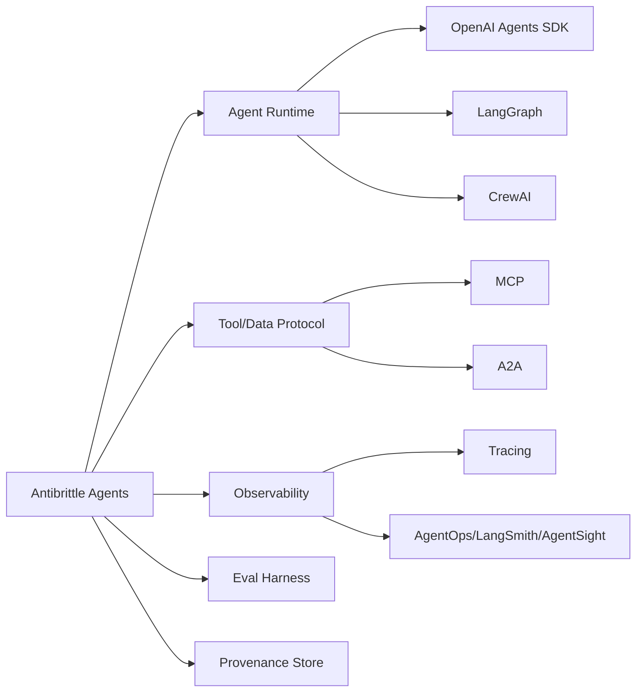

# Antibrittle Agents - 생태계

> [[01-overview|이전: 개요]] | [[README|목차로 돌아가기]] | [[03-references|다음: 참고자료]]

---

## 1. 위치 잡기

Antibrittle Agents는 하나의 SDK가 아니라 **agent reliability architecture lens**다. 따라서 구현은 runtime, protocol, observability, eval harness, provenance store를 조합한다.



---

## 2. 접근/도구 비교

| 접근/도구 | 초점 | Antibrittle 관점에서의 장점 | 한계/주의 |
|---|---|---|---|
| **Southbridge Antibrittle Agents / Strandweave 예정** | long-horizon runtime, run boxes, trenches, receipts | agent brittleness를 architecture 문제로 다룸 | Strandweave runtime은 글 기준 "곧 공개 예정"이라 검증 가능한 공개 생태계는 제한적 |
| **OpenAI Agents SDK** | agent loop, tools, handoffs, guardrails, sessions, tracing | 적은 primitive와 built-in tracing이 run boxes/receipts 구현에 적합 | framework가 모든 reliability policy를 대신 설계해주지는 않음 |
| **LangGraph** | long-running stateful agent orchestration | persistence, human-in-the-loop, fault tolerance, time travel이 trenches와 잘 맞음 | low-level framework라 설계 책임이 개발자에게 큼 |
| **CrewAI** | Crews + Flows 기반 multi-agent workflow | Flow로 control/state를 잡고 Crew로 autonomy를 분리 가능 | 무분별한 multi-agent 구성은 Southbridge가 지적한 communication cost를 키울 수 있음 |
| **MCP** | agent-to-tool/data protocol | tool integration 표준화, receipts용 data/tool access layer 구성에 유용 | tool poisoning, auth, permission, supply-chain risk 관리 필요 |
| **A2A Protocol** | agent-to-agent communication | 서로 다른 framework agent 간 delegation/discovery 표준화 | Antibrittle의 핵심인 내부 state discipline과 reliability metric은 별도 설계 필요 |
| **LangSmith / AgentOps / AgentSight류 observability** | traces, evals, runtime behavior visibility | receipts, behavior tracing, failure analysis에 필수 | dashboard만으로는 context boundary나 recovery strategy가 생기지 않음 |

---

## 3. 계층별 선택 기준

| 계층 | 선택 질문 | 후보 |
|------|-----------|------|
| Runtime | stateful loop, handoff, retry, human-in-the-loop이 필요한가? | OpenAI Agents SDK, LangGraph, CrewAI |
| Tool integration | 외부 system/tool을 여러 host에서 재사용해야 하는가? | MCP, OpenAPI wrapper, custom tools |
| Agent communication | 서로 다른 agent/framework 간 delegation이 필요한가? | A2A, queue, workflow engine |
| Observability | trajectory, cost, latency, tool result, decision을 추적하는가? | tracing, LangSmith, AgentOps, AgentSight |
| Reliability eval | 같은 task를 perturbation해 반복 측정하는가? | custom harness, CI eval, scenario tests |
| Provenance | 최종 결론에서 source/tool/script로 역추적 가능한가? | receipt store, artifact directory, database |

---

## 4. Southbridge 관점에서의 평가

### OpenAI Agents SDK

OpenAI Agents SDK는 agent loop, tools, handoffs, guardrails, sessions, tracing 같은 primitive를 제공한다. Antibrittle 관점에서는 **적은 primitive**와 **tracing**이 강점이다.

```python
# conceptual skeleton
trace = {
    "task_id": "research-001",
    "loop": 17,
    "tool": "fetch_url",
    "latency_ms": 820,
    "receipt_id": "source:southbridge-antibrittle",
    "state_size_tokens": 6400
}
```

주의할 점은 SDK가 reliability policy 자체를 대신 설계하지 않는다는 것이다. run box metric, choke point, receipt schema는 application이 정해야 한다.

### LangGraph

LangGraph는 persistence, human-in-the-loop, fault tolerance, time travel 같은 long-running stateful orchestration에 강하다. `node`, `edge`, `checkpoint` 구조는 trenches를 만들기 좋다.

| Antibrittle 개념 | LangGraph로 구현하는 방식 |
|------------------|---------------------------|
| Trenches | node boundary, typed state |
| Human interruption | interrupt / approval node |
| Receipts | state artifact, checkpoint, trace |
| Recovery | checkpoint resume, time travel |

### CrewAI

CrewAI는 Crew의 autonomous collaboration과 Flow의 deterministic control을 조합한다. Antibrittle하게 쓰려면 Crew를 무제한 fanout으로 쓰기보다, Flow로 state boundary와 choke point를 잡고 Crew는 특정 exploration region에 제한하는 편이 낫다.

### MCP와 A2A

MCP는 tool/data integration, A2A는 agent-to-agent communication에 가깝다. 둘 다 Antibrittle Agents의 기반이 될 수 있지만, 둘 자체가 reliability architecture는 아니다.

```text
MCP: agent -> tool/data/resource
A2A: agent -> agent/delegation
Antibrittle: loop state, boundary, receipts, metrics, recovery
```

---

## 5. 도입 전략

| 상황 | 추천 접근 |
|------|-----------|
| 기존 single-agent script가 자주 실패 | 먼저 trace와 receipt를 붙이고 run box metric을 만든다. |
| multi-agent workflow가 복잡해짐 | fanout을 줄이고 Flow/graph boundary를 명확히 한다. |
| tool이 너무 많음 | core tool 3~5개로 줄여 context pollution과 failure mode를 측정한다. |
| 사람이 매번 확인해야 함 | 모든 step 승인이 아니라 interruption point를 signal 기반으로 설계한다. |
| 결과 검증이 어려움 | final answer가 아니라 trajectory와 receipt coverage를 audit한다. |

---

## 관련 노트

- [[study/tech/ai/model-context-protocol-mcp]] - MCP tool/data protocol
- [[study/tech/ai/langchain-crewai]] - LangChain/CrewAI ecosystem
- [[study/tech/ai/multi-agent-platforms]] - multi-agent platform 비교
- [[study/tech/ai/ai-ecosystem/01-overview]] - AI ecosystem 큰 그림

## 다음 단계

> [!tip] 다음으로
> [[03-references|참고자료]]에서 원문과 reliability/observability 논문을 확인한다.
