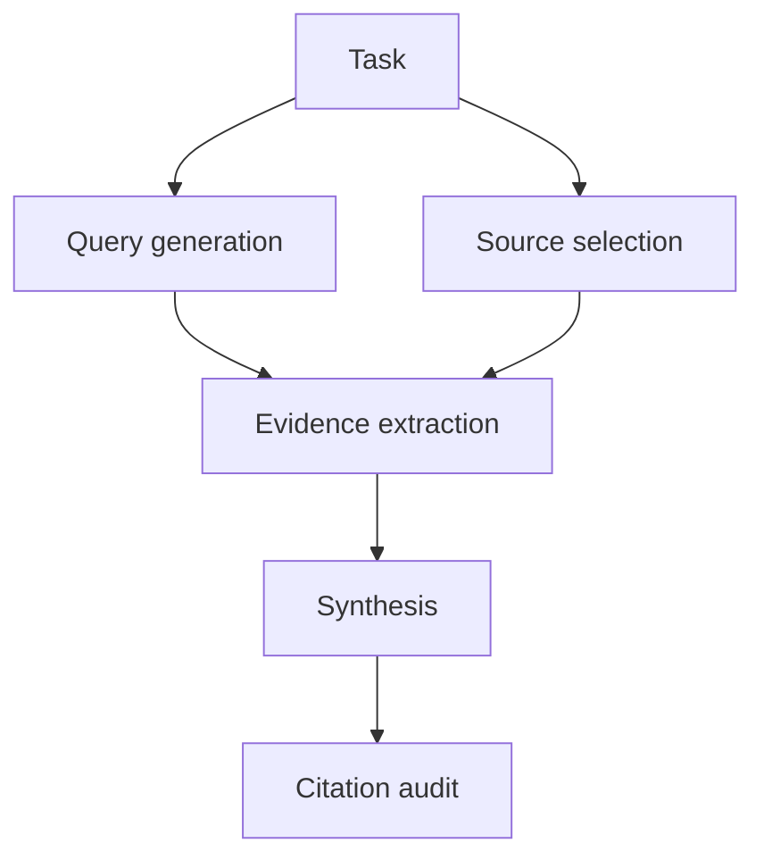

# Antibrittle Agents - 시작하기

> [[../03-references|이전: 참고자료]] | [[../README|목차로 돌아가기]] | [[02-deep-dive|다음: 심화]]

---

## 목표

작은 agent loop를 대상으로 **trace**, **run box metric**, **receipt**를 남기는 최소 실습을 한다. 프레임워크보다 먼저 관찰 가능한 loop를 만드는 것이 핵심이다.

```text
Task
  -> plan
  -> tool call
  -> observation
  -> decision
  -> receipt
  -> next loop
```

---

## 1. Agent loop를 기록하기

최소 trace schema를 먼저 정한다.

| 필드 | 설명 | 예시 |
|------|------|------|
| `task_id` | 작업 식별자 | `research-001` |
| `loop_index` | agentic loop 번호 | `7` |
| `goal` | 현재 subgoal | `find primary sources` |
| `tool_name` | 사용 tool | `fetch_url` |
| `tool_status` | success/error/timeout | `success` |
| `latency_ms` | tool 또는 model latency | `930` |
| `cost_estimate` | 비용 추정 | `0.014` |
| `state_size` | context/state 크기 | `8200 tokens` |
| `receipt_id` | source/script/tool result ID | `source:openai-agents-docs` |
| `decision` | 다음 행동 이유 | `source is official docs` |

```json
{
  "task_id": "antibrittle-study-001",
  "loop_index": 3,
  "goal": "compare runtimes",
  "tool_name": "fetch_url",
  "tool_status": "success",
  "latency_ms": 812,
  "state_size_tokens": 5400,
  "receipt_id": "source:langgraph-overview",
  "decision": "LangGraph has persistence and human-in-the-loop primitives"
}
```

---

## 2. TODO가 아니라 subproblem graph로 쪼개기

긴 작업은 TODO list보다 subproblem graph로 나누는 편이 안전하다.

| Domain | Subproblem graph 예시 |
|--------|------------------------|
| Research | query generation -> source selection -> evidence extraction -> synthesis -> citation audit |
| Code maintenance | repo scan -> issue localization -> patch plan -> edit -> test -> rollback point |
| Reconciliation | ingest -> normalize -> compare -> discrepancy classification -> report |



각 node는 trench 후보가 된다. node 사이에는 handoff artifact를 남긴다.

---

## 3. Run box metric 만들기

정답 여부 외에 좋은 행동/나쁜 행동 signal을 정의한다.

| Metric | 측정 방법 | 경고 기준 |
|--------|-----------|-----------|
| Source diversity | unique domain/source count | 1개 source에 과도하게 의존 |
| Repeated failed tool calls | 같은 tool+args 실패 횟수 | 2회 이상 반복 |
| Loop stagnation | 새 artifact 없는 loop 수 | 3 loop 이상 진전 없음 |
| Cost variance | 평균 대비 비용 증가율 | 예상 대비 2배 이상 |
| Context growth | state size 증가율 | boundary 없이 계속 증가 |
| Receipt coverage | claim 중 receipt 연결 비율 | 핵심 claim receipt 누락 |

```yaml
run_box:
  source_diversity_min: 3
  repeated_tool_failure_max: 2
  stagnation_loop_max: 3
  receipt_coverage_min: 0.9
  human_interrupt_on:
    - irreversible_action
    - cost_over_budget
    - low_receipt_coverage
```

---

## 4. Receipts coverage 실습

최종 문장과 근거 artifact를 연결한다.

| Claim | Receipt | 검증 방법 |
|-------|---------|-----------|
| Antibrittle Agents는 agentic loop를 primitive로 본다. | Southbridge 원문 | 원문 claim 확인 |
| MCP는 tool/data protocol layer다. | MCP intro | 공식 문서 확인 |
| LangGraph는 persistence/human-in-the-loop에 강하다. | LangGraph overview | 공식 문서 확인 |

```markdown
### Claim
LangGraph는 trenches 구현에 적합하다.

### Receipt
- source: https://docs.langchain.com/oss/python/langgraph/overview
- observed: persistence, human-in-the-loop, fault tolerance, time travel

### Decision
State boundary와 checkpoint가 필요한 long-running agent에 후보로 둔다.
```

---

## 5. 첫 실습 과제

1. 작은 research task 하나를 정한다.
2. subproblem graph를 4~5개 node로 나눈다.
3. 각 node의 handoff artifact를 정의한다.
4. loop trace JSONL을 남긴다.
5. run box metric을 3개 이상 만든다.
6. 최종 report claim마다 receipt를 연결한다.

```bash
mkdir -p runs/antibrittle-demo/receipts
touch runs/antibrittle-demo/trace.jsonl
touch runs/antibrittle-demo/claims.md
```

---

## 관련 노트

- [[study/tech/ai/lazy-codex/04-learning/02-verified-completion]] - 검증 완료 loop
- [[study/tech/ai/model-context-protocol-mcp/04-learning/01-getting-started]] - tool/resource discovery 실습
- [[study/tech/ai/autoresearch-study]] - research workflow 구조화
