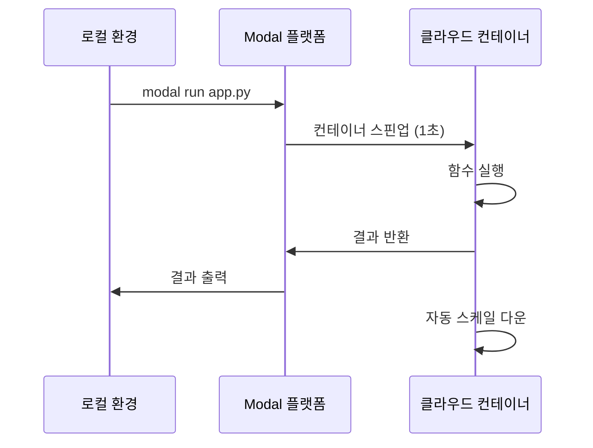

# Modal - 개요

> [[README|목차로 돌아가기]] | [[02-ecosystem|다음: 생태계]]

---

## 1. What - Modal이란?

> **한 줄 정의**: Python 코드를 클라우드에서 서버리스로 실행하는 AI/ML 특화 플랫폼

### 핵심 개념

Modal은 개발자가 인프라를 신경 쓰지 않고 Python 코드를 클라우드에서 실행할 수 있게 해주는 플랫폼입니다.

```python
import modal

app = modal.App("my-app")

# 이 함수는 클라우드에서 실행됩니다
@app.function()
def compute_heavy_task(data):
    return process(data)

# 로컬에서 호출하면 클라우드에서 실행
result = compute_heavy_task.remote(my_data)
```

### 주요 용어

| 용어 | 설명 |
|------|------|
| App | Modal 애플리케이션의 기본 단위 |
| Function | 클라우드에서 실행되는 Python 함수 |
| Image | 함수가 실행될 컨테이너 환경 정의 |
| Volume | 영구 저장소 (모델 가중치, 데이터 등) |
| Secret | 환경 변수, API 키 등 민감 정보 |
| Stub | (레거시) App의 이전 명칭 |

### Modal의 동작 방식



---

## 2. Why - 왜 Modal인가?

### 해결하려는 문제

1. **인프라 복잡성**: 서버 설정, Docker, Kubernetes 등 학습 부담
2. **GPU 접근성**: GPU 서버 구축/관리의 어려움
3. **비용 효율성**: 유휴 시간에도 비용 발생
4. **배포 복잡성**: CI/CD, 환경 설정 등 부가 작업

### 기존 방식의 한계

| 문제 | 기존 방식 | Modal |
|------|----------|-------|
| 서버 관리 | EC2/VM 직접 관리 | 완전 서버리스 |
| GPU 사용 | 복잡한 드라이버 설정 | 데코레이터 한 줄 |
| Cold Start | Lambda 수십 초 | 1초 미만 |
| 설정 파일 | YAML, Dockerfile | Python 코드만 |
| 비용 | 상시 실행 비용 | 실행 시간만 과금 |

---

## 3. 핵심 특징

### 장점

- **초고속 Cold Start**: 1초 만에 컨테이너 시작
- **Zero to Scale**: 요청 없으면 비용 0, 필요시 자동 확장
- **GPU 접근 용이**: T4, A10G, A100, H100, B200 등 다양한 GPU
- **Python Native**: YAML 없이 Python 코드로 모든 설정
- **개발자 경험**: 로컬 개발과 동일한 경험
- **무료 크레딧**: 매달 $30 무료 제공

### 단점

- **Python 전용**: 다른 언어 지원 제한적
- **Vendor Lock-in**: Modal 플랫폼에 종속
- **디버깅**: 클라우드 환경 디버깅 어려움
- **네트워크 의존**: 오프라인 개발 불가
- **학습 곡선**: 새로운 개념 학습 필요 (적지만 있음)

---

## 4. 사용 사례

### 적합한 경우

| 사용 사례 | 설명 |
|----------|------|
| ML 모델 서빙 | LLM, 이미지 생성 모델 API |
| 배치 처리 | 대용량 데이터 병렬 처리 |
| 모델 학습 | GPU 필요한 학습 작업 |
| 웹 스크래핑 | 브라우저 자동화 |
| 이미지/비디오 처리 | FFmpeg, 이미지 변환 |
| Cron 작업 | 주기적 데이터 수집/처리 |

### 실제 활용 예시

```python
# 1. LLM 추론 서비스
@app.function(gpu="A10G")
def generate_text(prompt):
    model = load_llm()
    return model.generate(prompt)

# 2. 이미지 생성 API
@app.function(gpu="A100")
@modal.web_endpoint()
def generate_image(prompt: str):
    return diffusion_model(prompt)

# 3. 병렬 데이터 처리
@app.function()
def process_file(file_path):
    return analyze(file_path)

# 1000개 파일 병렬 처리
results = list(process_file.map(file_list))
```

---

## 5. 가격 정책

### 과금 방식

- **초 단위 과금**: 실행 시간만큼만 지불
- **GPU별 가격**: 사양에 따라 다름
- **무료 크레딧**: 매달 $30

### 주요 가격 (2026년 기준, 변동 가능)

| 리소스 | 대략적 가격 |
|--------|------------|
| CPU (기본) | ~$0.001/초 |
| GPU T4 | ~$0.0003/초 |
| GPU A10G | ~$0.0006/초 |
| GPU A100 (40GB) | ~$0.0025/초 |
| GPU H100 | ~$0.006/초 |

> 최신 가격은 [modal.com/pricing](https://modal.com/pricing) 참조

---

## 다음 단계

> [!tip] 다음으로
> Modal의 개요를 이해했다면 [[02-ecosystem|생태계와 관련 기술]]을 살펴보세요.

---

## References

- [Modal 공식 사이트](https://modal.com)
- [Modal 공식 문서](https://modal.com/docs)
