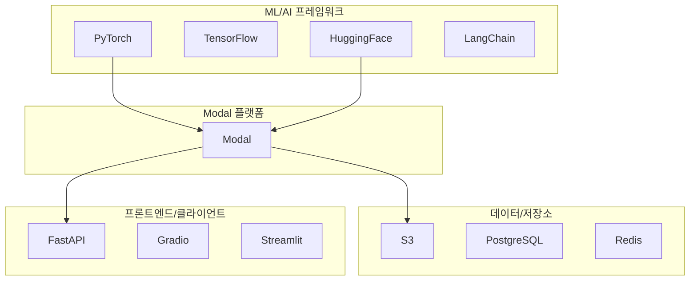
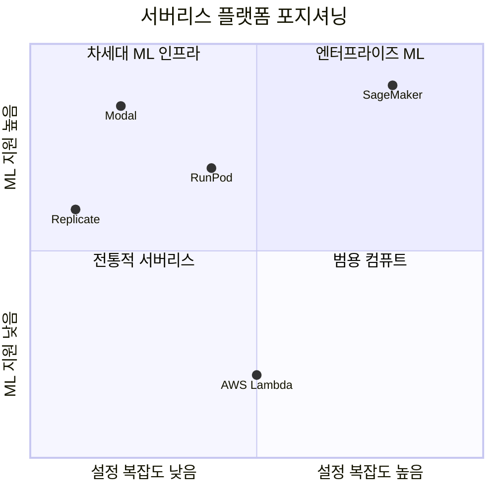

# Modal - 생태계

> [[01-overview|이전: 개요]] | [[README|목차]] | [[03-references|다음: 참고자료]]

---

## 1. 관련 기술 스택

### Modal과 함께 사용되는 기술



### 주요 통합 기술

| 분야 | 기술 | Modal과의 통합 |
|------|------|---------------|
| ML 프레임워크 | PyTorch, TensorFlow | GPU 함수에서 바로 사용 |
| LLM | HuggingFace, vLLM | 모델 서빙에 최적 |
| 웹 프레임워크 | FastAPI, Flask | @modal.asgi_app 데코레이터 |
| UI | Gradio, Streamlit | 웹 엔드포인트로 배포 |
| 데이터 | Pandas, Polars | 병렬 처리에 활용 |
| 이미지 | Pillow, OpenCV | 이미지 처리 작업 |
| 비디오 | FFmpeg | 비디오 인코딩/처리 |

---

## 2. 대안 기술 비교

### 서버리스 플랫폼 비교

| 특성 | Modal | AWS Lambda | Google Cloud Functions | Azure Functions |
|------|-------|------------|----------------------|-----------------|
| **GPU 지원** | 다양한 GPU | 없음 | 없음 | 제한적 |
| **Cold Start** | ~1초 | 수초~수십초 | 수초 | 수초 |
| **설정 방식** | Python 코드 | YAML/콘솔 | YAML/콘솔 | YAML/콘솔 |
| **언어 지원** | Python | 다양 | 다양 | 다양 |
| **ML 특화** | O | X | X | X |
| **무료 티어** | $30/월 | 100만 요청 | 200만 요청 | 100만 요청 |
| **학습 곡선** | 낮음 | 중간 | 중간 | 중간 |

### ML 인프라 비교

| 특성 | Modal | Replicate | RunPod | SageMaker |
|------|-------|-----------|--------|-----------|
| **대상** | 개발자 | 모델 사용자 | GPU 워크로드 | 엔터프라이즈 |
| **커스텀 코드** | 완전 지원 | 제한적 | 완전 지원 | 완전 지원 |
| **설정 복잡도** | 낮음 | 매우 낮음 | 중간 | 높음 |
| **가격** | 초 단위 | 초 단위 | 시간 단위 | 복잡 |
| **스케일링** | 자동 | 자동 | 수동 | 자동 |

### 선택 가이드

```
AI/ML 프로젝트인가?
├── Yes → GPU가 필요한가?
│         ├── Yes → 커스텀 코드가 필요한가?
│         │         ├── Yes → Modal 추천
│         │         └── No  → Replicate 고려
│         └── No  → AWS Lambda/Cloud Functions
└── No  → 일반 서버리스 플랫폼

프로토타입/사이드 프로젝트인가?
├── Yes → Modal (빠른 개발, 무료 크레딧)
└── No  → 요구사항에 따라 선택
```

---

## 3. 기술 트렌드

### 2025-2026 트렌드

1. **AI 네이티브 인프라**
   - LLM 서빙 최적화
   - GPU 자원 효율화
   - 모델 캐싱/프리로딩

2. **개발자 경험 중심**
   - No YAML, No Docker 직접 관리
   - Python 코드만으로 인프라 정의
   - 빠른 이터레이션

3. **비용 효율성**
   - 초 단위 과금
   - Zero to Scale
   - Spot/Preemptible GPU

### Modal의 위치



---

## 4. 생태계 통합 예시

### HuggingFace + Modal

```python
import modal

app = modal.App("huggingface-example")

image = modal.Image.debian_slim().pip_install(
    "transformers", "torch", "accelerate"
)

@app.function(image=image, gpu="T4")
def generate(prompt: str):
    from transformers import pipeline

    pipe = pipeline("text-generation", model="gpt2")
    return pipe(prompt, max_length=100)
```

### FastAPI + Modal

```python
import modal
from fastapi import FastAPI

app = modal.App("fastapi-example")
web_app = FastAPI()

@web_app.get("/hello")
def hello():
    return {"message": "Hello from Modal!"}

@app.function()
@modal.asgi_app()
def fastapi_app():
    return web_app
```

### Gradio + Modal

```python
import modal
import gradio as gr

app = modal.App("gradio-example")

@app.function()
def predict(text):
    return f"입력: {text}"

@app.function()
@modal.web_endpoint()
def gradio_app():
    interface = gr.Interface(fn=predict, inputs="text", outputs="text")
    return interface.launch()
```

---

## 5. 커뮤니티 및 리소스

### 공식 채널

- [Modal 공식 문서](https://modal.com/docs)
- [Modal GitHub](https://github.com/modal-labs)
- [Modal Discord](https://discord.gg/modal)
- [Modal Twitter/X](https://twitter.com/modal_labs)

### 예제 저장소

- [modal-labs/modal-examples](https://github.com/modal-labs/modal-examples)
  - LLM 서빙 예제
  - 이미지 생성 예제
  - 웹 스크래핑 예제
  - 데이터 처리 예제

---

## 다음 단계

> [!tip] 다음으로
> 생태계를 파악했다면 [[03-references|참고자료]]에서 학습 자료를 확인하세요.

---

## References

- [Modal 공식 블로그](https://modal.com/blog)
- [Modal GitHub Examples](https://github.com/modal-labs/modal-examples)
