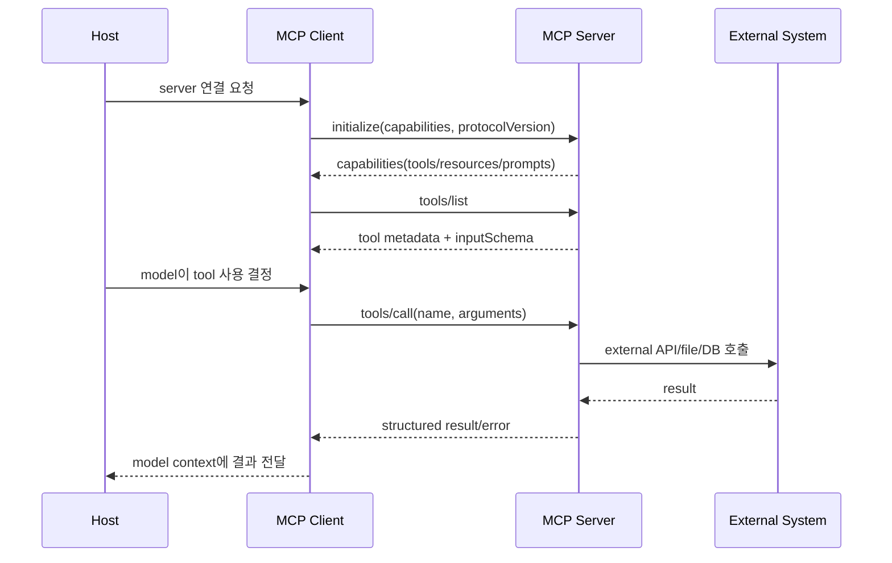

# Model Context Protocol (MCP) - 개요

> [[README|목차로 돌아가기]] | [[02-ecosystem|다음: 생태계]]

---

## 1. What - MCP란?

> **한 줄 정의**: MCP는 LLM/agent host가 외부 data source, tool, prompt, workflow를 표준 JSON-RPC 기반 client-server 방식으로 발견하고 호출하게 해주는 open protocol이다.

### 핵심 개념

MCP는 AI application의 외부 통합을 표준화하는 protocol이다. MCP server는 특정 external system을 감싸서 `tools`, `resources`, `prompts`를 노출하고, host 안의 MCP client가 server와 1:1 stateful session을 맺어 discovery와 invocation을 처리한다.

```text
User
  -> AI Host
      -> MCP Client
          -> MCP Server
              -> External System
```

예를 들어 GitHub MCP server를 만들면 Claude Desktop, Cursor, VS Code, OpenAI Responses API, LangChain, Google ADK 같은 여러 host/client가 같은 server를 재사용할 수 있다.

### 주요 용어

| 용어 | English | 설명 |
|------|---------|------|
| Host | AI application | Claude Desktop, IDE, agent app처럼 사용자가 만나는 AI application |
| Client | MCP client | host 내부 connector. MCP server와 1:1 session을 맺고 routing, negotiation, notification 처리 |
| Server | MCP server | 특정 system에 대한 focused adapter. tools/resources/prompts를 노출 |
| Tool | model-controlled function | 모델이 호출할 수 있는 작업. 예: `tools/list`, `tools/call` |
| Resource | application-driven context | file, DB row, document처럼 읽을 수 있는 context/data |
| Prompt | user-controlled template | 반복 workflow나 slash command처럼 재사용하는 prompt template |
| Roots | filesystem boundary | server가 접근 가능한 client-side filesystem 범위 |
| Sampling | client-mediated generation | server가 client/host를 통해 LLM generation을 요청하는 client feature |
| Elicitation | user input request | server가 사용자에게 추가 입력을 요청하는 client feature |

### 동작 방식



---

## 2. Why - 왜 MCP인가?

### 해결하려는 문제

- AI agent 통합은 서비스마다 connector를 따로 붙이는 `N x M` 문제가 있었다.
- 같은 Slack, GitHub, DB 통합을 Claude, Cursor, VS Code, LangChain, OpenAI API마다 반복 구현해야 했다.
- tool schema, auth, transport, discovery, prompt 재사용, resource access boundary가 host마다 달라 portability가 낮았다.

### 기존 방식의 한계

| 문제 | 기존 방식 | MCP |
|------|----------|-----|
| Connector 중복 | host마다 개별 adapter 구현 | 한 MCP server를 여러 host/client가 재사용 |
| Discovery | tool schema를 app 코드에 직접 등록 | `tools/list`, `resources/list`, `prompts/list`로 표준 discovery |
| Transport | 제품별 SDK/API에 종속 | `stdio`, `Streamable HTTP` 표준 transport |
| Context | function calling 중심 | tools, resources, prompts, roots를 protocol primitive로 제공 |
| Security | host별 권한 모델 | host가 user consent, auth, sampling, roots boundary를 조율 |
| Remote 운영 | local script 중심 | HTTP, OAuth, session, resumability 방향으로 확장 |

---

## 3. 핵심 특징

### Protocol primitives

| 영역 | 기능 | 대표 method |
|------|------|-------------|
| Lifecycle | 초기화, capability negotiation | `initialize`, `notifications/initialized` |
| Tools | callable function discovery/invocation | `tools/list`, `tools/call` |
| Resources | context/data discovery/read | `resources/list`, `resources/read` |
| Prompts | workflow template discovery/read | `prompts/list`, `prompts/get` |
| Client features | roots, sampling, elicitation | `roots/list`, `sampling/createMessage`, `elicitation/create` |
| Utility | pagination, cancellation, progress, logging | cursor, cancel, progress token, log notification |

### Transport

| Transport | 설명 | 적합한 상황 |
|-----------|------|-------------|
| `stdio` | local process와 stdin/stdout으로 JSON-RPC message 교환 | local dev, CLI tool, desktop host integration |
| `Streamable HTTP` | POST/GET, optional SSE streaming, session header, protocol version header | remote MCP, enterprise server, cloud-hosted connector |

HTTP transport는 `MCP-Session-Id`, `MCP-Protocol-Version` header와 resumability를 다룬다. 2025-2026 흐름은 local `stdio` 중심에서 remote MCP, OAuth, registry, enterprise security, long-running task 지원으로 이동 중이다.

### Server features

- **Tools**: model-controlled callable functions. Human-in-the-loop 승인과 명확한 `inputSchema`가 중요하다.
- **Resources**: application-driven context/data. URI, MIME type, pagination, read boundary를 설계해야 한다.
- **Prompts**: user-controlled reusable workflow template. slash command처럼 반복 작업을 표준화한다.

### Client features

- **Roots**: server가 접근 가능한 filesystem boundary를 제한한다.
- **Sampling**: server가 LLM generation을 요청하되 API key와 model choice는 client/host가 통제한다.
- **Elicitation**: server가 사용자 추가 입력을 요청한다. `2025-11-25` spec은 form mode와 URL mode를 지원한다.

### 최신 spec 포인트

현재 dossier 기준 최신 protocol version은 `2025-11-25`이다.

| 변경 포인트 | 의미 |
|-------------|------|
| OIDC discovery | authorization server metadata discovery 강화 |
| OAuth Client ID Metadata Documents | remote MCP client 식별과 metadata 처리 개선 |
| URL mode elicitation | 사용자 입력을 external URL 흐름으로 받을 수 있음 |
| Sampling tool calls | sampling 과정에서 tool call 지원 |
| Experimental tasks | long-running task 지원 방향 |
| Icon metadata | server/tool/resource/prompt UI 표시 개선 |
| JSON Schema 2020-12 | input/output schema 표현력 개선 |

---

## 4. 장점과 한계

### 장점

- **Portability**: 하나의 MCP server를 여러 host에서 재사용할 수 있다.
- **Standard discovery**: tool/resource/prompt 목록과 schema를 protocol로 발견한다.
- **Focused adapter**: server가 특정 system에 집중하므로 책임 경계가 명확하다.
- **Local + remote 확장성**: desktop local script부터 enterprise HTTP service까지 같은 모델로 다룬다.
- **Agent UX primitive**: prompt, resource, elicitation, sampling이 단순 function calling보다 agent workflow에 가깝다.

### 단점/주의점

- **Host별 지원 차이**: spec feature와 실제 host 구현 범위가 다를 수 있다.
- **Security burden**: tool invocation은 external side effect를 만들 수 있어 user consent와 audit가 필요하다.
- **Schema 품질 의존**: tool description과 error가 부실하면 모델이 잘못 호출한다.
- **Remote auth 복잡도**: OAuth, session, network boundary, enterprise policy를 함께 설계해야 한다.
- **Protocol churn**: 2025-2026 구간은 remote MCP와 registry가 빠르게 변하는 중이다.

---

## 5. 사용 사례

| 사용 사례 | 설명 |
|----------|------|
| IDE coding assistant | repo file, issue, test runner, deploy command를 tool/resource로 노출 |
| Internal API adapter | 사내 CRM/ERP/DB API를 MCP server로 감싸 여러 AI host에서 재사용 |
| Knowledge workflow | Obsidian, wiki, document store를 resource/tool/prompt로 노출 |
| RAG gateway | vector DB search를 `search_docs` tool 또는 resource로 제공 |
| Agent operations | long-running workflow를 task로 시작하고 progress/logging notification 제공 |

### 실제 활용 예시

```json
{
  "jsonrpc": "2.0",
  "id": 1,
  "method": "tools/call",
  "params": {
    "name": "search_notes",
    "arguments": {
      "query": "MCP와 A2A 차이",
      "limit": 5
    }
  }
}
```

---

## 관련 노트

- [[study/tech/ai/llm-wiki-study]] - MCP resource/tool로 vault 지식을 노출하는 응용 가능
- [[study/tech/ai/litellm]] - LLM routing layer와 MCP integration layer의 차이 비교
- [[study/tech/ai/agent-orchestration/cli-agents]] - CLI agent가 MCP server를 tool로 쓰는 흐름

---

## References

- [MCP Specification 2025-11-25](https://modelcontextprotocol.io/specification/2025-11-25)
- [MCP Architecture](https://modelcontextprotocol.io/specification/2025-11-25/architecture)
- [MCP Transports](https://modelcontextprotocol.io/specification/2025-11-25/basic/transports)
- [MCP Tools](https://modelcontextprotocol.io/specification/2025-11-25/server/tools)
- [MCP Resources](https://modelcontextprotocol.io/specification/2025-11-25/server/resources)
- [MCP Prompts](https://modelcontextprotocol.io/specification/2025-11-25/server/prompts)
