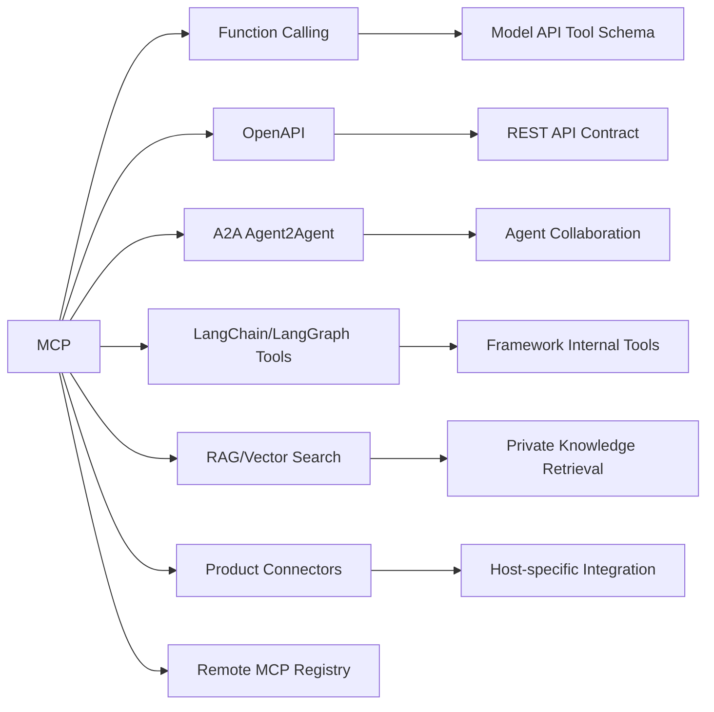

# Model Context Protocol (MCP) - 생태계

> [[01-overview|이전: 개요]] | [[README|목차로 돌아가기]] | [[03-references|다음: 참고자료]]

---

## 1. 관련 기술 맵

MCP는 agent framework나 model provider API 자체가 아니라 **AI application integration layer**에 가깝다. `tool`, `resource`, `prompt`를 표준 protocol로 노출하고 host/client가 이를 발견해 호출하게 만든다.

---

## 2. 경쟁/대안 기술 비교

| 기술 | 주 용도 | MCP와의 차이 | 같이 쓰는 방식 |
|---|---|---|---|
| **MCP** | Agent-to-tool/data/context 표준 | LLM app이 외부 system의 tool/resource/prompt를 discover/call | AI app의 integration layer |
| **Function Calling** | 특정 model API 내부 tool schema 호출 | vendor/API 종속적이고 server discovery/transport 표준은 약함 | MCP server의 tool을 model function/tool로 노출 |
| **OpenAPI** | HTTP REST API description | API 문서/contract 중심, agent context/prompt/session primitive는 없음 | OpenAPI를 MCP server로 wrap |
| **A2A(Agent2Agent)** | agent-to-agent communication/collaboration | MCP는 agent가 tool/data에 연결, A2A는 agent끼리 상호운용 | MCP + A2A를 함께 사용해 agent가 tool도 쓰고 다른 agent와 협업 |
| **LangChain/LangGraph tools** | Python/JS agent framework 내부 tool orchestration | library abstraction이며 protocol 자체는 아님 | `langchain-mcp-adapters`로 MCP server tool을 LangChain agent에 연결 |
| **RAG/vector search** | private knowledge retrieval | retrieval pipeline 자체. MCP는 retrieval source를 표준 resource/tool로 노출 가능 | vector DB 검색을 MCP tool/resource로 제공 |
| **Plugin/Connector systems** | 특정 product 전용 확장 | host별 구현이 달라 portability 낮음 | connector를 MCP server로 재구현해 여러 host에서 재사용 |

---

## 3. 선택 기준

| 상황 | MCP 적합도 | 이유 |
|------|-----------|------|
| 여러 AI host에서 같은 integration을 재사용해야 함 | 높음 | host/client portability가 MCP의 핵심 가치 |
| 단일 OpenAI API 호출에서만 tool schema가 필요함 | 중간 | function calling만으로 충분할 수 있음 |
| REST API contract를 사람이 읽고 client codegen해야 함 | 낮음 | OpenAPI가 더 직접적 |
| agent끼리 task delegation과 negotiation을 해야 함 | 중간 | A2A 쪽이 더 직접적이며 MCP는 tool/data 연결 담당 |
| 사내 DB/document/search를 agent에게 안전하게 노출해야 함 | 높음 | resource/tool boundary와 host consent를 설계할 수 있음 |
| UI 없는 batch integration만 필요함 | 중간 | MCP는 host UX와 discovery가 있을 때 가치가 크다 |

---

## 4. Host/Client 생태계

| 영역 | 예시 | MCP에서의 역할 |
|------|------|----------------|
| Desktop AI app | Claude Desktop | local stdio MCP server 연결, user consent 처리 |
| IDE | Cursor, VS Code | repo/file/tool context를 coding assistant에 연결 |
| API platform | OpenAI Responses API remote MCP | remote MCP server를 model tool로 연결 |
| Agent framework | LangChain, LangGraph | MCP server tool을 framework tool로 adapter |
| Agent SDK | Google ADK | agent workflow에서 MCP tool/resource 사용 |
| Enterprise platform | Registry, OAuth, security policy | remote server discovery, auth, governance |

---

## 5. 함께 사용하면 좋은 도구

| 도구/기술 | 역할 | 연동 방식 |
|-----------|------|----------|
| MCP Inspector | server debugging | local `stdio` server의 `tools/list`, `tools/call` 확인 |
| OpenAPI | API source contract | REST API를 MCP server로 wrap할 때 schema 원천으로 사용 |
| OAuth 2/OIDC | remote MCP auth | Streamable HTTP server 인증/인가 |
| LangChain/LangGraph | agent orchestration | MCP tools를 agent action으로 adapter |
| LiteLLM | LLM routing/gateway | host의 model/provider 선택과 cost control 담당 |
| Obsidian/LLM Wiki | knowledge base | vault search/read/write를 MCP resource/tool로 노출 |
| A2A | agent collaboration | agent 간 통신은 A2A, tool/data access는 MCP로 분리 |

---

## 6. Governance와 트렌드

| 시점 | 흐름 | 의미 |
|------|------|------|
| 2024-11-25 | Anthropic이 MCP 공개 | Claude 중심 local integration에서 시작 |
| 2025-2026 | remote MCP, OAuth, registry, enterprise security 강화 | desktop/local script를 넘어 조직 단위 운영으로 확장 |
| 2025-12-09 | Linux Foundation 산하 Agentic AI Foundation(AAIF)에 기부 | vendor-neutral governance 방향 강화 |
| 2025-11-25 spec | OIDC discovery, URL mode elicitation, tasks, JSON Schema 2020-12 | remote/enterprise/long-running workflow 대응 |

### 트렌드 요약

- **Local stdio -> Remote MCP**: 개인 desktop integration에서 cloud-hosted connector로 확장.
- **Ad hoc connector -> Registry**: server discovery와 metadata 관리가 중요해짐.
- **Tool call -> Workflow primitive**: prompt, resource, elicitation, task까지 agent UX가 넓어짐.
- **Vendor-specific -> Vendor-neutral**: AAIF 기부로 governance 독립성 강화.
- **Convenience -> Security**: OAuth, user consent, least privilege, audit logging이 핵심 운영 요건이 됨.

---

## 관련 노트

- [[study/tech/ai/litellm]] - MCP와 함께 쓰는 LLM gateway/routing 계층
- [[study/tech/ai/multi-agent-platforms]] - agent framework와 protocol layer의 차이
- [[study/tech/ai/llm-wiki-study]] - MCP resource/tool 적용 대상이 되는 지식 베이스 패턴

---

## 다음 단계

> [!tip] 다음으로
> [[03-references|참고자료]]에서 공식 specification, transport, authorization, security 문서를 확인한다.
