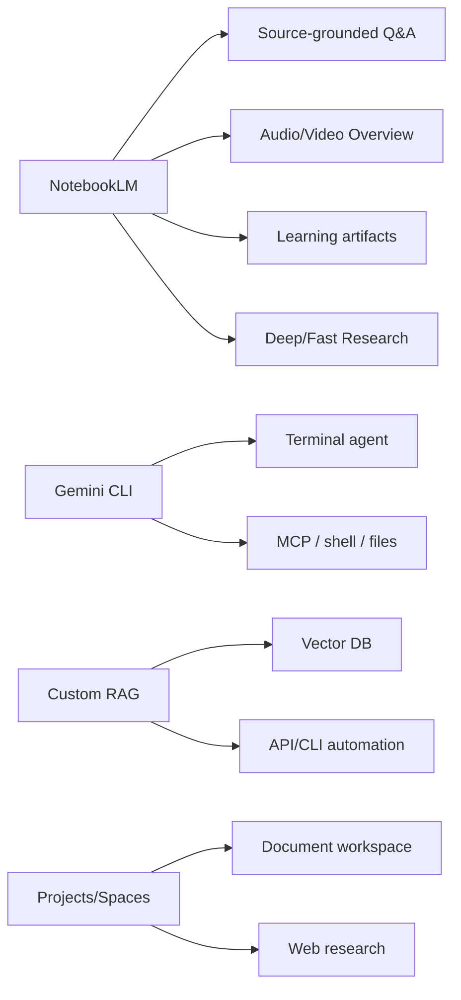

# NotebookLM - 생태계

> [[01-overview|이전: 개요]] | [[README|목차로 돌아가기]] | [[03-references|다음: 참고자료]]

---

## 1. 관련 도구 맵



NotebookLM은 **research/study product UX**에 가깝고, Gemini CLI와 custom RAG는 **automation/developer workflow**에 가깝다. "CLI가 있다"는 말이 나오면 NotebookLM 제품 자체인지, Gemini CLI인지, 비공식 browser automation인지 먼저 분리해야 한다.

## 2. 경쟁/대안 비교

| 도구 | 강점 | 약점/주의 | CLI/자동화 관점 |
|---|---|---|---|
| NotebookLM | source-grounded Q&A, citations, Audio/Video Overview, study artifacts | 공식 API/CLI 부재, Google UX 안에서 사용 | 공식 NotebookLM CLI 없음 |
| Gemini CLI | terminal-first AI agent, Google Search grounding, file/shell tools, MCP, scripting | NotebookLM notebook을 직접 조작하는 도구는 아님 | 공식 CLI 있음: `npx @google/gemini-cli`, `gemini -p ...` |
| Gemini Deep Research | web research report 생성에 강함 | notebook/source 관리 UX는 NotebookLM이 더 특화 | Gemini/NotebookLM 안에서 기능으로 사용 |
| ChatGPT Projects/Deep Research | 범용 research, 파일 기반 프로젝트 운영 | NotebookLM식 Audio/Video Overview 특화는 약함 | OpenAI API/Codex/CLI 계열로 자동화 가능 |
| Claude Projects | 긴 문맥, 문서 질의, writing workflow | citations/source artifact UX는 제품별 차이 | Claude Code 등 dev workflow 강함 |
| Perplexity Spaces | web-first answer engine, source discovery | 개인 문서 기반 학습 notebook보다는 검색 중심 | API/automation은 별도 제품 정책 확인 필요 |
| Custom RAG on Vertex AI/LangChain/LlamaIndex | 조직 데이터, 권한, 파이프라인 완전 제어 | 구축/운영 비용 필요 | 가장 scriptable, CLI/API 친화적 |

## 3. 선택 기준

| 상황 | 추천 | 이유 |
|------|------|------|
| 문서 묶음을 읽고 빠르게 study artifact를 만들고 싶다 | NotebookLM | source import, citation, Audio/Video Overview가 빠름 |
| terminal에서 local repo/docs를 요약하고 싶다 | Gemini CLI 또는 다른 CLI agent | shell/file workflow와 scripting에 적합 |
| 사내 문서 권한, audit, workflow integration이 중요하다 | Custom RAG / Vertex AI / MCP | 권한, logging, API, 배포를 직접 설계 가능 |
| web research report가 필요하다 | Gemini Deep Research, ChatGPT Deep Research, Perplexity | source discovery와 synthesis에 강함 |
| 반복 가능한 batch pipeline이 필요하다 | Custom RAG + CLI/API | NotebookLM은 제품 UI 중심이라 자동화 제약이 큼 |

## 4. NotebookLM vs Gemini CLI

| 질문 | NotebookLM | Gemini CLI |
|------|------------|------------|
| 기본 위치 | Browser/mobile app | Terminal |
| 주요 대상 | Research, study, briefing, source Q&A | Coding, shell/file automation, terminal agent |
| 입력 | Notebook sources | Local files, prompt, shell context, tools |
| 출력 | Chat answer, notes, Studio artifacts | Terminal output, file edits, command results |
| Citation | Notebook sources 기반 citation UX | prompt/workflow에 따라 file path나 search grounding 활용 |
| Notebook 조작 | 제품 UI에서 수행 | 공식 NotebookLM 조작 CLI가 아님 |

```bash
# Gemini CLI 설치/실행 예시
npx @google/gemini-cli

# 비대화형 prompt 예시
gemini -p "Read docs/*.md and list migration risks in Korean."
```

## 5. 조직 도입 관점

| 검토 항목 | 질문 |
|----------|------|
| Data protection | Workspace 계정에서 uploads, queries, responses가 어떻게 처리되는가? |
| Source governance | 누가 notebook을 만들고 공유하며 삭제할 수 있는가? |
| IP/copyright | 업로드할 권리가 있는 문서만 source로 쓰는가? |
| Output validation | Audio/Video/Quiz/Slide output을 누가 검토하는가? |
| Automation | UI 작업으로 충분한가, CLI/API pipeline이 필요한가? |
| Exit strategy | NotebookLM 밖으로 report/source list를 어떻게 보존할 것인가? |

## 6. 트렌드 요약

- **Document chat -> source-grounded workspace**: 단발성 파일 질문보다 notebook 단위의 research workspace가 중요해진다.
- **Text answer -> multimodal artifact**: Audio, Video, Infographic, Slide Deck처럼 학습/보고 산출물이 늘어난다.
- **Manual upload -> assisted source discovery**: Deep/Fast Research로 sources를 찾고 가져오는 흐름이 강화된다.
- **UI product -> automation need**: 조직은 eventually CLI/API/MCP/custom RAG를 요구하게 된다.

---

## 관련 노트

- [[study/tech/ai/agent-orchestration/cli-agents]] - Gemini CLI와 Codex/Claude Code 등 terminal agents 비교
- [[study/tech/ai/model-context-protocol-mcp]] - NotebookLM-like 자동화를 MCP tool/resource로 설계
- [[study/tech/ai/litellm]] - custom RAG의 model gateway 후보

---

## 다음 단계

> [!tip] 다음으로
> [[03-references|참고자료]]에서 NotebookLM Help의 source limits, Audio/Video Overview, FAQ와 Gemini CLI 공식 자료를 확인한다.
