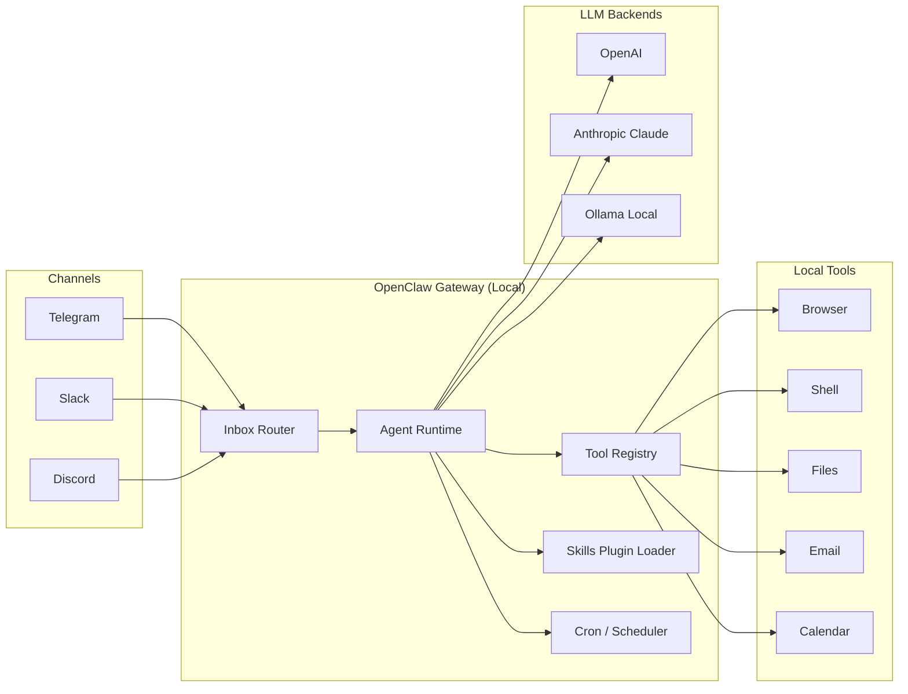

# Part 1. OpenClaw 개요

## 📌 한 줄로 정리

**OpenClaw = "메신저 + 도구 호출 + 로컬 실행"을 한 묶음으로 묶은 자가호스팅 에이전트 게이트웨이**

LLM(Claude/GPT/Gemini/Ollama)을 사용자의 머신에 띄우고, 텔레그램·디스코드 같은 채널을 통해 명령을 받아 브라우저/터미널/캘린더/메일을 LLM이 직접 조작하게 한다. **"Any OS. Any Platform. The lobster way. 🦞"** 라는 슬로건이 컨셉을 잘 보여준다.

## 🧩 핵심 개념 5가지

### 1. Local-first Gateway

OpenClaw의 핵심 컴포넌트. 모든 세션·도구·채널·이벤트를 단일 제어 평면(control plane)에서 관리한다. 사용자의 머신에서 **24/7 데몬으로 떠 있고**, 외부 LLM 호출은 게이트웨이가 라우팅한다.

```
[Telegram] ┐
[Discord]  ├─► OpenClaw Gateway ─► LLM(Claude/Ollama) ─► Tools(Browser/Shell/Cron)
[WhatsApp] ┘                              │
                                          └─► Skills(Plugins)
```

### 2. Multi-channel Inbox

20+ 메신저 채널을 하나의 inbox로 통합:
- 메신저: WhatsApp, **Telegram**, **Slack**, **Discord**, iMessage, Signal, Matrix
- 협업: Microsoft Teams, Google Chat, Feishu, Mattermost
- 지역 특화: LINE, WeChat, QQ, Zalo, KakaoTalk(비공식)
- 기타: IRC, Nostr, Twitch, WebChat

채널마다 **별도 에이전트와 워크스페이스로 격리** 가능 → 가족용/업무용/디버그용 봇을 한 머신에서 분리 운영.

### 3. Multi-agent Routing

```yaml
agents:
  family:
    channels: [telegram-family, imessage]
    model: claude-opus-4-7
    tools: [calendar, reminder]
  work:
    channels: [slack-work]
    model: claude-sonnet-4-6
    tools: [browser, email, github]
```

같은 게이트웨이 안에서 **에이전트별 모델 + 도구 + 권한**을 다르게 설정.

### 4. Tool Calling + Skills

- **First-class tools** (내장): browser, canvas, shell, cron, files, http, email
- **Skills**: 외부 플러그인 마켓플레이스에서 가져오는 추가 기능 (Notion, Jira, GitHub 등)
- MCP(Model Context Protocol) 호환 → Claude Code/Cursor에서 쓰던 MCP 서버를 그대로 사용 가능

### 5. Voice Wake / Live Canvas (Companion Apps)

- 별도 macOS 메뉴바 앱 / iOS·Android 앱
- 음성 깨우기(wake word), 연속 대화 모드(Talk Mode)
- Live Canvas: 에이전트가 직접 그리는 시각 작업 공간(A2UI)

## ⚖️ 장단점

### ✅ 장점

| 항목 | 설명 |
|------|------|
| **데이터 주권** | 시크릿·세션·로그 전부 로컬. 클라우드 벤더 추적 없음 |
| **채널 폭** | 20+ 메신저 → 가족·회사·해외 친구 다 한 번에 |
| **모델 자유** | Claude/OpenAI/Gemini/Ollama 자유롭게 교체. 비용·성능 최적화 가능 |
| **MCP 호환** | 기존 MCP 생태계 자산 재사용 |
| **활발한 커뮤니티** | 374k★ / awesome-openclaw-agents 162개 템플릿 |

### ❌ 단점·주의점

| 항목 | 설명 |
|------|------|
| **거대한 공격 표면** | 43만 줄 코드, Sandbox escape CVE 다수 (CVE-2026-44112/44113) |
| **장기 기억 없음** | 세션 단위 컨텍스트만 보유. memU/Letta 같은 메모리 레이어 별도 필요 |
| **"Lethal Trifecta" 충족** | 사적 데이터 접근 + 외부(메신저) 입력 + 외부 통신 동시 보유 → 프롬프트 인젝션에 취약 |
| **운영 복잡도** | Node 24, pnpm, Docker, 20+ 채널 의존성 — 셋업이 가볍지 않음 |
| **버전 휘발성** | 빠른 릴리즈 사이클로 breaking change 잦음 |

## 🎯 누가 쓰면 좋은가

| 사용자 유형 | 적합도 |
|------------|--------|
| **Self-hoster / Homelab 운영자** (Mac mini, NAS, RPi5) | ⭐⭐⭐⭐⭐ |
| **개발자: 개인 비서 자동화** | ⭐⭐⭐⭐⭐ |
| **클라우드 의존 줄이고 싶은 프라이버시 중시 사용자** | ⭐⭐⭐⭐ |
| **장기 기억 기반 PA가 필요한 사용자** | ⭐⭐ (memU/Letta 추천) |
| **엔터프라이즈 SaaS 대체** | ⭐⭐ (보안 감사 부담, AutoGen/CrewAI 검토) |
| **단순함 우선** | ⭐⭐ (Nanobot/ZeroClaw 추천) |

## 🏢 채택 사례 & 커뮤니티

- **awesome-openclaw-agents** (mergisi/awesome-openclaw-agents): 19개 카테고리에 162개 production-ready 템플릿
- **OneClaw / ClawHost / ClawPort**: OpenClaw 매니지드 호스팅을 제공하는 상용 서비스 — Self-host vs Managed 선택지 모두 존재
- **Telegram IELTS 튜터봇** (medium.com/@ahmad.gayibov): 개인이 OpenClaw + Docker + Claude로 영어 튜터 봇 구축한 사례
- **Mac mini M4 AI 서버** (marc0.dev): Ollama + OpenClaw + Claude Code 결합 가이드

## 🔬 OpenClaw의 핵심 아키텍처 (한 눈에)



## 🔗 다음 챕터

- 비슷한 카테고리 프로젝트와의 차이 → [02-ecosystem.md](02-ecosystem.md)
- 실제로 Mac mini에 띄우기 → [04-learning/01-mac-mini-setup.md](04-learning/01-mac-mini-setup.md)
