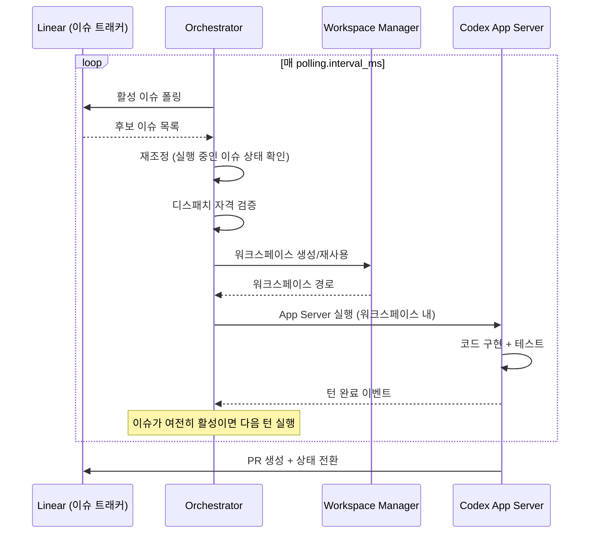

# Symphony - 개요

> [[README|목차로 돌아가기]] | [[02-ecosystem|다음: 생태계]]

---

## 1. What - Symphony란?

> **한 줄 정의**: 이슈 트래커를 폴링하여 코딩 에이전트를 이슈별 격리 워크스페이스에서 자율 실행하는 장기 실행(long-running) 오케스트레이션 서비스

### 핵심 개념

Symphony는 OpenAI가 2026년 2월에 개발하고 3월에 공개한 **자율 코딩 에이전트 오케스트레이터**다. "하니스 엔지니어링(Harness Engineering)" 패러다임의 다음 단계로, 개발자가 코딩 에이전트를 직접 감독하는 것에서 **작업 자체를 관리하는 것으로** 전환하게 해준다.

#### Symphony가 해결하는 4가지 문제

| # | 문제 | Symphony의 해법 |
|---|------|----------------|
| 1 | 수동 스크립트로 에이전트 실행 | 반복 가능한 데몬 워크플로우로 자동화 |
| 2 | 에이전트 간 파일시스템 간섭 | 이슈별 격리된 워크스페이스 |
| 3 | 에이전트 설정 산재 | `WORKFLOW.md`에 모든 정책을 코드와 함께 버전 관리 |
| 4 | 동시 실행 에이전트 모니터링 불가 | 구조화된 로그 + 옵저버빌리티 대시보드 |

### 주요 용어

| 용어 | 설명 |
|------|------|
| **Harness Engineering** | 코딩 에이전트가 자율적으로 개발하도록 코드베이스를 설계하는 방법론 |
| **WORKFLOW.md** | Symphony의 핵심 설정 파일. YAML 프론트매터 + 프롬프트 템플릿 |
| **Workspace** | 이슈별 격리된 파일시스템 디렉토리 |
| **Codex App Server** | Codex의 JSON-RPC 기반 프로그래밍 인터페이스 (stdio 통신) |
| **Orchestrator** | 폴링, 디스패치, 재시도, 재조정을 관리하는 핵심 상태 머신 |
| **Run Attempt** | 하나의 이슈에 대한 단일 실행 시도 |
| **Reconciliation** | 실행 중인 이슈의 트래커 상태를 주기적으로 확인하고 동기화하는 과정 |
| **Skill** | Codex 에이전트가 사용하는 재사용 가능한 작업 단위 (commit, push, land 등) |

### 동작 방식



### 기술 스택

| 구성 요소 | 기술 | 이유 |
|-----------|------|------|
| 런타임 | Elixir / Erlang BEAM / OTP | 장시간 프로세스 감독, 핫코드 리로딩, 동시성 |
| 이슈 트래커 | Linear | GraphQL API, 커스텀 상태, 브랜치 메타데이터 |
| 코딩 에이전트 | OpenAI Codex (App Server 모드) | JSON-RPC over stdio, 샌드박스 지원 |
| 대시보드 | Phoenix LiveView | 실시간 옵저버빌리티 UI |
| 빌드 도구 | Mix + mise | Elixir 의존성 관리, 버전 관리 |
| 라이선스 | Apache 2.0 | 상업적 사용 가능 |

---

## 2. Why - 왜 Symphony인가?

### 해결하려는 문제

- **에이전트 감독 오버헤드**: 개발자가 코딩 에이전트를 하나씩 실행하고 결과를 확인해야 함
- **격리 부재**: 여러 에이전트가 같은 코드베이스에서 동시 작업 시 충돌
- **설정 산재**: 에이전트 프롬프트, 런타임 설정, 훅이 여러 곳에 분산
- **재시도 없음**: 에이전트 실패 시 수동으로 다시 실행해야 함
- **옵저버빌리티 부재**: 무엇이 실행 중이고, 무엇이 실패했는지 파악 어려움

### 기존 방식의 한계

| 문제 | 수동 에이전트 실행 | Symphony |
|------|-------------------|----------|
| 동시 실행 | 터미널 탭 수동 관리 | 최대 10개 동시 에이전트 자동 관리 |
| 작업 할당 | 사람이 에이전트에 명령 | 이슈 트래커에서 자동 디스패치 |
| 격리 | 같은 디렉토리에서 작업 | 이슈별 독립 워크스페이스 |
| 실패 복구 | 수동 재실행 | 지수 백오프 자동 재시도 |
| 설정 관리 | 환경변수 + YAML + 대시보드 분산 | WORKFLOW.md 단일 파일 |
| 상태 추적 | 수동 확인 | Phoenix LiveView 대시보드 + JSON API |

### OpenAI 내부 검증

OpenAI는 Symphony의 기반이 되는 Harness Engineering 방법론으로 **5개월 동안 약 100만 줄의 프로덕션 코드를 수동 작성 없이 배포**했다고 발표했다. Symphony는 이 방법론을 외부 팀도 사용할 수 있도록 일반화한 것이다.

---

## 3. 핵심 특징

### 장점

- **완전 자율 실행**: 이슈 감지 -> 구현 -> 테스트 -> PR -> 리뷰 대기까지 무인 운영
- **이슈별 격리**: 각 에이전트가 독립 워크스페이스에서 작업, 서로 간섭 없음
- **단일 설정 파일**: `WORKFLOW.md` 하나로 프롬프트, 런타임, 훅, 트래커 모두 관리
- **자동 재시도**: 실패 시 지수 백오프로 자동 재시도 (최대 5분 간격)
- **동적 리로드**: `WORKFLOW.md` 수정 시 서비스 재시작 없이 설정 반영
- **Erlang/OTP 내결함성**: 개별 에이전트 실패가 전체 시스템에 영향을 주지 않음
- **핫코드 리로딩**: 실행 중인 에이전트를 중단하지 않고 코드 업데이트 가능
- **스펙 기반 설계**: `SPEC.md`로 언어에 무관한 구현 가능

### 단점

- **OpenAI 에코시스템 종속**: 현재 Codex만 공식 지원, Anthropic/Google은 커뮤니티 수준
- **Linear 전용**: 이슈 트래커가 Linear만 지원 (GitHub Issues, Jira 어댑터 개발 중)
- **Elixir 러닝커브**: 레퍼런스 구현이 Elixir, 대다수 팀에 생소한 언어
- **프로덕션 미검증**: Engineering Preview 단계, 운영 트랙 레코드 부재
- **높은 신뢰 전제**: 기본 설정이 고신뢰 환경 대상, 보안 정책은 별도 구현 필요
- **비용 불투명**: 다수 에이전트 동시 실행 시 API 비용 예측 어려움

---

## 4. 사용 사례

### 적합한 경우

| 사용 사례 | 설명 |
|----------|------|
| 반복적 티켓 처리 | 버그 수정, 리팩토링 등 명확한 이슈를 대량 처리 |
| CI/CD 파이프라인 연계 | 이슈 -> PR -> 리뷰 -> 머지 자동화 |
| Harness Engineering 도입 팀 | 이미 에이전트 친화적 코드베이스를 갖춘 팀 |
| 다수 에이전트 동시 운영 | 10개+ 이슈를 동시에 에이전트로 처리 |
| Linear 사용 팀 | Linear의 커스텀 상태와 GraphQL API 활용 |

### 실제 활용 예시: 이슈에서 PR까지

```
1. 엔지니어가 Linear에 "로그인 페이지 비밀번호 유효성 검사 추가" 이슈 생성
2. Symphony가 이슈를 감지하고 "In Progress"로 전환
3. 격리 워크스페이스 생성, git clone 실행
4. Codex가 코드 구현 + 테스트 작성
5. Codex Workpad 코멘트에 진행 상황 기록
6. PR 생성, CI 확인, "Human Review"로 전환
7. 엔지니어가 리뷰 후 승인
8. "Merging" 상태에서 land 스킬로 안전하게 머지
9. "Done"으로 전환, 워크스페이스 정리
```

### 부적합한 경우

| 사용 사례 | 이유 |
|----------|------|
| 설계 수준의 의사결정 | Symphony는 실행기, 아키텍처 결정은 인간 영역 |
| Linear 외 트래커 사용 팀 | 현재 Linear만 지원 |
| 비-OpenAI 모델 필수 | Codex App Server 기반이라 다른 모델 사용 제한적 |
| 엄격한 보안 요구 | 기본이 고신뢰 환경 대상, 강력한 샌드박스 별도 필요 |
| 소규모 1-2명 팀 | 오버헤드 대비 효과가 크지 않을 수 있음 |

---

## 5. 아키텍처 요약

Symphony는 6개 핵심 레이어로 구성된다:

```
┌─────────────────────────────────────────┐
│           Policy Layer                   │
│        (WORKFLOW.md 프롬프트)              │
├─────────────────────────────────────────┤
│        Configuration Layer               │
│     (YAML 프론트매터 → 타입 설정)          │
├─────────────────────────────────────────┤
│        Coordination Layer                │
│  (Orchestrator: 폴링, 디스패치, 재시도)    │
├─────────────────────────────────────────┤
│         Execution Layer                  │
│  (Workspace + AgentRunner + Codex)       │
├─────────────────────────────────────────┤
│        Integration Layer                 │
│      (Linear API 어댑터)                  │
├─────────────────────────────────────────┤
│       Observability Layer                │
│   (구조화 로그 + Phoenix LiveView)         │
└─────────────────────────────────────────┘
```

> [!tip] 상세 아키텍처는 [[04-learning/01-architecture|아키텍처 학습 노트]]를 참고하세요.

---

## 다음 단계

> [!tip] 다음으로
> Symphony의 개요를 이해했다면 [[02-ecosystem|생태계와 관련 기술]]에서 LangGraph, CrewAI 등과의 비교를 살펴보세요.

---

## References

- [GitHub - openai/symphony](https://github.com/openai/symphony)
- [SPEC.md - Symphony Service Specification](https://github.com/openai/symphony/blob/main/SPEC.md)
- [Harness Engineering - OpenAI](https://openai.com/index/harness-engineering/)
- [Codex App Server - OpenAI Developers](https://developers.openai.com/codex/app-server/)
