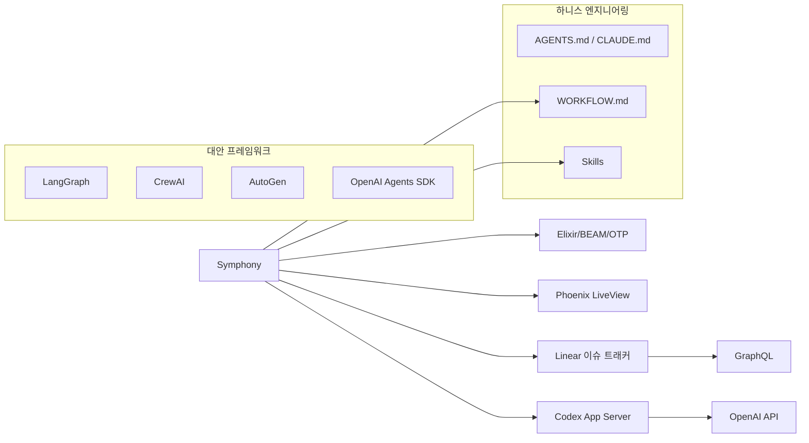

# Symphony - 생태계

> [[01-overview|이전: 개요]] | [[README|목차로 돌아가기]] | [[03-references|다음: 참고자료]]

---

## 1. 관련 기술 맵



---

## 2. 에이전트 오케스트레이션 프레임워크 비교

### Symphony vs LangGraph vs CrewAI vs AutoGen

| 비교 항목 | **Symphony** | **LangGraph** | **CrewAI** | **AutoGen** |
|-----------|-------------|---------------|------------|-------------|
| **패러다임** | 이슈 기반 자율 실행 | 그래프 기반 워크플로우 | 역할 기반 협업 | 대화 기반 멀티에이전트 |
| **주요 목적** | 코딩 에이전트 오케스트레이션 | 범용 에이전트 워크플로우 | 빠른 멀티에이전트 프로토타이핑 | 연구/실험 에이전트 시스템 |
| **언어** | Elixir | Python | Python | Python |
| **모델 지원** | OpenAI Codex 전용 | 다양한 LLM | 다양한 LLM | 다양한 LLM |
| **상태 관리** | In-memory + 트래커 기반 | 체크포인트 + 영속 저장소 | 내장 메모리 | 대화 기록 |
| **내결함성** | OTP Supervision Tree | 체크포인트 복원 | 기본 재시도 | 기본 재시도 |
| **동시성** | 10+ 에이전트 동시 실행 | 비동기 노드 실행 | 순차/병렬 실행 | 그룹 채팅 기반 |
| **이슈 트래커 통합** | Linear 네이티브 | 없음 (별도 구현) | 없음 (별도 구현) | 없음 (별도 구현) |
| **워크스페이스 격리** | 이슈별 자동 격리 | 없음 | 없음 | 없음 |
| **설정 방식** | WORKFLOW.md 단일 파일 | Python 코드 | Python 코드/YAML | Python 코드 |
| **대시보드** | Phoenix LiveView 내장 | LangSmith (유료) | 없음 | AG Studio |
| **러닝커브** | 높음 (Elixir) | 중간 | 낮음 | 중간 |
| **프로덕션 성숙도** | Preview (신규) | 높음 | 중간 | 중간 |
| **라이선스** | Apache 2.0 | MIT | MIT | MIT |

### 핵심 차별점

> [!important] Symphony만의 독특한 포지션
> Symphony는 다른 프레임워크와 **경쟁 관계가 아닌 다른 카테고리**에 있다.
> - LangGraph/CrewAI/AutoGen: **범용 에이전트 워크플로우 프레임워크**
> - Symphony: **코딩 에이전트 스케줄러/러너** (이슈 트래커 연동 자동화 서비스)

```
┌─────────────────────────────────────────────────────┐
│                 에이전트 오케스트레이션                  │
├──────────────────────┬──────────────────────────────┤
│  범용 워크플로우        │  코딩 에이전트 자동화           │
│                      │                              │
│  LangGraph           │  Symphony                    │
│  CrewAI              │  (스케줄러 + 이슈 트래커 통합)   │
│  AutoGen             │                              │
│  OpenAI Agents SDK   │                              │
└──────────────────────┴──────────────────────────────┘
```

### 언제 어떤 도구를 사용할까?

| 상황 | 추천 도구 | 이유 |
|------|----------|------|
| Linear 이슈를 자동으로 코딩 에이전트에 디스패치 | **Symphony** | 이슈 트래커 통합이 핵심 기능 |
| 복잡한 분기/루프가 있는 에이전트 워크플로우 | **LangGraph** | 그래프 기반 제어 흐름이 강점 |
| 빠른 멀티에이전트 프로토타이핑 (3-5개 에이전트) | **CrewAI** | 가장 빠른 프로토타이핑 속도 |
| 연구/실험용 에이전트 대화 시뮬레이션 | **AutoGen** | 대화 기반 에이전트 시스템 최적화 |
| OpenAI 모델 기반 에이전트 빠르게 구축 | **OpenAI Agents SDK** | 네이티브 tool calling, 핸드오프 |
| 코드 없이 에이전트 워크플로우 구축 | **n8n / LangFlow** | 비주얼 워크플로우 빌더 |

---

## 3. Symphony와 함께 사용하면 좋은 도구

| 도구 | 역할 | 연동 방식 |
|------|------|----------|
| **Linear** | 이슈 트래커 | GraphQL API로 네이티브 연동 |
| **Codex CLI** | 코딩 에이전트 | App Server 모드로 실행 |
| **GitHub** | 코드 호스팅 + PR | Codex가 `gh` CLI로 직접 사용 |
| **mise** | Elixir/Erlang 버전 관리 | Symphony 빌드 시 사용 |
| **Phoenix LiveView** | 옵저버빌리티 대시보드 | 내장 웹 대시보드 |

### Harness Engineering 에코시스템

Symphony는 OpenAI의 **Harness Engineering** 패러다임의 일부다:

```
Harness Engineering 스택
━━━━━━━━━━━━━━━━━━━━━━━━
  AGENTS.md / CLAUDE.md    → 코드베이스 가이드라인
  WORKFLOW.md              → 에이전트 워크플로우 정의
  Skills (.codex/skills/)  → 재사용 가능한 작업 단위
  ─────────────────────────
  Codex App Server         → 코딩 에이전트 런타임
  Symphony                 → 오케스트레이터
  ─────────────────────────
  Linear                   → 작업 관리
  GitHub                   → 코드 + PR
```

---

## 4. SPEC.md 기반 대안 구현

Symphony의 핵심 차별점 중 하나는 **언어 무관한 SPEC.md**를 공식 제공한다는 것이다. 이를 통해 Elixir 외 언어로도 동일한 동작을 구현할 수 있다.

### 자체 구현 접근법

README.md에서 권장하는 방법:

```
"좋아하는 코딩 에이전트에게 다음 스펙에 따라 Symphony를 구현하라고 지시하세요:
 https://github.com/openai/symphony/blob/main/SPEC.md"
```

이는 실제로 실용적인 접근법이다. SPEC.md는 다음을 정의한다:

- 도메인 모델 (Issue, Workspace, RunAttempt, LiveSession 등)
- 오케스트레이터 상태 머신 (Unclaimed -> Claimed -> Running -> Released)
- 폴링/스케줄링/재조정 알고리즘
- 워크스페이스 안전성 불변식
- Codex App Server JSON-RPC 프로토콜
- 옵저버빌리티 요구사항

---

## 5. 트렌드

- **Harness Engineering 확산**: OpenAI가 자체 개발에서 검증한 방법론을 Symphony로 외부 공개, 업계 표준화 가능성
- **이슈 트래커 연동 확대**: GitHub Issues, Jira 어댑터 개발 중, 트래커에 무관한 에이전트 자동화 기대
- **SPEC.md 기반 다국어 구현**: Python, Go, Rust 등 다양한 언어로의 커뮤니티 구현 등장 예상
- **코딩 에이전트 스케줄러 카테고리**: Symphony가 개척한 "코딩 에이전트 스케줄러" 카테고리에 다른 벤더 진입 가능성
- **자율 개발 파이프라인**: 이슈 생성 -> 코딩 -> 테스트 -> 리뷰 -> 배포의 완전 자동화 가속

---

## 다음 단계

> [!tip] 다음으로
> [[03-references|참고자료]]에서 SPEC.md 상세, Harness Engineering 문서, 커뮤니티 자료를 확인하세요.
