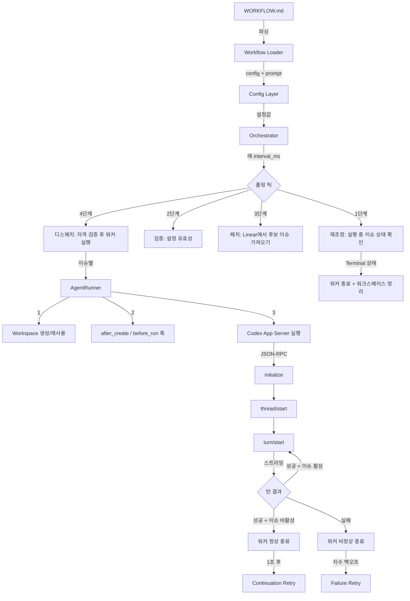

# Symphony 아키텍처

> [[README|목차로 돌아가기]] | [[02-workflow-config|다음: WORKFLOW.md 설정]]

---

## 📌 핵심 개념

Symphony는 **6개 레이어**, **8개 컴포넌트**로 구성된 서비스다. 핵심은 단일 프로세스 내에서 Elixir/OTP의 GenServer로 오케스트레이션 상태를 관리하고, 이슈별로 독립된 워커 프로세스를 감독하는 구조다.

### 6개 추상화 레이어

```
Layer 1: Policy Layer         → WORKFLOW.md의 프롬프트 본문
Layer 2: Configuration Layer  → YAML 프론트매터 → 타입 설정값
Layer 3: Coordination Layer   → Orchestrator (폴링, 디스패치, 재시도)
Layer 4: Execution Layer      → Workspace + AgentRunner + Codex
Layer 5: Integration Layer    → Linear API 어댑터
Layer 6: Observability Layer  → 구조화 로그 + Phoenix LiveView 대시보드
```

### 8개 핵심 컴포넌트

| # | 컴포넌트 | Elixir 모듈 | 역할 |
|---|---------|-------------|------|
| 1 | Workflow Loader | `SymphonyElixir.Workflow` | WORKFLOW.md 파싱 (YAML + 프롬프트) |
| 2 | Config Layer | `SymphonyElixir.Config` | 타입 설정값, 기본값, 환경변수 확장 |
| 3 | Issue Tracker Client | `SymphonyElixir.Tracker` | Linear GraphQL API 호출/정규화 |
| 4 | Orchestrator | `SymphonyElixir.Orchestrator` | 폴링 루프, 상태 머신, 디스패치/재시도 |
| 5 | Workspace Manager | `SymphonyElixir.Workspace` | 디렉토리 생명주기, 훅 실행 |
| 6 | Agent Runner | `SymphonyElixir.AgentRunner` | 워크스페이스 준비 -> Codex 실행 |
| 7 | Status Surface | `SymphonyElixir.StatusDashboard` | Phoenix LiveView 대시보드 |
| 8 | Logging | `SymphonyElixir.LogFile` | 구조화 로그 파일 관리 |

---

## 💻 코드

### 컴포넌트 간 흐름: 이슈 하나의 생명주기

```elixir
# 1. Orchestrator (GenServer) - 폴링 틱마다 실행
defmodule SymphonyElixir.Orchestrator do
  use GenServer

  # 폴링 틱 핸들링 (핵심 루프)
  def handle_info({:tick, tick_token}, state) do
    state = refresh_runtime_config(state)        # Config 리로드
    state = reconcile_running_issues(state)       # 재조정
    state = dispatch_eligible_issues(state)       # 디스패치
    state = schedule_tick(state)                  # 다음 틱 예약
    {:noreply, state}
  end
end

# 2. AgentRunner - 이슈별 워커 프로세스
defmodule SymphonyElixir.AgentRunner do
  def run(issue, codex_update_recipient, opts) do
    # 워크스페이스 생성/재사용
    {:ok, workspace} = Workspace.create_for_issue(issue, worker_host)

    # before_run 훅 실행
    :ok = Workspace.run_before_run_hook(workspace, issue, worker_host)

    # Codex 턴 실행 (max_turns까지 반복)
    run_codex_turns(workspace, issue, codex_update_recipient, opts, worker_host)
  end
end

# 3. Codex AppServer - JSON-RPC 클라이언트
defmodule SymphonyElixir.Codex.AppServer do
  def run(workspace, prompt, issue, opts) do
    {:ok, session} = start_session(workspace, opts)  # initialize + thread/start
    run_turn(session, prompt, issue, opts)            # turn/start + 스트리밍
    stop_session(session)                             # 세션 정리
  end
end
```

### Orchestrator 런타임 상태 구조

```elixir
defmodule SymphonyElixir.Orchestrator.State do
  defstruct [
    :poll_interval_ms,         # 폴링 간격 (기본 30초)
    :max_concurrent_agents,    # 동시 실행 제한 (기본 10)
    :next_poll_due_at_ms,      # 다음 폴링 시각
    :poll_check_in_progress,   # 폴링 진행 중 여부
    :tick_timer_ref,           # 타이머 참조
    :tick_token,               # 틱 토큰 (중복 방지)
    running: %{},              # issue_id -> running entry (실행 중)
    completed: MapSet.new(),   # 완료된 이슈 ID 집합
    claimed: MapSet.new(),     # 예약된 이슈 ID 집합
    retry_attempts: %{},       # issue_id -> RetryEntry (재시도 큐)
    codex_totals: nil,         # 누적 토큰/시간 통계
    codex_rate_limits: nil     # 최신 rate limit 스냅샷
  ]
end
```

### 전체 흐름 다이어그램



---

## ✅ 체크포인트

- [ ] Symphony가 해결하는 4가지 문제를 설명할 수 있는가?
- [ ] 6개 추상화 레이어의 역할을 각각 설명할 수 있는가?
- [ ] Orchestrator -> AgentRunner -> Codex AppServer의 호출 흐름을 그릴 수 있는가?
- [ ] 왜 Elixir/OTP를 선택했는지 설명할 수 있는가?
- [ ] `running`, `claimed`, `retry_attempts`의 차이를 이해하는가?

---

## ⚠️ 흔한 실수

| 실수 | 올바른 이해 |
|------|------------|
| Symphony가 범용 멀티에이전트 프레임워크라고 생각 | Symphony는 **코딩 에이전트 스케줄러**이지 범용 워크플로우 엔진이 아님 |
| Orchestrator가 직접 코드를 수정한다고 생각 | Orchestrator는 스케줄링만, 실제 코드 수정은 Codex가 수행 |
| 하나의 이슈에 하나의 턴만 실행된다고 생각 | `max_turns`까지 동일 스레드에서 연속 턴 실행 가능 |
| 실패하면 영원히 재시도한다고 생각 | 지수 백오프로 최대 5분까지, 이슈 상태가 비활성이면 중단 |
| DB가 필요하다고 생각 | In-memory 상태 + 트래커 기반 복구, DB 불필요 |

---

## 🔗 더 알아보기

- [[02-workflow-config|WORKFLOW.md 설정 가이드]] - 워크플로우 정의 상세
- [[03-orchestrator|오케스트레이터 상태 머신]] - 폴링, 스케줄링, 재조정 상세
- [SPEC.md - Section 3: System Overview](https://github.com/openai/symphony/blob/main/SPEC.md#3-system-overview)
- [Elixir GenServer 가이드](https://hexdocs.pm/elixir/GenServer.html)
