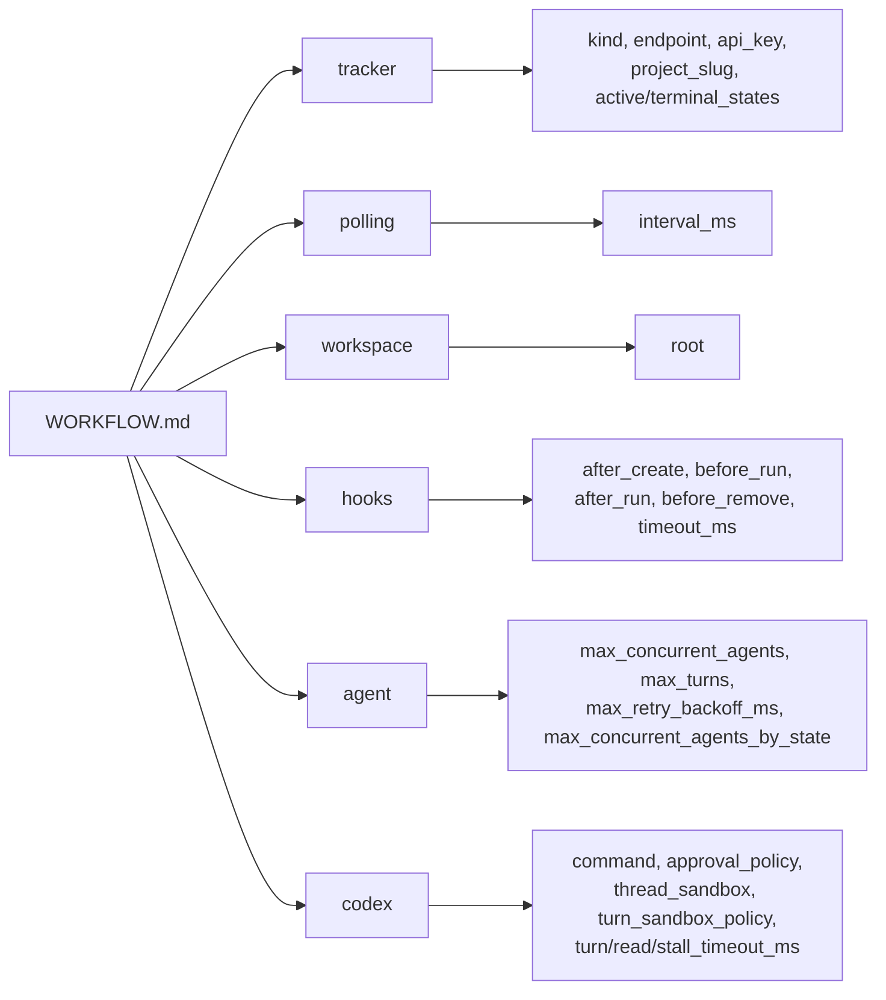

# WORKFLOW.md 설정 완전 가이드

> [[01-architecture|이전: 아키텍처]] | [[README|목차로 돌아가기]] | [[03-orchestrator|다음: 오케스트레이터]]

---

## 📌 핵심 개념

`WORKFLOW.md`는 Symphony의 **킬러 피처**다. YAML 프론트매터 + 마크다운 프롬프트 템플릿을 하나의 파일에 담아, 에이전트의 런타임 설정과 행동 정책을 코드 저장소에 버전 관리한다.

### 파일 구조

```
---                          ← YAML 프론트매터 시작
tracker:
  kind: linear
  project_slug: "my-project"
workspace:
  root: ~/code/workspaces
agent:
  max_concurrent_agents: 10
codex:
  command: codex app-server
---                          ← YAML 프론트매터 끝

여기부터 프롬프트 템플릿 본문 (Liquid 호환 구문)

이슈: {{ issue.identifier }}
제목: {{ issue.title }}
설명: {{ issue.description }}
```

### 프론트매터 6대 섹션



---

## 💻 코드

### 최소 WORKFLOW.md

```markdown
---
tracker:
  kind: linear
  project_slug: "my-project-abc123"
workspace:
  root: ~/code/workspaces
---

You are working on a Linear issue {{ issue.identifier }}.

Title: {{ issue.title }}
Body: {{ issue.description }}
```

이것만으로도 Symphony가 동작한다. 나머지는 기본값이 적용된다.

### 실전 WORKFLOW.md (전체 설정)

```markdown
---
tracker:
  kind: linear
  api_key: $LINEAR_API_KEY           # 환경변수 참조
  project_slug: "my-project-abc123"  # Linear 프로젝트 URL에서 확인
  active_states:                     # 에이전트가 작업할 이슈 상태
    - Todo
    - In Progress
    - Merging
    - Rework
  terminal_states:                   # 작업 종료 상태
    - Closed
    - Cancelled
    - Canceled
    - Duplicate
    - Done

polling:
  interval_ms: 5000                  # 5초마다 폴링 (기본 30초)

workspace:
  root: ~/code/my-workspaces         # 워크스페이스 루트 디렉토리

hooks:
  after_create: |                    # 워크스페이스 최초 생성 시
    git clone --depth 1 git@github.com:my-org/my-repo.git .
    npm install
  before_run: |                      # 매 실행 전
    git fetch origin main
    git rebase origin/main || true
  after_run: |                       # 매 실행 후
    echo "Run completed at $(date)"
  before_remove: |                   # 워크스페이스 삭제 전
    echo "Cleaning up workspace"
  timeout_ms: 120000                 # 훅 타임아웃 2분 (기본 60초)

agent:
  max_concurrent_agents: 5           # 동시 실행 에이전트 수 (기본 10)
  max_turns: 30                      # 연속 턴 최대 횟수 (기본 20)
  max_retry_backoff_ms: 600000       # 재시도 최대 간격 10분 (기본 5분)
  max_concurrent_agents_by_state:    # 상태별 동시 실행 제한
    merging: 2                       # Merging 상태는 최대 2개
    rework: 3                        # Rework 상태는 최대 3개

codex:
  command: codex --config model_reasoning_effort=xhigh --model gpt-5.3-codex app-server
  approval_policy: never             # 자동 승인 (고신뢰 환경)
  thread_sandbox: workspace-write    # 워크스페이스 내에서만 쓰기
  turn_sandbox_policy:
    type: workspaceWrite             # 턴별 샌드박스 정책
  turn_timeout_ms: 7200000           # 턴 타임아웃 2시간
  read_timeout_ms: 10000             # 읽기 타임아웃 10초
  stall_timeout_ms: 600000           # 정체 감지 타임아웃 10분

server:
  port: 4000                         # 대시보드 포트 (확장 옵션)
---

You are working on a Linear ticket `{{ issue.identifier }}`


Continuation context:
- This is retry attempt #{{ attempt }}.
- Resume from the current workspace state.


Issue context:
Identifier: {{ issue.identifier }}
Title: {{ issue.title }}
Current status: {{ issue.state }}
Labels: {{ issue.labels }}
URL: {{ issue.url }}

Description:

{{ issue.description }}

No description provided.


Instructions:
1. This is an unattended session. Never ask a human.
2. Only stop for true blockers.
3. Report completed actions only.
```

### 프론트매터 설정 키 전체 정리

#### tracker 섹션

| 키 | 타입 | 기본값 | 설명 |
|----|------|--------|------|
| `kind` | string | (필수) | 트래커 종류. 현재 `linear`만 지원 |
| `endpoint` | string | `https://api.linear.app/graphql` | Linear API 엔드포인트 |
| `api_key` | string | `$LINEAR_API_KEY` | API 키. `$VAR` 형식으로 환경변수 참조 가능 |
| `project_slug` | string | (필수) | Linear 프로젝트 슬러그 |
| `active_states` | list | `["Todo", "In Progress"]` | 에이전트가 작업할 이슈 상태 |
| `terminal_states` | list | `["Closed", "Cancelled", "Canceled", "Duplicate", "Done"]` | 작업 종료 상태 |

#### polling 섹션

| 키 | 타입 | 기본값 | 설명 |
|----|------|--------|------|
| `interval_ms` | integer | `30000` | 폴링 간격 (밀리초). 동적 리로드 지원 |

#### workspace 섹션

| 키 | 타입 | 기본값 | 설명 |
|----|------|--------|------|
| `root` | path | `<system-temp>/symphony_workspaces` | 워크스페이스 루트 디렉토리. `~`, `$VAR` 지원 |

#### hooks 섹션

| 키 | 타입 | 기본값 | 설명 |
|----|------|--------|------|
| `after_create` | string | null | 워크스페이스 최초 생성 후 실행. **실패 시 생성 중단** |
| `before_run` | string | null | 매 실행 직전. **실패 시 실행 중단** |
| `after_run` | string | null | 매 실행 후 (성공/실패 무관). 실패 무시 |
| `before_remove` | string | null | 워크스페이스 삭제 전. 실패 무시 |
| `timeout_ms` | integer | `60000` | 모든 훅의 타임아웃 (밀리초) |

#### agent 섹션

| 키 | 타입 | 기본값 | 설명 |
|----|------|--------|------|
| `max_concurrent_agents` | integer | `10` | 전역 동시 에이전트 수 제한 |
| `max_turns` | integer | `20` | 단일 워커 실행에서 연속 턴 최대 횟수 |
| `max_retry_backoff_ms` | integer | `300000` | 재시도 최대 백오프 (5분) |
| `max_concurrent_agents_by_state` | map | `{}` | 상태별 동시 에이전트 수 제한 |

#### codex 섹션

| 키 | 타입 | 기본값 | 설명 |
|----|------|--------|------|
| `command` | string | `codex app-server` | Codex 실행 명령. `bash -lc`로 실행됨 |
| `approval_policy` | string/map | 구현 정의 | Codex 승인 정책 (`never`, `on-failure` 등) |
| `thread_sandbox` | string | 구현 정의 | 세션 샌드박스 모드 (`workspace-write` 등) |
| `turn_sandbox_policy` | map | 구현 정의 | 턴별 샌드박스 정책 |
| `turn_timeout_ms` | integer | `3600000` | 턴 타임아웃 (1시간) |
| `read_timeout_ms` | integer | `5000` | 프로토콜 메시지 읽기 타임아웃 |
| `stall_timeout_ms` | integer | `300000` | 정체 감지 타임아웃 (5분). `<=0`이면 비활성화 |

### 프롬프트 템플릿 변수

템플릿은 **Liquid 호환** 구문을 사용한다:

```markdown
# 사용 가능한 변수

{{ issue.identifier }}     # 예: "ABC-123"
{{ issue.id }}             # Linear 내부 ID
{{ issue.title }}          # 이슈 제목
{{ issue.description }}    # 이슈 설명 (null 가능)
{{ issue.state }}          # 현재 상태 ("In Progress" 등)
{{ issue.priority }}       # 우선순위 (1-4, null 가능)
{{ issue.url }}            # Linear 이슈 URL
{{ issue.labels }}         # 라벨 목록
{{ issue.branch_name }}    # 트래커 제공 브랜치명 (null 가능)
{{ issue.blocked_by }}     # 블로커 이슈 목록
{{ issue.created_at }}     # 생성 시각
{{ issue.updated_at }}     # 수정 시각

{{ attempt }}              # 재시도 횟수 (첫 실행 시 null)

# 조건문

  {{ issue.description }}

  설명 없음



  재시도 #{{ attempt }}

```

### 동적 리로드

WORKFLOW.md 수정 시 **서비스 재시작 없이** 반영되는 설정:

| 동적 리로드 O | 재시작 필요 |
|-------------|------------|
| polling.interval_ms | server.port |
| agent.max_concurrent_agents | - |
| agent.max_retry_backoff_ms | - |
| hooks.* | - |
| codex.* (다음 실행부터) | - |
| 프롬프트 템플릿 | - |
| tracker.active_states | - |
| tracker.terminal_states | - |

> [!important] 리로드 실패 시
> 잘못된 YAML로 수정해도 서비스는 **마지막 정상 설정으로 계속 동작**하고, 에러를 로그에 기록한다.

---

## ✅ 체크포인트

- [ ] WORKFLOW.md의 두 부분(프론트매터, 프롬프트 본문)의 역할을 설명할 수 있는가?
- [ ] 최소 설정으로 동작하는 WORKFLOW.md를 작성할 수 있는가?
- [ ] 각 훅의 실패 의미론(fatal vs ignored)을 정확히 알고 있는가?
- [ ] 프롬프트 템플릿에서 `attempt` 변수의 용도를 이해하는가?
- [ ] 동적 리로드가 되는 설정과 안 되는 설정을 구분할 수 있는가?

---

## ⚠️ 흔한 실수

| 실수 | 올바른 방법 |
|------|------------|
| YAML 프론트매터 없이 프롬프트만 작성 | 프론트매터 없으면 모든 설정이 기본값. 최소한 `tracker`는 지정 필요 |
| `api_key`에 토큰 하드코딩 | `$LINEAR_API_KEY` 형식으로 환경변수 참조 |
| `after_create`에 시간 오래 걸리는 작업 | `hooks.timeout_ms` 기본 60초. 무거운 작업은 타임아웃 증가 필요 |
| 프롬프트에 존재하지 않는 변수 사용 | 알 수 없는 변수/필터는 렌더링 에러 발생 (Liquid strict mode) |
| `active_states`에 커스텀 상태 누락 | "Rework", "Human Review" 등 커스텀 상태는 명시적 추가 필요 |
| 경로에 `~` 미전개 기대 | `workspace.root`는 `~`를 홈 디렉토리로 확장해줌 |

---

## 🔗 더 알아보기

- [[03-orchestrator|오케스트레이터 상태 머신]] - 설정이 실제로 적용되는 방식
- [[05-workspace-management|워크스페이스 관리]] - 훅이 실행되는 생명주기
- [SPEC.md - Section 5: Workflow Specification](https://github.com/openai/symphony/blob/main/SPEC.md#5-workflow-specification-repository-contract)
- [SPEC.md - Section 6: Configuration](https://github.com/openai/symphony/blob/main/SPEC.md#6-configuration-specification)
