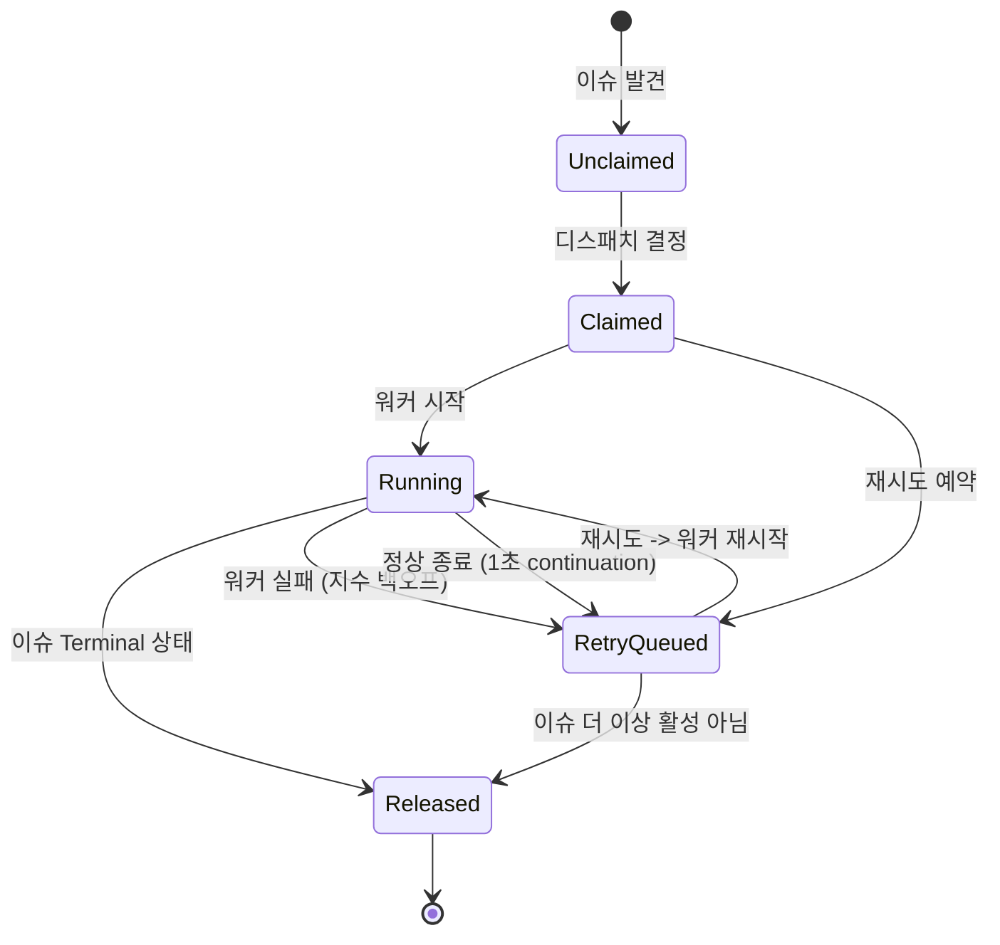

# 오케스트레이터 상태 머신

> [[02-workflow-config|이전: WORKFLOW.md 설정]] | [[README|목차로 돌아가기]] | [[04-codex-integration|다음: Codex 연동]]

---

## 📌 핵심 개념

Orchestrator는 Symphony의 **두뇌**다. Elixir GenServer로 구현되어 단일 프로세스에서 모든 스케줄링 상태를 관리한다. 핵심 역할은 **폴링 -> 재조정 -> 디스패치 -> 재시도** 루프를 반복하는 것이다.

### 이슈 오케스트레이션 상태 (내부 상태)

> [!important] 트래커 상태 vs 오케스트레이션 상태
> Linear의 `Todo`, `In Progress` 등은 **트래커 상태**이고, 아래는 Symphony **내부의 오케스트레이션 상태**다.



| 상태 | 설명 | `claimed`에 포함? | `running`에 포함? | `retry_attempts`에 포함? |
|------|------|:--:|:--:|:--:|
| Unclaimed | 미처리, 재시도 없음 | - | - | - |
| Claimed | 예약됨 (Running 또는 RetryQueued) | O | - | - |
| Running | 워커 실행 중 | O | O | - |
| RetryQueued | 재시도 타이머 대기 | O | - | O |
| Released | 해제됨 (종료/비활성/부재) | - | - | - |

### Run Attempt 생명주기

하나의 실행 시도는 이 단계를 거친다:

```
PreparingWorkspace → BuildingPrompt → LaunchingAgentProcess
    → InitializingSession → StreamingTurn → Finishing
    → Succeeded | Failed | TimedOut | Stalled | CanceledByReconciliation
```

---

## 💻 코드

### 폴링 틱 시퀀스

```elixir
# 매 polling.interval_ms 마다 실행되는 핵심 루프
def handle_info({:tick, tick_token}, state) do
  # 0. 런타임 설정 리프레시 (WORKFLOW.md 동적 리로드)
  state = refresh_runtime_config(state)

  # 1. 재조정 (reconciliation) - 실행 중인 이슈 상태 확인
  #    Part A: 정체(stall) 감지
  #    Part B: 트래커 상태 변경 확인
  state = reconcile_running_issues(state)

  # 2. 디스패치 사전 검증 (config 유효성)
  # 3. Linear에서 후보 이슈 페치
  # 4. 우선순위 정렬 후 디스패치
  state = dispatch_eligible_issues(state)

  # 5. 옵저버빌리티 알림
  notify_status_surface(state)

  # 6. 다음 틱 예약
  state = schedule_tick(state)

  {:noreply, state}
end
```

### 후보 선택 알고리즘

디스패치 자격 조건 (모두 충족해야 함):

```elixir
defp dispatch_eligible?(issue, state) do
  # 1. 필수 필드 존재
  has_required_fields?(issue) and

  # 2. active_states에 포함 & terminal_states에 미포함
  is_active_state?(issue.state) and
  not is_terminal_state?(issue.state) and

  # 3. 이미 실행 중 아님
  not Map.has_key?(state.running, issue.id) and

  # 4. 이미 예약됨 아님
  not MapSet.member?(state.claimed, issue.id) and

  # 5. 전역 동시성 슬롯 가용
  available_global_slots(state) > 0 and

  # 6. 상태별 동시성 슬롯 가용
  available_state_slots(state, issue.state) > 0 and

  # 7. Todo 상태일 때 블로커 체크
  (issue.state != "Todo" or all_blockers_terminal?(issue))
end
```

정렬 순서:

```elixir
defp sort_candidates(issues) do
  Enum.sort_by(issues, fn issue ->
    {
      issue.priority || 999,        # 우선순위 오름차순 (1-4, null은 마지막)
      issue.created_at || ~U[9999-12-31 23:59:59Z],  # 생성일 오래된 순
      issue.identifier              # 식별자 사전순 (타이브레이커)
    }
  end)
end
```

### 재시도 백오프 공식

```elixir
# 정상 종료 (continuation): 1초 고정
@continuation_retry_delay_ms 1_000

# 실패 재시도: 지수 백오프
@failure_retry_base_ms 10_000  # 10초 기본

defp failure_retry_delay(attempt, max_backoff_ms) do
  # delay = min(10000 * 2^(attempt - 1), max_retry_backoff_ms)
  delay = @failure_retry_base_ms * (1 <<< (attempt - 1))
  min(delay, max_backoff_ms)
end

# attempt=1: min(10000 * 1,  300000) = 10초
# attempt=2: min(10000 * 2,  300000) = 20초
# attempt=3: min(10000 * 4,  300000) = 40초
# attempt=4: min(10000 * 8,  300000) = 80초
# attempt=5: min(10000 * 16, 300000) = 160초
# attempt=6: min(10000 * 32, 300000) = 300초 (5분 cap)
```

### 재조정(Reconciliation) 로직

```elixir
defp reconcile_running_issues(state) do
  # Part A: 정체(Stall) 감지
  state = Enum.reduce(state.running, state, fn {issue_id, entry}, acc ->
    elapsed = now_ms - (entry.last_codex_timestamp || entry.started_at)

    if elapsed > Config.settings!().codex.stall_timeout_ms do
      # 워커 종료 -> 재시도 큐로
      kill_worker(entry)
      schedule_retry(acc, issue_id, entry.attempt + 1, "stall_timeout")
    else
      acc
    end
  end)

  # Part B: 트래커 상태 새로고침
  running_ids = Map.keys(state.running)
  current_states = Tracker.fetch_states(running_ids)

  Enum.reduce(current_states, state, fn {issue_id, tracker_state}, acc ->
    cond do
      is_terminal_state?(tracker_state) ->
        # Terminal: 워커 종료 + 워크스페이스 정리
        kill_worker_and_cleanup(acc, issue_id)

      is_active_state?(tracker_state) ->
        # Active: 이슈 스냅샷 업데이트
        update_issue_snapshot(acc, issue_id, tracker_state)

      true ->
        # Neither: 워커 종료만 (워크스페이스 유지)
        kill_worker(acc, issue_id)
    end
  end)
end
```

### 동시성 제어

```elixir
# 전역 슬롯 계산
defp available_global_slots(state) do
  max(state.max_concurrent_agents - map_size(state.running), 0)
end

# 상태별 슬롯 계산
defp available_state_slots(state, issue_state) do
  config = Config.settings!()
  normalized_state = String.downcase(issue_state)

  case Map.get(config.agent.max_concurrent_agents_by_state, normalized_state) do
    nil ->
      # 상태별 제한 없음 -> 전역 제한만 적용
      available_global_slots(state)

    limit ->
      running_in_state = count_running_by_state(state, normalized_state)
      max(limit - running_in_state, 0)
  end
end
```

### 워커 이벤트 처리

```elixir
# 워커 정상 종료
def handle_info({:DOWN, ref, :process, _pid, :normal}, state) do
  {issue_id, entry} = find_by_ref(state.running, ref)
  state = remove_from_running(state, issue_id)
  state = update_codex_totals(state, entry)
  # 1초 후 continuation retry (이슈가 여전히 활성인지 확인)
  state = schedule_retry(state, issue_id, 1, nil, @continuation_retry_delay_ms)
  {:noreply, state}
end

# 워커 비정상 종료
def handle_info({:DOWN, ref, :process, _pid, reason}, state) do
  {issue_id, entry} = find_by_ref(state.running, ref)
  state = remove_from_running(state, issue_id)
  state = update_codex_totals(state, entry)
  # 지수 백오프 재시도
  attempt = (entry.attempt || 0) + 1
  state = schedule_retry(state, issue_id, attempt, inspect(reason))
  {:noreply, state}
end

# Codex 업데이트 이벤트 (토큰, rate limit 등)
def handle_info({:codex_worker_update, issue_id, message}, state) do
  state = update_live_session(state, issue_id, message)
  {:noreply, state}
end
```

---

## ✅ 체크포인트

- [ ] 오케스트레이션 상태 5가지(Unclaimed~Released)를 그릴 수 있는가?
- [ ] 폴링 틱의 6단계 순서를 설명할 수 있는가?
- [ ] 후보 선택의 7가지 조건을 나열할 수 있는가?
- [ ] 정상 종료 vs 비정상 종료의 재시도 차이를 설명할 수 있는가?
- [ ] 재조정(Reconciliation)의 Part A(Stall)와 Part B(State)를 구분할 수 있는가?
- [ ] `claimed`, `running`, `retry_attempts`가 각각 언제 추가/제거되는지 아는가?

---

## ⚠️ 흔한 실수

| 실수 | 올바른 이해 |
|------|------------|
| 정상 종료하면 재시도 안 한다고 생각 | 정상 종료 후에도 1초 후 continuation retry로 이슈 재확인 |
| `claimed`와 `running`이 같다고 생각 | `claimed` = `running` + `retry_attempts`. RetryQueued도 claimed |
| 재조정이 매 틱마다 실행 안 된다고 생각 | 재조정은 **디스패치보다 먼저** 매 틱 실행 |
| 정체 감지를 비활성화할 수 없다고 생각 | `stall_timeout_ms <= 0`이면 비활성화 |
| 재시도가 무한히 계속된다고 생각 | 이슈가 비활성/부재/terminal이면 claim 해제 |

---

## 🔗 더 알아보기

- [[04-codex-integration|Codex App Server 연동]] - AgentRunner가 Codex와 통신하는 방법
- [[02-workflow-config|WORKFLOW.md 설정]] - Orchestrator가 읽는 설정 상세
- [SPEC.md - Section 7: Orchestration State Machine](https://github.com/openai/symphony/blob/main/SPEC.md#7-orchestration-state-machine)
- [SPEC.md - Section 8: Polling, Scheduling, and Reconciliation](https://github.com/openai/symphony/blob/main/SPEC.md#8-polling-scheduling-and-reconciliation)
