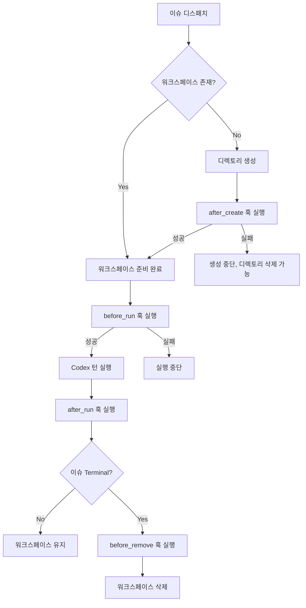

# 워크스페이스 관리

> [[04-codex-integration|이전: Codex 연동]] | [[README|목차로 돌아가기]]

---

## 📌 핵심 개념

워크스페이스는 Symphony의 **격리 단위**다. 각 이슈에 대해 독립된 파일시스템 디렉토리를 생성하고, 그 안에서만 Codex가 작업한다. 이를 통해 여러 에이전트가 동시에 서로 다른 이슈를 처리하면서도 충돌하지 않는다.

### 워크스페이스 레이아웃

```
<workspace.root>/               # 설정된 루트 디렉토리
├── ABC-123/                   # 이슈 ABC-123의 워크스페이스
│   ├── .git/                  # (after_create 훅에서 git clone)
│   ├── src/
│   ├── package.json
│   └── ...
├── ABC-124/                   # 이슈 ABC-124의 워크스페이스
│   └── ...
└── DEF-45/                    # 이슈 DEF-45의 워크스페이스
    └── ...
```

### 3대 안전성 불변식 (Safety Invariants)

> [!warning] Symphony에서 가장 중요한 이식성 제약
> 이 3가지 불변식은 SPEC.md에서 "가장 중요한 이식성 제약"으로 명시되어 있다.

| # | 불변식 | 설명 | 위반 시 |
|---|--------|------|---------|
| 1 | **CWD 격리** | Codex를 실행할 때 `cwd`는 반드시 워크스페이스 경로여야 한다 | 소스 저장소 직접 수정 위험 |
| 2 | **경로 봉쇄** | 워크스페이스 경로는 반드시 workspace root의 하위 디렉토리여야 한다 | 디렉토리 탈출 (path traversal) |
| 3 | **키 새니타이징** | 워크스페이스 디렉토리명에 `[A-Za-z0-9._-]` 외 문자는 `_`로 치환 | 악의적 파일명 방지 |

### 워크스페이스 생명주기



---

## 💻 코드

### 워크스페이스 생성/재사용 로직

```elixir
defmodule SymphonyElixir.Workspace do
  @spec create_for_issue(map(), String.t() | nil) :: {:ok, Path.t()} | {:error, term()}
  def create_for_issue(issue, worker_host \\ nil) do
    # 1. 이슈 식별자를 워크스페이스 키로 새니타이징
    workspace_key = sanitize_key(issue.identifier)
    # "ABC-123" -> "ABC-123" (이미 안전한 문자만)
    # "이슈/test" -> "___test" (비안전 문자를 _로)

    # 2. 워크스페이스 경로 계산
    workspace_root = Config.settings!().workspace.root
    workspace_path = Path.join(workspace_root, workspace_key)

    # 3. 경로 봉쇄 검증 (Safety Invariant #2)
    :ok = PathSafety.validate_within_root!(workspace_path, workspace_root)

    # 4. 디렉토리 생성 (이미 존재하면 재사용)
    case ensure_directory(workspace_path, worker_host) do
      {:ok, :created} ->
        # 새로 생성됨 -> after_create 훅 실행
        run_after_create_hook(workspace_path, issue, worker_host)
        {:ok, workspace_path}

      {:ok, :existed} ->
        # 이미 존재 -> 재사용 (훅 없음)
        {:ok, workspace_path}

      {:error, reason} ->
        {:error, reason}
    end
  end
end
```

### 워크스페이스 키 새니타이징

```elixir
@spec sanitize_key(String.t()) :: String.t()
defp sanitize_key(identifier) do
  # Safety Invariant #3: [A-Za-z0-9._-] 외 문자는 _로 치환
  String.replace(identifier, ~r/[^A-Za-z0-9._-]/, "_")
end

# 예시:
# "ABC-123"     -> "ABC-123"      (변경 없음)
# "PROJ/SUB-1"  -> "PROJ_SUB-1"   (슬래시 치환)
# "이슈-42"     -> "___-42"       (한글 치환)
```

### 경로 안전성 검증

```elixir
defmodule SymphonyElixir.PathSafety do
  @spec validate_within_root!(Path.t(), Path.t()) :: :ok | no_return()
  def validate_within_root!(workspace_path, workspace_root) do
    # 절대 경로로 정규화
    abs_workspace = Path.expand(workspace_path)
    abs_root = Path.expand(workspace_root)

    # 워크스페이스가 루트의 하위 디렉토리인지 확인
    unless String.starts_with?(abs_workspace, abs_root <> "/") do
      raise "Path safety violation: #{abs_workspace} is outside #{abs_root}"
    end

    :ok
  end
end

# 방어하는 공격 패턴:
# workspace_root: /home/user/workspaces
# identifier:     "../../etc/passwd" -> sanitize -> "______etc_passwd"
#                 경로: /home/user/workspaces/______etc_passwd (안전)
```

### 훅 실행

```elixir
# 훅 실행 공통 로직
defp run_hook(hook_script, workspace_path, worker_host, timeout_ms) do
  # 워크스페이스 디렉토리에서 쉘 스크립트 실행
  # POSIX: bash -lc <script>
  case execute_shell(hook_script,
    cwd: workspace_path,
    worker_host: worker_host,
    timeout: timeout_ms
  ) do
    {:ok, _output} -> :ok
    {:error, :timeout} -> {:error, :hook_timeout}
    {:error, reason} -> {:error, reason}
  end
end
```

### 훅 사용 패턴

#### 패턴 1: Git 저장소 클론

```yaml
hooks:
  after_create: |
    git clone --depth 1 git@github.com:my-org/my-repo.git .
    npm install
```

#### 패턴 2: mise를 사용한 언어 런타임 설정

```yaml
hooks:
  after_create: |
    git clone --depth 1 git@github.com:my-org/my-repo.git .
    cd elixir && mise trust && mise exec -- mix deps.get
```

#### 패턴 3: 매 실행 전 최신 코드 동기화

```yaml
hooks:
  before_run: |
    git fetch origin main
    git checkout main
    git pull origin main
    npm install
```

#### 패턴 4: 워크스페이스 정리

```yaml
hooks:
  before_remove: |
    # 브랜치 정리, 임시 파일 삭제 등
    git checkout main
    git branch | grep -v main | xargs git branch -D 2>/dev/null || true
```

### 훅 실패 의미론 정리

```
after_create  실패 → 워크스페이스 생성 중단 (FATAL)
              이유: 불완전한 워크스페이스에서 Codex 실행 방지

before_run    실패 → 이번 실행 시도 중단 (FATAL)
              이유: 준비 안 된 환경에서 실행 방지

after_run     실패 → 로그만 기록, 무시 (IGNORED)
              이유: 실행 후 정리 실패가 전체를 막으면 안 됨

before_remove 실패 → 로그만 기록, 삭제 진행 (IGNORED)
              이유: 정리 실패가 워크스페이스 삭제를 막으면 안 됨
```

### 워크스페이스 정리

```elixir
# Terminal 상태 이슈의 워크스페이스 삭제
defp cleanup_workspace(issue_id, workspace_path, worker_host) do
  # 1. before_remove 훅 실행 (실패해도 진행)
  run_before_remove_hook(workspace_path, worker_host)

  # 2. 디렉토리 삭제
  remove_directory(workspace_path, worker_host)
end

# 서비스 시작 시 Terminal 워크스페이스 정리
defp run_terminal_workspace_cleanup() do
  # 1. 트래커에서 Terminal 상태 이슈 조회
  case Tracker.fetch_terminal_issues() do
    {:ok, terminal_issues} ->
      Enum.each(terminal_issues, fn issue ->
        workspace_key = sanitize_key(issue.identifier)
        workspace_path = Path.join(workspace_root(), workspace_key)
        if File.dir?(workspace_path), do: remove_directory(workspace_path)
      end)

    {:error, _reason} ->
      Logger.warning("Failed to fetch terminal issues for cleanup, continuing startup")
  end
end
```

### SSH 원격 워커 (확장)

Symphony는 로컬 실행 외에 **SSH 원격 워커**도 지원한다:

```yaml
# WORKFLOW.md 확장 설정
worker:
  ssh_hosts:
    - worker1.example.com
    - worker2.example.com
  max_concurrent_agents_per_host: 3  # 호스트별 최대 동시 실행
```

```elixir
# SSH를 통한 원격 워크스페이스 생성
defmodule SymphonyElixir.SSH do
  def execute_on_host(host, command, opts) do
    # SSH로 원격 머신에서 명령 실행
    System.cmd("ssh", [host, command], opts)
  end
end
```

---

## ✅ 체크포인트

- [ ] 3대 안전성 불변식을 열거하고 각각 왜 필요한지 설명할 수 있는가?
- [ ] 워크스페이스가 "재사용"된다는 것이 무슨 의미인지 아는가?
- [ ] 4가지 훅의 실행 시점과 실패 의미론을 구분할 수 있는가?
- [ ] 워크스페이스 키 새니타이징의 목적과 규칙을 설명할 수 있는가?
- [ ] 서비스 시작 시 Terminal 워크스페이스 정리가 왜 필요한지 아는가?
- [ ] SSH 원격 워커의 용도를 이해하는가?

---

## ⚠️ 흔한 실수

| 실수 | 올바른 이해 |
|------|------------|
| 매 실행마다 워크스페이스를 새로 만든다고 생각 | 동일 이슈는 워크스페이스를 **재사용**. `after_create`는 최초 1회만 |
| 성공하면 워크스페이스가 자동 삭제된다고 생각 | 성공해도 **삭제 안 됨**. Terminal 상태가 돼야 정리 |
| 소스 저장소에서 직접 Codex를 실행 | **절대 안 됨**. 반드시 워크스페이스 내에서만 (Safety Invariant #1) |
| `after_create` 훅 실패를 무시해도 된다고 생각 | `after_create` 실패는 **FATAL** - 워크스페이스 생성 자체가 중단 |
| 워크스페이스 경로에 임의 문자를 허용 | `[A-Za-z0-9._-]` 외는 모두 `_`로 치환 (Safety Invariant #3) |

---

## 🔗 더 알아보기

- [[01-architecture|아키텍처]] - 전체 컴포넌트 관계에서의 Workspace 위치
- [[02-workflow-config|WORKFLOW.md 설정]] - hooks 섹션 설정 상세
- [[03-orchestrator|오케스트레이터]] - 워크스페이스 정리 트리거
- [SPEC.md - Section 9: Workspace Management and Safety](https://github.com/openai/symphony/blob/main/SPEC.md#9-workspace-management-and-safety)
